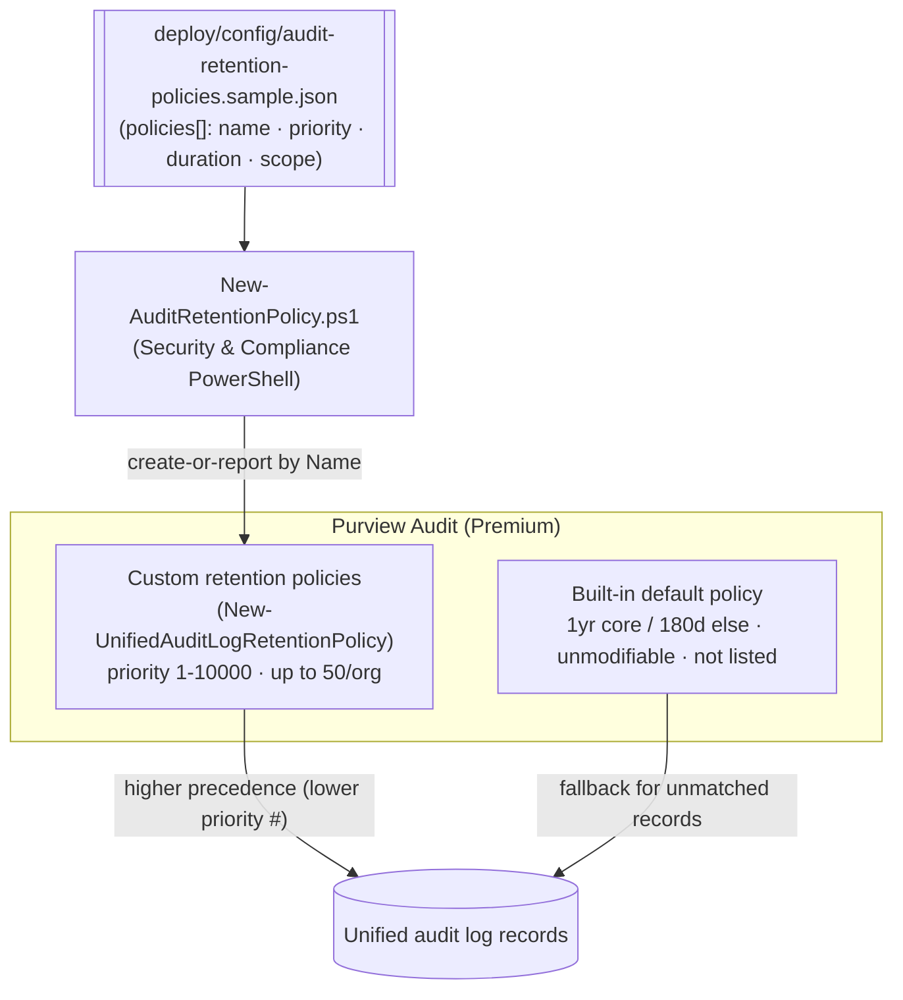

# Audit — Audit-Log Retention Policy Management

## 1. Scenario summary

Manages **Microsoft Purview Audit (Premium) audit-log retention policies** as code: creates and
maintains custom policies that set **how long audit records are kept**, scoped by record type,
operation, and user, with a priority that resolves overlaps. This is the **configuration counterpart**
to the read-only `scenarios/audit/premium-audit-investigation/` scenario — that one *queries* the audit
log; this one *governs how long the log survives to be queried*.

**Who it's for:** a security/compliance/SecOps team that must retain specific audit records longer than
the tenant default (e.g. privileged admin operations for 10 years for regulatory investigations) and
wants those retention rules defined, reviewed, and deployed reproducibly rather than clicked into the
portal.

## 2. Business/regulatory driver

Audit records are only useful for an investigation if they still exist when you look. The built-in
default keeps most records **1 year** (Entra/Exchange/OneDrive/SharePoint) or **180 days** (everything
else) [[1]](#references) — often shorter than the multi-year lookback that breach investigations, legal
holds, and regulations (SOX, PCI-DSS log-retention, financial-services record rules) assume. Custom
retention policies let you keep the records that matter (privileged operations, sensitive workloads)
for up to **10 years**, and shorten noise you don't need. Managing them as code makes the retention
schedule diffable, reviewable, and auditable in its own right.

> ⚠️ **Retention is a governance decision with cost and legal weight.** Over-long retention grows audit
> volume and can conflict with data-minimization obligations; too-short retention destroys evidence you
> may be legally required to keep. Review durations with Security/Legal, and note that **10-year
> retention requires an add-on license** (§10). See §11.

## 3. Prerequisites

Full licensing detail: `docs/licensing-matrix.md`. RBAC: `docs/rbac-model.md`. Automation surface:
`docs/automation-surface.md` (surface 1 — Security & Compliance PowerShell). Summary:

| Requirement | Minimum | Notes |
|---|---|---|
| Licensing | **Audit (Premium)** — M365 E5 / E5 Compliance / add-on | Premium is what enables custom retention policies [[1]](#references) |
| 10-year retention | **10-Year Audit Log Retention add-on** (per-user) | Required to use `TenYears`; the other durations don't need it [[1]](#references) |
| Role | **Organization Configuration** (in the Compliance/Records role groups) | To create/edit/remove retention policies [[1]](#references) |
| Auth | `Connect-IPPSSession` (certificate app-only preferred) | Security & Compliance PowerShell — `docs/automation-surface.md` §3 |

> Verify current entitlement names against `docs/licensing-matrix.md` (dated 2026-09-02) before a sales
> commitment — SKU names change.

## 4. Architecture



Each config entry becomes one custom policy. Custom policies take precedence over the default; when
several match the same record, the **lowest priority number wins**. Full rationale: `design.md`.

## 5. Step-by-step implementation

```powershell
# Connect (certificate app-only preferred - docs/automation-surface.md §3; needs Organization Configuration role)
Connect-IPPSSession -AppId $AppId -Certificate $Cert -Organization 'contoso.onmicrosoft.com'

# 1. Dry run - prints the exact New-UnifiedAuditLogRetentionPolicy cmdlets, runs none
./deploy/New-AuditRetentionPolicy.ps1 -ConfigPath ./deploy/config/audit-retention-policies.json -DryRun

# 2. Create the policies
./deploy/New-AuditRetentionPolicy.ps1 -ConfigPath ./deploy/config/audit-retention-policies.json

# 3. Validate
./validate/Test-AuditRetentionPolicy.ps1 -ConfigPath ./deploy/config/audit-retention-policies.json
```

### Portal reference

Policies are visible in the [Microsoft Purview portal](https://purview.microsoft.com) under **Audit →
Audit retention policies** [[1]](#references). The portal exposes more duration choices than the
cmdlet's documented enum — see §11 VERIFY. `-WhatIf` is non-functional in S&C PowerShell, so the scripts
ship a `-DryRun`.

## 6. Configuration reference

| Setting | Value this scenario uses | Notes |
|---|---|---|
| Cmdlet | `New-UnifiedAuditLogRetentionPolicy` | Create a custom retention policy [[2]](#references) |
| `Name` | policy display name | Matched client-side on re-run (Get has no `-Identity`) |
| `Priority` | `1`–`10000` (**mandatory**) | Lower number = higher precedence when policies overlap |
| `RetentionDuration` | `ThreeMonths` / `SixMonths` / `NineMonths` / `TwelveMonths` / `TenYears` (**mandatory**) | The documented enum; `TenYears` needs the add-on [[2]](#references) |
| `RecordTypes` | e.g. `ExchangeAdmin`, `AzureActiveDirectory` | Scope by audit record type |
| `Operations` | e.g. specific activity names | Optional finer scope |
| `UserIds` | UPNs | Optional per-user scope |
| Edit | `Set-UnifiedAuditLogRetentionPolicy` | Priority/duration mandatory on Set too |
| Remove | `Remove-UnifiedAuditLogRetentionPolicy -Identity` | `-ForceDeletion` to skip the prompt |

Exact cmdlet syntax and Learn sources are cited in each script's `.NOTES`.

## 7. Validation / how to prove it works

1. **Automated** — `./validate/Test-AuditRetentionPolicy.ps1` confirms each config policy exists with the
   expected `RetentionDuration` and `Priority`, and reports the total custom-policy count. Exits non-zero
   on failure.
2. **Idempotency proof** — re-run the deploy; existing policies report `exists` (not `created`); nothing
   is duplicated or silently mutated.
3. **Precedence check** — where two policies could match the same record, confirm the intended one wins
   by its lower priority number.
4. **Behavioral proof (lab)** — generate an audited action in a scoped record type, then confirm the
   record is still queryable beyond the default window once the policy is in effect (via the sibling
   investigation scenario / `Search-UnifiedAuditLog`).

## 8. Operations & tuning

**KPIs / signals:** number of custom policies vs. the **50-per-org cap**; retention coverage of your
crucial record types; audit-log volume/cost trend as long-retention policies accumulate. **Tuning:**
assign priorities in deliberate bands (e.g. 100s for long-retention overrides, 200s for standard) so new
policies slot in without renumbering; keep scopes as narrow as the obligation allows — retain the record
types that matter for years, not everything.

**Change management:** the config file is the versioned retention schedule. Changing a duration or
priority is a deliberate, reviewed edit via `Set-UnifiedAuditLogRetentionPolicy` (the deploy reports,
never silently mutates). Removing a policy silently reverts its scope to the default window — treat that
as a governance change, not an ops tidy-up.

## 9. Rollback / decommission

See `rollback.md`. Quick reference: `./deploy/Remove-AuditRetentionPolicy.ps1` removes the config's
policies (their scope then falls back to the **built-in default** window). It does **not** delete audit
records already retained, and deletion can take up to **30 minutes** to take effect.

## 10. Cost & licensing notes

- **Per-user E5 / Audit (Premium) entitlement**; `TenYears` retention requires the separate **10-Year
  Audit Log Retention add-on** [[1]](#references). No Azure consumption meter for the policies
  themselves.
- **Cost is storage + governance.** Long-retention policies keep more audit data for longer; factor that
  into audit-volume planning. The expensive mistakes are (a) not retaining a record type you later need,
  and (b) blanket 10-year retention you must license and store.

## 11. Known limitations & gotchas

- **`-WhatIf` is non-functional in S&C PowerShell** — the scripts ship a `-DryRun` instead.
- **The default policy can't be managed here.** The built-in default (1 yr core / 180 d else) is not
  returned by `Get-UnifiedAuditLogRetentionPolicy` and can't be modified or removed — custom policies
  only **override** it for their scope [[1]](#references).
- **`Get` has no `-Identity`.** It takes filter parameters and returns custom policies only; this scenario
  matches by `Name` client-side for idempotency.
- **50-policy cap per org** — plan scopes/priorities to stay within it [[1]](#references).
- **Duration enum vs. portal (VERIFY).** The cmdlet's documented `-RetentionDuration` enum is the five
  values used here; the portal shows additional duration choices. If you need a value outside the enum,
  set it in the portal and confirm the cmdlet round-trips it — this scenario emits only the confirmed
  values rather than guessing.
- **`TenYears` needs the add-on** — the cmdlet will reject it without the license.
- **Removal latency & fallback.** Deleting a policy can take ~30 minutes and reverts its scope to the
  default window; records already retained are unaffected.
- **Idempotency is create-or-report, not create-or-update** — edit deliberately with `Set-`.
- **Illustrative values.** The sample record types, durations, and priorities are placeholders — set them
  to your real retention obligations, reviewed by Security/Legal, before deploying.

## 12. References

1. Manage audit log retention policies (default policy, 50-policy limit, priority, roles, 10-year add-on, portal location) — <https://learn.microsoft.com/purview/audit-log-retention-policies>
2. New-UnifiedAuditLogRetentionPolicy (-Name, -Priority, -RetentionDuration enum, -RecordTypes/-Operations/-UserIds) — <https://learn.microsoft.com/powershell/module/exchangepowershell/new-unifiedauditlogretentionpolicy>
3. Get-UnifiedAuditLogRetentionPolicy — <https://learn.microsoft.com/powershell/module/exchangepowershell/get-unifiedauditlogretentionpolicy>
4. Set-UnifiedAuditLogRetentionPolicy — <https://learn.microsoft.com/powershell/module/exchangepowershell/set-unifiedauditlogretentionpolicy>
5. Remove-UnifiedAuditLogRetentionPolicy — <https://learn.microsoft.com/powershell/module/exchangepowershell/remove-unifiedauditlogretentionpolicy>
6. Microsoft Purview Audit (Premium) — retention and licensing — <https://learn.microsoft.com/purview/audit-premium>

> Re-verify all links, cmdlet parameters, the duration enum, licensing, and the 50-policy limit against
> current Microsoft Learn before a customer-facing deployment.
