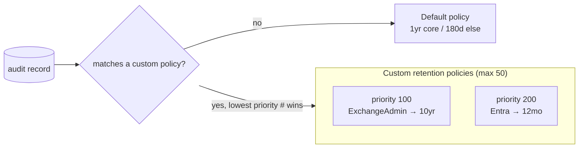

# Design — Audit-Log Retention Policy Management

## 1. Problem statement

The unified audit log is only evidence if it still exists at investigation time. The tenant default
keeps most records 1 year (or 180 days for many types) — shorter than the lookback that breach
investigations, legal holds, and regulations assume. This scenario manages **custom audit-log retention
policies** as code so the retention schedule is deliberate, scoped, reproducible, and reviewable — the
configuration side of audit, complementing the read-only investigation scenario.

## 2. Design goals

1. **Retention as code.** The config file is the versioned retention schedule; deploy is idempotent
   create-or-report.
2. **Scoped, prioritized.** Keep what matters (record type / operation / user) for as long as the
   obligation requires; use priority to resolve overlaps predictably.
3. **Honest about the default.** The built-in default can't be managed here; custom policies only
   override it for their scope — documented, not implied.
4. **No silent mutation.** Existing policies are reported; duration/priority changes are a deliberate
   `Set-` edit.
5. **Grounded, no invented values.** Only the documented `-RetentionDuration` enum is emitted; the
   portal's extra durations are flagged VERIFY, not guessed.

## 3. Why this vs. the investigation scenario

`premium-audit-investigation/` is **read-only**: it runs audit searches and exports results. It answers
"what happened?" This scenario answers "will the record still be here when we ask?" — it configures
retention durations. Same module, opposite direction (write config vs. read data); deliberately a pair.

## 4. Object model

## 5. Key decisions

| Decision | Choice | Rationale |
|---|---|---|
| Surface | Security & Compliance PowerShell (surface 1) | Where `*-UnifiedAuditLogRetentionPolicy` lives |
| Dry-run | Custom `-DryRun` | `-WhatIf` non-functional in S&C PowerShell |
| Idempotency | Create-or-report, match by `Name` | `Get` has no `-Identity`; retention scope is high-consequence |
| Duration values | Documented enum only | No invented values; portal extras flagged VERIFY |
| Priority | Explicit, banded | Predictable overlap resolution; room to insert |
| Removal | Reverts scope to default; records kept | Matches platform behavior; never deletes captured records |

## 6. Failure modes and guardrails

| Failure mode | Guardrail |
|---|---|
| Silent duration/priority change | Create-or-report; existing policies reported, `Set-` is the deliberate path |
| Invalid duration | Validated against the documented enum before any cmdlet runs |
| Hitting the 50-policy cap | Documented; narrow scopes + banded priorities |
| Assuming removal deletes records | Rollback/README state removal only reverts future scope to default |
| 10-year without license | Documented add-on requirement; cmdlet rejects otherwise |
| Portal/enum mismatch | Explicit VERIFY, not a guessed value |

## 7. Non-goals

- **Managing the built-in default policy** — not possible (unmodifiable, unlisted).
- **Querying/exporting audit records** — the sibling `premium-audit-investigation/` scenario.
- **Audit streaming** to Sentinel / the Management Activity API — a separate follow-up.
- **Portal-only durations** outside the documented cmdlet enum — flagged VERIFY, set in portal if needed.
