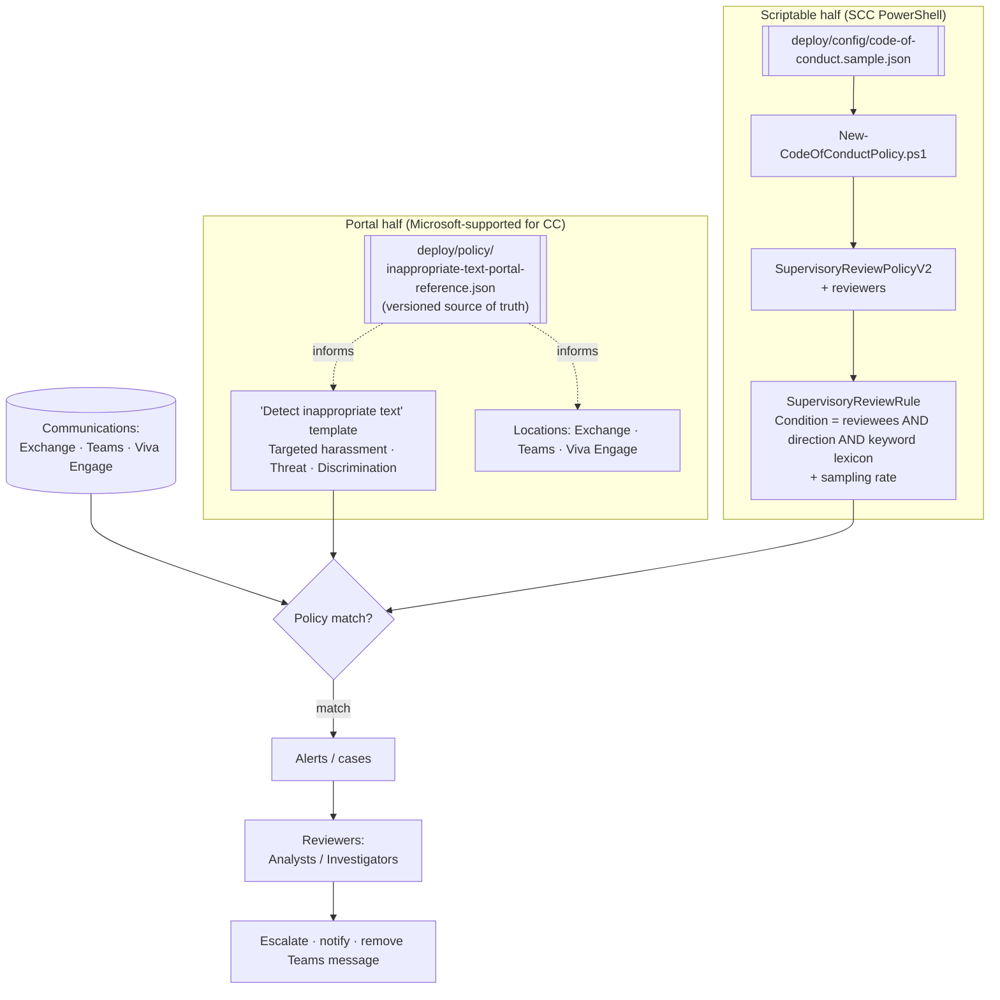

# Communication Compliance — Harassment & Code-of-Conduct Detection

## 1. Scenario summary

Stands up a Microsoft Purview **Communication Compliance** policy that detects workplace harassment
and code-of-conduct violations across **Exchange Online, Microsoft Teams, and Viva Engage**, using
the built-in **Targeted harassment / Threat / Discrimination** trainable classifiers (the "Detect
inappropriate text" template) plus an organization-owned **keyword lexicon**, routed to named
reviewers for triage and remediation. Because Microsoft supports **only the portal** for creating and
managing Communication Compliance policies, this scenario is a deliberate **two-part deployment**: the
classifier + location half is configured in the portal (captured as a versioned reference manifest),
and the **scriptable half** — the supervisory-review policy shell, reviewers, and the keyword rule
(reviewees, direction, sampling) — is deployed with the Security & Compliance PowerShell
`SupervisoryReview` cmdlets.

**Who it's for:** an HR/Legal/compliance team standing up harassment and conduct supervision who wants
the workflow and keyword-lexicon half managed as reviewable, re-runnable code, and the
machine-learning half configured through Microsoft's supported portal surface — with a single
source-of-truth manifest tying the two halves together.

## 2. Business/regulatory driver

Detecting and acting on workplace harassment is a core obligation under employment law and internal
codes of conduct, and increasingly under regulatory regimes for regulated industries (SEC/FINRA
supervision of communications). Microsoft's own case study frames Communication Compliance precisely
this way: an organization updating its corporate policy "for reducing workplace harassment" builds a
policy to detect potentially inappropriate messages across Teams, Viva Engage, and Exchange
[[5]](#references). Communication Compliance is built **privacy-by-design** — usernames are
pseudonymized by default, reviewers are opted in by an admin, role-based access is enforced, and audit
logs are kept — so the control can meet its detection goal without turning into blanket surveillance
[[6]](#references).

This scenario supports:
- **Anti-harassment / hostile-work-environment obligations** — a documented, auditable detection and
  reviewer-triage workflow is evidence of a good-faith program, not just a written policy.
- **Regulated-industry supervision** (SEC Rule 17a-4 / FINRA 3110 supervisory review of
  communications) — the same supervisory-review engine underlies both conduct and financial
  supervision.
- **Privacy/works-council balance (GDPR, EU works councils)** — pseudonymization-by-default and
  role-scoped investigator access are the controls that make communication monitoring defensible.

## 3. Prerequisites

Full licensing detail and citations: `docs/licensing-matrix.md`. RBAC: `docs/rbac-model.md`.
Automation surface: `docs/automation-surface.md` (surface 1 — Security & Compliance PowerShell).
Summary for this scenario:

| Requirement | Minimum | Notes |
|---|---|---|
| License for scoped (supervised) users | **Microsoft Purview Suite** (ex-M365 E5 Compliance), **O365 E5**, or **O365 E3 + Advanced Compliance add-on** | Every user *covered by* the policy needs one of these — not just admins [[1]](#references) |
| Role to create/manage the policy | **Communication Compliance Admins** (or **Communication Compliance**, or Compliance Administrator / Organization Management) | Makes Communication Compliance visible in the portal and authorizes policy config [[2]](#references) |
| Reviewer role | **Communication Compliance Analysts** (metadata only) or **Communication Compliance Investigators** (message content + remediation) | Reviewers must be in one of these **and** named in the policy **and** have an Exchange Online mailbox [[3]](#references) |
| Reviewer of last resort | Keep ≥1 user in **Communication Compliance** / **Communication Compliance Admins** | Avoid a "zero administrator" lockout [[2]](#references) |
| Automation identity (scriptable half) | App registration connected via **Connect-IPPSSession** (certificate app-only preferred) with a policy-management role | Security & Compliance PowerShell — `docs/automation-surface.md` §3 |
| Scoping (optional) | **Administrative units** to scope investigators by region/department | Restricted admins see only their admin unit's users; can't combine with adaptive scopes in CC [[3]](#references) |

> Verify current entitlement names against `docs/licensing-matrix.md` (dated 2026-09-02) and the
> Product Terms before a sales commitment — SKU names change.

## 4. Architecture



The classifier + location half and the keyword + workflow half both feed the same policy match →
alert → reviewer pipeline. The reference manifest keeps the portal-configured half diffable in source
control even though it isn't script-applied. Full rationale: `design.md`.

## 5. Step-by-step implementation

### Portal path (required for the classifier half; Microsoft's supported surface)

1. Confirm licensing (§3) and assign roles: put admins in **Communication Compliance Admins**, and
   reviewers in **Communication Compliance Analysts/Investigators** (Purview portal → **Settings →
   Roles and groups**) [[2]](#references)[[3]](#references).
2. In the [Microsoft Purview portal](https://purview.microsoft.com) → **Communication Compliance →
   Policies → Create policy →** template **"Detect inappropriate text"** [[4]](#references).
3. Name it to match the manifest (`Code of Conduct - Inappropriate Text`). Assign **reviewers**.
4. **Locations:** Exchange Online, Microsoft Teams, Viva Engage. **Direction:** Inbound, Outbound,
   Internal. **Review percentage:** 100% [[4]](#references).
5. Confirm the template's classifiers (**Targeted harassment, Threat, Discrimination**); optionally
   add the LLM content-safety classifiers (**Hate/Sexual/Violence/Self-harm**, preview, Teams/Viva
   Engage) which add a **Severity** column to alerts [[4]](#references). Enable **Filter email
   blasts** to cut bulk-sender false positives [[4]](#references).
6. Keep **user-name pseudonymization** on (global setting, default) [[6]](#references).
7. Record any deviations from `deploy/policy/inappropriate-text-portal-reference.json` back into that
   file so intent stays diffable.

### Script path (the scriptable half: policy shell, reviewers, keyword rule)

```powershell
# Connect first (certificate app-only preferred - see docs/automation-surface.md §3)
Connect-IPPSSession -AppId $AppId -Certificate $Cert -Organization 'contoso.onmicrosoft.com'

# 1. Dry run — prints the policy, reviewers, and the exact keyword-rule Condition; changes nothing
./deploy/New-CodeOfConductPolicy.ps1 -ConfigPath ./deploy/config/code-of-conduct.json -DryRun

# 2. Deploy the scriptable half (reconciles policy + keyword rule to the config)
./deploy/New-CodeOfConductPolicy.ps1 -ConfigPath ./deploy/config/code-of-conduct.json

# 3. Validate (and print the portal-classifier manual checklist)
./validate/Test-CodeOfConductPolicy.ps1 -ConfigPath ./deploy/config/code-of-conduct.json
```

The script uses the **Security & Compliance PowerShell** `SupervisoryReview` cmdlets (surface 1). It
implements its own `-DryRun` because **`-WhatIf` is non-functional in Security & Compliance
PowerShell** [[7]](#references).

## 6. Configuration reference

| Setting | Value this scenario uses | Notes |
|---|---|---|
| Policy template (portal) | **Detect inappropriate text** | Threat, Discrimination, Targeted harassment classifiers; Exchange/Teams/Viva Engage; 100% review [[4]](#references) |
| Policy cmdlet | `New-`/`Set-`/`Get-`/`Remove-SupervisoryReviewPolicyV2` | Params used: `-Name`/`-Identity`, `-Reviewers`, `-Enabled` [[8]](#references) |
| Rule cmdlet | `New-`/`Set-`/`Get-SupervisoryReviewRule` | Params used: `-Name`, `-Policy`, `-Condition`, `-SamplingRate` [[9]](#references) |
| Rule `-Condition` syntax | `((Reviewee:…) -OR …) -AND ((Direction:Inbound) -OR …) -AND ((word) -OR (phrase))`, wrapped in outer parens | Reviewees, directions, and keyword/phrase matches; phrases inserted bare — per Microsoft's documented syntax [[9]](#references) |
| Reviewers | Must be in Analysts/Investigators role group + EXO mailbox | Enforced by the service; validated in the manual checklist [[3]](#references) |
| Sampling rate | `100` | Review every match (recommended for conduct) [[9]](#references) |
| Dry-run mechanism | Custom `-DryRun` (not `-WhatIf`) | `-WhatIf` doesn't work in S&C PowerShell [[7]](#references) |
| Privacy | Pseudonymize user names (default, portal global setting) | Keep on unless HR/Legal decide otherwise [[6]](#references) |

Exact cmdlet syntax and Learn sources are cited in each script's `.NOTES`; the portal half is captured
in `deploy/policy/inappropriate-text-portal-reference.json`.

## 7. Validation / how to prove it works

1. **Automated (scriptable half)** — `./validate/Test-CodeOfConductPolicy.ps1` confirms the policy
   exists, is enabled, has ≥1 reviewer, and that its keyword rule exists with a Condition and sampling
   rate; exits non-zero on failure.
2. **Manual checklist (classifier half)** — the validate script prints the portal-only items to
   confirm (classifiers added, locations selected, filter-email-blasts on, reviewer role membership,
   pseudonymization on) — these aren't readable via cmdlet, so they're verified in the portal against
   the reference manifest.
3. **Detection test (safe)** — from a scoped test user, send a Teams message and an email containing
   an unambiguous conduct-violation test phrase (and one of your lexicon terms); confirm within the
   review SLA that an **alert** appears under **Communication Compliance → Alerts/Policies**, visible
   to the assigned reviewer role only [[10]](#references).
4. **Remediation-path test** — as an **Investigator**, confirm you can open the message, see the
   **Conversation** context, and take a remediation action (escalate / notify / remove Teams
   message); as an **Analyst**, confirm you see metadata but not the actions gated to Investigators
   [[3]](#references)[[10]](#references).
5. **Privacy test** — confirm alerts show **pseudonymized** usernames to reviewers by default
   [[6]](#references).

## 8. Operations & tuning

**KPIs to watch:**
- **Alert volume & false-positive rate** by classifier — harassment/threat classifiers can over-fire
  on bulk/newsletter content; **Filter email blasts** is the first lever [[4]](#references). Track the
  Investigator's *Report as Misclassified* submissions, which feed classifier improvement
  [[6]](#references).
- **Severity distribution** — if you enabled the LLM content-safety classifiers, sort/triage alerts by
  the **Severity** column (severity ≥4 surfaces as an alert) [[4]](#references).
- **Review backlog / time-to-triage** — the reviewer on-call metric; a 100% sampling conduct policy
  can generate real volume, so staff the reviewer rota accordingly.

**Alerting & workflow:** matches generate alerts/cases for the assigned reviewers; there's no external
alert stream to wire — triage happens in the Communication Compliance console. Investigator actions
(escalate, notify sender, remove Teams message, run Power Automate flow) are the remediation surface
[[3]](#references)[[10]](#references).

**Incident runbook (a real harassment alert):** (1) Investigator opens the alert, reviews the message
+ conversation context; (2) escalates to HR/Legal via the built-in escalate action or a Power Automate
flow; (3) for an active-harm message, remove the Teams message and notify; (4) record the disposition
(resolved/escalated) — the modification history exports to CSV for the case file [[2]](#references).

**Review cadence:** review the keyword lexicon and classifier set quarterly with HR/Legal; keep the
reference manifest and config file in sync with the deployed policy (a `-DryRun` deploy flags keyword
drift). Role-group changes take up to 30 minutes to apply [[2]](#references).

## 9. Rollback / decommission

See `rollback.md`. Quick reference: `./deploy/Remove-CodeOfConductPolicy.ps1` **disables** the policy
(reversible); add `-Delete` to remove it. Disabling stops detection while preserving the policy, rule,
and captured review history.

## 10. Cost & licensing notes

- **Per-user entitlement, not PAYG.** Communication Compliance is an **M365/Purview per-user
  entitlement** feature — every *supervised* user needs Purview Suite / O365 E5 / E3+Advanced
  Compliance (§3) — contrast with this library's Data Governance scenarios, which bill PAYG. Confirm
  seat coverage for the *scoped* population, not just admins [[1]](#references).
- **No Azure consumption meter** for the policy itself; cost is licensing + reviewer staff time.
- **Cost governance:** the real operating cost is **reviewer time**. A 100% sampling org-wide conduct
  policy without email-blast filtering can flood the queue — tune scope, filtering, and (for
  regulatory sampling) the sampling rate to keep reviewer load sustainable.

## 11. Known limitations & gotchas

- **PowerShell isn't Microsoft-supported for CC policy management.** Microsoft explicitly directs CC
  policy creation/management to the portal [[2]](#references). This scenario uses the
  `SupervisoryReview` cmdlets (which are real, documented, and underlie CC) for the **keyword +
  workflow subset only**, and configures the classifiers in the portal. **VERIFY** that a
  portal-created CC policy and a `SupervisoryReviewPolicyV2` created here are fully equivalent in your
  tenant before standardizing on the script path.
- **Trainable classifiers are not exposed in the cmdlet surface.** `New-SupervisoryReviewRule` has no
  documented classifier parameter (the `-AdvancedRule` parameter is undocumented) — Targeted
  harassment/Threat/Discrimination are **portal-only** here. Do not present the script alone as the
  full harassment control [[9]](#references).
- **Locations may not be settable via cmdlet.** Exchange/Teams/Viva Engage selection isn't a
  documented policy/rule parameter; `-ContentSources` is undocumented. Treat location selection as
  portal — **VERIFY** [[9]](#references).
- **`-WhatIf` is non-functional** in Security & Compliance PowerShell [[7]](#references); this
  scenario ships a custom `-DryRun` instead.
- **Keyword lexicons are blunt.** A static word list produces false positives/negatives and can't read
  intent — it complements, never replaces, the classifiers. Keep slurs out of source control; prefer a
  maintained keyword dictionary. The sample lexicon is intentionally mild placeholder content.
- **Licensing covers the scoped population.** Supervising users who lack the required license is a
  compliance gap — confirm seat coverage for everyone in the reviewee group [[1]](#references).
- **Privacy is a policy decision.** Pseudonymization-by-default and role-scoped investigators are what
  make this defensible; disabling pseudonymization is an explicit HR/Legal/works-council decision, not
  a default to flip [[6]](#references).
- **Role changes lag ~30 minutes** [[2]](#references); reviewers need EXO mailboxes and policy
  assignment before they see anything [[3]](#references).

## 12. References

1. Plan for Communication Compliance — licensing (Purview Suite / O365 E5 / E3+Advanced Compliance), reviewers, scoped users — <https://learn.microsoft.com/purview/communication-compliance-plan>
2. Assign permissions in Communication Compliance (six role groups; admin gate; 30-minute propagation; zero-admin warning) — <https://learn.microsoft.com/purview/communication-compliance-permissions>
3. Assign permissions / Investigate & remediate (Analysts vs. Investigators; reviewer EXO mailbox + policy assignment; admin units) — <https://learn.microsoft.com/purview/communication-compliance-permissions> and <https://learn.microsoft.com/purview/communication-compliance-investigate-remediate>
4. Create and manage Communication Compliance policies (templates incl. "Detect inappropriate text"; classifiers; content-safety LLM classifiers; filter email blasts; PowerShell-not-supported note) — <https://learn.microsoft.com/purview/communication-compliance-policies>
5. Case study — Contoso configures a policy to identify potentially inappropriate text (Teams/Viva Engage/Exchange harassment) — <https://learn.microsoft.com/purview/communication-compliance-case-study>
6. Communication Compliance overview / system capabilities (privacy-by-design, pseudonymization, classifiers + keyword matching, Report as Misclassified) — <https://learn.microsoft.com/purview/communication-compliance-solution-overview>
7. New-SupervisoryReviewRule ("The WhatIf switch doesn't work in Security & Compliance PowerShell"; `-Condition` syntax) — <https://learn.microsoft.com/powershell/module/exchangepowershell/new-supervisoryreviewrule>
8. New-/Set-/Get-/Remove-SupervisoryReviewPolicyV2 (SCC PowerShell) — <https://learn.microsoft.com/powershell/module/exchangepowershell/new-supervisoryreviewpolicyv2>
9. New-/Set-/Get-SupervisoryReviewRule (SCC PowerShell; `-Condition`, `-SamplingRate`, `-ContentSources`, `-AdvancedRule`) — <https://learn.microsoft.com/powershell/module/exchangepowershell/new-supervisoryreviewrule>
10. Investigate and remediate Communication Compliance alerts (reviewer actions, Conversation tab) — <https://learn.microsoft.com/purview/communication-compliance-investigate-remediate>
11. Get started with Communication Compliance (create policy; locations; conditions; classifiers) — <https://learn.microsoft.com/purview/communication-compliance-configure>

> Re-verify licensing, role names, cmdlet parameters, and the portal-vs-PowerShell support boundary
> against current Microsoft Learn before a customer-facing deployment. The classifier half of this
> control is portal-managed by Microsoft's own guidance; the script path covers the keyword/workflow
> subset only.
