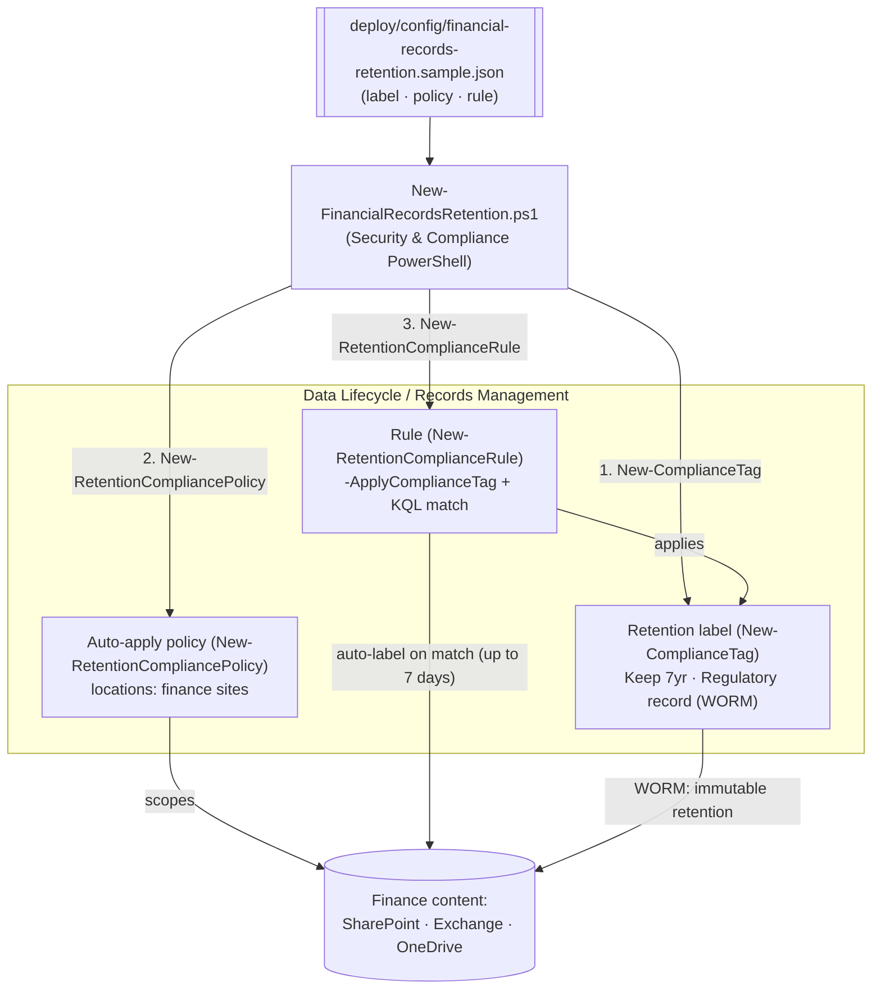

# Data Lifecycle Management — Regulatory Retention Labels for Financial Records

## 1. Scenario summary

Creates a **regulatory record** retention label for financial books-and-records (SEC 17a-4-style
write-once-read-many immutability) and an **auto-apply** retention label policy that stamps it onto
finance content — as code, via Security & Compliance PowerShell. The label keeps content for 7 years
as a non-rewriteable, non-erasable **regulatory record**; the auto-apply policy targets the finance
SharePoint site(s) and matches financial-record signals with a KQL query. Regulatory record labels
can **only be created in PowerShell** (the portal hides the option by default), which makes this a
genuinely PowerShell-first control, not a portal convenience.

**Who it's for:** a records-management / compliance / IT team at a regulated organization (broker-
dealer, bank, insurer) that must retain financial records immutably for a fixed period and wants the
label + auto-apply policy defined, reviewed, and deployed as reproducible code.

## 2. Business/regulatory driver

Financial-services firms face prescriptive records-retention rules with **immutability** requirements:
**SEC Rule 17a-4** requires broker-dealers to preserve specified records for defined periods (many for
6 years, the first 2 readily accessible) in a **non-rewriteable, non-erasable (WORM)** format;
**FINRA Rule 4511**, **CFTC 1.31**, **Sarbanes-Oxley**, and **MiFID II** impose parallel obligations.
Microsoft Purview **regulatory record** labels are designed for exactly this: once applied, the label
**can't be removed, relabeled, or unlocked, its retention can't be shortened, and the content can't be
edited or deleted** — for anyone, including admins — until the retention period expires. Managing the
label and its auto-apply policy as code makes the control reproducible and auditable, and — critically —
**creating a regulatory record label requires PowerShell**, so automation isn't optional here.

> ⚠️ **Irreversibility is the feature and the risk.** A regulatory record label, once applied, cannot
> be undone. Over-scoping the auto-apply query stamps immutable retention onto the wrong content, which
> you then cannot remove for years. Test in a lab tenant, review with `-DryRun`, and get Records/Legal
> sign-off before deploying. See §11.

## 3. Prerequisites

Full licensing detail: `docs/licensing-matrix.md`. RBAC: `docs/rbac-model.md`. Automation surface:
`docs/automation-surface.md` (surface 1 — Security & Compliance PowerShell). Summary:

| Requirement | Minimum | Notes |
|---|---|---|
| Licensing | Retention labels/policies: **M365 E3**; **records management** (record + regulatory record labels, auto-apply, event-based, disposition review): **M365 E5 / E5 Compliance / Purview Suite** | Regulatory records are a Records Management (E5) capability [[6]](#references) |
| Role | **Retention Management** or **Records Management** role group (Compliance Administrator / Organization Management include it) | To create labels, policies, and rules — `docs/rbac-model.md` |
| Auth | `Connect-IPPSSession` (certificate app-only preferred) | Security & Compliance PowerShell — `docs/automation-surface.md` §3 |
| Regulatory record option | Enabled **only via PowerShell** (`New-ComplianceTag -Regulatory $true`) | The portal hides regulatory records by default [[1]](#references) |
| Target locations | Finance SharePoint site(s) / mailboxes / OneDrive | Auto-apply policy needs ≥1 location |

> Verify current entitlement names against `docs/licensing-matrix.md` (dated 2026-09-02) before a
> sales commitment — SKU names change.

## 4. Architecture



Three objects: the **label** (the retention + immutability settings), the **policy** (where to look),
and the **rule** (which label to apply and the match query). The label is the durable control; the
policy/rule drive where and how it's auto-applied. Full rationale: `design.md`.

## 5. Step-by-step implementation

### PowerShell path (required for the regulatory record label)

```powershell
# Connect (certificate app-only preferred - docs/automation-surface.md §3)
Connect-IPPSSession -AppId $AppId -Certificate $Cert -Organization 'contoso.onmicrosoft.com'

# 1. Dry run — prints the exact New-ComplianceTag / New-RetentionCompliancePolicy / -Rule cmdlets
./deploy/New-FinancialRecordsRetention.ps1 -ConfigPath ./deploy/config/financial-records-retention.json -DryRun

# 2. Deploy the label + auto-apply policy + rule (after lab test + Records/Legal sign-off)
./deploy/New-FinancialRecordsRetention.ps1 -ConfigPath ./deploy/config/financial-records-retention.json

# 3. Validate
./validate/Test-FinancialRecordsRetention.ps1 -ConfigPath ./deploy/config/financial-records-retention.json
```

### Portal reference

The label, policy, and rule are visible in the [Microsoft Purview portal](https://purview.microsoft.com)
under **Records Management** (or **Data Lifecycle Management**) → **File plan / Labels** and →
**Label policies** [[2]](#references)[[3]](#references). The **regulatory record** option is hidden in
the portal by default, which is why this scenario is PowerShell-first [[1]](#references). `-WhatIf` is
non-functional in S&C PowerShell, so the deploy/remove scripts ship a `-DryRun` instead.

## 6. Configuration reference

| Setting | Value this scenario uses | Notes |
|---|---|---|
| Label cmdlet | `New-ComplianceTag` | Retention label [[4]](#references) |
| `RetentionAction` | `Keep` | `Keep` / `Delete` / `KeepAndDelete` |
| `RetentionDuration` | `2555` (≈7 years) | Days, or `Unlimited` |
| `RetentionType` | `CreationAgeInDays` | When the clock starts: `CreationAgeInDays` / `ModificationAgeInDays` / `TaggedAgeInDays` / `EventAgeInDays` |
| `Regulatory` | `$true` | **Regulatory record** — strongest immutability; PowerShell-only [[1]](#references) |
| `IsRecordLabel` | implied by `Regulatory` | A plain record label (lockable) if you don't need full regulatory immutability |
| Policy cmdlet | `New-RetentionCompliancePolicy` | Auto-apply label policy; needs ≥1 location [[5]](#references) |
| Locations | `SharePointLocation` (finance site) | Also `ExchangeLocation`, `OneDriveLocation`, etc. |
| Rule cmdlet | `New-RetentionComplianceRule -ApplyComplianceTag` | One rule per policy; `-ContentMatchQuery` (KQL) or `-ContentContainsSensitiveInformation` [[7]](#references) |
| Retry stuck distribution | `Set-RetentionCompliancePolicy -RetryDistribution` | If the policy status shows Off (Error) [[3]](#references) |

Exact cmdlet syntax and Learn sources are cited in each script's `.NOTES`.

## 7. Validation / how to prove it works

1. **Automated** — `./validate/Test-FinancialRecordsRetention.ps1` confirms the label exists with the
   expected action/duration and record flags, the policy exists and is enabled with ≥1 location, and
   the rule applies the expected label. Exits non-zero on failure.
2. **Immutability test (lab tenant)** — apply the label to a test document, then confirm you **cannot**
   edit or delete it, **cannot** remove or change the label, and **cannot** shorten its retention —
   even as an admin — proving the regulatory record behavior [[1]](#references).
3. **Auto-apply test** — place matching content in a finance location, wait up to **7 days**
   [[3]](#references), and confirm the label is applied (portal, or `Get-` on the item's compliance
   tag). If stuck, run `Set-RetentionCompliancePolicy -RetryDistribution`.
4. **Idempotency proof** — re-run the deploy; the label/policy/rule report `exists` (not `created`) and
   nothing is duplicated or silently mutated.
5. **Disposition (if configured)** — for `KeepAndDelete` labels with disposition review, confirm the
   reviewer receives a disposition item at end-of-retention (out of scope for the `Keep`-only default).

## 8. Operations & tuning

**KPIs / signals:** policy **DistributionStatus** (should reach a healthy state; Off (Error) → retry);
count of items labeled over time (via content search / Data Lifecycle reports); disposition backlog
(if using KeepAndDelete). **Tuning:** keep the auto-apply **match query narrow** — precision matters
far more than recall when the label is irreversible; start with a tightly-scoped location + query,
validate, then widen. Auto-apply latency is up to 7 days; don't expect instant labeling.

**Change management:** treat any change to the label or its scope as a controlled, Records/Legal-
reviewed change — you can't walk back a regulatory record. Keep the config file under version control
as the record of what was deployed and why.

## 9. Rollback / decommission

See `rollback.md`. Quick reference: `./deploy/Remove-FinancialRecordsRetention.ps1` **disables** the
auto-apply policy (stops labeling *new* content); `-Delete` removes the policy + rule. The regulatory
record **label is not force-removed** — a regulatory record label that has been applied **cannot** be
deleted and its retention **cannot** be shortened (that immutability is the whole point). Removing the
policy never releases content already labeled.

## 10. Cost & licensing notes

- **Per-user E5 entitlement**, no Azure consumption meter. Records management (regulatory records,
  auto-apply, disposition) is an **E5 / E5 Compliance / Purview Suite** capability; plain retention
  labels/policies are E3 [[6]](#references).
- **Cost is licensing + storage + governance discipline.** Immutable content can't be deleted early,
  so storage grows for the full retention term — factor 7-year (or longer) growth into SharePoint/
  Exchange capacity planning.
- **The expensive mistake is over-scoping.** An over-broad auto-apply query makes vast amounts of
  content immutable and un-deletable for years — the dominant risk to manage (§11).

## 11. Known limitations & gotchas

- **IRREVERSIBLE.** A regulatory record label, once applied, cannot be removed, relabeled, or unlocked;
  its retention cannot be shortened; content cannot be edited or deleted — by anyone. **Test in a lab
  tenant, review with `-DryRun`, and get Records/Legal sign-off before deploying** [[1]](#references).
- **Regulatory records are PowerShell-only.** `New-ComplianceTag -Regulatory $true` is the only
  supported way to create one; the portal hides the option by default [[1]](#references). Confirm your
  org actually needs full regulatory immutability vs. a standard record label (still lockable, but with
  more admin flexibility) — pick the least-restrictive control that meets the obligation.
- **`-WhatIf` is non-functional in S&C PowerShell** — the scripts ship a `-DryRun` instead.
- **Auto-apply latency & scope.** Auto-apply can take up to 7 days; can't label SharePoint/OneDrive
  items older than 6 months for trainable-classifier conditions; SharePoint/mailboxes need ≥10 MB for
  classifier-based apply. This scenario uses a KQL `-ContentMatchQuery`, which is not subject to the
  classifier age/size limits, but still has the 7-day latency [[3]](#references).
- **Idempotency is create-or-report, not create-or-update.** The deploy locates objects by name and
  does **not** silently modify an existing label/policy (retention objects are high-consequence) — edit
  deliberately, with review, if settings must change.
- **Adaptive scopes out of scope.** This scenario uses static SharePoint locations; large/dynamic
  estates should use adaptive scopes (a documented follow-up) [[3]](#references).
- **Locking behavior of the policy vs. records.** Disabling/deleting the auto-apply policy stops future
  labeling only — it never releases content already made a regulatory record (`rollback.md`).
- **Illustrative values.** The 7-year duration, the finance site URL, and the match query are
  placeholders — set them to your actual regulatory obligation and record signals, validated by Records/
  Legal, before deploying.

## 12. References

1. Learn about records management / regulatory records (immutability: can't remove/relabel/unlock/shorten; PowerShell-only creation) — <https://learn.microsoft.com/purview/records-management>
2. Declare records / create retention labels for records — <https://learn.microsoft.com/purview/declare-records>
3. Automatically apply a retention label (auto-apply policy, up to 7-day latency, RetryDistribution, classifier limits) — <https://learn.microsoft.com/purview/apply-retention-labels-automatically>
4. New-ComplianceTag (retention label; RetentionAction/Duration/Type, IsRecordLabel, Regulatory) — <https://learn.microsoft.com/powershell/module/exchangepowershell/new-compliancetag>
5. New-RetentionCompliancePolicy (retention label policy; locations) — <https://learn.microsoft.com/powershell/module/exchangepowershell/new-retentioncompliancepolicy>
6. Microsoft Purview service description — Records Management / Data Lifecycle Management licensing — <https://learn.microsoft.com/office365/servicedescriptions/microsoft-365-service-descriptions/microsoft-365-tenantlevel-services-licensing-guidance/microsoft-purview-service-description>
7. New-RetentionComplianceRule (-ApplyComplianceTag / -PublishComplianceTag, -ContentMatchQuery, -ContentContainsSensitiveInformation) — <https://learn.microsoft.com/powershell/module/exchangepowershell/new-retentioncompliancerule>
8. PowerShell cmdlets for retention policies and retention labels — <https://learn.microsoft.com/purview/retention-cmdlets>
9. Bulk create and publish retention labels by using PowerShell — <https://learn.microsoft.com/purview/bulk-create-publish-labels-using-powershell>

> Re-verify all links, cmdlet parameters, licensing, and the regulatory-record behavior against
> current Microsoft Learn before a customer-facing deployment. Regulatory records are irreversible —
> the scenario is deliberately conservative (dry-run, create-or-report, no force-remove of records).
