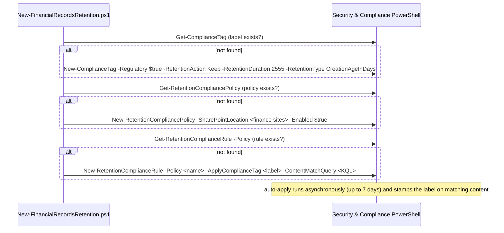

# Design — Regulatory Retention Labels for Financial Records

## 1. Problem statement

A regulated firm must retain financial books-and-records **immutably** for a fixed period (SEC 17a-4,
FINRA 4511, SOX, MiFID II) and prove it. The control has two parts that must be right and reproducible:
the **retention/immutability settings** (how long, and that it truly can't be altered or deleted) and
the **targeting** (which content gets it, automatically). This scenario builds both as code — a
regulatory record retention label plus an auto-apply policy — with heavy guardrails because the label
is irreversible once applied.

## 2. Design goals

1. **Immutability that satisfies WORM obligations.** Use a **regulatory record** label so content
   becomes non-rewriteable/non-erasable and the label/retention can't be weakened by anyone.
2. **Reproducible as code.** One config → label + policy + rule; re-running is safe and reports rather
   than silently mutates high-consequence objects.
3. **Guardrails proportional to irreversibility.** `-DryRun` by intent (S&C `-WhatIf` doesn't work),
   create-or-report (never auto-edit an existing retention object), loud warnings, and a rollback that
   refuses to pretend records can be released.
4. **PowerShell-first, honestly.** Regulatory records can only be created in PowerShell — so this is a
   real automation requirement, not a portal shortcut, and the scenario says so.
5. **Narrow targeting.** Encourage a tightly-scoped location + match query, because over-scoping an
   irreversible label is the dominant risk.

## 3. Why a regulatory record label (and when not to)

Purview offers a ladder of retention strength:
- **Retention label (Keep)** — retains content but an admin can still remove the label / change
  retention.
- **Record label (`-IsRecordLabel`)** — locks the item (can't edit/delete while locked) but a record
  can be **unlocked** and the label can be removed by a records manager — reversible with privilege.
- **Regulatory record (`-Regulatory`)** — the strongest: **cannot** be removed, relabeled, unlocked, or
  shortened, and content **cannot** be edited/deleted, by anyone, for the full period.

This scenario defaults to **regulatory record** because SEC 17a-4-class obligations demand WORM
immutability that even admins can't override. `design.md`/`README.md` are explicit that regulatory
immutability is a serious, irreversible commitment: teams whose obligation is met by a plain record
label (which keeps some admin flexibility) should choose that instead — least-restrictive control that
meets the rule.

## 4. Object model

A policy is invalid until it has a rule; only **one rule per policy**. The label carries the durable
settings; the policy/rule decide where and how it's auto-applied.

## 5. Idempotency and safety posture

Idempotency here is deliberately **create-or-report**, not create-or-update: the deploy locates each
object by name and, if it exists, reports it and moves on rather than mutating it. Retention objects —
especially a regulatory record label — are too consequential to silently reconcile from a file; a
settings change must be a deliberate, reviewed action. Combined with `-DryRun`, loud regulatory
warnings, and a rollback that never force-removes records, the safety posture is proportional to the
irreversibility of the control.

## 6. Key decisions

| Decision | Choice | Rationale |
|---|---|---|
| Immutability level | Regulatory record (`-Regulatory $true`) by default | Meets WORM/17a-4-class obligations; documented alternative is a plain record label |
| Surface | Security & Compliance PowerShell | Regulatory records are PowerShell-only; DLM/RM cmdlets are the native surface |
| Dry-run | Custom `-DryRun` | `-WhatIf` is non-functional in S&C PowerShell |
| Idempotency | Create-or-report (no silent update) | Retention objects are high-consequence; edits must be deliberate |
| Retention clock | `CreationAgeInDays`, 2555 days (~7y) | Common financial-records baseline; tune to the obligation |
| Targeting | Static SharePoint location + narrow KQL | Precision over recall for an irreversible label; adaptive scopes are a follow-up |
| Rollback | Disable/delete policy; never force-remove records | Regulatory records can't be released — the script refuses to pretend otherwise |

## 7. Non-goals

- **Publishing labels for manual application** (`-PublishComplianceTag`) — this scenario auto-applies;
  a publish policy for user-applied labels is a variant.
- **Event-based retention / disposition review workflows** (`-EventType`, `KeepAndDelete`,
  `-ReviewerEmail`) — powerful RM features layered on the same cmdlets; candidate follow-ups.
- **Adaptive scopes** — used for large/dynamic estates; this scenario uses static locations.
- **File plan descriptors** (`-FilePlanProperty`: categories, citations, authorities) — valuable for
  formal file plans; out of scope for the starter.
- **Editing/strengthening an existing label** — the deploy reports and does not mutate; changes are a
  deliberate, reviewed action.
- **Releasing existing records** — impossible for regulatory records by design; rollback only stops
  future auto-labeling.
