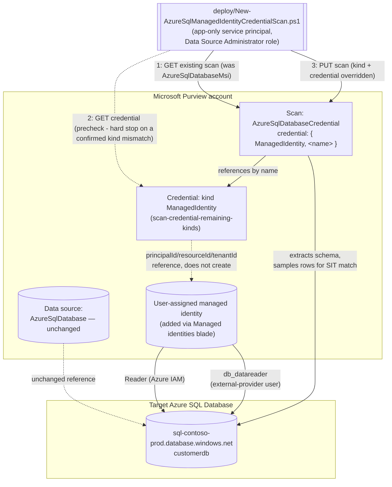

# Data Map — UAMI Credential for the Azure SQL Database Scan

## 1. Scenario summary

Extends `scenarios/data-map/scan-azure-sql-and-classify/`: reconciles that scenario's already-
registered scan from the Purview account's shared system-assigned managed identity (SAMI) onto a
**user-assigned managed identity (UAMI)** — a separately-scoped, per-source Azure identity built via
`scenarios/data-map/scan-credential-remaining-kinds/`'s `ManagedIdentity` credential kind. Every
other scan property (database, server, collection, scan rule set) is preserved unchanged; only the
authentication path moves.

**Who it's for:** a data governance or security team that has already run the base Azure SQL
Database scanning scenario, and whose governance model wants **per-source identity separation**
instead of relying on the Purview account's one shared SAMI for every source it scans — e.g. an
MSSP scanning multiple customer tenants' databases through one Purview account, or an enterprise
whose security team wants a compromised or misconfigured grant on one source's identity to have no
blast radius on any other source.

## 2. Business/regulatory driver

Least-privilege and blast-radius reduction are explicit controls under SOC 2 (CC6.1 — logical
access restricted to least privilege), ISO 27001 (A.8.2 — privileged access rights), and most
internal segregation-of-duties policies. The Purview account's SAMI is, by design, **one identity
shared across every source that account scans** — there is no way to scope the SAMI itself more
narrowly per source. Microsoft's own documented credential priority order ranks a UAMI directly
below SAMI for exactly this reason: it is a separate, independently-grantable and independently-
revocable Azure identity per source or source group [[8]](#references). This scenario makes that
narrower option concrete for the base scenario's Azure SQL Database scan, rather than leaving it as
a documented-but-unbuilt "alternative" (the base scenario's own README §6 has always named
`AzureSqlDatabaseCredential` as the alternative scan kind without scripting it).

## 3. Prerequisites

Full licensing detail and citations: `docs/licensing-matrix.md`. Summary for this scenario —
**additive** to the base scenario's own prerequisite table, which still applies in full:

| Requirement | Minimum | Notes |
|---|---|---|
| The base scenario already deployed | `scenarios/data-map/scan-azure-sql-and-classify/` scan exists (SAMI or already-reconciled credential auth) | This scenario reconciles an **existing** scan — it refuses to run against a data source/scan that doesn't exist yet |
| A user-assigned managed identity (UAMI) created and added to the Purview account | Azure identity-administration action, via the Purview account's own **Managed identities** blade | Out-of-band Azure step, not a Scanning-API call — see `scan-credential-remaining-kinds/README.md` §3 [[9]](#references) |
| A Purview credential object, kind `ManagedIdentity`, referencing that UAMI | Built via `scenarios/data-map/scan-credential-remaining-kinds/deploy/New-PurviewScanCredentialExtended.ps1 -CredentialType ManagedIdentity` | This scenario's `-CredentialReferenceName` parameter is that credential object's name |
| Reconcile the scan onto the new credential | **Data Source Administrator** role on the scan's collection | Same Purview role the base scenario's own deploy script needs — see `docs/rbac-model.md` §5 |
| Azure IAM on the target SQL Server, for the **UAMI** (not the Purview account's SAMI) | **Reader** role, scoped to the **SQL Server resource itself**, granted to the UAMI | A separate grant from the base scenario's SAMI grant — Microsoft's portal instructions accept "your Microsoft Purview account name or UAMI" in the same **Select** box, but they are two different principals with two separate role assignments [[4]](#references) |
| Database-level access for the UAMI | `db_datareader` granted to the **UAMI's exact managed-identity name** as a Microsoft Entra external-provider database user | Same T-SQL pattern as the base scenario's SAMI grant, different `[Username]` value — see §5 [[4]](#references) |
| Network path to the database | Unchanged from the base scenario — **neither SAMI nor UAMI works over a self-hosted integration runtime** | Confirmed explicitly for UAMI, not just SAMI — see §11 [[4]](#references) |
| Automation identity for the REST calls themselves | App registration with **Data Source Administrator** (and, for `validate/`, **Data Reader**) Purview role on the collection | Same as the base scenario — `docs/automation-surface.md` §3 and §7 below |

> Verify current entitlement names against `docs/licensing-matrix.md` before a production rollout —
> this scenario introduces no new licensing surface (still PAYG Data Map scanning), only a different
> authentication identity.

## 4. Architecture



## 5. Step-by-step implementation

### Portal path (for a first manual walkthrough / to validate intent before scripting)

1. Complete `scenarios/data-map/scan-credential-remaining-kinds/`'s portal or script path for a
   `ManagedIdentity` credential first — this requires a UAMI already added under the Purview
   account's **Managed identities** blade in the Azure portal [[9]](#references).
2. In Azure SQL, run the T-SQL grant against the target database, using the UAMI's **exact managed
   identity name** as `[Username]`:
   ```sql
   CREATE USER [Username] FROM EXTERNAL PROVIDER
   GO
   EXEC sp_addrolemember 'db_datareader', [Username]
   GO
   ```
   [[4]](#references)
3. In the Azure portal, on the **SQL Server resource itself**, grant the **Reader** IAM role to the
   UAMI (select it by name in the same **Access control (IAM)** pane the base scenario's SAMI grant
   used) [[4]](#references).
4. Back in the Purview portal, open the base scenario's already-registered scan and select **Edit**.
   Under **Credential**, switch from the system-assigned managed identity to the UAMI, select **Test
   connection**, then **Save** [[4]](#references)[[1]](#references).
5. Re-run (or wait for the next scheduled trigger) and confirm the scan still completes
   successfully under the new identity.

### Script path (idempotent, parameterized, dry-run capable)

```powershell
# 0. Prerequisite: build the ManagedIdentity credential first (if not already done)
../scan-credential-remaining-kinds/deploy/New-PurviewScanCredentialExtended.ps1 `
    -PurviewAccountName 'contoso-purview' -TenantId $TenantId -AppId $AppId -ClientSecret $ClientSecret `
    -CredentialName 'sql-contoso-uami' -CredentialType ManagedIdentity `
    -PrincipalId $UamiPrincipalId -ResourceId $UamiResourceId

# 1. Dry run first - reports every REST call that would be made, changes nothing
./deploy/New-AzureSqlManagedIdentityCredentialScan.ps1 `
    -PurviewAccountName 'contoso-purview' -TenantId $TenantId -AppId $AppId -ClientSecret $ClientSecret `
    -DataSourceName 'sql-contoso-prod-customerdb' -CredentialReferenceName 'sql-contoso-uami' -WhatIf

# 2. Reconcile for real
./deploy/New-AzureSqlManagedIdentityCredentialScan.ps1 `
    -PurviewAccountName 'contoso-purview' -TenantId $TenantId -AppId $AppId -ClientSecret $ClientSecret `
    -DataSourceName 'sql-contoso-prod-customerdb' -CredentialReferenceName 'sql-contoso-uami'

# 3. Reconcile and immediately prove the new identity works
./deploy/New-AzureSqlManagedIdentityCredentialScan.ps1 `
    -PurviewAccountName 'contoso-purview' -TenantId $TenantId -AppId $AppId -ClientSecret $ClientSecret `
    -DataSourceName 'sql-contoso-prod-customerdb' -CredentialReferenceName 'sql-contoso-uami' -RunNow

# 4. Validate
./validate/Test-AzureSqlManagedIdentityCredentialScan.ps1 `
    -PurviewAccountName 'contoso-purview' -TenantId $TenantId -AppId $AppId -ClientSecret $ClientSecret `
    -DataSourceName 'sql-contoso-prod-customerdb' -ExpectedCredentialReferenceName 'sql-contoso-uami' `
    -CheckCredentialObject
```

Same REST surface as the base scenario — Microsoft Purview Data Map / Data Governance REST API,
automation surface 4 per `docs/automation-surface.md` §1. Token acquisition follows
`docs/automation-surface.md` §3's client-credentials pattern.

## 6. Configuration reference

| Setting | Value this scenario uses | Notes |
|---|---|---|
| Scan `kind` (before) | `AzureSqlDatabaseMsi` | SAMI-authenticated — the base scenario's default |
| Scan `kind` (after) | `AzureSqlDatabaseCredential` | Confirmed via direct fetch of the Scans - Create Or Replace REST reference [[5]](#references) |
| `properties.credential.credentialType` | `ManagedIdentity` | One of `CredentialType`'s eight documented enum values [[5]](#references) |
| `properties.credential.referenceName` | Name of a pre-existing `ManagedIdentity`-kind credential object | Built via `scan-credential-remaining-kinds` — see §3 |
| Properties preserved unchanged from the existing scan | `databaseName`, `serverEndpoint`, `collection`, `scanRulesetName`, `scanRulesetType` | GET-then-PUT reconciliation — see `design.md` §2 goal 1 |
| `-SkipCredentialPrecheck` | Off by default | Skips the read-only GET against the credential object before reconciling — use if `-AppId` cannot read the credential's collection. Does not suppress the hard stop below |
| `-Force` | Off by default | Required to proceed past a precheck that found the credential object but confirmed it is **not** kind `ManagedIdentity` — a deterministic misconfiguration, unlike an ambiguous 404, so it hard-stops by default |
| `-RunNow` | Off by default | Starts an immediate scan run to prove the new identity actually authenticates, not just that the object was accepted |
| API version pinned by this script | `2023-09-01` | Matches the base scenario |

Full cmdlet/REST-body grounding: `deploy/New-AzureSqlManagedIdentityCredentialScan.ps1`'s inline
comments and `.NOTES` block.

## 7. Validation / how to prove it works

1. **Automated config check** — `./validate/Test-AzureSqlManagedIdentityCredentialScan.ps1` confirms
   the scan's `kind` is `AzureSqlDatabaseCredential`, its `credential.credentialType` is
   `ManagedIdentity`, and (with `-ExpectedCredentialReferenceName`) that it references the expected
   credential object. `-CheckCredentialObject` additionally confirms that object itself still exists
   and is still kind `ManagedIdentity`.
2. **Scan run status** — Purview portal → **Data Map** → **Data sources** → the scan → **Recent
   scans** → confirm a run under the new identity reaches **Completed**.
3. **Access-path evidence** — confirm in Azure SQL (`SELECT * FROM sys.database_principals WHERE
   type = 'E'`) that the UAMI (not the Purview account) now appears as the external-provider
   database user with `db_datareader` actually being used by new scan runs.
4. **Negative test** — temporarily revoke the UAMI's `db_datareader` grant, re-run with `-RunNow`,
   and confirm the run fails with an authentication/authorization error rather than silently
   succeeding under a fallback identity (Purview does not fall back from a configured credential to
   SAMI).

**What no script here can prove**, beyond the base scenario's own §7 disclaimer: whether the UAMI is
still attached to the Purview account (it can be detached/deleted independently of the credential
object that references it — see §11); whether the stored credential's three ID strings still match
a live, existing UAMI resource.

## 8. Operations & tuning

All of the base scenario's §8 KPI and incident-response guidance applies unchanged — this scenario
only changes *which identity* authenticates the same scan, not its scan behavior, scheduling, or
failure classification. Two additions specific to the UAMI path:

- **The UAMI credential has no Key Vault-side detective control.** Like `AmazonARN`, the
  `ManagedIdentity` kind carries no secret — there is nothing for a Key Vault `AuditEvent` diagnostic
  log to catch if the credential object is silently re-pointed at a different UAMI. The only
  detective control is `scenarios/data-map/scan-credential-inventory-report/`'s estate-wide drift
  report, run on the same daily cadence `scan-credential-remaining-kinds/README.md` §8 recommends for
  this kind.
- **A UAMI can be deleted or detached from the Purview account independently of this scan's
  configuration.** If a scan that previously succeeded starts failing authentication with no
  configuration change on the Purview side, check the Azure portal's **Managed identities** blade on
  the Purview account first — the UAMI resource itself, not just the credential object, is the
  most likely point of silent failure (see §11).
- **No detective control exists for the scan's own `credential.referenceName` drifting away from
  the intended UAMI credential.** `scenarios/data-map/scan-credential-inventory-report/` monitors
  drift on a *credential object's own content* (its `principalId`/`resourceId`/`tenantId`); it has
  no concept of which *scans* reference which credential, so it would not catch an operator
  (accidentally or deliberately) re-pointing this scan at a different, still-valid `ManagedIdentity`
  credential. The only detective control for that specific drift is re-running
  `validate/Test-AzureSqlManagedIdentityCredentialScan.ps1 -ExpectedCredentialReferenceName` on a
  schedule — there is no Purview audit event or alert for a scan's credential reference changing
  (the same "no `GenerateAlert` for scans" gap `scan-azure-sql-and-classify/README.md` §8 already
  discloses generally).
- **Adopt selectively, not as a blanket replacement for SAMI.** Each UAMI is one more Azure identity
  a team must provision, grant, and monitor (§10) — the identity-separation benefit is highest for a
  small number of high-sensitivity sources (e.g. an MSSP's per-customer databases), and lowest for a
  large fleet of low-sensitivity sources where the coordination overhead likely outweighs the
  blast-radius reduction. Start with the sources whose compromise would be most consequential, not
  every scan the base scenario has ever registered.

## 9. Rollback / decommission

See `rollback.md` for the full staged procedure. Quick reference:
`./deploy/Remove-AzureSqlManagedIdentityCredentialScan.ps1` reverts the scan's `kind` back to
`AzureSqlDatabaseMsi` (SAMI), preserving every other scan property — reversible by re-running this
scenario's own deploy script again. It does not delete the UAMI, its Azure IAM/SQL grants, or the
`ManagedIdentity` credential object.

## 10. Cost & licensing notes

- **No new billing surface.** This scenario changes authentication only — the same PAYG Data Map
  scan-consumption model documented in `docs/licensing-matrix.md` §1–2 and the base scenario's §10
  applies unchanged.
- **A UAMI itself has no direct Azure cost** — it is a free identity resource. The only cost
  consideration is operational: each additional UAMI is one more Azure identity a team must
  provision, grant, and monitor (see the CISO coordination-cost point in
  `scan-credential-remaining-kinds/reviews.md`, which applies identically here).

## 11. Known limitations & gotchas

- **`ManagedIdentity` (UAMI) is a Microsoft-labeled Preview capability**, inherited from
  `scan-credential-remaining-kinds`. A production rollout built on it could be disrupted by a
  behavior change with no corresponding documentation update — see that scenario's README §11 for
  the full disclosure, which applies unchanged here.
- **Neither SAMI nor UAMI works over a self-hosted integration runtime.** If the target SQL Server is
  reachable only via self-hosted IR, this entire scenario (and the base scenario's SAMI default) is
  inapplicable — the only supported paths are service principal or SQL authentication, both
  requiring a Key Vault-backed credential via `scan-credential-key-vault-backed` instead
  [[4]](#references).
- **A UAMI can be deleted independently of the credential object that references it, and
  independently of this scan's configuration.** Neither this scenario's deploy script nor its
  validate script can detect that — `-CheckCredentialObject` confirms the Purview credential object
  still exists and is the right kind, not that the UAMI resource it points at is still live and
  attached to the Purview account. Confirm in the Azure portal's Managed identities blade if a
  previously-working scan starts failing authentication.
- **Reverting to SAMI (rollback) assumes the SAMI's own Reader/`db_datareader` grants from the base
  scenario are still in place.** If they were removed when the UAMI was adopted, re-establish them
  before rolling back, or the reverted scan will register successfully but fail on its next run —
  see `rollback.md`.
- **This scenario's precheck cannot detect every misconfiguration.** `-CheckCredentialObject`/the
  deploy script's built-in precheck confirm the credential object exists and is the right *kind* —
  neither confirms the UAMI it references is attached to the Purview account or holds the Azure
  IAM/SQL grants, the same disclosed gap `scan-credential-remaining-kinds/README.md` §7 already
  carries for every consumer of a `ManagedIdentity` credential.

## 12. References

1. Discover and govern Azure SQL Database in Microsoft Purview — <https://learn.microsoft.com/purview/register-scan-azure-sql-database>
2. Microsoft Purview billing models (PAYG for Data Map) — <https://learn.microsoft.com/purview/purview-billing-models>
3. Tutorial: Authenticate for Microsoft Purview data-plane APIs — <https://learn.microsoft.com/purview/data-gov-api-rest-data-plane>
4. Discover and govern Azure SQL Database — "Configure authentication for a scan" / "Managed identity" tab (UAMI supported source, T-SQL grant using the exact managed identity name, Azure IAM Reader accepting "your Microsoft Purview account name or UAMI", SAMI/UAMI incompatibility with self-hosted integration runtime) — <https://learn.microsoft.com/purview/register-scan-azure-sql-database#configure-authentication-for-a-scan>
5. Scans - Create Or Replace REST API reference (API version 2023-09-01; confirmed `AzureSqlDatabaseCredentialScanProperties`, `CredentialReference { credentialType, referenceName }`, and the `CredentialType` enum including `ManagedIdentity`) — <https://learn.microsoft.com/rest/api/purview/scanningdataplane/scans/create-or-replace>
6. Connect to and manage Azure Synapse Analytics workspaces in Microsoft Purview — collection ID lookup — <https://learn.microsoft.com/purview/register-scan-synapse-workspace#scan>
7. Scans and ingestion in Data Map — <https://learn.microsoft.com/purview/data-map-scan-ingestion>
8. Data governance best practices for security — Credential management (Microsoft's explicit credential priority order: Purview managed identity → user-assigned managed identity → service principal → account key/SQL auth/other) — <https://learn.microsoft.com/purview/data-gov-classic-security-best-practices>
9. Credentials for source authentication in Microsoft Purview Data Map — "Create a user-assigned managed identity" (UAMI creation via the Purview account's Managed identities blade; confirms Azure SQL Database as a UAMI-supported source) — <https://learn.microsoft.com/purview/data-map-data-scan-credentials#create-a-user-assigned-managed-identity>
10. Credential - Get / List REST API reference (object shape used by this scenario's optional `-CheckCredentialObject`/precheck) — <https://learn.microsoft.com/rest/api/purview/scanningdataplane/credential>
11. `scenarios/data-map/scan-credential-remaining-kinds/` — the `ManagedIdentity` credential kind this scenario consumes (creation, grounding, and its own known limitations).
12. `scenarios/data-map/scan-azure-sql-and-classify/` — the base scenario this fragment extends (data source registration, SAMI defaults, full prerequisite table this scenario's own table is additive to).

> Re-verify all links, API versions, and REST body shapes against current Microsoft Learn before a
> customer-facing deployment. The `ManagedIdentity` credential kind remains Microsoft-labeled
> Preview as of this writing — see §11.
