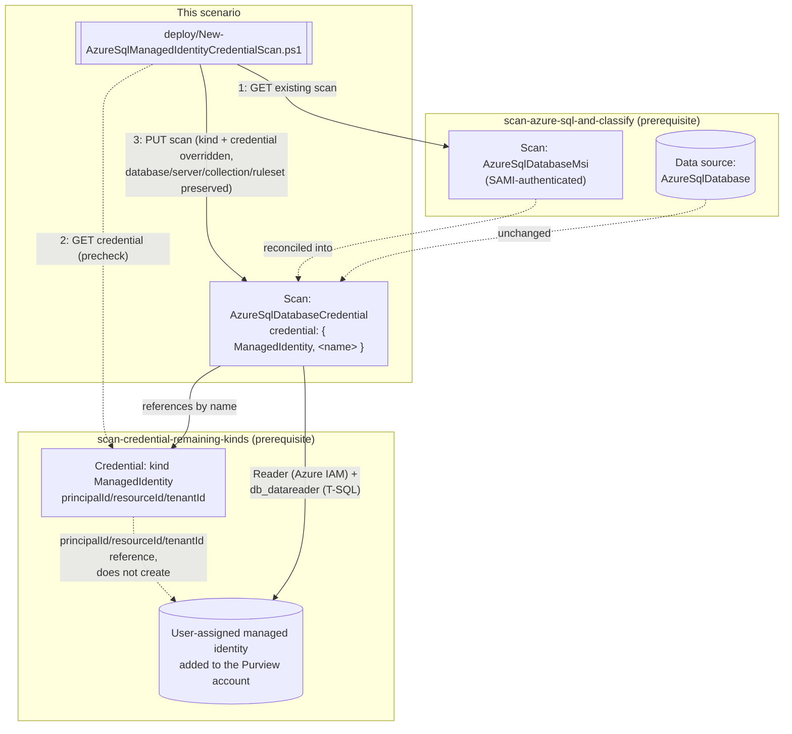

# Design — UAMI Credential for the Azure SQL Database Scan

## 1. Problem statement

`scenarios/data-map/scan-azure-sql-and-classify/` authenticates its scan as the Purview account's
own **system-assigned managed identity (SAMI)** — Microsoft's recommended default, and the right
starting choice because it needs no credential object to create or rotate. That default has a
structural cost at scale: the SAMI is **one identity shared by every source the Purview account
scans**. Grant it Azure IAM Reader on ten SQL servers and `db_datareader` on ten databases, and a
single compromised Purview account (or a single over-broad SAMI grant) now has read access to all
ten — there is no way to scope the SAMI itself more narrowly per source.

Microsoft's own credential priority order (`scan-credential-remaining-kinds/README.md` §2, citing
reference 8 below) ranks a **user-assigned managed identity (UAMI)** directly below SAMI, precisely
because a UAMI is a separate, independently-scoped Azure identity: one UAMI per source or per
source group, each grantable — and revocable — without touching any other source's access. This
scenario closes the gap `scan-credential-remaining-kinds/README.md` §6 named but did not build (see
its "Related scenarios" and `PROGRESS.md`): wiring its `ManagedIdentity` credential kind into an
already-scanned source, using Azure SQL Database (the base scenario's own target) as the first of
the three directly-actionable siblings it identified.

## 2. Design goals

1. **Reconcile the existing scan, never create a second one.** A single Azure SQL Database scan
   authenticates one way at a time — Microsoft's object model has no concept of "try SAMI, then
   fall back to UAMI." A parallel second scan against the same database would double scan cost and
   catalog noise for no benefit (rejected — see §5). `deploy/New-AzureSqlManagedIdentityCredentialScan.ps1`
   follows the same GET-then-PUT reconciliation pattern `scan-azure-sql-and-classify-pii-ruleset`
   already established for this repo: read the existing scan, copy every property forward
   unchanged, and override only `kind` and `properties.credential`.
2. **The credential object is a prerequisite, not this scenario's job to create.** Creating the
   UAMI itself (an Azure-side "Managed identities" blade action), adding it to the Purview account,
   and creating the `ManagedIdentity`-kind Purview credential object that references it are all
   `scan-credential-remaining-kinds`'s job (already built). This scenario only ever *consumes* a
   credential name — the same "downstream of an out-of-band identity" boundary that scenario itself
   established for the UAMI, and `scan-credential-key-vault-backed` established for the Key Vault
   secret before it.
3. **Catch a bad credential reference before it becomes a failed scan run.** Purview exposes no
   "test credential" API (the same limitation every credential-consuming script in this repo
   inherits — `scan-credential-key-vault-backed/README.md` §7). The next best thing this script can
   do without connecting to the tenant itself is a read-only precheck: GET the named credential
   object and confirm it is kind `ManagedIdentity` before reconciling the scan onto it, so a typo in
   `-CredentialReferenceName` surfaces immediately as a `[WARN]` rather than silently at the next
   scheduled scan run. `-SkipCredentialPrecheck` exists because this check needs Data Reader on
   whichever collection the credential object lives in, which is not guaranteed to be the same
   collection as the scan itself.
4. **Fully reversible, the same way the base scenario's own alternative-kind claim promised.**
   `scan-azure-sql-and-classify/README.md` §6 has always listed `AzureSqlDatabaseCredential` as "the
   alternative" scan kind — this scenario is that alternative, made concrete and scripted, and its
   `Remove-AzureSqlManagedIdentityCredentialScan.ps1` reverses it with the same GET-then-PUT
   reconciliation pattern, restoring `AzureSqlDatabaseMsi` exactly as the base scenario originally
   created it (see §5's "what rollback does not undo").

## 3. Architecture

## 4. Configuration model

| Element | Value | Why |
|---|---|---|
| Scan `kind` (after reconciliation) | `AzureSqlDatabaseCredential` | Confirmed via direct fetch of the Scans - Create Or Replace REST reference — the same kind the base scenario's README §6 already names as "the alternative" |
| `properties.credential.credentialType` | `ManagedIdentity` | Confirmed as one of `CredentialType`'s eight documented enum values on the same reference page, alongside `SqlAuth`/`ServicePrincipal`/etc. |
| `properties.credential.referenceName` | The name of a pre-existing `ManagedIdentity`-kind credential object | Built via `scan-credential-remaining-kinds/deploy/New-PurviewScanCredentialExtended.ps1 -CredentialType ManagedIdentity` |
| Properties preserved from the existing scan | `databaseName`, `serverEndpoint`, `collection`, `scanRulesetName`, `scanRulesetType` | GET-then-PUT reconciliation (Design goal 1) — a `PUT` that omitted these would silently reset them to the API's defaults |
| Azure IAM grant | **Reader**, scoped to the SQL Server resource, granted to the **UAMI** (not the Purview account's SAMI) | Microsoft's own portal instructions state this role assignment's **Select** box accepts "your Microsoft Purview account name or UAMI" — a different principal than the base scenario's own grant |
| SQL-side grant | `db_datareader`, granted via `CREATE USER [Username] FROM EXTERNAL PROVIDER` where `[Username]` is "the exact managed identity from Microsoft Purview" | Same T-SQL pattern as SAMI, different principal name — see README.md §5 |

## 5. What this scenario does not do

- **Create a second, parallel scan.** Rejected in Design goal 1 — one scan authenticates one way;
  running both a SAMI-authenticated and a UAMI-authenticated scan against the same database would
  scan (and bill) the same content twice for no discovery benefit, and would leave two scan-run
  histories to reconcile in `validate/`.
- **Create the UAMI, attach it to the Purview account, or create the `ManagedIdentity` credential
  object.** All three are `scan-credential-remaining-kinds`'s scope (already built) — see Design
  goal 2.
- **Grant the Azure IAM Reader role or the SQL `db_datareader` permission.** Both are one-time,
  ARM/SQL-side prerequisites for the *UAMI*, documented but not scripted, matching the base
  scenario's own boundary for the SAMI equivalents (README.md §11 of that scenario).
- **What rollback does not undo:** classifications already applied by prior scan runs (under either
  identity) are not retroactively changed; the UAMI, its Azure IAM/SQL grants, and the
  `ManagedIdentity` credential object itself are never deleted by `Remove-
  AzureSqlManagedIdentityCredentialScan.ps1` — only the scan's own `kind`/`credential` properties are
  reverted. See `rollback.md`.
- **Extend to the Azure SQL Managed Instance or Azure Synapse siblings.** `scan-credential-remaining-
  kinds/README.md` §6 names those two as separately actionable — each has its own base scenario and
  would need its own reconciliation script, out of scope for this fragment (tracked in
  `PROGRESS.md`).

## 6. References

Full citation list in `README.md` §12.
