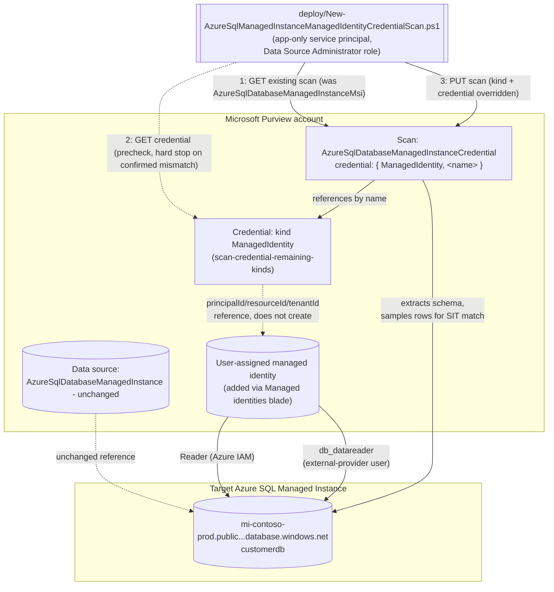

# Data Map - UAMI Credential for the Azure SQL Managed Instance Scan

## 1. Scenario summary

Extends `scenarios/data-map/scan-azure-sql-managed-instance-and-classify/`: reconciles that
scenario's already-registered scan from the Purview account's shared system-assigned managed
identity (SAMI) onto a **user-assigned managed identity (UAMI)** - a separately-scoped, per-source
Azure identity built via `scenarios/data-map/scan-credential-remaining-kinds/`'s `ManagedIdentity`
credential kind. Every other scan property (database, server, collection, scan rule set) is
preserved unchanged; only the authentication path moves. This is the Managed Instance sibling of
`scenarios/data-map/scan-azure-sql-and-classify-managed-identity-credential/`, following the same
reconciliation pattern but against Managed Instance's own distinct scan `kind` and REST properties
shape - see `design.md` §1 for the full diff from that sibling.

**Who it's for:** a data governance or security team that has already run the base Azure SQL
Managed Instance scanning scenario, and whose governance model wants **per-source identity
separation** instead of relying on the Purview account's one shared SAMI for every source it
scans - the same driver as the Database sibling, applied to a common lift-and-shift landing zone
for on-premises SQL Server estates.

## 2. Business/regulatory driver

Identical to the Database sibling (`scan-azure-sql-and-classify-managed-identity-credential/
README.md` §2): SOC 2 CC6.1 and ISO 27001 A.8.2 both call for least-privilege, blast-radius-scoped
access, and a UAMI is a separate, independently-grantable and independently-revocable Azure identity
per source - ranked directly below SAMI in Microsoft's own documented credential priority order
[[8]](#references). Managed Instance is a particularly common landing zone for lift-and-shift
migrations of regulated on-premises SQL Server estates (`scan-azure-sql-managed-instance-and-
classify/README.md` §2), which raises the stakes of a shared, broadly-scoped scanning identity
across many such migrated databases.

## 3. Prerequisites

Full licensing detail and citations: `docs/licensing-matrix.md`. Summary for this scenario -
**additive** to the base scenario's own prerequisite table, which still applies in full (including
its Managed-Instance-specific deltas from the Database sibling: public endpoint, Microsoft Entra
admin on the instance, Directory Readers role):

| Requirement | Minimum | Notes |
|---|---|---|
| The base scenario already deployed | `scenarios/data-map/scan-azure-sql-managed-instance-and-classify/` scan exists (SAMI or already-reconciled credential auth) | This scenario reconciles an **existing** scan - it refuses to run against a data source/scan that doesn't exist yet |
| A user-assigned managed identity (UAMI) created and added to the Purview account | Azure identity-administration action, via the Purview account's own **Managed identities** blade | Out-of-band Azure step - see `scan-credential-remaining-kinds/README.md` §3 [[9]](#references) |
| A Purview credential object, kind `ManagedIdentity`, referencing that UAMI | Built via `scenarios/data-map/scan-credential-remaining-kinds/deploy/New-PurviewScanCredentialExtended.ps1 -CredentialType ManagedIdentity` | This scenario's `-CredentialReferenceName` parameter is that credential object's name |
| Reconcile the scan onto the new credential | **Data Source Administrator** role on the scan's collection | Same Purview role the base scenario's own deploy script needs |
| Azure IAM on the managed instance, for the **UAMI** (not the Purview account's SAMI) | **Reader** role, scoped to the **managed instance resource itself**, granted to the UAMI | A separate grant from the base scenario's SAMI grant. Confirmed that UAMI is a supported authentication identity for this source type and that "either managed identity" needs this access [[4]](#references)[[9]](#references) - the exact "Access control (IAM) → Add role assignment → Reader → Select box accepts SAMI or UAMI" portal walkthrough is directly confirmed on the Azure SQL Database page, not independently re-confirmed word-for-word on this source's own page; same underlying Azure RBAC mechanism, so treated as applying identically - see §11 |
| Database-level access for the UAMI | `db_datareader` granted to the **UAMI's exact managed-identity name** as a Microsoft Entra external-provider database user | Same T-SQL pattern as the base scenario's SAMI grant, different `[Username]` value - see §5 [[4]](#references) |
| Instance-level prerequisites (unchanged from the base scenario) | Public endpoint enabled; Microsoft Entra admin set via `Set-AzSqlInstanceActiveDirectoryAdministrator`; **Directory Readers** role for the instance's own managed identity | Orthogonal to which Purview identity authenticates - these enable Microsoft Entra auth on the instance at all, regardless of SAMI vs UAMI (`design.md` §2) - already satisfied if the base scenario's scan is running |
| Network path to the instance | Unchanged from the base scenario - **neither SAMI nor UAMI works over a self-hosted integration runtime** | Same restriction as the Database sibling |
| Automation identity for the REST calls themselves | App registration with **Data Source Administrator** (and, for `validate/`, **Data Reader**) Purview role on the collection | Same as the base scenario |

> Verify current entitlement names against `docs/licensing-matrix.md` before a production rollout -
> this scenario introduces no new licensing surface.

## 4. Architecture



## 5. Step-by-step implementation

### Portal path (for a first manual walkthrough / to validate intent before scripting)

1. Complete `scenarios/data-map/scan-credential-remaining-kinds/`'s portal or script path for a
   `ManagedIdentity` credential first - this requires a UAMI already added under the Purview
   account's **Managed identities** blade [[9]](#references).
2. In Azure SQL Managed Instance, run the T-SQL grant against the target database, using the UAMI's
   **exact managed identity name** as `[Username]`:
   ```sql
   CREATE USER [Username] FROM EXTERNAL PROVIDER
   GO
   EXEC sp_addrolemember 'db_datareader', [Username]
   GO
   ```
   [[4]](#references)
3. In the Azure portal, on the **managed instance resource itself**, grant the **Reader** IAM role
   to the UAMI (the same **Access control (IAM) → Add role assignment** pane the base scenario's
   SAMI grant used, selecting the UAMI by name instead - see §11 for the one detail in this step not
   independently re-confirmed for this specific source page).
4. Back in the Purview portal, open the base scenario's already-registered scan and select **Edit**.
   Under **Credential**, switch from the system-assigned managed identity to the UAMI, select **Test
   connection**, then **Save** [[1]](#references).
5. Re-run (or wait for the next scheduled trigger) and confirm the scan still completes
   successfully under the new identity.

### Script path (idempotent, parameterized, dry-run capable)

```powershell
# 0. Prerequisite: build the ManagedIdentity credential first (if not already done)
../scan-credential-remaining-kinds/deploy/New-PurviewScanCredentialExtended.ps1 `
    -PurviewAccountName 'contoso-purview' -TenantId $TenantId -AppId $AppId -ClientSecret $ClientSecret `
    -CredentialName 'mi-contoso-uami' -CredentialType ManagedIdentity `
    -PrincipalId $UamiPrincipalId -ResourceId $UamiResourceId

# 1. Dry run first
./deploy/New-AzureSqlManagedInstanceManagedIdentityCredentialScan.ps1 `
    -PurviewAccountName 'contoso-purview' -TenantId $TenantId -AppId $AppId -ClientSecret $ClientSecret `
    -DataSourceName 'mi-contoso-prod-customerdb' -CredentialReferenceName 'mi-contoso-uami' -WhatIf

# 2. Reconcile for real
./deploy/New-AzureSqlManagedInstanceManagedIdentityCredentialScan.ps1 `
    -PurviewAccountName 'contoso-purview' -TenantId $TenantId -AppId $AppId -ClientSecret $ClientSecret `
    -DataSourceName 'mi-contoso-prod-customerdb' -CredentialReferenceName 'mi-contoso-uami'

# 3. Reconcile and immediately prove the new identity works
./deploy/New-AzureSqlManagedInstanceManagedIdentityCredentialScan.ps1 `
    -PurviewAccountName 'contoso-purview' -TenantId $TenantId -AppId $AppId -ClientSecret $ClientSecret `
    -DataSourceName 'mi-contoso-prod-customerdb' -CredentialReferenceName 'mi-contoso-uami' -RunNow

# 4. Validate
./validate/Test-AzureSqlManagedInstanceManagedIdentityCredentialScan.ps1 `
    -PurviewAccountName 'contoso-purview' -TenantId $TenantId -AppId $AppId -ClientSecret $ClientSecret `
    -DataSourceName 'mi-contoso-prod-customerdb' -ExpectedCredentialReferenceName 'mi-contoso-uami' `
    -CheckCredentialObject
```

Same REST surface as the base scenario - Microsoft Purview Data Map / Data Governance REST API,
automation surface 4 per `docs/automation-surface.md` §1.

## 6. Configuration reference

| Setting | Value this scenario uses | Notes |
|---|---|---|
| Scan `kind` (before) | `AzureSqlDatabaseManagedInstanceMsi` | SAMI-authenticated - the base scenario's default |
| Scan `kind` (after) | `AzureSqlDatabaseManagedInstanceCredential` | Confirmed via direct fetch of the Scans - Create Or Replace REST reference - a distinct enum member from the Database sibling's `AzureSqlDatabaseCredential` [[5]](#references) |
| `properties.credential.credentialType` | `ManagedIdentity` | Same shared `CredentialType` enum as the Database sibling [[5]](#references) |
| `properties.credential.referenceName` | Name of a pre-existing `ManagedIdentity`-kind credential object | Built via `scan-credential-remaining-kinds` - see §3 |
| Properties preserved unchanged from the existing scan | `databaseName`, `serverEndpoint` (the `tcp:<fqdn>,<port>` form), `collection`, `scanRulesetName`, `scanRulesetType` | GET-then-PUT reconciliation - see `design.md` §2 goal 1 |
| `-SkipCredentialPrecheck` | Off by default | Skips the read-only GET against the credential object before reconciling |
| `-Force` | Off by default | Required to proceed past a precheck that found the credential object but confirmed it is **not** kind `ManagedIdentity` |
| `-RunNow` | Off by default | Starts an immediate scan run to prove the new identity actually authenticates |
| API version pinned by this script | `2023-09-01` | Matches the base scenario |

Full cmdlet/REST-body grounding: `deploy/New-AzureSqlManagedInstanceManagedIdentityCredentialScan.ps1`'s
inline comments and `.NOTES` block.

## 7. Validation / how to prove it works

1. **Automated config check** - `./validate/Test-AzureSqlManagedInstanceManagedIdentityCredentialScan.ps1`
   confirms the scan's `kind` is `AzureSqlDatabaseManagedInstanceCredential`, its
   `credential.credentialType` is `ManagedIdentity`, and (with `-ExpectedCredentialReferenceName`)
   that it references the expected credential object. `-CheckCredentialObject` additionally confirms
   that object itself still exists and is still kind `ManagedIdentity`.
2. **Scan run status** - Purview portal → **Data Map** → **Data sources** → the scan → **Recent
   scans** → confirm a run under the new identity reaches **Completed**.
3. **Access-path evidence** - confirm in Azure SQL Managed Instance
   (`SELECT * FROM sys.database_principals WHERE type = 'E'`) that the UAMI now appears as the
   external-provider database user actually being used by new scan runs.
4. **Negative test** - temporarily revoke the UAMI's `db_datareader` grant, re-run with `-RunNow`,
   and confirm the run fails with an authentication/authorization error.

**What no script here can prove**: whether the UAMI is still attached to the Purview account
(detachable independently of the credential object that references it); whether the instance-level
prerequisites (Directory Readers, Entra admin) that already gated the base scenario's own SAMI scan
remain intact - this scenario's checks are scoped to the identity/credential layer only.

## 8. Operations & tuning

All of the base scenario's §8 KPI and incident-response guidance applies unchanged - this scenario
only changes *which identity* authenticates the same scan. Two additions specific to the UAMI path,
identical to the Database sibling's own disclosure (`scan-azure-sql-and-classify-managed-identity-
credential/README.md` §8):

- **No Key Vault-side detective control.** `ManagedIdentity` carries no secret - the only detective
  control is `scenarios/data-map/scan-credential-inventory-report/`'s estate-wide drift report.
- **No detective control for the scan's own credential reference drifting**, as distinct from the
  credential object's content drifting - the inventory report monitors the latter, not which scan
  references which credential. The only mitigation is re-running
  `validate/Test-AzureSqlManagedInstanceManagedIdentityCredentialScan.ps1
  -ExpectedCredentialReferenceName` on a schedule.
- **Adopt selectively.** Same phased-rollout recommendation as the Database sibling - start with the
  highest-sensitivity Managed Instance databases, not a blanket switch for every registered scan.

## 9. Rollback / decommission

See `rollback.md` for the full staged procedure. Quick reference:
`./deploy/Remove-AzureSqlManagedInstanceManagedIdentityCredentialScan.ps1` reverts the scan's `kind`
back to `AzureSqlDatabaseManagedInstanceMsi` (SAMI), preserving every other scan property. It does
not delete the UAMI, its grants, or the `ManagedIdentity` credential object.

## 10. Cost & licensing notes

Identical to the Database sibling (`scan-azure-sql-and-classify-managed-identity-credential/
README.md` §10): no new billing surface - still PAYG Data Map scanning; a UAMI itself has no direct
Azure cost, only the operational cost of provisioning, granting, and monitoring one more identity.

## 11. Known limitations & gotchas

- **`ManagedIdentity` (UAMI) is a Microsoft-labeled Preview capability**, inherited from
  `scan-credential-remaining-kinds` - see that scenario's README §11.
- **Neither SAMI nor UAMI works over a self-hosted integration runtime.** If the instance is
  reachable only via self-hosted IR, this entire scenario is inapplicable - fall back to service
  principal or SQL authentication via `scan-credential-key-vault-backed`.
- **A UAMI can be deleted independently of the credential object that references it, and
  independently of this scan's configuration.** Same disclosed gap as the Database sibling.
- **Reverting to SAMI (rollback) assumes the SAMI's own Reader/`db_datareader` grants from the base
  scenario are still in place.** See `rollback.md`.
- **This scenario's precheck cannot detect every misconfiguration** - it confirms the credential
  object exists and is the right *kind*, not that the UAMI it references is attached to the Purview
  account or holds the Azure IAM/SQL grants - same disclosed gap as the Database sibling.
- **Instance-level prerequisites are assumed, not re-verified.** This scenario's scripts do not
  re-check the public endpoint, Microsoft Entra admin, or Directory Readers role the base scenario
  already established - see `design.md` §2 goal 2 for why that's a deliberate scope boundary, not an
  oversight.
- **VERIFY - the Azure IAM Reader role-assignment portal walkthrough for a UAMI is directly confirmed
  on the Azure SQL Database page, not independently re-confirmed word-for-word on the Managed
  Instance page.** Both are grounded facts: Microsoft's "Supported data sources for UAMI" list
  explicitly includes Azure SQL Managed Instance, and the Managed Instance registration page confirms
  "either managed identity will need permission to get metadata for the database, schemas and
  tables." What is *not* independently confirmed is the exact **Access control (IAM) → Add role
  assignment → Reader → Select box** step-by-step sequence on the Managed Instance page specifically
  - only on the Database page. Since IAM role assignment is the same generic Azure RBAC mechanism
  regardless of resource type, this is very likely a documentation-page omission rather than a real
  product difference, but it is flagged here rather than silently assumed identical, per `AGENTS.md`
  §4. Confirm against a pilot tenant or a future Microsoft Learn pass before treating §5 step 3 as
  page-verified rather than mechanism-inferred.

## 12. References

1. Connect to and manage an Azure SQL Managed Instance in Microsoft Purview - <https://learn.microsoft.com/purview/register-scan-azure-sql-managed-instance>
2. Microsoft Purview billing models (PAYG for Data Map) - <https://learn.microsoft.com/purview/purview-billing-models>
3. Tutorial: Authenticate for Microsoft Purview data-plane APIs - <https://learn.microsoft.com/purview/data-gov-api-rest-data-plane>
4. Connect to and manage an Azure SQL Managed Instance in Microsoft Purview - "Register" / authentication section (System or user-assigned managed identity registration; T-SQL grant using the exact managed identity name; confirms "Either managed identity will need permission to get metadata for the database, schemas and tables, and to query the tables for classification") - <https://learn.microsoft.com/purview/register-scan-azure-sql-managed-instance#register>
5. Scans - Create Or Replace REST API reference (API version 2023-09-01; confirmed `AzureSqlDatabaseManagedInstanceCredentialScanProperties`, identical field names to the Database sibling's properties object; the shared `CredentialType` enum including `ManagedIdentity`) - <https://learn.microsoft.com/rest/api/purview/scanningdataplane/scans/create-or-replace>
6. Scans and ingestion in Data Map - <https://learn.microsoft.com/purview/data-map-scan-ingestion>
7. `scenarios/data-map/scan-azure-sql-managed-instance-and-classify/` - the base scenario this fragment extends (data source registration, SAMI defaults, the Managed-Instance-specific prerequisite deltas from the Database sibling this scenario's own table is additive to).
8. Data governance best practices for security - Credential management (Microsoft's credential priority order) - <https://learn.microsoft.com/purview/data-gov-classic-security-best-practices>
9. Credentials for source authentication in Microsoft Purview Data Map - "Create a user-assigned managed identity" - <https://learn.microsoft.com/purview/data-map-data-scan-credentials#create-a-user-assigned-managed-identity>
10. Credential - Get / List REST API reference - <https://learn.microsoft.com/rest/api/purview/scanningdataplane/credential>
11. `scenarios/data-map/scan-credential-remaining-kinds/` - the `ManagedIdentity` credential kind this scenario consumes.
12. `scenarios/data-map/scan-azure-sql-and-classify-managed-identity-credential/` - the Azure SQL Database sibling this scenario ports the reconciliation pattern from; see `design.md` §1 for the confirmed differences.

> Re-verify all links, API versions, and REST body shapes against current Microsoft Learn before a
> customer-facing deployment. The `ManagedIdentity` credential kind remains Microsoft-labeled
> Preview as of this writing - see §11.
