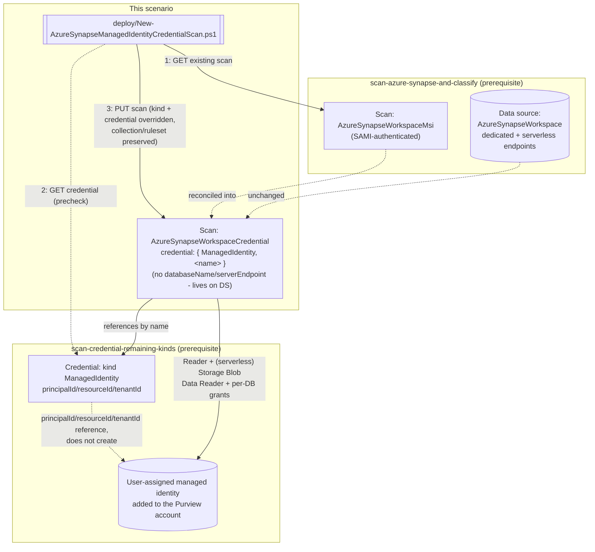

# Design — UAMI Credential for the Azure Synapse Workspace Scan

## 1. Problem statement

`scenarios/data-map/scan-azure-synapse-and-classify/` authenticates its scan as the Purview
account's shared system-assigned managed identity (SAMI) — the same blast-radius tradeoff both
sibling `-managed-identity-credential` scenarios already document in full. This fragment is the
third and last of the three siblings `scan-credential-remaining-kinds/README.md` §6 named as
directly wireable, closing that backlog item completely.

**Stronger grounding than either sibling.** Both the Database and Managed Instance siblings had to
infer `ManagedIdentity` support for their specific scan kind from Microsoft's generic "Supported
data sources for UAMI" list (a page-level feature statement, not a worked example for the exact
scan `kind` in question) — and for Managed Instance, that inference was flagged as an open VERIFY
(`scan-azure-sql-managed-instance-and-classify-managed-identity-credential/reviews.md`). This
fragment instead found a **direct worked JSON example** on the canonical
`register-scan-synapse-workspace` page — the same page the base Synapse scenario is itself grounded
against — explicitly showing `"credentialType":"SqlAuth | ServicePrincipal | ManagedIdentity (if
UAMI authentication)"` against `"kind":"AzureSynapseWorkspaceCredential"`. No equivalent VERIFY is
needed here for the core REST-level claim.

## 2. Design goals

1. **Same reconciliation pattern as both siblings, ported not copied.** GET the existing scan, copy
   every property forward, override only `kind` and `properties.credential`. Confirmed via direct
   fetch that `AzureSynapseWorkspaceCredentialScanProperties` has **no** `databaseName`/
   `serverEndpoint` fields at all — a genuine structural difference from both siblings, not an
   oversight: both dedicated and serverless SQL pool endpoints live on the **data source** object
   (`dedicatedSqlEndpoint`/`serverlessSqlEndpoint`), which this fragment never touches, consistent
   with the base scenario's own one-data-source-per-workspace model (`scan-azure-synapse-and-
   classify/design.md`).
2. **`resourceTypes` stays out of scope, matching the base scenario's own deliberate omission —
   despite this build finding a worked example for it.** The worked JSON example that confirmed
   `ManagedIdentity` support also happens to show a `resourceTypes.AzureSynapseServerlessSql` shape
   for scoping a scan to named serverless databases. The base SAMI scenario deliberately omits
   `resourceTypes` (auto-enumerating every database instead) because, at the time of its own build,
   no worked example was found for it. This fragment does not change that choice — adopting
   `resourceTypes` would be a scan-scoping behavior change independent of authentication, out of
   scope for a fragment about swapping *which identity* authenticates. The newly-found worked
   example is recorded as an update to the base scenario's own open VERIFY (`PROGRESS.md`), not
   acted on here.
3. **The credential precheck's severity split is ported unchanged** from both siblings — hard stop
   on a confirmed kind mismatch, warn only on an ambiguous 404.
4. **The credential object is a prerequisite, not this scenario's job to create** — same boundary as
   both siblings.

## 3. Architecture

## 4. Configuration model

| Element | Value | Why |
|---|---|---|
| Scan `kind` (after reconciliation) | `AzureSynapseWorkspaceCredential` | Confirmed via direct fetch of both the Scans - Create Or Replace REST reference AND a worked JSON example on the base scenario's own registration page |
| `properties.credential.credentialType` | `ManagedIdentity` | Directly confirmed for this exact scan kind by Microsoft's own worked example — see §1 |
| `properties.credential.referenceName` | Name of a pre-existing `ManagedIdentity`-kind credential object | Built via `scan-credential-remaining-kinds` |
| Properties preserved from the existing scan | `collection`, `scanRulesetName`, `scanRulesetType` only | No `databaseName`/`serverEndpoint` — confirmed absent from `AzureSynapseWorkspaceCredentialScanProperties`; those live on the data source object instead (Design goal 1) |
| Azure IAM grants (dedicated pools) | **Reader**, scoped to the workspace resource, granted to the **UAMI** | Same grant the base scenario documents for its SAMI, targeted at the UAMI instead |
| Azure IAM grants (serverless pools, additional) | **Storage Blob Data Reader** on the associated storage account's resource group/subscription, granted to the **UAMI** | Serverless-only, same three-part grant model the base scenario documents |
| SQL-side grants | Per-database `CREATE LOGIN`/`CREATE USER`/`db_datareader` (serverless) or `CREATE USER`/`db_datareader` (dedicated), using the UAMI's exact managed-identity name | Same T-SQL pattern as the base scenario's SAMI grants |
| `resourceTypes` | Not set (unchanged from base scenario) | Design goal 2 — a newly-found worked example exists but adopting it is a scope decision independent of authentication, deferred to a `PROGRESS.md` follow-up against the base scenario |

## 5. What this scenario does not do

- **Create a second, parallel scan**, **create the UAMI/credential object**, or **grant the Azure
  IAM/SQL permissions** — same boundaries as both siblings.
- **Adopt the `resourceTypes` scoping shape this build discovered** — Design goal 2 explains why
  that's deferred as a separate, authentication-independent decision for the base scenario.
- **Re-establish or re-verify the workspace firewall setting** the base scenario already
  established — orthogonal to which Purview identity authenticates.
- **What rollback does not undo:** identical scope boundary to both siblings — see `rollback.md`.

## 6. References

Full citation list in `README.md` §12.
