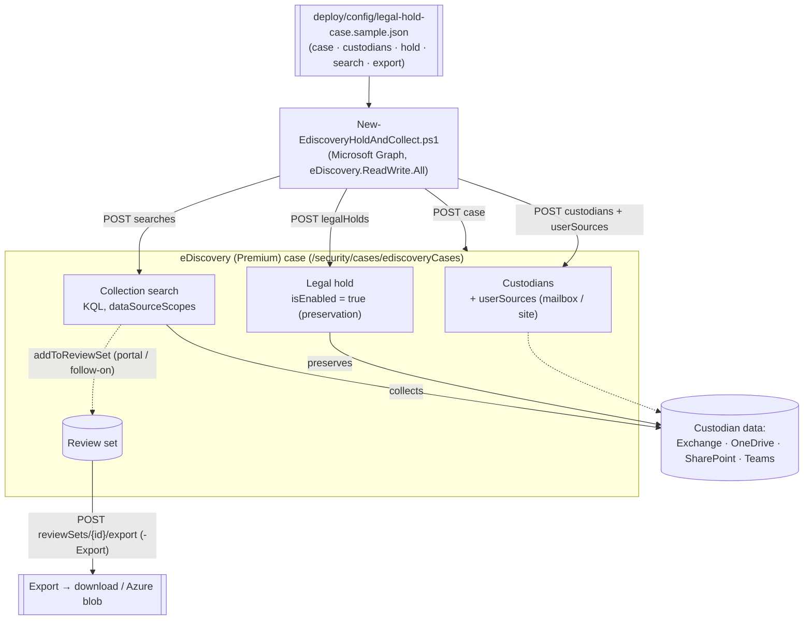

# eDiscovery (Premium) — Legal Hold, Collection & Export

## 1. Scenario summary

Stands up a Microsoft Purview **eDiscovery (Premium)** matter as code via the **Microsoft Graph
eDiscovery API** (v1.0 `security` namespace): create the case, add **custodians** and their mailbox
and OneDrive/SharePoint data sources, place a **legal hold** (preservation-in-place), create a
**collection search** (KQL) scoped to the case custodians, and — as an opt-in step — **export** a
review set for production to counsel or a regulator. The whole matter is driven by a version-
controlled JSON file so a legal-hold/collection workflow is repeatable, reviewable, and auditable
instead of hand-clicked per matter.

**Who it's for:** a legal/compliance/eDiscovery team that responds to litigation, regulatory
requests, or internal investigations and wants the repetitive, high-stakes case-setup steps
(preservation + collection + export) automated with an auditable definition, while keeping the
legally-sensitive judgment calls (scope of hold, when to release) explicit.

## 2. Business/regulatory driver

Legal hold and defensible collection are legal obligations, not conveniences: once litigation is
reasonably anticipated, an organization has a **duty to preserve** relevant ESI, and failure to do
so (spoliation) carries sanctions under the U.S. Federal Rules of Civil Procedure (FRCP Rule 37(e))
and equivalents. Regulators (SEC, FINRA, DOJ) issue document requests with hard deadlines. Microsoft
positions the eDiscovery APIs precisely for this: to "automate repetitive tasks and integrate with
existing eDiscovery tools to build repeatable workflows that industry regulations might require"
[[1]](#references). Automating the case → custodian → hold → collect → export chain:
- **reduces spoliation risk** — preservation is applied consistently and promptly, with an auditable
  record of who was held and when;
- **meets production deadlines** — collection and export are reproducible and fast;
- **is defensible** — the same definition file produces the same scoped hold and collection every
  time, which is exactly the reproducibility opposing counsel and regulators probe.

The legally significant decisions — the **scope** of the preservation hold and **when to release**
it — are kept explicit in this scenario (safe defaults, `-WhatIf`, and Legal sign-off), because those
are judgment calls, not automation defaults.

## 3. Prerequisites

Full licensing detail: `docs/licensing-matrix.md`. RBAC: `docs/rbac-model.md`. Automation surface:
`docs/automation-surface.md` (surface 3 — Microsoft Graph). Summary for this scenario:

| Requirement | Minimum | Notes |
|---|---|---|
| Licensing | **E3** for cases/searches/holds (delegated auth); **E5 / Purview Suite** for premium features (review sets, tagging, analytics), app-only auth, and export | On E3, **export requires pay-as-you-go billing**; app-only + review-set export are E5/Premium [[1]](#references) |
| Role to manage cases | **eDiscovery Manager** (own cases) or **eDiscovery Administrator** (all cases) | Microsoft Purview role groups; also Compliance Administrator / Organization Management [[2]](#references) |
| Graph permission | **eDiscovery.ReadWrite.All** (write); **eDiscovery.Read.All** (validate) | Delegated (work/school) or Application. App-only requires E5 and the app-auth setup [[1]](#references) |
| Auth (this scenario) | `Connect-MgGraph -Scopes 'eDiscovery.ReadWrite.All'` (delegated), or app-only certificate | Microsoft Graph PowerShell SDK — `docs/automation-surface.md` §3 |
| Custodians | Real, licensed users with mailboxes/OneDrive | Custodian sources reference their mailbox and (optionally) site |
| Export destination | Review set with content committed (addToReviewSet) | Export runs against a review set — see §5 and §11 |

> Verify current entitlement names against `docs/licensing-matrix.md` (dated 2026-09-02) and the
> Product Terms before a sales commitment — SKU names and the E3 export-billing model change.

## 4. Architecture



The definition file is the source of truth; the deploy script reconciles the case and its objects to
it (idempotent get-then-create by natural key). Preservation (hold) and collection (search) are
separate objects: the **hold** freezes content in place; the **search** collects a copy for review.
Export runs from a **review set** once collected content is committed to it. Full rationale:
`design.md`.

## 5. Step-by-step implementation

### Portal path (for a first manual walkthrough / to validate intent)

1. In the [Microsoft Purview portal](https://purview.microsoft.com) → **eDiscovery** → **Create
   case** [[2]](#references).
2. **Data sources / Custodians** → add custodians by email; include their mailbox and OneDrive/
   SharePoint sources.
3. **Holds** → create a hold over the custodians (leave the query empty to preserve everything, or
   scope with KQL **only** with legal sign-off) [[3]](#references).
4. **Collections / Searches** → create a search with a KQL query, scoped to the case custodians;
   run it and review the statistics.
5. **Review sets** → add the search results to a review set (commit), review/tag, then **Export**
   [[1]](#references).

### Script path (idempotent, parameterized, real `-WhatIf`)

```powershell
# Connect (delegated - signed-in user needs the eDiscovery Manager/Administrator Purview role)
Connect-MgGraph -Scopes 'eDiscovery.ReadWrite.All'

# 1. Dry run — shows the case, custodians, hold, and search that would be created; changes nothing
./deploy/New-EdiscoveryHoldAndCollect.ps1 -ConfigPath ./deploy/config/legal-hold-case.json -WhatIf

# 2. Deploy: create/reconcile case + custodians + hold + collection search
./deploy/New-EdiscoveryHoldAndCollect.ps1 -ConfigPath ./deploy/config/legal-hold-case.json

# 3. Validate
./validate/Test-EdiscoveryHoldAndCollect.ps1 -ConfigPath ./deploy/config/legal-hold-case.json

# 4. (After running the search and committing results to a review set - see §11) Export
./deploy/New-EdiscoveryHoldAndCollect.ps1 -ConfigPath ./deploy/config/legal-hold-case.json `
    -Export -ReviewSetId '273f11a1-17aa-419c-981d-ff10d33e420f'
```

The scripts use the **Microsoft Graph eDiscovery API** (v1.0 `security` namespace) via the Microsoft
Graph PowerShell SDK (`Invoke-MgGraphRequest`) — automation surface 3 per
`docs/automation-surface.md`. Real `-WhatIf` is supported (unlike Security & Compliance PowerShell).

## 6. Configuration reference

| Setting | Value this scenario uses | Notes |
|---|---|---|
| Base path | `/security/cases/ediscoveryCases` | v1.0 security namespace [[1]](#references) |
| Create case | `POST .../ediscoveryCases` | Body `{displayName, description, externalId}` [[4]](#references) |
| Add custodian | `POST .../{caseId}/custodians` | Body `{email}` [[5]](#references) |
| Add custodian source | `POST .../custodians/{id}/userSources` | Body `{email, includedSources: mailbox\|site}` [[6]](#references) |
| Legal hold | `POST .../{caseId}/legalHolds` | Body `{displayName, description, contentQuery, isEnabled}`; `isEnabled=true` = preservation active [[1]](#references) |
| Collection search | `POST .../{caseId}/searches` | Body `{displayName, description, contentQuery (KQL), dataSourceScopes}` [[7]](#references) |
| Search scope | `allCaseCustodians` | Also: `none`, `allTenantMailboxes`, `allTenantSites`, `allCaseNoncustodialDataSources` [[7]](#references) |
| Export | `POST .../reviewSets/{id}/export` | Body `{outputName, description, exportOptions, exportStructure}`; returns `202` + `Location` (async op) [[8]](#references) |
| exportOptions | `originalFiles,tags` | Bitwise: `originalFiles,text,pdfReplacement,tags,splitSource,includeFolderAndPath,friendlyName,condensePaths`; summary + load files always included [[8]](#references) |
| exportStructure | `pst` | `none\|pst\|msg` (`directory` deprecated) [[8]](#references) |

Exact bodies and Microsoft Learn sources are cited in each script's `.NOTES`.

## 7. Validation / how to prove it works

1. **Automated** — `./validate/Test-EdiscoveryHoldAndCollect.ps1` confirms the case exists; each
   configured custodian is present with ≥1 data source and reports its hold status; the legal hold
   exists and is **enabled**; and the collection search exists with the expected scope. Exits
   non-zero on failure.
2. **Preservation evidence** — in the portal, the custodians show **hold status = applied** and the
   hold is **On**; confirm a test item authored before the hold survives even if the custodian tries
   to delete it (preservation-in-place) [[3]](#references).
3. **Collection evidence** — run the search and confirm the statistics (item/location counts) are
   non-zero and match expectations for the KQL query [[7]](#references).
4. **Export evidence** — after committing results to a review set and running `-Export`, confirm the
   export operation completes (portal **Exports** tab, or the case `operations`) and the package
   contains the expected structure (`pst`/`msg`) and load files [[8]](#references).
5. **Idempotency proof** — re-run the deploy unchanged; every object reports `exists` (not
   `created`) and no duplicate case/custodian/hold/search appears.

## 8. Operations & tuning

**KPIs / signals to watch:**
- **Custodian hold status** — every custodian in scope should read `applied`; a `pending`/error
  status is a preservation gap to chase immediately (the validate script surfaces this).
- **Collection statistics** — item and volume counts per search; a sudden drop after a query change
  can mean an over-narrowed collection (defensibility risk).
- **Export operation status** — exports are async (`202` + operation); track them to completion and
  record the export in the matter file.

**Runbook (new matter):** deploy hold + collection first (preserve fast), then iterate the KQL
`contentQuery` with counsel, re-running the search until scope is agreed; commit to a review set,
review/tag, then export. **Runbook (release):** only when Legal confirms the matter and any
litigation-hold obligation is over — see §9.

**Audit:** eDiscovery activities are captured in the Microsoft Purview audit log; keep the definition
file under version control so the scoped hold/collection for each matter is reconstructable.

## 9. Rollback / decommission

See `rollback.md`. Quick reference: `./deploy/Remove-EdiscoveryHoldAndCollect.ps1` **releases**
(disables) the legal hold — ending preservation — and, with `-Delete`, deletes the hold and search.
It never deletes collected content, review sets, exports, custodians, or the case. **Release a legal
hold only when Legal confirms the preservation obligation is over** — premature release can be
spoliation.

## 10. Cost & licensing notes

- **Per-user entitlement (E3/E5), with a PAYG wrinkle on E3 export.** Cases/searches/holds work on
  E3 (delegated); **premium features (review sets, tagging, analytics), app-only auth, and export**
  require **E5/Purview Suite**, and **on E3, export bills pay-as-you-go** [[1]](#references). Confirm
  the tier for the operations you automate.
- **Storage/egress:** exports produce data that leaves the service (download or Azure blob) — factor
  storage and handling of exported PII/privileged content into cost and security planning.
- **Cost governance:** the dominant cost is reviewer/attorney time plus export storage; automation
  reduces setup labor but does not change per-review economics. Scope collections tightly (with
  counsel) to keep review volume — and cost — defensible.

## 11. Known limitations & gotchas

- **Legal significance — this is not a routine automation.** Placing a hold and collecting content
  are legally consequential. Always review with `-WhatIf` and with Legal before running for real; the
  scripts default to safe behavior (no export unless `-Export`, no delete unless `-Delete`) and use
  `ConfirmImpact = High`.
- **VERIFY — committing to a review set (addToReviewSet) is a prerequisite for export and is not
  scripted here.** The deploy creates the collection **search**; running it and committing results
  into a **review set** (the `addToReviewSet` action) must be done in the portal or a follow-on
  before `-Export` has anything to export. That action's exact body wasn't exercised in this build —
  confirm it before automating end-to-end [[1]](#references).
- **Hold scope is a legal decision.** The sample uses an **empty** `contentQuery` = preserve
  everything for the sources (the defensible default). Narrowing a preservation hold with KQL risks
  spoliation and must have legal sign-off — this is a judgment call, not a tuning knob (`design.md`).
- **Legal hold ≠ retention hold.** eDiscovery legal holds preserve for litigation/investigation and
  should not be conflated with Data Lifecycle Management retention (a different scenario/obligation)
  [[1]](#references).
- **Custodian source binding.** This scenario adds each custodian's mailbox (and optionally site) and
  scopes the search with `allCaseCustodians`. Binding **specific** custodian sources into the legal
  hold or search (via `@odata.bind`) is supported but not used here to keep the default simple —
  extend with the documented source-binding pattern if you need per-source holds.
- **Async operations.** Search runs, review-set commits, and exports are asynchronous (`202` +
  operation); the deploy script starts the export but does not block on completion — poll the case
  `operations` or the portal.
- **App-only auth is E5-gated.** Delegated auth works on E3 for standard operations; app-only
  (unattended) automation requires E5/Premium and the app-auth setup [[1]](#references).
- **Illustrative custodians/queries.** The sample custodian emails, KQL, and matter name are
  placeholders — replace with the real matter's custodians and counsel-approved query.

## 12. References

1. Use the Microsoft Purview eDiscovery API (overview, object model, licensing/auth tiers, export billing) — <https://learn.microsoft.com/graph/api/resources/security-ediscovery-apioverview?view=graph-rest-1.0>
2. Assign permissions in eDiscovery (eDiscovery Manager/Administrator roles) — <https://learn.microsoft.com/purview/edisc-permissions>
3. Create/manage holds in eDiscovery — <https://learn.microsoft.com/purview/edisc-hold-create> and <https://learn.microsoft.com/purview/edisc-hold-manage>
4. Create ediscoveryCase (`POST /security/cases/ediscoveryCases`) — <https://learn.microsoft.com/graph/api/security-casesroot-post-ediscoverycases?view=graph-rest-1.0>
5. Create custodians (`POST .../custodians`, body `{email}`) — <https://learn.microsoft.com/graph/api/security-ediscoverycase-post-custodians?view=graph-rest-1.0>
6. Create custodian userSource (`POST .../custodians/{id}/userSources`, `{email, includedSources}`) — <https://learn.microsoft.com/graph/api/security-ediscoverycustodian-post-usersources?view=graph-rest-1.0>
7. Create searches (`POST .../searches`, `{displayName, contentQuery, dataSourceScopes}`) — <https://learn.microsoft.com/graph/api/security-ediscoverycase-post-searches?view=graph-rest-1.0>
8. ediscoveryReviewSet: export (`POST .../reviewSets/{id}/export`, `{outputName, exportOptions, exportStructure}`) — <https://learn.microsoft.com/graph/api/security-ediscoveryreviewset-export?view=graph-rest-1.0>
9. Set up app-only access for the eDiscovery API — <https://learn.microsoft.com/graph/security-ediscovery-appauthsetup>

> Re-verify all links, API version, request/response shapes, and the licensing/auth tiers against
> current Microsoft Learn before a customer-facing deployment. Legal hold and collection are
> legally significant — automate the mechanics, keep the scoping and release decisions with Legal.
