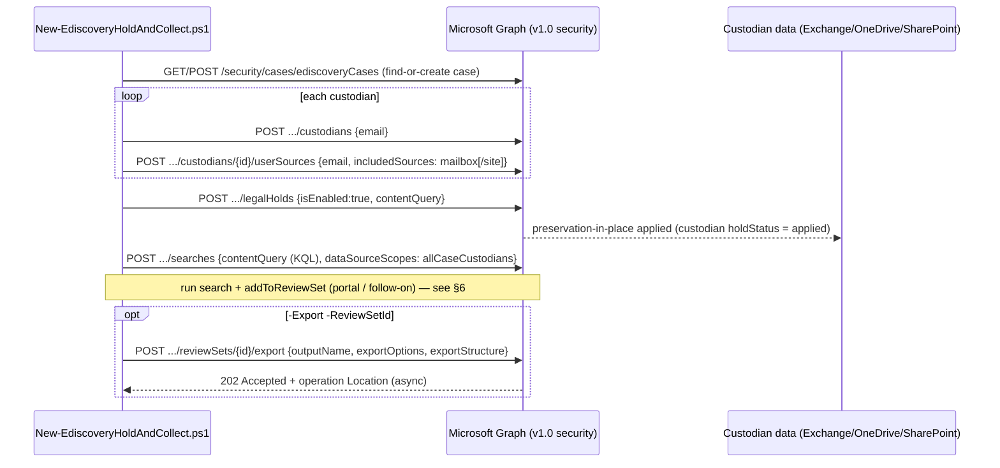

# Design — eDiscovery (Premium) Legal Hold, Collection & Export

## 1. Problem statement

Responding to litigation, a regulatory request, or an internal investigation means repeatedly
performing the same high-stakes setup: open a case, identify custodians and their data, **preserve**
that data before it can be altered or deleted, **collect** what's responsive, and **export** it for
review or production. Done by hand per matter, this is slow, error-prone, and — worst of all — hard
to reproduce defensibly when opposing counsel or a regulator asks how the hold and collection were
scoped. This scenario automates the mechanics of the case → custodian → hold → collect → export chain
from a version-controlled definition, while keeping the legally significant scoping and release
decisions explicit and human.

## 2. Design goals

1. **Reproducible, auditable matters as code.** One JSON file defines the case, custodians, hold,
   collection, and export options; re-running reconciles rather than duplicating.
2. **Preserve first, safely.** Default the hold to preserve-everything (empty query) and enable it on
   deploy; make export and deletion strictly opt-in (`-Export`, `-Delete`) with `ConfirmImpact=High`.
3. **Real dry-run.** Because this uses Microsoft Graph (not S&C PowerShell), `-WhatIf` genuinely works
   and is the primary review mechanism before touching a legal matter.
4. **Honest scope.** Script only what the v1.0 API cleanly supports (case, custodians+sources, hold,
   search, review-set export); flag the review-set commit (addToReviewSet) prerequisite rather than
   fabricating it.
5. **Keep judgment human.** Hold scope and hold release are legal decisions surfaced in the docs and
   gated behind explicit review — never silent defaults.

## 3. Why the Microsoft Graph eDiscovery API (not Security & Compliance PowerShell)

Both surfaces can do eDiscovery holds:
- **S&C PowerShell** (`New-ComplianceCase`, `New-CaseHoldPolicy`/`Rule`, `New-ComplianceSearch`,
  `New-ComplianceSearchAction` export) is the classic surface. It works, but `New-ComplianceCase` now
  requires a special search-only session (`-EnableSearchOnlySession`), `-WhatIf` is non-functional in
  S&C PowerShell, and it maps to the older content-search model rather than the Premium case objects
  (custodians, review sets).
- **The Microsoft Graph eDiscovery API** (v1.0 `security` namespace) is the modern, Premium-aligned
  surface with first-class custodians, legal holds, searches, review sets, and export — the object
  model this scenario needs — plus **working `-WhatIf`** through the Graph PowerShell SDK and a clean
  app-only auth story for unattended automation (E5). It is Microsoft's stated surface for building
  "repeatable eDiscovery workflows that industry regulations might require."

This scenario uses Graph for those reasons; the S&C PowerShell path is noted as the classic
alternative.

## 4. Object model and workflow

Preservation (**legalHold**) and collection (**search**) are deliberately separate objects: the hold
freezes content in place so nothing is lost while the query is still being negotiated with counsel;
the search collects a copy of what's responsive. Export is a **review set** operation, downstream of
committing collected content to that review set.

## 5. Idempotency

Get-then-create by natural key: the case by `displayName`, custodians by `email`, the hold and search
by `displayName`, custodian sources by `email`+`includedSources`. Each collection is read (with
`@odata.nextLink` paging) before a create, so a re-run reconciles to the file rather than duplicating
objects. Mutations are wrapped in `$PSCmdlet.ShouldProcess`, so `-WhatIf` reports the exact create
set without touching the tenant.

## 6. Key decisions

| Decision | Choice | Rationale |
|---|---|---|
| Automation surface | Microsoft Graph eDiscovery API (v1.0 security), Graph PowerShell SDK | Premium object model + working `-WhatIf` + app-only auth (§3) |
| Preservation default | Legal hold with **empty** `contentQuery`, `isEnabled=true` | Preserve-everything is the defensible default; narrowing needs legal sign-off |
| Collection scope | Search `dataSourceScopes = allCaseCustodians` | Simplest grounded scope tied to the case's custodians; avoids per-source `@odata.bind` complexity |
| Export | Opt-in `-Export` + `-ReviewSetId`, grounded export body | Export leaves the service and is E5/PAYG-gated; never automatic |
| Deletion | Opt-in `-Delete`; hold **released** (disabled) before delete | Releasing preservation is a legal act; deleting evidence must be deliberate |
| addToReviewSet | Documented as a prerequisite, not scripted | Its exact action body wasn't exercised this build — flagged VERIFY rather than fabricated |
| Confirm impact | `High` on both deploy and remove | These are legally significant operations |

## 7. Non-goals

- **Committing collected content to a review set (addToReviewSet)** — a prerequisite for export,
  documented and flagged VERIFY, not scripted (its exact body wasn't confirmed this build).
- **Advanced review** — tagging, predictive coding/analytics, redaction — Premium review-set features
  beyond hold/collect/export; candidate follow-ups.
- **Noncustodial data sources** — the API supports them; this scenario uses custodians only for a
  clean default.
- **Closing/deleting the case and releasing custodians** — deliberately left as governed portal steps
  in rollback, not automated, because they end a legal matter.
- **Retention (Data Lifecycle Management)** — a different obligation and scenario; legal holds here
  are for litigation/investigation, not regulatory retention.
- **eDiscovery Standard (content search) via S&C PowerShell** — the classic surface, noted as an
  alternative (§3), not the path this scenario takes.
