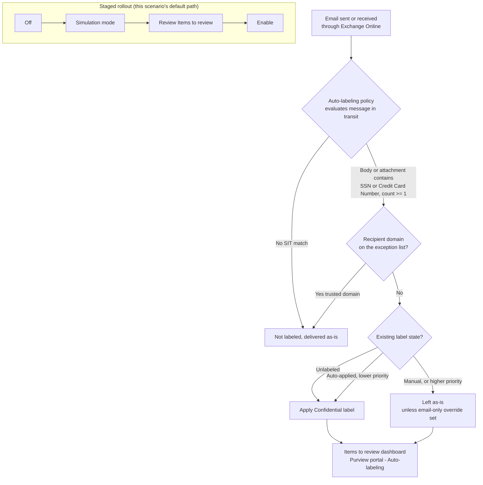

# Information Protection — Auto-Label Confidential PII in Exchange Email

## 1. Scenario summary

Automatically applies an existing **"Confidential"** sensitivity label to Exchange Online email
that carries regulated personal data (U.S. Social Security Numbers or credit card numbers in the
body or attachments) — evaluated **as mail is sent and received**, not after the fact. Deployed as
a single Microsoft Purview **auto-labeling policy** scoped to the Exchange location with **one rule**
(`-Workload Exchange`), staged simulation-first.

**Who it's for:** any enterprise whose users email regulated PII and needs that email systematically
classified so downstream controls key off the label — email-encryption on the `Confidential` label,
DLP rules that condition on the label, and retention. This is the **email companion** to
`scenarios/information-protection/auto-label-confidential-sharepoint/` (files at rest); together they
close the classification gap across both at-rest documents and in-transit mail.

## 2. Business/regulatory driver

Email is the highest-volume egress path for regulated data in most tenants, and the one most likely
to leave the organization. **GDPR Article 32**, **CCPA/CPRA**, and **ISO/IEC 27001:2022 Annex
A.5.12 / A.8.2** (information classification) all require that regulated personal data be identified
and protected in transit, not just at rest [[1]](#references). Manual labeling of email under-covers
worse than for files — users send mail fast and rarely stop to classify — so service-side
auto-labeling of mail in transit is Microsoft's mechanism for closing that gap [[2]](#references).

This scenario is the **classification and marking control for email**. It is the reliable signal an
email-encryption or DLP control conditions on: a rule that encrypts or blocks "email labeled
Confidential" first needs the label to actually be applied, which is what this does across all mail
flow rather than the subset a user labeled by hand.

**Scope note:** the two built-in sensitive information types shipped here — U.S. Social Security
Number and Credit Card Number — are a representative **U.S.-centric starter set**, not
jurisdiction-complete "personal data" coverage under GDPR/CCPA. A tenant whose regulated population
is EU/UK-only should swap in the relevant regional SITs (§6 shows where). ISO/IEC 27001 Annex
A.5.12/A.8.2 is the driver this default configuration most directly satisfies as shipped.

## 3. Prerequisites

Full licensing detail and citations: `docs/licensing-matrix.md`. Summary for this scenario:

| Requirement | Minimum | Notes |
|---|---|---|
| Automatic / policy-based labeling | **Microsoft 365 E5 / A5 / G5**, **Microsoft Purview Suite** (ex-E5 Compliance), or the **Information Protection & Governance (IP&G)** add-on | Per user in scope — `docs/licensing-matrix.md` §2, Information Protection row |
| Role to author/edit auto-labeling policies | **Information Protection Admin** role group | `docs/rbac-model.md` §3 |
| Role to **turn the policy on** after simulation | **Compliance Administrator** or **Compliance Data Administrator** | The **Turn on policy** button is greyed out without one of these, even after a clean simulation [[2]](#references) |
| Role to review simulation content | **Data Classification Content Viewer** (in the Content Explorer Content Viewer / Information Protection / Information Protection Investigators role groups) | Global admins do **not** have this by default [[2]](#references) |
| Automation identity | App registration with **Exchange.ManageAsApp** (Microsoft Exchange Online Protection resource), granted the Information Protection Admin role group | Certificate-based app-only auth — `docs/automation-surface.md` §3 |
| Dependency (not deployed by this scenario) | A published sensitivity label named **Confidential** (parameterizable), whose **label scope includes Emails**, and which is **not** a parent label (a parent label silently labels nothing) | Label authoring is a separate prerequisite; see §11 |
| Tenant configuration: unified audit logging on | Audit log search enabled | Required for the policy's **simulation mode** to produce results [[2]](#references) |
| Region availability | Auto-labeling available in tenant's region | If **Auto-labeling** isn't visible under Information Protection, the tenant is in a region blocked by an Azure backend dependency [[2]](#references) |
| Scoping nuance | At least one **non-EDM** sensitive information type per rule | A rule built only from Exact Data Match SITs silently disables auto-labeling for that label [[2]](#references) |

> **No SharePoint Online Management Shell / `EnableAIPIntegration` prerequisite here.** That toggle
> is a SharePoint/OneDrive-only requirement (the sibling scenario's §3/§11). Exchange auto-labeling
> is service-side and needs no equivalent tenant integration switch — one fewer moving part than the
> file-at-rest sibling.

## 4. Architecture



**One policy, one rule.** Email is a single `-Workload` value (`Exchange`), so — unlike the
SharePoint/OneDrive sibling's two rules — there is no per-workload split. Full rationale in
`design.md` §4.

## 5. Step-by-step implementation

### Portal path (for a first manual walkthrough)

1. Confirm the **Confidential** label is published to at least one user and its scope includes
   **Emails** (Information Protection → Sensitivity labels).
2. [Microsoft Purview portal](https://purview.microsoft.com) → **Information Protection** →
   **Auto-labeling** → **Create auto-labeling policy** → **Custom** → **Custom policy**.
3. Name: `Confidentiality - Auto-Label PII in Exchange Email`.
4. **Choose a label to auto-apply**: select **Confidential** (confirm it is not a parent label).
5. **Choose locations**: select **Exchange**. Keep the default **All** included / **None** excluded
   — this ensures inbound external email is evaluated. Do **not** switch to specific users here (that
   exempts external inbound mail); scope with rule conditions instead [[2]](#references).
6. **Set up common or advanced rules** → **Content contains** → **Sensitive info types** → add
   **U.S. Social Security Number (SSN)** and **Credit Card Number**, min count **1** each, **Any of
   these** (OR). Optionally add **Advanced rules** → **Recipient domain is** as an *exception* for
   trusted internal domains [[3]](#references).
7. **Additional label settings**: leave overrides at default unless you deliberately want the
   **Emails only** higher-priority override (§6, §11). If the label applies encryption and you want
   inbound external mail encrypted, set **Apply encryption to email received from outside your
   organization** and assign a **Rights Management owner** (a single user, §11) [[2]](#references).
8. **Decide to test now or later**: **Run policy in simulation mode**; do **not** accept
   auto-turn-on-after-7-days — enable deliberately (§8).
9. **Submit** → **Done**.

### Script path (idempotent, config-driven, dry-run capable)

```powershell
# 1. Connect (certificate app-only — docs/automation-surface.md §3)
Connect-IPPSSession -AppId $AppId -Certificate $Cert -Organization 'contoso.onmicrosoft.com'

# 2. Dry run — prints every cmdlet, changes nothing
./deploy/New-ConfidentialExchangeAutoLabelPolicy.ps1 -DryRun

# 3. Deploy in simulation mode (config default) to observe real mail flow first
./deploy/New-ConfidentialExchangeAutoLabelPolicy.ps1

# 4. After a review window, enforce
./deploy/New-ConfidentialExchangeAutoLabelPolicy.ps1 -Mode Enable

# 5. Validate (read-only)
./validate/Test-ConfidentialExchangeAutoLabelPolicy.ps1
```

The deploy script uses Security & Compliance PowerShell (`New-AutoSensitivityLabelPolicy
-ExchangeLocation`, `New-AutoSensitivityLabelRule -Workload Exchange`) — automation surface 2 per
`docs/automation-surface.md` §1. `-WhatIf` is non-functional in S&C PowerShell, so the script
implements a custom `-DryRun`.

## 6. Configuration reference

| Setting | Value |
|---|---|
| `policy.name` | `Confidentiality - Auto-Label PII in Exchange Email` (immutable after creation) |
| `policy.applySensitivityLabel` | `Confidential` — an existing, published, non-parent label scoped to Emails |
| `policy.exchangeLocation` | `All` (recommended — evaluates inbound external mail too) |
| `policy.mode` | `TestWithNotifications` (deploy default) → `Enable` after review |
| `policy.overwriteLabel` | `true` — overrides a **lower-priority auto-applied** label only; manual/higher-priority labels are never overridden [[4]](#references) |
| `policy.exchangeSenderMemberOf[Exception]` | Optional sender-group scoping. **Changing off `All` exempts inbound external mail** (§11) |
| `policy.externalMailRightsManagementOwner` | Optional single-user SMTP; only relevant when the label encrypts, to own encryption on inbound external mail [[2]](#references) |
| `policy.applySensitivityLabelOverwriteWorkloads` | Optional email-only override switch — **VERIFY** (§11); omitted unless set |
| `rule.name` | `AutoLabel-Confidential-PII-Exchange` |
| `rule.sensitiveInformationTypes` | U.S. Social Security Number (SSN), Credit Card Number — `mincount 1` each, OR-combined |
| `rule.exceptIfRecipientDomainIs` | Optional trusted recipient domains to exempt (`-ExceptIfRecipientDomainIs`) |

All values live in `deploy/config/auto-label-confidential-exchange.sample.json`. Exact cmdlet
grounding: the deploy script's `.NOTES` block cites the Microsoft Learn reference pages.

## 7. Validation / how to prove it works

1. **Automated config check** — `./validate/Test-ConfidentialExchangeAutoLabelPolicy.ps1` confirms
   the label resolves, the policy exists and applies it, is scoped to Exchange, and the rule targets
   the Exchange workload with SIT conditions; exits non-zero on any hard failure.
2. **Simulation results** — Purview portal → Auto-labeling → select the policy → **Items to review**.
   Simulation for Exchange takes up to ~12 hours and evaluates **mail flowing while it runs** — so
   **send representative test messages during the simulation window** or the tab will look empty even
   with a correct policy [[2]](#references).
3. **Functional test** — while enabled (or simulating), send a test message containing a documented
   test SSN or card-brand test number (never real PII) through an in-scope mailbox; confirm it shows
   the Confidential label / appears in Items to review.
4. **Exception test** — if `exceptIfRecipientDomainIs` is set, send the same test message to a
   recipient in an excepted domain and confirm it is **not** labeled.
5. **Enforcement confirmation** — after `-Mode Enable`, re-run the config check and confirm it
   reports `Mode: Enable`, not a `Test*` value.

## 8. Operations & tuning

**Deployment sequence**: Off → simulation → review Items to review (send representative mail during
the window) → Enable. The deploy default is `TestWithNotifications`; pass `-Mode Enable` deliberately.
Do not accept the wizard's auto-turn-on-after-7-days option — a reviewed enable is this library's
standard (`AGENTS.md` §4).

**KPIs to watch (first 30–60 days):**
- **Matched-message volume vs. false positives** — nine-digit numbers that aren't SSNs (invoice/PO
  numbers in email bodies and attachments) are the most common false-positive source; track
  override/relabel activity in Activity Explorer and consider raising the SIT confidence level rather
  than reacting to a single report.
- **Inbound-external coverage** — confirm `exchangeLocation` stayed `All`; a well-meaning scoping
  edit to specific senders silently drops all inbound external mail from evaluation (§11).
- **Encryption blast radius** (if the label encrypts) — labeling inbound external mail can encrypt
  it to your tenant; confirm the Rights Management owner is set so encryption can later be managed
  (§11), and watch for user reports of unexpectedly protected mail.

**Alert routing:** auto-labeling has no DLP-style incident email; its observability surface is the
policy's **Items to review** dashboard and **Activity Explorer**. Simulation itself still fires any
configured activity alerts — scope or pause those during the simulation window to avoid a mass-alert
wave [[2]](#references). For SIEM, pull labeling events via the Audit Search / Graph pattern in
`docs/automation-surface.md` §4.

**Review cadence:** monthly for the first quarter, quarterly thereafter; re-run
`validate/Test-ConfidentialExchangeAutoLabelPolicy.ps1` each time to catch configuration drift.

**Runbook — mail that should be labeled isn't:**
1. Confirm you sent the test mail **while** simulation was running (Exchange simulation only sees
   in-flight mail) — re-send during an active simulation, or wait for a production pass.
2. Confirm `exchangeLocation` is still `All` and the message actually matched a SIT (check the SIT's
   min count / confidence).
3. If the label wasn't applied because a higher-priority or manual label was present, that's expected
   (§6) unless you've deliberately set the email-only override.

## 9. Rollback / decommission

See `rollback.md`. Quick reference: `./deploy/Remove-ConfidentialExchangeAutoLabelPolicy.ps1`
disables (reversible); add `-Purge` to permanently delete the policy and its rule. Neither strips
labels/encryption already applied to mail that flowed while enabled.

## 10. Cost & licensing notes

- **No PAYG component.** Exchange auto-labeling is a per-user E5-tier / IP&G entitlement feature —
  `docs/licensing-matrix.md` §1–2. There is no per-message charge.
- **No additional Azure subscription** required for this control.
- **Sizing note:** license the users whose mail is in scope. With `exchangeLocation = All`, that is
  effectively every licensed mailbox — the common state for a tenant already on E5 for other Purview
  controls in this library.

## 11. Known limitations & gotchas

- **VERIFY — the email-only override parameter.** The auto-labeling wizard exposes an **Emails only**
  override (replace a lower-priority *manual* label on email when a higher-priority policy label
  matches), distinct from the **All locations** override. The PowerShell surface is
  `-ApplySensitivityLabelOverwriteWorkloads <Workload>` alongside the boolean `-OverwriteLabel`; the
  cmdlet reference does not enumerate accepted values for the former or spell out how the two interact.
  The deploy script sets `-OverwriteLabel` (confirmed boolean) and passes
  `-ApplySensitivityLabelOverwriteWorkloads` **only** when explicitly set in config, unmodified —
  flagged inline in the script `.NOTES`. Confirm the exact value/semantics against a pilot tenant
  before relying on email-only manual-label override.
- **Exchange auto-labeling acts on mail IN TRANSIT, not stored mailbox items.** It evaluates messages
  as they are sent and received; it does not scan or relabel existing mailbox contents, and it is
  service-side (no Outlook/client dependency) [[2]](#references). This is the fundamental behavioral
  difference from the SharePoint/OneDrive sibling, which scans files at rest.
- **Simulation only sees mail that flows while it runs.** Unlike file simulation (which scans content
  at rest), Exchange simulation evaluates messages sent/received during the ~12-hour run and results
  are not repeatable unless the same messages are re-sent [[2]](#references). Empty Items-to-review is
  usually "no representative mail flowed," not a broken policy.
- **No `-ExchangeLocationException`.** `New-AutoSensitivityLabelPolicy` has **no** location-URL
  exclusion for Exchange (unlike `-SharePointLocationException`/`-OneDriveLocationException`).
  Exclude mail via `-ExchangeSenderMemberOfException` (senders) or the rule's
  `-ExceptIfRecipientDomainIs`/other conditions — a genuinely different exclusion model from the
  sibling's site-URL exclusion.
- **Scoping off `All` exempts inbound external mail.** If you replace the default `All` Exchange
  location with specific senders, email sent from **outside** your organization becomes exempt; if
  you keep `All` but add a sender **exception**, mail those users *send* is exempt but not mail they
  *receive* [[2]](#references). Keep `All` and scope with rule conditions unless you have a specific
  reason not to.
- **Encryption on inbound external mail needs a Rights Management owner.** If `Confidential` applies
  encryption and you enable encryption for externally received mail, you must assign a Rights
  Management owner (a single user owned by your org — not a group, shared mailbox, or contact) so an
  authorized person retains Full Control to manage that encryption later [[2]](#references). This
  scenario does not configure encryption on the label itself (a separate label-authoring decision).
- **A parent label silently labels nothing.** If `applySensitivityLabel` points at a label that has
  sublabels, the policy runs without error but never labels anything. The validation script cannot
  reliably detect this from `Get-Label` — confirm manually in the portal label list.
- **A manually applied or higher-priority label is never overridden** (absent the email-only override
  above) — the most direct way to defeat this control is a message pre-labeled with something
  innocuous. Pair with content-based DLP that keys off the SIT directly (not the label) where
  interdiction matters, same pattern as `scenarios/dlp/pci-teams-exfil-block/`.
- **Config validation is not match validation.** A green
  `Test-ConfidentialExchangeAutoLabelPolicy.ps1` run proves the policy/rule are shaped correctly, not
  that any mail is being labeled — always cross-check Items to review for non-zero volume (§7).
- **U.S.-centric SIT set** — see the §2 scope note; swap in jurisdiction-appropriate SITs for a
  non-U.S. regulated population rather than treating the default as GDPR-complete coverage.

## 12. References

1. Automatically apply a sensitivity label to Microsoft 365 data — <https://learn.microsoft.com/purview/apply-sensitivity-label-automatically>
2. Automatically apply a sensitivity label to Microsoft 365 data — Exchange in-transit behavior, simulation-for-Exchange caveats, location scoping (All vs. specific senders), encryption / Rights Management owner, roles, region dependency — <https://learn.microsoft.com/purview/apply-sensitivity-label-automatically#how-to-configure-auto-labeling-policies-for-sharepoint,-onedrive,-and-exchange>
3. New-AutoSensitivityLabelRule reference (`-Workload` = Exchange, `-ContentContainsSensitiveInformation`, `-ExceptIfRecipientDomainIs`, sender/recipient conditions) — <https://learn.microsoft.com/powershell/module/exchangepowershell/new-autosensitivitylabelrule>
4. Automatically apply a sensitivity label to Microsoft 365 data — "Will an existing label be overridden?" (manual labels never overridden; lower-priority auto-applied labels overridden only with the override setting) — <https://learn.microsoft.com/purview/apply-sensitivity-label-automatically#will-an-existing-label-be-overridden>
5. New-AutoSensitivityLabelPolicy reference (`-ExchangeLocation`, `-Mode`, `-ApplySensitivityLabel`, `-OverwriteLabel`, `-ExchangeSenderMemberOf`/`Exception`, `-ExternalMailRightsManagementOwner`, `-ApplySensitivityLabelOverwriteWorkloads`) — <https://learn.microsoft.com/powershell/module/exchangepowershell/new-autosensitivitylabelpolicy>
6. Set-AutoSensitivityLabelPolicy reference (`-Mode` accepted values) — <https://learn.microsoft.com/powershell/module/exchangepowershell/set-autosensitivitylabelpolicy>
7. Remove-AutoSensitivityLabelPolicy reference — <https://learn.microsoft.com/powershell/module/exchangepowershell/remove-autosensitivitylabelpolicy>
8. Default sensitivity labels and policies — service-side auto-labeling (Exchange starts simulation immediately; SPO/OneDrive wait ~25 days) — <https://learn.microsoft.com/purview/default-sensitivity-labels-policies#service-side-auto-labeling>
9. Learn about sensitive information types (SSN / Credit Card Number built-in SITs, confidence levels) — <https://learn.microsoft.com/purview/sit-sensitive-information-type-learn-about>
10. Connect-IPPSSession reference (app-only certificate auth) — <https://learn.microsoft.com/powershell/module/exchangepowershell/connect-ippssession>

> Re-verify all links against current Microsoft Learn before a customer-facing assessment or sale —
> auto-labeling behavior (override parameters, region availability, encryption options) has changed
> more than once in this feature's history.
