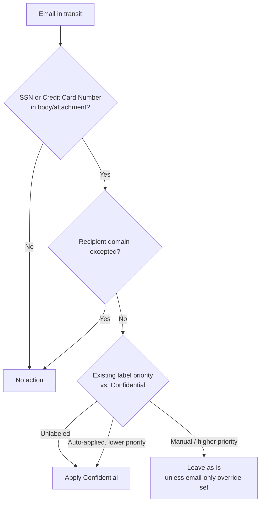

# Design — Auto-Label Confidential PII in Exchange Email

## 1. Problem statement

Email is the fastest, highest-volume path by which regulated personal data leaves (and enters) an
organization, and the one users are least likely to classify by hand. This scenario applies the
**Confidential** label automatically to email carrying SSNs or credit card numbers — in the body or
in attachments — as the mail is sent and received, so that downstream email-encryption, DLP, and
retention controls have a reliable label to act on. It is the in-transit-email companion to the
files-at-rest SharePoint/OneDrive sibling.

## 2. Design goals

1. Apply **Confidential** automatically to email whose body or attachments contain SSNs or credit
   card numbers, for mail in transit, without user action.
2. Never override a **manually applied** label or a **higher-priority** label (unless the operator
   deliberately opts into the documented email-only override) — a human's classification decision is
   authoritative.
3. Allow overriding only a **lower-priority, previously auto-applied** label, so classification can
   tighten over time without downgrading.
4. Evaluate inbound external mail too, by keeping the Exchange location at `All` and expressing any
   narrowing as rule conditions rather than sender scoping.
5. Idempotent and re-runnable: running the deploy script twice must not create duplicate objects.
6. Ship "off" by default: simulation mode first (`AGENTS.md` §4).

## 3. Why auto-labeling for email (not a mail flow rule, not DLP, not manual-only)

- **A mail flow (transport) rule** can act on messages but does not durably apply a *sensitivity
  label* other controls key off of. Microsoft's own guidance is explicit: an Exchange auto-labeling
  policy needs neither a mail flow rule nor a DLP policy to label mail in transit — it evaluates
  messages as they are sent/received on its own [[2]](#references-in-readme).
- **DLP for Exchange** detects and acts on movement (block, encrypt, notify) but, like the SharePoint
  case, it is the consumer of a label, not the thing that durably marks the message.
- **Manual-only labeling** stays the primary path for content that doesn't match an automatable
  pattern, and this scenario never overrides a manual choice by default (goal 2). Auto-labeling is a
  backstop and accelerant for the mail that does match a clear pattern.

## 4. Policy architecture

**One policy, one rule** — email is a single `-Workload` value (`Exchange`), so there is no
per-workload rule split as in the SharePoint + OneDrive sibling.

| Rule | Workload | Condition | Action |
|---|---|---|---|
| `AutoLabel-Confidential-PII-Exchange` | Exchange | Content contains **U.S. Social Security Number (SSN)** OR **Credit Card Number**, count ≥ 1 (body or attachment); optional exception: recipient domain is a trusted domain | Apply `Confidential` label |

Policy-level settings: `ExchangeLocation = All`, `OverwriteLabel = $true` (governs lower-priority
auto-applied labels only), optional `ExchangeSenderMemberOf[Exception]`, optional
`ExternalMailRightsManagementOwner` (only if the label encrypts), optional email-only override
(`ApplySensitivityLabelOverwriteWorkloads` — VERIFY, `README.md` §11).

## 5. Data flow / where enforcement happens

Exchange auto-labeling is **service-side and in transit**: Exchange Online evaluates each message as
it is sent and received, checking body and attachment content against the rule's SIT conditions, and
stamps the label at that point. It does **not** scan messages already stored in mailboxes, and there
is **no client/app dependency** (unlike client-side auto-labeling in Office apps). This is the core
difference from the SharePoint/OneDrive sibling, which runs an asynchronous scan over files at rest.

Two consequences flow from this and are carried into `README.md` §7/§8/§11:
- **Simulation only sees mail that flows during the run** (~12 hours), so representative test
  messages must be sent while simulation is active; results are not repeatable across runs.
- **There is no at-rest backlog to catch up on** — the "existing content" backlog problem that the
  file sibling budgets for does not exist for email, but conversely there is no way to retroactively
  label historical mail with this control.

## 6. Key decisions

| Decision | Choice | Rationale |
|---|---|---|
| Deploy surface | Security & Compliance PowerShell (`Connect-IPPSSession`), surface 2 | Auto-labeling policy/rule objects are S&C PowerShell objects. |
| Config-driven + custom `-DryRun` | JSON config; script implements `-DryRun` | `-WhatIf` is non-functional in S&C PowerShell; matches this library's current house pattern (e.g. `data-lifecycle-management/retention-labels-financial-records`). |
| Sensitive info types | Built-in **SSN** and **Credit Card Number** | Representative regulated-PII categories that most often leak via email; extend per the buyer's inventory. |
| One rule, one workload | `-Workload Exchange` | Email is a single workload — no split, unlike the sibling. |
| Location scope | `ExchangeLocation = All` | Keeps inbound external mail in scope; narrowing off `All` silently exempts external inbound mail (documented). Narrow via rule conditions instead. |
| Exclusion mechanism | `-ExceptIfRecipientDomainIs` (and optional sender exceptions) | There is **no** `-ExchangeLocationException`; exclusion for email is condition/sender-based, not a location-URL list — a genuine difference from the sibling's site-URL exclusion. |
| Override setting | `OverwriteLabel $true`; email-only override left optional/VERIFY | Tighten lower-priority auto-labels without touching manual/higher-priority ones; the distinct email-only manual-override switch is exposed but not asserted, pending pilot verification. |
| Encryption owner | Optional `ExternalMailRightsManagementOwner`, off by default | Only meaningful if the label encrypts and inbound external mail should be encrypted; requires a single-user RM owner. |
| Default policy mode | `TestWithNotifications` | Nothing enforces by default without an explicit flag (`AGENTS.md` §4). |

## 7. Non-goals

- Does not author or publish the `Confidential` label — a prerequisite dependency (`README.md` §3),
  not a deployed artifact. Whether the label applies encryption/visual markings is a label-authoring
  decision out of scope here.
- Does not cover SharePoint/OneDrive files at rest — that is the sibling
  `auto-label-confidential-sharepoint`; this scenario is the email half.
- Does not build a mail flow rule or a DLP policy — Microsoft's guidance is that Exchange
  auto-labeling needs neither. A DLP policy that *acts* on the resulting label (encrypt/block) is a
  natural, separate follow-up.
- Does not retroactively label historical mailbox mail — this control only sees mail in transit
  going forward; there is no email equivalent of on-demand at-rest classification for this policy.
- Does not resolve the email-only override parameter semantics (`README.md` §11 VERIFY) — flagged,
  not guessed, per `AGENTS.md` §4.
