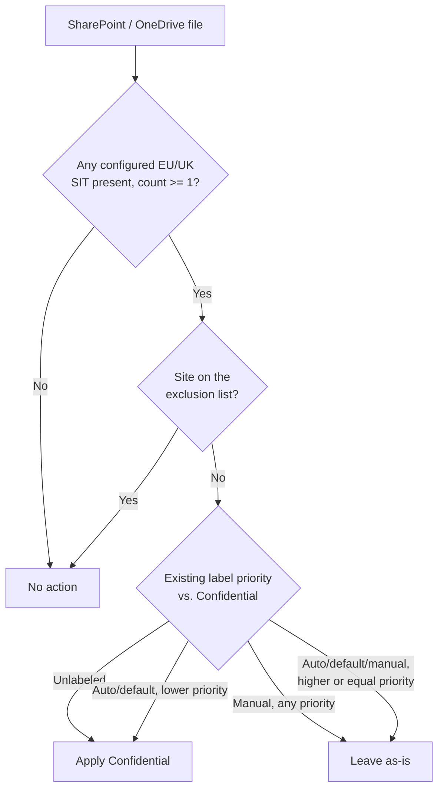

# Design — Auto-Label EU/UK Personal Data in SharePoint & OneDrive

## 1. Problem statement

`scenarios/information-protection/auto-label-confidential-sharepoint/` ships a working
auto-labeling pattern, but its default condition set — U.S. Social Security Number (SSN) and
Credit Card Number — is a U.S.-centric starter kit. Its own `reviews.md` (Red Team finding 4) and
`README.md` §2 already flag this explicitly: a tenant whose regulated population is EU/UK-only
gets materially weaker real-world coverage from that default than its GDPR framing implies, since
SSN simply does not appear in EU/UK personal data. That sibling scenario deferred the fix to a
follow-up (`PROGRESS.md`, "Follow-ups discovered while building the Information Protection
auto-labeling scenario") rather than guessing at EU-appropriate sensitive information types (SITs)
without grounding them first. This scenario is that follow-up: the same auto-labeling mechanism,
re-pointed at Microsoft's built-in EU/UK-region SITs, with the SIT list itself parameterized so a
buyer can localize further to only the member states they actually operate in.

## 2. Design goals

1. Apply the **Confidential** label (parameterizable, same dependency pattern as the sibling
   scenario) automatically to SharePoint/OneDrive content containing EU/UK personal identifiers —
   national ID numbers, the EU Social-Security-or-equivalent family, and EU-format debit card
   numbers — going forward and across the existing backlog, without requiring any user action.
2. Do not hard-code a single country's identifier the way the sibling scenario hard-codes U.S.
   SSN. Default to Microsoft's built-in **EU-wide bundle SITs** (which internally OR-match across
   every EU member state's own national ID/SSN/passport/driver's-license entity — see §4), but
   make the exact SIT name list a script parameter so a buyer whose regulated population is, say,
   Germany-and-France-only can swap in just `'Germany Identity Card Number'` and `'France Social
   Security Number'` instead of matching all 26 countries' formats — directly resolving the
   "localizing sensitive information type selection by data-residency/jurisdiction" follow-up this
   scenario was scoped from.
3. Preserve every override-safety and staged-rollout guarantee the sibling scenario already
   established (never override a manual label; only override a lower-priority auto-applied/default
   label; simulation-mode-first): this scenario changes *which* SITs the rule matches, not the
   label-priority or rollout model, which are already correct.
4. Idempotent and re-runnable: running the deploy script twice must not create duplicate policies
   or rules.
5. Ship "off" by default: simulation mode first, matching `AGENTS.md` §4.

## 3. Why a second scenario, not a parameter on the sibling scenario

The sibling scenario's policy and rule names, `README.md` prose, and `reviews.md` findings are all
written specifically around the U.S. SSN + Credit Card Number condition set. Retrofitting it to be
region-generic in place would mean either (a) silently changing what an already-reviewed,
already-shipped scenario matches — breaking any buyer who deployed it expecting U.S. coverage — or
(b) adding enough conditional prose/parameters to cover both regions that the README stops reading
as the clean, niche format `AGENTS.md` §4 requires. A second, sibling scenario folder — same
policy family, same architecture, different (and parameterized) SIT list and policy/rule names —
keeps both scenarios independently deployable, independently rollback-able, and independently
readable, matching the precedent already set by
`scenarios/information-protection/auto-label-confidential-exchange/` (a sibling by *location*,
not by *SIT set*, but the same "don't overload one scenario with two purposes" principle).

## 4. Sensitive information type selection — grounding

Microsoft Purview's built-in SIT catalog includes both **per-country** entities (e.g. "Germany
Identity Card Number", "France Social Security Number", one per EU member state) and a small set
of **EU-wide grouping SITs** that internally match across every member state's own entity under
one selectable name — confirmed as genuinely selectable, distinct SIT objects (not just a
documentation grouping) by Microsoft's own "these SITs can't be copied" exclusion list, which
names them individually alongside ordinary built-in SITs [[1]](#references):

| EU-wide SIT (as titled in Microsoft's canonical entity-definitions index) | Matches (per that SIT's own definition page) |
|---|---|
| **EU national identification number** | The OR of 26 per-country national ID entities (Austria Identity Card, Belgium National Number, ... U.K. National Insurance Number) [[2]](#references) |
| **EU Social Security Number (SSN) or Equivalent ID** | The OR of 12 per-country SSN-equivalent entities (Austria, Belgium, Croatia, Czech, Denmark, Finland, France, Germany, Greece, Hungary, Spain, Sweden) [[3]](#references) |
| **EU debit card number** | A single, region-wide 16–19-digit pattern with checksum + card/expiry keyword corroboration — not a per-country bundle, the direct EU-format analog of the sibling scenario's "Credit Card Number" SIT [[4]](#references) |

This scenario's default condition set is these three, OR-combined, `mincount = 1` each — the
direct EU/UK analog of the sibling scenario's SSN + Credit Card Number pair (one identity SIT
family, one financial SIT), not an attempt at exhaustive EU personal-data coverage (name, address,
and health-data SITs exist separately and are out of scope here, same "starter set, not
jurisdiction-complete" framing the sibling scenario's `README.md` §2 already uses).

**Deliberately not defaulted to:** "EU passport number" and "EU driver's license number" (also
real, confirmed EU-wide bundle SITs [[5]](#references)[[6]](#references)) — omitted from the
default set because passport/driver's-license numbers are lower-frequency in day-to-day SharePoint/
OneDrive business content than national-ID and payment-card numbers, not because they're any less
real. `-SensitiveInfoTypeName` (§5) accepts them directly if a buyer's data inventory calls for it.

**VERIFY (pilot tenant, before production reliance):** the exact, byte-precise capitalization of
these three SIT names as they must be passed to `-ContentContainsSensitiveInformation` /
`New-DlpComplianceRule`. Microsoft's own Learn pages render the same SIT with inconsistent casing
across pages (the bundle index page titles it lowercase, "EU national identification number"; the
canonical numbered entity-definitions list titles it the same way; other pages sentence-case only
the leading word) — this build could not find a single authoritative, byte-exact string to cite
with certainty, the same class of gap already flagged for the sibling scenario's own SIT names
(`auto-label-confidential-sharepoint/README.md` did not need this VERIFY because "U.S. Social
Security Number (SSN)" and "Credit Card Number" both matched their citation exactly, but this
scenario's EU SIT names carry that risk and it would be dishonest to imply otherwise). The deploy
script (`deploy/New-EuPersonalDataAutoLabelPolicy.ps1`) resolves each configured name via
`Get-DlpSensitiveInformationType` before referencing it in a rule and fails clearly, listing the
closest available matches, rather than silently creating a rule with zero real matches if a name is
off by case or punctuation — see `README.md` §11.

## 5. Localization parameter — `-SensitiveInfoTypeName`

`deploy/New-EuPersonalDataAutoLabelPolicy.ps1` accepts `-SensitiveInfoTypeName` as a `string[]`,
defaulting to the three EU-wide SITs in §4. A buyer who wants to localize further passes their own
list — either a subset of per-country entities (e.g. only the member states they operate in, for
tighter false-positive control and a clearer per-jurisdiction legal-basis mapping than "matches
somewhere in the EU"), or a superset including passport/driver's-license SITs, or entirely
different SITs for a non-EU region this scenario's name doesn't target (the parameter itself is
region-agnostic; only the *default value* is EU/UK-specific). This is the concrete mechanism that
resolves the sibling scenario's own deferred localization follow-up, and its existence is
cross-referenced back into `auto-label-confidential-sharepoint/README.md` §11 so a reader of either
scenario finds the other.

## 6. Policy architecture

Identical shape to the sibling scenario (`auto-label-confidential-sharepoint/design.md` §4): one
auto-labeling policy, two rules (one per workload — `New-AutoSensitivityLabelRule -Workload` is
single-valued per call [[7]](#references)), both rules sharing the same SIT condition set and
target label.

| Rule | Workload | Condition | Action |
|---|---|---|---|
| `AutoLabel-EuPersonalData-SharePoint` | SharePoint | Content contains any of `-SensitiveInfoTypeName` (default: EU national identification number, EU Social Security Number (SSN) or Equivalent ID, EU debit card number), count ≥ 1 | Apply `Confidential` label |
| `AutoLabel-EuPersonalData-OneDrive` | OneDriveForBusiness | Same | Same |

Policy-level settings, override semantics, exclusion mechanism, and rollout staging are all
inherited unchanged from the sibling scenario's design (`auto-label-confidential-sharepoint/
design.md` §4–§6) — this scenario changes the SIT condition set and adds the localization
parameter; it does not re-derive any of the already-reviewed rollout/override design.

## 7. Key decisions

| Decision | Choice | Rationale |
|---|---|---|
| Default SITs | EU national identification number, EU Social Security Number (SSN) or Equivalent ID, EU debit card number | §4 — direct EU/UK analog of the sibling's identity+financial pair, grounded against Microsoft's canonical entity-definitions index |
| Localization mechanism | `-SensitiveInfoTypeName string[]` parameter, resolved via `Get-DlpSensitiveInformationType` at deploy time | §5 — turns "swap the SIT list for your jurisdiction" from README prose (the sibling's approach) into an actual script parameter |
| Name validation | Deploy script resolves every configured SIT name against `Get-DlpSensitiveInformationType` and fails clearly (listing near-matches) rather than silently deploying a zero-match rule | Directly mitigates the casing-uncertainty VERIFY in §4 rather than shipping a rule that might silently match nothing |
| Passport/driver's-license SITs | Available via the parameter, not defaulted | §4 — lower day-to-day frequency in business documents than ID/payment identifiers; a buyer's own data inventory should drive adding them, not this scenario's default |
| Label, override behavior, exclusion mechanism, rollout mode | Unchanged from the sibling scenario | §6 — already reviewed and correct; this scenario's scope is the SIT set, not the rollout/override model |

## 8. Non-goals

- This scenario does not author or publish the `Confidential` sensitivity label — same
  prerequisite-dependency pattern as the sibling scenario (`README.md` §3).
- This scenario does not cover Exchange (email) — scoped to SharePoint/OneDrive at-rest content,
  matching the sibling scenario's own scope split with
  `auto-label-confidential-exchange/`. The EU-personal-data Exchange variant is now built as
  `scenarios/information-protection/auto-label-eu-personal-data-exchange/` — see that scenario's
  `design.md` for why it is a third, sibling scenario rather than a parameter on this one.
- This scenario does not attempt EU personal-data-category completeness (names, physical
  addresses, health data, biometric data are all "personal data" under GDPR Article 4(1) but are
  covered by entirely separate SIT/named-entity families) — see §4's explicit starter-set framing.
- This scenario does not implement per-country legal-basis or retention-period differentiation
  (GDPR is a single regulation, but a France-only vs. Germany-only deployment might have different
  internal data-handling procedures downstream of the label) — that is a policy/process decision
  for the buyer's compliance team, out of scope for a labeling-mechanism scenario.

## References

1. Create custom sensitive information types — "These SITs can't be copied" (lists the EU-wide
   bundle SITs individually, confirming each is a real, selectable, standalone SIT object) —
   <https://learn.microsoft.com/purview/sit-create-a-custom-sensitive-information-type#before-you-begin>
2. EU national identification number entity definition (26-country membership list) —
   <https://learn.microsoft.com/purview/sit-defn-eu-national-identification-number>
3. EU Social Security Number (SSN) or Equivalent ID entity definition (12-country membership
   list) — <https://learn.microsoft.com/purview/sit-defn-eu-social-security-number-equivalent-identification>
4. EU debit card number entity definition (single region-wide pattern, checksum, keyword
   corroboration, Entity id `0e9b3178-9678-47dd-a509-37222ca96b42`) —
   <https://learn.microsoft.com/purview/sit-defn-eu-debit-card-number>
5. EU passport number entity definition — <https://learn.microsoft.com/purview/sit-defn-eu-passport-number>
6. EU drivers license number entity definition — <https://learn.microsoft.com/purview/sit-defn-eu-drivers-license-number>
7. New-AutoSensitivityLabelRule reference (`-Workload` single-valued) —
   <https://learn.microsoft.com/powershell/module/exchangepowershell/new-autosensitivitylabelrule>
