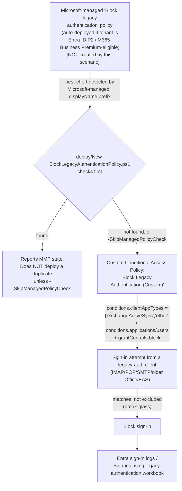

## The short version

Checks whether Microsoft has already auto-deployed its own **Microsoft-managed** "Block legacy
authentication" Conditional Access policy to the tenant, then - only if one isn't already covering
it, or the operator deliberately wants an independent policy - creates or reconciles a custom
Microsoft Entra Conditional Access policy that blocks (or, by default, reports on) sign-in attempts
using legacy authentication protocols (POP, IMAP, SMTP, older non-modern-auth Office clients,
Exchange ActiveSync). Legacy authentication doesn't support multifactor authentication, so an
attacker who obtains valid credentials can use it to bypass every MFA requirement a tenant has
configured elsewhere.

## Why this matters

- **This is one of the highest-leverage, lowest-cost identity controls Microsoft documents.**
  Microsoft's own analysis states more than 97% of credential-stuffing attacks and more than 99%
  of password-spray attacks use legacy authentication protocols specifically **because** those
  protocols don't support multifactor authentication - an attacker who already
  has MFA-protected credentials can often still get in through an unblocked legacy-auth path.
- **Prerequisite hardening for every other Conditional Access control in this library.** Both of
  this library's other Conditional-Access-based scenarios
  (*Conditional Access Insider Risk Block*, *Conditional Access Step-Up for Moderate/Minor Insider Risk*) assume
  a baseline of Conditional Access hygiene neither of them scripts - this scenario is that
  baseline.
- **SOC 2 / ISO 27001 / PCI DSS control-automation expectations.** "Legacy/basic authentication is
  disabled" is a commonly-assessed identity control across these frameworks' access-control
  domains; this scenario gives an organization a scripted, evidenced way to close it.
- **Zero Trust identity guidance.** Microsoft's own Zero Trust identity-protection guidance lists
  blocking legacy authentication as a named recommendation alongside MFA enforcement.

## How the control works

Full rule-by-rule rationale, including the Microsoft-managed-policy finding this scenario's design
is built around, is in the design notes.

## What it takes

### Prerequisites

Full licensing detail and citations: [Licensing matrix, section 9](/docs/licensing-matrix/#9-adjacent-product-family-microsoft-entra-id-p1-baseline-conditional-access---block-legacy-authentication) (this scenario's Entra ID P1
requirement - notably **not** P2, unlike this library's other two Conditional-Access-based
scenarios). RBAC detail: [RBAC model, section 10](/docs/rbac-model/#10-microsoft-entra-conditional-access---a-sixth-system-for-identity-layer-scenarios) (reused unchanged - same Conditional Access
Administrator role and Graph permissions as the sibling scenarios). Summary:

| Requirement | Minimum | Notes |
|---|---|---|
| Conditional Access (custom policy path) | **Microsoft Entra ID P1**, standalone or bundled (e.g. **Microsoft 365 E3/E5**, **Microsoft 365 Business Premium**) | Confirmed directly on Microsoft's Conditional Access licensing reference - a materially lower floor than the **P2** this library's other two Conditional-Access-based scenarios require, since this scenario uses no risk-based condition. See [Licensing matrix, section 9](/docs/licensing-matrix/#9-adjacent-product-family-microsoft-entra-id-p1-baseline-conditional-access---block-legacy-authentication). |
| Microsoft-managed policy eligibility (auto-deployed path, informational only - not required to use this scenario) | **Microsoft Entra ID P2** or **Microsoft 365 Business Premium** | Per Microsoft's own Microsoft-managed-policies prerequisites - a tenant on P1 only will never receive the auto-deployed policy and should expect this scenario's custom-policy path to be the one that actually applies. |
| No Conditional Access license at all (Entra ID Free) | **Security defaults** | Out of scope for this scenario's scripts - see section 11. A Free-tier tenant should enable security defaults instead, which also blocks legacy authentication (with no customization). |
| Role to create/manage this scenario's Conditional Access policy | **Conditional Access Administrator** (Microsoft Entra role) | Same role and Graph permission set as this library's other Conditional-Access-based scenarios - [RBAC model, section 10](/docs/rbac-model/#10-microsoft-entra-conditional-access---a-sixth-system-for-identity-layer-scenarios). |
| Automation identity for the deploy script | Microsoft Graph app-only certificate authentication, `Policy.ReadWrite.ConditionalAccess` + `Policy.Read.All` application permissions | [Automation surface, section 3](/docs/automation-surface/#3-authentication-patterns---interactive-vs-unattended) (surface 3, Microsoft Graph) - identical permission set to the sibling scenarios. |
| Emergency-access (break-glass) account(s) or group | Excluded from this policy before enforcement | step 4 of the implementation steps below; Microsoft's standard, independently-documented Conditional Access deployment practice. |

> Verify current entitlement names against [Licensing matrix](/docs/licensing-matrix/) and the Product Terms before
> a sales commitment - SKU names change.

### Cost and licensing

- **Entra ID P1 floor, not P2.** Unlike this library's other two Conditional-Access-based
  scenarios, this one needs no risk-based condition - Microsoft's own Conditional Access licensing
  reference confirms P1 (or bundled Microsoft 365 Business Premium) is sufficient. An organization already licensed at Microsoft 365 E3 (which bundles Entra ID P1)
  needs **no incremental identity license** for this specific scenario.
- **Likely already free for a P2/Business Premium tenant.** If the Microsoft-managed policy is
  found, this scenario adds **no incremental cost or new object** - it only confirms
  and documents a control Microsoft already deployed.
- **No PAYG component.** Conditional Access evaluation is a per-user-entitlement feature, not
  consumption-billed.
- **No additional infrastructure cost.** The deploy/validate scripts are one-time or infrequent.

## Proof it works

1. **Automated checks** - `./validate/Test-BlockLegacyAuthenticationPolicy.ps1` reports whether a
   Microsoft-managed policy exists and its state, validates this scenario's own custom policy's
   shape if present, and **fails hard if neither exists** - legacy authentication would then be
   completely unrestricted by Conditional Access in that tenant.
2. **Manual checklist** - the same script prints a checklist for everything with no API to query:
   whether the legacy-auth-usage workbook/logs have actually been reviewed, whether break-glass
   accounts are excluded from whichever policy is the tenant's source of truth, and awareness of
   the Microsoft-managed policy's 30-day auto-enable clock if relying on it.
3. **Report-only evidence before enforcement** - **Entra admin center** → **Conditional Access** →
   **Insights and reporting**, filtered to the relevant policy, shows which sign-ins *would* have
   been blocked.
4. **End-to-end functional test (non-production accounts/clients only)** - in a pilot tenant,
   attempt an IMAP or basic-auth SMTP sign-in with a disposable test account while the policy is in
   Report-only, confirm it surfaces in Insights and reporting, then re-test after promoting to
   `-Mode Enabled` and confirm the sign-in is actually blocked.

## Where it stops

- **Microsoft-managed policy detection is best-effort, not a confirmed Graph flag.** The v1.0
  `conditionalAccessPolicy` resource has no documented boolean property (e.g.
  "isMicrosoftManaged") this scenario's scripts could check directly - the portal's "Created by:
  Microsoft" column is a UI-only rendering. Detection relies on Microsoft's own audit-log guidance
  that "Microsoft-managed policy names start with Microsoft-managed:". A tenant
  that has renamed its Microsoft-managed policy (not something Microsoft's own UI allows, per that
  same page - but not independently re-verified for a direct Graph PATCH attempt) would not be
  detected by this heuristic.
- **Conditional Access is a post-authentication control.** As the design notes documents, blocking
  legacy authentication with Conditional Access stops the resulting session, not the authentication
  attempt itself - Microsoft's own community guidance confirms this does not prevent a
  credential-stuffing/password-spray attempt from confirming valid credentials, only from
  establishing a session with them. Exchange-side authentication policies are a separate,
  workload-specific control that acts earlier - built as the companion scenario
  *Exchange-Side Legacy Authentication Block*, not scripted by this scenario itself.
- **This scenario does not script the "exclude guests/external users" nested Users condition**
  Microsoft's own guide's procedure also recommends for some Conditional Access scenarios - the
  same undocumented `excludeGuestsOrExternalUsers` shape this library's other Conditional-Access
  scenarios also decline to script unverified.
- **This scenario does not check or configure Security defaults.** A tenant without Entra ID P1/P2
  at all should use security defaults instead - not something this scenario's
  scripts detect or recommend automatically.
- **Policy identity is by exact `displayName`, not a fixed GUID** - same limitation as this
  library's other Conditional-Access-based scenarios; renaming the policy in the portal breaks
  this script's idempotency detection.
- **VERIFY (pilot tenant, before relying on Graph to manage a Microsoft-managed policy directly):**
  whether `Update-MgIdentityConditionalAccessPolicy`/`Remove-MgIdentityConditionalAccessPolicy`
  actually accept a PATCH (state/exclusions) or reject a DELETE against a Microsoft-managed
  policy's `id` the same way the portal UI restricts renaming/deletion - not independently tested
  during this build; this scenario's own scripts never attempt either against a Microsoft-managed
  policy regardless of the answer.
- **VERIFY (pilot tenant):** the exact, byte-precise remainder of a Microsoft-managed policy's
  displayName beyond the confirmed `Microsoft-managed:` prefix (e.g. whether it is exactly
  `Microsoft-managed: Block legacy authentication`) - not independently confirmed word-for-word
  during this build; this scenario's detection regex is deliberately tolerant (prefix + substring
  match) rather than an exact-string comparison, to avoid a false "not found" from a minor wording
  difference.
- **The Microsoft-managed policy's 30-day auto-enable clock is Microsoft's timeline, not this
  scenario's.** An organization relying on the Microsoft-managed policy alone should not assume it stays in
  Report-only indefinitely - review and act (exclude break-glass, or explicitly disable if not
  ready) before the auto-enable date rather than being surprised by it.