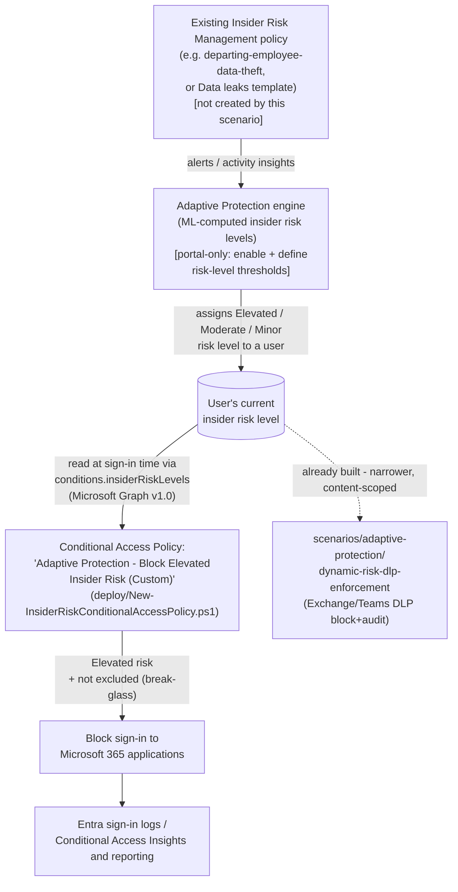

## The short version

Deploys a Microsoft Entra Conditional Access policy that blocks (or, in its default posture,
reports on) sign-in to Microsoft 365 applications for users Microsoft Purview Adaptive
Protection has assigned an **Elevated** insider risk level, using Conditional Access's own
**Insider Risk** condition (`conditions.insiderRiskLevels`). As Insider Risk Management raises or
resets a user's risk level, this policy's evaluation of that user changes on the next sign-in -
no analyst has to manually revoke access.

## Why this matters

Same underlying gap *Dynamic Risk-Based DLP Enforcement* (why this matters) describes - detection (Insider
Risk Management) and enforcement have historically required a human to notice an alert and
manually act - but this scenario closes it with the widest available lever instead of a
content-scoped one:

- **Faster, broader incident containment.** A DLP block stops one channel; a Conditional Access
  block stops the user's Microsoft 365 session entirely, closing SharePoint/OneDrive downloads,
  removable-media copies via synced files, printing from a signed-in session, and every other
  access path the DLP-only sibling scenario cannot reach.
- **SOC 2 / ISO 27001 control-automation expectations.** The same automated detection-to-enforcement evidence the DLP sibling scenario supports, extended to the identity layer.
- **A materially different residual-risk profile for CISO sign-off.** Blocking sign-in entirely
  is a bigger business-continuity decision than blocking one export channel - this scenario's
  operations and tuning and the review notes (CISO lens) treat that difference explicitly, not as a smaller
  version of the DLP sibling's own considerations.
- **Insurance / cyber-liability underwriting.** As with the DLP sibling, automated risk-adaptive
  access controls are an increasingly specific underwriting question.

## How the control works

Full rule-by-rule rationale, including exactly what this scenario can and cannot script and how
it relates to its DLP sibling, is in the design notes.

## What it takes

### Prerequisites

Full licensing detail and citations: [Licensing matrix, section 2](/docs/licensing-matrix/#2-master-capability--license-matrix) (Adaptive Protection row) and
operations and tuning (this scenario's Entra ID P2 requirement, new in this build). RBAC detail:
[RBAC model, section 10](/docs/rbac-model/#10-microsoft-entra-conditional-access---a-sixth-system-for-identity-layer-scenarios) (Microsoft Entra Conditional Access - new in this build). Summary:

| Requirement | Minimum | Notes |
|---|---|---|
| Adaptive Protection (feeder risk signal) | **Microsoft 365 E5**, **Purview Suite**, or the underlying IRM add-on | Inherits IRM prerequisites - see *Dynamic Risk-Based DLP Enforcement* (the prerequisites) |
| **Microsoft Entra ID P2** | Standalone, or bundled in **Microsoft 365 E5** / **Microsoft 365 E5 Security** | Required specifically for the Conditional Access Insider Risk *condition* - a materially narrower requirement than "any Entra P1/P2 for administrative units" already in [Licensing matrix, section 4](/docs/licensing-matrix/#4-common-cross-module-prerequisites); see section 8 |
| Insider Risk Management (feeder policy) | Already deployed and generating alerts/insights | Not created by this scenario - see why this matters (Non-goals in the design notes) |
| Role to configure Adaptive Protection settings/insider risk levels | **Insider Risk Management** or **Insider Risk Management Admins** role group (Purview) | Same role group the DLP sibling scenario uses - this scenario does not add a new Purview-side role |
| Role to create/manage this scenario's Conditional Access policy | **Conditional Access Administrator** (Microsoft Entra role) | A **separate admin surface from every Purview role group** in [RBAC model, section 1](/docs/rbac-model/#1-four-rbac-systems-not-one-read-this-first) - see the cost and licensing notes there (new in this build) |
| Automation identity for the deploy script | Microsoft Graph app-only certificate authentication, `Policy.ReadWrite.ConditionalAccess` + `Policy.Read.All` application permissions | [Automation surface, section 3](/docs/automation-surface/#3-authentication-patterns---interactive-vs-unattended) (surface 3, Microsoft Graph) - same app-only certificate pattern as every other Graph-based scenario in this library |
| Feeder Insider Risk Management policy | Already deployed and generating alerts/insights | Not created by this scenario |
| Adaptive Protection enabled, with insider risk levels defined | Portal-only, no PowerShell/Graph surface found during this build | Same portal-only prerequisite as the DLP sibling - see the implementation steps Steps 1-3 there |
| Emergency-access (break-glass) account(s) or group | Excluded from this policy before enforcement | step 5 of the implementation steps below; Microsoft's standard, independently-documented Conditional Access deployment practice |

> Verify current entitlement names against [Licensing matrix](/docs/licensing-matrix/) and the Product Terms
> before a sales commitment - SKU names change.

### Cost and licensing

- **New incremental license requirement versus the DLP sibling: Microsoft Entra ID P2**, for
  every user in this policy's scope. This is the first scenario in this
  library to require Entra ID P2 specifically for a *Conditional Access condition* (distinct from
  the more general "P1/P2 for administrative units" prerequisite already in
  [Licensing matrix, section 4](/docs/licensing-matrix/#4-common-cross-module-prerequisites)) - see section 8 there.
- **No incremental cost beyond that P2 requirement** for a tenant already at E5/Suite for the
  feeder IRM policy - Adaptive Protection's own signal generation is not billed separately per
  consuming policy (inherits [Licensing matrix, section 2](/docs/licensing-matrix/#2-master-capability--license-matrix)'s Adaptive Protection row).
- **No PAYG component.** Conditional Access evaluation is a per-user-entitlement feature, not
  consumption-billed.
- **Sizing note:** every user this policy could plausibly block needs Entra ID P2 *and* the
  qualifying DLP/IRM entitlement the feeder policy needs - a materially broader P2 footprint than
  an organization might already hold if their only prior Entra P1/P2 use was administrative units for a
  narrow admin population. Confirm P2 coverage for the *entire* population this policy's `Users`
  condition includes before enabling enforcement, not just the IT/security team.
- **No additional infrastructure cost.** The deploy/validate scripts are one-time or infrequent.

## Proof it works

1. **Automated checks** - `./validate/Test-InsiderRiskConditionalAccessPolicy.ps1` confirms the
   policy exists with the correct state, `insiderRiskLevels` condition, target-resources/users
   scope, and block grant control. Exits non-zero on a hard failure.
2. **Manual checklist** - the same script prints a checklist for everything with no API to query:
   whether Adaptive Protection is actually turned on, whether Entra ID P2 is licensed, whether a
   feeder IRM policy is in scope, and whether the break-glass exclusion has actually been sign-in
   tested. A policy that passes every automated check can still silently match zero users, or
   worse, block an untested break-glass account, if these aren't confirmed.
3. **Report-only evidence before enforcement** - **Entra admin center** → **Conditional Access**
   → **Insights and reporting**, filtered to this policy, shows which sign-ins *would* have been
   blocked. Confirm this view shows activity (or a deliberate, explained absence of it) before
   promoting to `-Mode Enabled`.
4. **End-to-end functional test (non-production accounts only)** - in a pilot tenant: assign a
   test account a confirmed Elevated insider risk level (via the feeder IRM policy or the
   activities that qualify per Step 3's configuration), then attempt to sign in. Confirm the
   expected outcome: a report-only log entry (before enforcement) or an actual block (after).
   Wait the full 36-hour propagation window before concluding a test failed.

## Where it stops

- **Up to 36 hours before Adaptive Protection actions apply after first enabling.** Same backend
  processing delay the DLP sibling documents - not a property of this scenario's Conditional
  Access policy.
- **This scenario's policy will validate and deploy successfully even if Adaptive Protection is
  never turned on** - `insiderRiskLevels` simply never matches any user until both Adaptive
  Protection is enabled and a risk level is defined. The manual checklist in
  `validate/Test-InsiderRiskConditionalAccessPolicy.ps1` exists to catch this "looks configured,
  does nothing" state, the same trap the DLP sibling's own validation script guards against.
- **Policy identity is by exact `displayName`, not a fixed GUID.** Unlike this library's JSON-payload-based Intune/macOS device-control scripts (which mint their own fixed GUIDs), a
  Conditional Access policy's `id` is Graph-assigned on creation and cannot be pre-chosen -
  renaming this policy in the portal breaks this script's own idempotency detection on the next
  run (the design notes, "Policy identity for idempotency" row).
- **The "exclude guests/external users" nested Users condition Microsoft's own guide's procedure
  recommends** **is now scripted**, defaulting to the same three categories the
  guide names (`b2bDirectConnectUser`, `serviceProvider`, `otherExternalUser` - Graph's
  `excludeGuestsOrExternalUsers.guestOrExternalUserTypes`, confirmed on the
  `conditionalAccessGuestsOrExternalUsers` resource reference).
  One thing remains a deliberate non-goal, not a gap: this scenario does not script the sibling
  `externalTenants` property (scoping the exclusion to specific external tenant IDs) - Microsoft's
  own guide doesn't scope by tenant either - see the design notes. **VERIFY closed 2026-09-27
  (Microsoft Learn MCP):** the exact separator between multiple `guestOrExternalUserTypes` values
  on the wire (this script assumes a bare comma, no space) is now grounded, not guessed - Graph
  documents the identical "multi-valued enumeration on a single Edm.String property" JSON shape
  for other resources (e.g. `cloudLicensing subscription`'s `tags`/`state`, `cloudLicensing
  service`'s `assignableTo`) and states explicitly for each that it "can
  contain multiple values in a comma-separated list"; no Microsoft Learn source documents a
  different separator for any property of this shape, and the contrasting
  `conditionalAccessEnumeratedExternalTenants.members` property (a true collection) shows a
  visibly different JSON shape (`["String"]`, not `"String"`), confirming `guestOrExternalUserTypes`
  is not that kind of property. Because the Microsoft Graph PowerShell SDK's
  typed model classes are generated from this same Edm.String metadata, `Get-
  MgIdentityConditionalAccessPolicy`'s read-back is that same raw comma-separated string, not an
  already-split collection - this script's idempotency (match/drift) detection for this field can
  now be relied on in production. `deploy/New-InsiderRiskConditionalAccessPolicy.ps1`'s `.NOTES`
  and `validate/Test-InsiderRiskConditionalAccessPolicy.ps1`'s `.NOTES` updated accordingly.
- **Policy naming deliberately avoids asserting Microsoft's Quick Setup auto-generated name.**
  Unlike the DLP sibling scenario (which independently confirmed and explicitly avoided colliding
  with Microsoft's exact auto-generated DLP policy name), this build could **not** independently
  confirm Microsoft Quick Setup's exact auto-generated Conditional Access policy display name -
  **VERIFY** (pilot tenant, or a future grounding pass) before assuming no collision is possible
  if a tenant later also runs Quick Setup.
- **This scenario blocks sign-in broadly, not by content sensitivity.** Like the DLP sibling's
  own `AccessScope`-only condition, `insiderRiskLevels` alone matches *any* sign-in attempt by an
  Elevated-risk user - it does not distinguish a routine Outlook check from an attempted mass
  download. This is intentional (it matches Microsoft's own documented reference configuration
 ) but is the broadest, most business-impacting control in this library's
  Adaptive Protection scenarios - see operations and tuning's CISO/service-desk coordination note.
- **A Conditional Access block does not retroactively undo anything already accessed** before the
  block took effect - this is a forward-looking access control, not a data-recovery or
  containment-of-already-copied-data mechanism.
- **No PowerShell/Graph write API for enabling Adaptive Protection or defining insider risk
  levels** - identical limitation to the DLP sibling; the design notes.
- **VERIFY (pilot tenant, before production reliance):** confirm Microsoft's documented Users
  step's additional guest/external-category exclusion recommendation (above) doesn't materially
  change expected coverage for your tenant's actual guest population before enabling enforcement.
- **An already-issued sign-in session is not necessarily terminated the instant a user becomes
  Elevated-risk.** Conditional Access (including this policy) is evaluated at sign-in; for
  applications/tenants without **Continuous Access Evaluation (CAE)** enabled, an access token
  issued before the risk-level change can remain valid until it expires (commonly up to an hour)
  rather than being revoked immediately. CAE is a separate, broader Entra capability this scenario
  does not configure - a real, disclosed bypass window for an actively-signed-in user, not a flaw
  specific to this policy. Flagged as a Red Team finding in the review notes.
- **Legacy authentication protocols may not fully honor this condition.** Clients using legacy
  auth (POP/IMAP/older non-modern-auth Office clients) have long-documented Conditional Access
  gaps independent of this scenario. Microsoft's own general guidance is to pair any risk-based
  Conditional Access policy with a separate, dedicated **block legacy authentication** policy
  (`clientAppTypes` scoped to other/legacy clients) - not configured by this scenario, which
  assumes that baseline hardening is already in place. If it isn't, an Elevated-risk user with a
  legacy-auth-capable client may retain access this policy intends to block.
- **This policy's own change-propagation delay is separate from Adaptive Protection's 36-hour
  risk-level delay.** A newly created or updated Conditional Access policy itself can take up to
  roughly 15-30 minutes to apply across Microsoft 365 clients/sessions - a much shorter, different
  delay than the 36-hour window before Adaptive Protection first assigns risk levels after being
  turned on. Don't conflate the two when triaging why a test sign-in wasn't evaluated as expected.