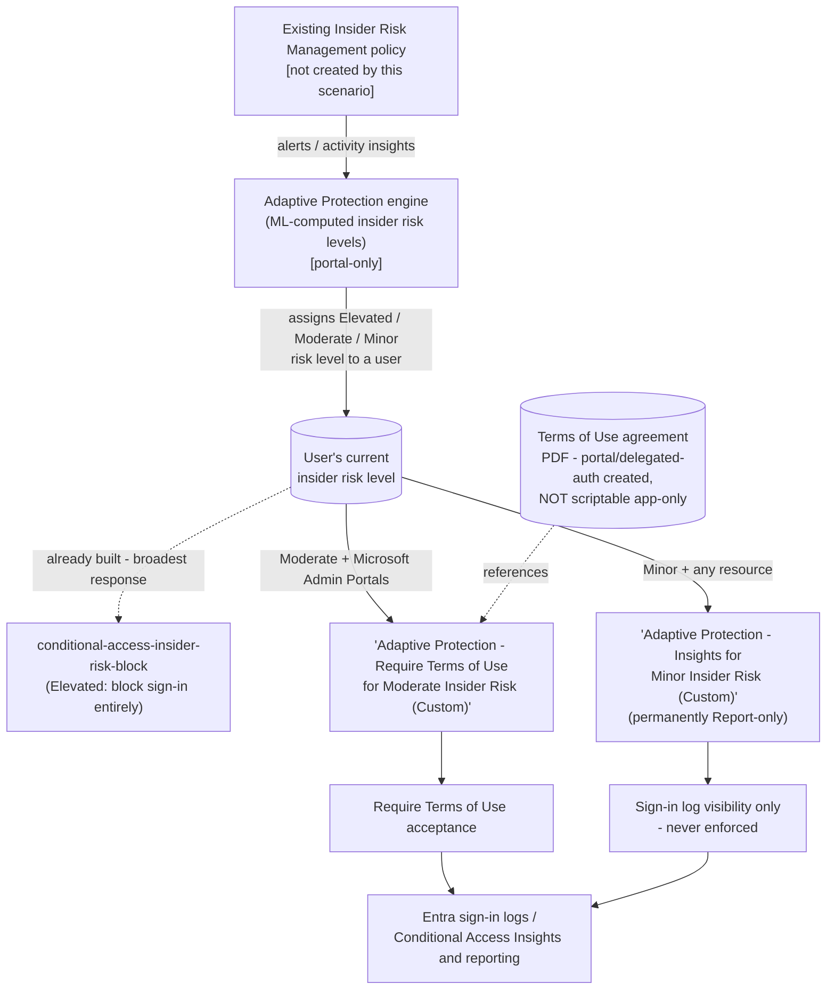

## The short version

Deploys the two Microsoft Entra Conditional Access policies Microsoft's own **Adaptive Protection
configuration guide** documents for **Moderate** and **Minor** insider risk levels: a **Terms of
Use** acceptance requirement scoped to Microsoft Admin Portals (Moderate), and a permanently
**Report-only** visibility policy (Minor). Both read the same live insider risk level Microsoft
Purview Adaptive Protection assigns, via Conditional Access's own Insider Risk condition
(`conditions.insiderRiskLevels`) - the same condition
*Conditional Access Insider Risk Block* uses for the **Elevated**
risk level's block policy.

## Why this matters

Same underlying gap the Elevated the sibling scenario's why this matters describes - detection (Insider Risk
Management) and enforcement have historically required a human to notice and manually act - but
extended to the two lower risk tiers with a **graduated**, not all-or-nothing, response:

- **Proportionate response matching Microsoft's own reference architecture.** A board or auditor
  reviewing this control can cross-check it directly against Microsoft's own published
  Elevated/Moderate/Minor Conditional Access guidance, rather than a bespoke scheme this library
  invented.
- **Early behavioral nudge before risk escalates.** Requiring Terms of Use acknowledgment at
  Moderate risk reminds a user of their security/privacy commitments at the point of admin-portal
  access - before they reach Elevated risk and lose access entirely - without materially disrupting
  productivity.
- **Visibility into Minor-risk activity without alert fatigue.** The Minor policy generates
  Conditional Access sign-in log/Insights data for the lowest-confidence risk tier without
  prompting or restricting the user at all - useful trend data for the quarterly review this
  scenario's operations and tuning and the Elevated sibling's own review cadence already establish.
- **SOC 2 / ISO 27001 control-automation and "least disruptive control" expectations.** A graduated
  response is easier to defend to a CISO/board than "block everyone at every risk level" - see operations and tuning
  CISO note.

## How the control works

Full rule-by-rule rationale, including why this design was chosen over the naive "require MFA"
alternative, is in the design notes.

## What it takes

### Prerequisites

Full licensing detail and citations: [Licensing matrix, section 8](/docs/licensing-matrix/#8-adjacent-product-family-microsoft-entra-id-p2-conditional-access-risk-based-conditions) (Entra ID P2 - this scenario
reuses the Elevated sibling's own P2 requirement; the Terms of Use *feature itself* additionally
requires only Entra ID **P1**, already covered by a P2 tenant - see section 10 below). RBAC detail:
[RBAC model, section 10](/docs/rbac-model/#10-microsoft-entra-conditional-access---a-sixth-system-for-identity-layer-scenarios) (Microsoft Entra Conditional Access). Summary:

| Requirement | Minimum | Notes |
|---|---|---|
| Adaptive Protection (feeder risk signal) | **Microsoft 365 E5**, **Purview Suite**, or the underlying IRM add-on | Same as both siblings |
| **Microsoft Entra ID P2** | Standalone, or bundled in **Microsoft 365 E5** / **Microsoft 365 E5 Security** | Required for the Conditional Access Insider Risk *condition* itself, used by both policies this scenario deploys - same requirement as the Elevated sibling, not a new tier |
| Microsoft Entra ID P1 (Terms of Use feature) | Bundled in Entra ID P2 | Confirmed on Microsoft's own Terms of Use prerequisites page - already satisfied by the P2 requirement above; called out separately only because an organization evaluating just the Moderate policy in isolation should know the *feature's own* floor, not just this scenario's overall floor |
| **A Terms of Use agreement object, already created** | PDF document uploaded via portal, or a one-time delegated-auth Graph call | **Not created by this scenario's scripts** - Microsoft's own `Create agreement` Graph API is delegated-permission-only (`Agreement.ReadWrite.All`, work-or-school account); app-only certificate automation cannot call it. See step 4 of the implementation steps and the known limitations. |
| Role to configure Adaptive Protection settings/insider risk levels | **Insider Risk Management** or **Insider Risk Management Admins** role group (Purview) | Same as both siblings |
| Role to create/manage these Conditional Access policies | **Conditional Access Administrator** (Microsoft Entra role) | Same role as the Elevated sibling - [RBAC model, section 10](/docs/rbac-model/#10-microsoft-entra-conditional-access---a-sixth-system-for-identity-layer-scenarios) |
| Role to create the Terms of Use agreement | **Conditional Access Administrator** or **Security Administrator** (least-privileged for agreement creation) | A delegated (interactive sign-in) operation - see the known limitations |
| Automation identity for the deploy script | Microsoft Graph app-only certificate authentication, `Policy.ReadWrite.ConditionalAccess` + `Policy.Read.All` application permissions | Same permissions and pattern as the Elevated sibling - covers policy create/update; does **not** cover agreement creation (see row above) |
| Feeder Insider Risk Management policy | Already deployed and generating alerts/insights | Not created by this scenario |
| Adaptive Protection enabled, with insider risk levels defined | Portal-only | Same portal-only prerequisite as both siblings |
| Emergency-access (break-glass) account(s) or group | Excluded from both policies before enforcement | step 5 of the implementation steps below |

> Verify current entitlement names against [Licensing matrix](/docs/licensing-matrix/) and the Product Terms
> before a sales commitment - SKU names change.

### Cost and licensing

- **No new incremental license requirement versus the Elevated sibling.** This scenario's
  Conditional Access Insider Risk condition needs the same **Microsoft Entra ID P2** the Elevated
  sibling already requires ([Licensing matrix, section 8](/docs/licensing-matrix/#8-adjacent-product-family-microsoft-entra-id-p2-conditional-access-risk-based-conditions)) - deploying this scenario alongside the
  Elevated sibling does not add a licensing tier.
- **The Terms of Use feature itself requires only Entra ID P1** - a strictly
  *lower* floor than the P2 already required for the underlying Insider Risk condition, so a
  tenant licensed for the Elevated sibling is already covered; called out for an organization evaluating
  the Moderate policy in isolation, without the Elevated sibling.
- **No incremental cost beyond the existing P2 requirement** for a tenant already at E5/Suite -
  same reasoning as the Elevated sibling's own the cost and licensing notes.
- **No PAYG component.** Conditional Access evaluation and Terms of Use attestation are per-user-entitlement features, not consumption-billed.
- **Sizing note:** same population-sizing caution as the Elevated sibling ([Licensing matrix, section 8](/docs/licensing-matrix/#8-adjacent-product-family-microsoft-entra-id-p2-conditional-access-risk-based-conditions)) - every user in scope of either policy needs Entra ID P2, not just the population that
  actually reaches Moderate/Minor risk.
- **No additional infrastructure cost.** The deploy/validate scripts are one-time or infrequent;
  the one manual step (Terms of Use agreement creation) is also one-time per agreement version.

## Proof it works

1. **Automated checks** - `./validate/Test-InsiderRiskStepUpPolicies.ps1` confirms both policies
   exist with correct state, `insiderRiskLevels` condition, target-resources/users scope, and
   grant control - including a hard `FAIL` if the Minor policy is ever found in an `enabled` state
   (which this scenario's own scripts cannot produce, but a manual portal edit could).
2. **Manual checklist** - the same script prints a checklist for everything with no API to query:
   Adaptive Protection enablement, whether the referenced Terms of Use agreement actually exists,
   and functional sign-in testing.
3. **Report-only evidence before enforcement** - **Entra admin center** → **Conditional Access**
   → **Insights and reporting**, filtered to the Moderate policy, shows which sign-ins *would*
   have been prompted for Terms of Use. Confirm this before promoting to `-ModerateMode Enabled`.
4. **Terms of Use acceptance tracking** - **Entra admin center** → **Conditional Access** →
   **Terms of use** → select the agreement → **View acceptance status**, or Microsoft Graph's
   `agreementAcceptance` resource - this scenario's scripts do not read or
   export acceptance records; use Microsoft's native reporting.
5. **End-to-end functional test (non-production accounts only)** - in a pilot tenant: assign a
   test account a confirmed Moderate insider risk level, then sign in to a Microsoft Admin Portal
   (e.g. `entra.microsoft.com`). Confirm the expected outcome: a report-only log entry (before
   enforcement) or an actual Terms of Use prompt (after). Wait the full 36-hour propagation window
 before concluding a test failed.

## Where it stops

- **This scenario's scripts cannot create the Terms of Use agreement object.** Microsoft's own
  `Create agreement` Graph reference documents delegated permissions only -
  **"Application: Not supported"**. This library's standard app-only
  certificate automation pattern ([Automation surface, section 3](/docs/automation-surface/#3-authentication-patterns---interactive-vs-unattended)), used for every other Graph
  call this scenario makes (policy create/update), cannot call this specific endpoint. Create the
  agreement once via the portal or a separate interactive delegated-auth session
  before running the deploy script's Moderate-policy path.
- **The Minor policy's grant control is a disclosed payload-shape choice, not a Microsoft
  recommendation.** Microsoft's Adaptive Protection configuration guide names no specific control
  for Minor risk - only "a policy... in Report-Only mode" for visibility. This
  scenario's script sets `grantControls.builtInControls = ['mfa']` purely as a payload container,
  deliberately **not** reusing the Elevated sibling's `['block']` shape - `mfa` fails safe (a
  second-factor prompt) rather than `block` (a tenant-wide lockout) in the unlikely event this
  policy's state is ever changed to `enabled` outside this scenario's own scripts (e.g. a manual
  portal edit; `validate/Test-InsiderRiskStepUpPolicies.ps1` hard-fails if it ever finds `block`
  here). This script structurally prevents `-MinorMode` from ever requesting `Enabled` in the
  first place - no such value exists in that parameter's `ValidateSet`. See the design notes.
- **Up to 36 hours before Adaptive Protection actions apply after first enabling** - same
  propagation delay both siblings document.
- **Both policies will validate and deploy successfully even if Adaptive Protection is never
  turned on** - `insiderRiskLevels` simply never matches any user until Adaptive Protection is
  enabled and a risk level is defined. The manual checklist in
  `validate/Test-InsiderRiskStepUpPolicies.ps1` exists to catch this.
- **Policy identity is by exact `displayName`, not a fixed GUID** - same limitation as the
  Elevated sibling; renaming either policy in the portal breaks this script's idempotency
  detection for that policy.
- **This scenario does not script Microsoft's additional documented "exclude guests/external
  users" nested Users condition**, the same deferred item the Elevated the sibling scenario's known limitations
  already tracks (shared project follow-up, not duplicated here).
- **A Conditional Access policy's own change-propagation delay (~15-30 minutes) is separate from
  Adaptive Protection's 36-hour risk-level delay** - same distinction the Elevated sibling's
  the review notes (Blue Team finding) already documents; applies identically here.
- **Legacy authentication protocols may not fully honor either policy's Insider Risk condition** -
  same documented Conditional Access blind spot the Elevated the sibling scenario's known limitations already
  flags; not re-solved by this scenario.
- **Terms of Use acceptance is per-agreement-version, not permanent.** A "major version" update to
  the agreement (per Microsoft's own `New-MgIdentityGovernanceTermsOfUseAgreementFile` schema
 ) invalidates prior acceptances for that language, re-prompting users on next
  sign-in - expected behavior, not a bug in this scenario's policy, but worth knowing before
  updating the underlying PDF.
- **The Moderate policy only ever evaluates sign-ins to Microsoft Admin Portals** - matching
  Microsoft's own documented scope exactly, but worth stating plainly: for a Moderate-risk
  user who is not an administrator and never signs in to an admin portal, this policy may **never
  trigger at all**. It is not a general "step up authentication for any Moderate-risk activity"
  control - unlike the rejected "require MFA / require compliant device on all resources" idea, which would have covered every sign-in. If your Moderate-risk population is
  predominantly non-admin users, this policy alone provides little practical coverage for them -
  consider it a complement to, not a substitute for, the DLP sibling's own Moderate/Minor audit
  rule (*Dynamic Risk-Based DLP Enforcement*), which does inspect regular content-sharing activity.
- **Terms of Use is a notice/evidentiary control, not a technical barrier.** Accepting it is a
  single click that does not verify comprehension and does not prevent any actual data-handling
  action - a determined insider loses nothing by clicking through it. Its value is in documented
  notice (useful for HR/Legal and audit evidence - see operations and tuning CISO framing in the review notes) and mild
  behavioral friction, not technical risk reduction. Do not present this policy to an organization as
  equivalent in strength to the Elevated sibling's block or the DLP sibling's audit/restrict
  actions.
- **An already-issued sign-in session to a Microsoft Admin Portal is not necessarily re-prompted
  the instant a user becomes Moderate-risk**, for the same Continuous Access Evaluation (CAE)
  /token-lifetime reason the Elevated sibling's the review notes (Red Team finding) documents - a
  session already signed in before the risk-level change can remain valid until natural token
  expiry (commonly up to an hour) without CAE. A materially smaller exposure window than the
  Elevated sibling's block bypass (this control never denies access outright, only defers a
  one-time prompt), but a real, disclosed gap, not a flaw unique to this policy.
- **What happens if a user declines the Terms of Use prompt is not separately re-confirmed in this
  build** beyond Microsoft's general documented behavior (the sign-in does not complete until the
  grant control is satisfied) - treat a decline as equivalent to not completing sign-in, and route
  it to the same help-desk runbook as any other Conditional Access grant-control failure.
- **VERIFY (pilot tenant, before production reliance):** whether Entra sign-in logs distinguish a
  "Terms of Use declined" outcome from a "Terms of Use pending/not yet presented" outcome for this
  policy specifically - not independently confirmed during this build; relevant for the help-desk
  runbook in operations and tuning when triaging a user who reports being unable to complete sign-in.
- **VERIFY (pilot tenant, before production reliance):** whether a user who has already accepted
  the current Terms of Use version and is later re-evaluated by this same policy is re-prompted on
  every sign-in or only once per acceptance - not independently confirmed during this build;
  Microsoft's own Terms of Use documentation describes acceptance tracking but not the exact
  re-prompt cadence against a Conditional Access policy re-evaluation.