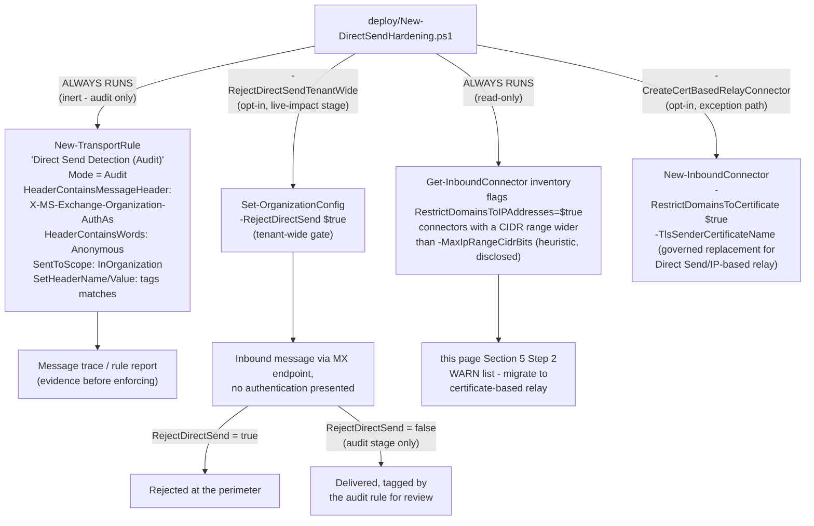

## The short version

Closes a bypass path this library's own *Exchange-Side Legacy Authentication Block*
Red Team review named explicitly (the review notes finding 3 there): blocking authenticated legacy
protocols (SMTP AUTH) does nothing to stop **Direct Send** - Exchange Online's unauthenticated,
internal-recipients-only SMTP path - or a mail flow connector that accepts **anonymous relay** from
an IP range that is broader than it needs to be. This scenario deploys an audit-first detection rule
for Direct Send traffic, an inbound connector risk audit, the tenant-wide `RejectDirectSend`
enforcement gate, and a governed, certificate-based relay exception path for devices/apps that
still need to send mail without authenticating.

## Why this matters

- **Direct Send is unauthenticated by design, and Microsoft's own guidance says most tenants don't
  need it.** "If your device or application can act as an email server, no Microsoft 365 or Office
  365 settings are required... We recommend Direct Send only for advanced customers willing to take
  on the responsibilities of email server admins". No credential, certificate, or
  IP allowlist is required to use it - only knowledge of the tenant's accepted domain and its MX
  endpoint (`<domain>-com.mail.protection.outlook.com`), which is public DNS information.
- **Microsoft has itself flagged Direct Send as a default-posture risk.** The same reference page
  states: "Most customers don't need to use Direct Send. We're working on an option to disable
  Direct Send by default to protect customers" - this scenario deploys the
  documented tenant-wide control (`Set-OrganizationConfig -RejectDirectSend`, the known limitations VERIFY on rollout
  status) rather than waiting for a Microsoft-driven default change on Microsoft's own timeline, the
  same "control the transition on your terms" posture this library's *Exchange-Side Legacy Authentication Block*
  scenario took for SMTP AUTH.
- **A documented, real-world abuse pattern.** Direct Send messages sent to internal recipients with
  a spoofed internal `From` address are a known phishing/BEC technique (internal-sender spoofing) -
  the messages arrive looking like they came from a colleague, bypassing the trust signal recipients
  give to "internal" mail, and are addressed directly in Microsoft's own anti-spoofing documentation
  on intra-org spoofing detection (`compauth=fail reason=6xx`).
- **Anonymous relay connectors are a separate, complementary gap.** An `InboundConnector` configured
  with `-RestrictDomainsToIPAddresses $true` authenticates a sender purely by source IP address -
  Microsoft's own guidance requires "a static IP address that isn't shared with another
  organization" precisely because a shared or overly broad IP range defeats the
  authentication model entirely. This scenario audits existing connectors for that exact weakness
  and recommends migrating to certificate-based authentication (`-RestrictDomainsToCertificate`),
  which Microsoft documents as not requiring a static IP at all.
- **SOC 2 / ISO 27001 / PCI DSS control-automation expectations.** "Inbound mail flow is
  authenticated, not just IP-filtered" and "the tenant does not accept unauthenticated internal-looking mail from the open internet" are both defensible, auditable control statements this
  scenario produces evidence for.

## How the control works

Full rationale for the audit-before-enforce sequencing and the connector-risk heuristic is in
the design notes.

## What it takes

### Prerequisites

| Requirement | Minimum | Notes |
|---|---|---|
| Exchange Online (any plan that includes it) | Exchange Online Plan 1/2, or any Microsoft 365/Office 365 plan that bundles it | `Set-OrganizationConfig`, `New-/Get-TransportRule`, and `New-/Get-InboundConnector` are all core Exchange Online administration surfaces - **no incremental license**. |
| Automation identity for the deploy script | Exchange Online app-only certificate authentication (`Connect-ExchangeOnline -AppId ... -CertificateThumbprint ...`), `Exchange.ManageAsApp` application permission on the **Office 365 Exchange Online** resource, plus an Exchange Online RBAC role/role group granted to the app's service principal | [Automation surface, sections 1 and 3](/docs/automation-surface/#1-five-automation-surfaces-not-one-read-this-first) (automation surface 1, Exchange Online PowerShell). |
| Role to run the deploy/validate scripts interactively, or to assign to the app's service principal for unattended use | **Organization Management** (Exchange Online role group) - confirmed sufficient by the *Exchange-Side Legacy Authentication Block* sibling scenario for the same class of tenant-wide `Set-OrganizationConfig`/mail-flow-object cmdlets | [RBAC model, section 6](/docs/rbac-model/#6-exchange-online-dependency-the-most-common-permissions-gap). Narrower least-privilege roles not independently confirmed - see the known limitations. |
| Verified accepted domain(s) and MX record pointed at Microsoft 365 | At least one [accepted domain](https://learn.microsoft.com/exchange/mail-flow-best-practices/manage-accepted-domains/manage-accepted-domains) with a healthy MX record | Required for Direct Send to function at all - also required context for interpreting this scenario's detection rule and connector audit correctly. |
| Inventory of any device/app currently depending on Direct Send or an existing IP-based relay connector | List of scanners, multifunction devices, or line-of-business apps that send mail without authenticating | step 2 of the implementation steps below. Enforcing `RejectDirectSend` tenant-wide without this step is this scenario's single highest-risk operational mistake - see operations and tuning. |

> Verify current entitlement names against [Licensing matrix, section 4](/docs/licensing-matrix/#4-common-cross-module-prerequisites) and the Product Terms
> before a sales commitment - SKU names change.

### Cost and licensing

- **No incremental license.** `Set-OrganizationConfig`, `New-/Get-TransportRule`, and
  `New-/Get-InboundConnector` are core Exchange Online administration surfaces, included in every
  plan that includes Exchange Online. [Licensing matrix, section 4](/docs/licensing-matrix/#4-common-cross-module-prerequisites).
- **No PAYG component.** These are tenant configuration objects, not consumption-billed.
- **Real, if modest, migration cost for an organization with legitimate Direct Send senders.** Migrating a
  scanner/LOB app to certificate-based relay requires provisioning and installing a TLS certificate
  on that device - call this out explicitly in a CISO conversation rather than presenting Step
  5 as zero-friction.
- **Closes a gap an organization's existing legacy-authentication controls do not cover**, at effectively no
  incremental cost - the CISO pitch is "the SMTP AUTH block closed one door; this closes the one
  right next to it that never needed a key in the first place."

## Proof it works

1. **Automated checks** - `./validate/Test-DirectSendHardening.ps1`:
   - `Get-TransportRule -Identity 'Direct Send Detection (Audit)'` - confirms the rule exists,
     `Mode -eq 'Audit'`, and its condition/action shape matches the configuration reference.
   - `Get-InboundConnector` - re-runs the connector risk heuristic and reports every WARN.
   - `-ExpectRejectDirectSend` (optional) - confirms `Get-OrganizationConfig |
     Select-Object RejectDirectSend` is `$true`; FAILs if not when passed.
   - `-ExpectedRelayConnectors <names>` (optional) - confirms each named certificate-based relay
     connector exists with `RestrictDomainsToCertificate -eq $true`.
2. **Manual checklist** - printed by the same script: Step 2's evidence-gathering window was
   observed before enforcing, every flagged connector in Step 3 was reviewed, and every legitimate
   Direct Send sender was migrated (Step 4) or confirmed retired before Step 5.
3. **End-to-end functional test (non-production sender only)** - before Step 5, send a test message
   via the Direct Send path (MX endpoint, port 25, no auth) to an internal test mailbox and confirm
   delivery with the audit header present; after Step 5, confirm the same attempt is rejected, and
   confirm a certificate-based relay connector's test sender still delivers successfully.

## Where it stops

- **Grounded 2026-09-26 (Microsoft Learn):** the `Set-OrganizationConfig` reference page's
  `-RejectDirectSend` entry now carries a full descriptive paragraph:
  `$true` blocks Direct Send - Exchange Online rejects an anonymous message from your own accepted
  domain to your organization's mailboxes only when *both* (a) the message doesn't match any
  inbound connector configured to match the sender's IP or certificate, *and* (b) the `MAIL FROM`
  (`5321.MailFrom`/P1 envelope sender) domain is one of your accepted domains; `$false` doesn't
  block it. This directly answers this item's edge-case question: a sender that already matches a
  certificate-based or IP-based relay connector is unaffected by `-RejectDirectSend` either way.
  The parameter's own **Default value** field still reads `None` (no explicit default is
  published), consistent with the Direct Send overview page's statement that Microsoft is still
  "working on an option to disable Direct Send by default" - i.e. Direct Send is
  not yet blocked by default as of this grounding pass, and no rollout wave or date for that future
  default-disable has been published. Deploy Step 2's audit window and Step 6's functional test
  remain the way to confirm the setting's effect in your own tenant before relying on it operationally.
- **The connector risk heuristic (`-MaxIpRangeCidrBits`, default `/24`) is this scenario's own
  judgment call, not a Microsoft-published threshold.** A narrower range can still be shared or
  spoofable; a wider range flagged WARN may be entirely appropriate for an organization's specific network
  topology. Treat every WARN as "review," not "automatically wrong."
- **This scenario does not detect or block internal-sender spoofing that arrives via an already-authenticated path** (a compromised mailbox sending as itself, or a message that passes SPF/DKIM
  from a genuinely authorized third-party sender). That is Defender for Office 365 anti-phishing/
  anti-spoofing territory (composite authentication, spoof intelligence - why this matters
 ), a separate control this scenario does not duplicate or replace.
- **The audit-mode transport rule detects Direct Send traffic aimed at internal recipients only**
  (`SentToScope InOrganization`), matching Direct Send's own internal-only delivery scope
  - it will not surface anonymous-relay abuse aimed at external recipients via an
  IP-based connector; the separate connector audit is this scenario's control for that surface.
- **A certificate-based relay connector (Step 4) is not itself internal-recipient-only** - unlike
  Direct Send, Microsoft's own comparison table shows SMTP relay can send to any accepted-domain
  address and, depending on configuration, external recipients. This is a
  materially different capability than what it's replacing; scope `-RelaySenderDomains` and the
  connector's accepted-domain association as narrowly as the actual sending application needs.
- **Policy identity is by exact name, not a fixed immutable ID exposed to this script's own
  parameters** - the same class of limitation this library's other named-policy scenarios disclose;
  renaming the audit rule or a relay connector in the portal breaks this script's idempotency
  detection.
- **VERIFY (pilot tenant):** the exact least-privilege Exchange Online management role scoped to
  just transport rules and inbound connectors, as distinct from the confirmed-sufficient but broad
  **Organization Management** role group this scenario's Prerequisites use.
- **Grounding note:** `techcommunity.microsoft.com` (the Exchange Team's own "What is Direct Send and
  how to secure it" blog post, referenced by name in a Microsoft Q&A accepted answer) returned a
  fetch error from this build's network environment and could not be directly reviewed - this
  scenario is grounded instead on the official Microsoft Learn Direct Send reference page, the `Set-OrganizationConfig`/`New-InboundConnector`/`New-TransportRule` cmdlet
  references, and the anti-spoofing/composite-authentication documentation, all direct-fetched or
  returned in full by Microsoft Learn search during this build. Re-verify the blog post's content
  against a working link before a customer-facing commitment, in case it adds detail not present in
  the reference pages used here.