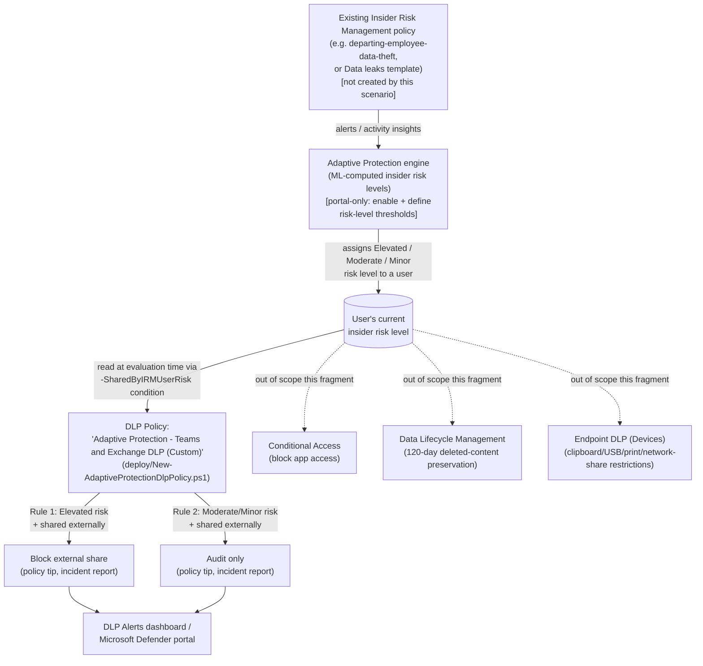

## The short version

Deploys a Microsoft Purview DLP policy whose enforcement action depends on a user's **live
Insider Risk Management insider risk level**, using Adaptive Protection's `SharedByIRMUserRisk`
condition: users assigned **Elevated** risk are automatically blocked from sharing content
externally over Exchange or Teams; users assigned **Moderate** or **Minor** risk are audited
only. As Insider Risk Management raises or resets a user's risk level, the DLP policy's
evaluation of that user changes on the next matching activity - no analyst has to manually
build or lift an exception.

## Why this matters

No regulation names "Adaptive Protection" as a required control the way PCI DSS names
messaging-technology PAN protection. What it supports is a specific, common gap in mature
security programs: detection (Insider Risk Management) and enforcement (DLP) exist as two
separate systems, and closing the loop between them has historically required a human to notice
an alert and manually tighten a policy. That gap is exactly the highest-risk window - a user
mid-exfiltration is not waiting for an analyst's shift to start. This scenario supports:

- **Faster incident containment.** The technical control tightens the moment risk is detected,
  not after triage - directly reducing the mean time between detection and first response for
  the exact users Insider Risk Management has already flagged.
- **SOC 2 / ISO 27001 control-automation expectations.** Auditors under both frameworks
  increasingly look for evidence that detective controls feed enforcement, not just that both
  exist independently; this scenario is that evidence.
- **Analyst workload reduction.** A blunt, permanent, org-wide DLP tightening in response to a
  handful of flagged users would hurt productivity for everyone; a targeted, per-user, risk-level-scoped control (the design Adaptive Protection is built for) achieves the containment
  goal without that cost - a point a CISO can make directly to the board.
- **Insurance / cyber-liability underwriting.** Automated, risk-adaptive controls are
  increasingly a specific underwriting question, distinct from "do you have DLP" or "do you have
  insider risk monitoring" asked separately.

## How the control works

Full rule-by-rule rationale, including exactly what this scenario can and cannot script, is in
the design notes.

## What it takes

### Prerequisites

Full licensing detail and citations: [Licensing matrix, section 2](/docs/licensing-matrix/#2-master-capability--license-matrix) (Adaptive Protection and its
constituent DLP/Insider Risk Management rows). Summary for this scenario:

| Requirement | Minimum | Notes |
|---|---|---|
| Adaptive Protection (DLP/label enforcement) | **Microsoft 365 E5**, **Purview Suite**, or the underlying IRM + DLP add-ons | Built on Insider Risk Management + DLP - inherits both prerequisites |
| Insider Risk Management (feeder policy) | **E5/A5/G5**, **Purview Suite**, or the **E5 Insider Risk Management** add-on | This scenario does not create the feeder IRM policy - see *Departing Employee Data Theft* (the prerequisites) for that scenario's own licensing detail |
| DLP for Exchange and Teams | Advanced classification & Teams-scoped DLP → **E5** | [Licensing matrix, section 2](/docs/licensing-matrix/#2-master-capability--license-matrix), DLP row |
| Role to configure Adaptive Protection settings/insider risk levels | **Insider Risk Management** or **Insider Risk Management Admins** role group | |
| Role to create/manage the DLP policy in this scenario | One of: **Compliance Administrator**, **Compliance Data Administrator**, **DLP Compliance Management**, **Global Administrator** | - same DLP-authoring roles used elsewhere in this library, see [RBAC model](/docs/rbac-model/) |
| Automation identity for the deploy script | App-only certificate authentication to Security & Compliance PowerShell | [Automation surface, section 3](/docs/automation-surface/#3-authentication-patterns---interactive-vs-unattended) - same certificate app-only pattern as every other DLP scenario in this library |
| Feeder Insider Risk Management policy | Already deployed and generating alerts/insights | Not created by this scenario - see why this matters (Non-goals in the design notes) |
| Adaptive Protection enabled, with insider risk levels defined | Portal-only, no PowerShell/Graph surface found during this build | the implementation steps Steps 1-3 below |

> Verify current entitlement names against [Licensing matrix](/docs/licensing-matrix/) and the Product Terms
> before a sales commitment - SKU names change.

### Cost and licensing

- **No incremental license cost for a tenant already at E5/Suite for the feeder IRM policy and
  DLP-for-Teams scenarios in this library** - Adaptive Protection is built on those same two
  entitlements, not a separate SKU ([Licensing matrix, section 2](/docs/licensing-matrix/#2-master-capability--license-matrix), Adaptive Protection row
 ).
- **No PAYG component for this scenario specifically** - the base M365 Exchange/Teams DLP
  evaluation this scenario relies on is per-user-entitlement, not consumption-billed. (Contrast
  with the feeder IRM policy's own cloud-indicator PAYG carve-out, which is a cost of the
  detection side, not this enforcement scenario.)
- **Sizing note:** every user this policy could plausibly block or audit needs the qualifying
  DLP + Insider Risk Management entitlement - in practice this means the same license population
  as the feeder IRM policy, typically org-wide E5 for an organization deploying this pattern
  seriously, not a narrow subset.
- **No additional infrastructure cost.** The deploy/validate scripts in this scenario are
  one-time or infrequent (deploy once, validate on a review cadence) - unlike the departing-employee IRM scenario's daily HR feed, there's no recurring scheduled job here.

## Proof it works

1. **Automated checks** - `./validate/Test-AdaptiveProtectionDlpPolicy.ps1` confirms the policy
   and both rules exist with the correct locations, `SharedByIRMUserRisk` GUIDs, and block/audit
   behavior. Exits non-zero on a hard failure.
2. **Manual checklist** - the same script prints a checklist for everything with no API to
   query: whether Adaptive Protection is actually turned on, whether insider risk levels are
   defined, and whether a feeder IRM policy is in scope. A policy that passes every automated
   check can still silently match zero users if these portal-only prerequisites aren't met.
3. **End-to-end functional test (non-production accounts only)** - in a pilot tenant: assign a
   test account a confirmed insider risk level (either by waiting for a real detection from the
   feeder IRM policy, or by performing the activities that qualify for a level per your Step 3
   configuration), then attempt to share content externally from that account via Exchange or
   Teams. Confirm the expected rule fires: a block + policy tip for Elevated, or an audit-only
   notification for Moderate/Minor. Wait the full 36-hour propagation window before
   concluding a test failed.
4. **Cross-check against the portal's own Adaptive Protection view** - Purview portal →
   **Insider Risk Management** → **Adaptive protection** → **Data Loss Prevention** tab should
   list this policy. If it doesn't appear there despite the rule syntax being valid, the
   `SharedByIRMUserRisk` condition was accepted by PowerShell but the policy may not be
   correctly recognized as an Adaptive Protection binding - treat this portal view as the
   authoritative confirmation, not `Get-DlpComplianceRule` output alone.

## Where it stops

- **Up to 36 hours before Adaptive Protection actions apply after first enabling.** This is a
  backend processing delay in the Adaptive Protection service, not a property of the DLP policy
  this scenario deploys - don't conclude a pilot failed before that window has elapsed.
- **This scenario's DLP policy will validate and deploy successfully even if Adaptive Protection
  is never turned on.** `New-DlpComplianceRule -SharedByIRMUserRisk` doesn't check whether
  Adaptive Protection is enabled or whether any insider risk level is currently defined - the
  rule simply never matches any user until both are true. The manual checklist in
  `validate/Test-AdaptiveProtectionDlpPolicy.ps1` exists specifically to catch this "looks
  configured, does nothing" state.
- **Policy naming deliberately avoids colliding with Quick Setup.** If a tenant later also runs
  Microsoft's Quick Setup wizard, it will create its own
  `Adaptive Protection policy for Teams and Exchange DLP` policy - a *different* name from this
  scenario's `Adaptive Protection - Teams and Exchange DLP (Custom)`. Running both at once means
  two policies enforcing overlapping logic; if that happens, decide which one is authoritative
  and disable the other rather than leaving both live indefinitely.
- **Insider risk levels are tenant-wide, not policy-specific.** A user's Elevated/Moderate/Minor
  level is computed from *whichever* IRM policies are in Adaptive Protection's scope - if more
  than one feeder policy is later added, this scenario's DLP rule has no way to distinguish
  which feeder policy caused the assignment. Investigate via the feeder policy's own alert, not
  this scenario's DLP rule, when root-causing a block.
- **The `AccessScope NotInOrganization` condition matches any external share**,
  not just sensitivity-labeled or otherwise sensitive content - this is intentional (it matches
  Microsoft's own documented reference configuration), but it means an
  Elevated-risk user is blocked from sharing *anything* externally via Exchange/Teams, not just
  confidential material. An organization wanting narrower scoping should add a content-sensitivity
  condition on top rather than assume this scenario already does so.
- **This scenario does not configure Endpoint DLP (Devices), Conditional Access, or
  Data Lifecycle Management (preview integration)** - all three are Adaptive
  Protection-integrated but out of scope here; see the design notes and the project backlog for the
  follow-up fragments this build opened. Conditional Access is now built as the sibling scenario
  *Conditional Access Insider Risk Block*, and Data Lifecycle
  Management as *Adaptive Protection Deleted-Content Preservation*. **Correction
  (2026-09-09):** this bullet previously called Conditional Access a "preview integration" too -
  that build's own fresh grounding pass found no preview label on Microsoft's current "Block
  access for users with insider risk" how-to guide or on the Graph v1.0
  `conditionalAccessConditionSet.insiderRiskLevels` resource (independent industry reporting
  places GA at June 2024), both re-confirmed directly during this correction pass. Data Lifecycle Management's integration remains
  Microsoft-labeled preview, directly re-confirmed by the new sibling scenario's own build, and is
  unaffected by this correction. **This is a real, exploitable
  gap, not a theoretical one:** an Elevated-risk user blocked from emailing or Teams-sharing a file externally can, as
  of this scenario alone, still exfiltrate the identical file via a direct SharePoint/OneDrive
  download, a USB copy, printing, or an upload to a personal cloud-storage app - none of which
  this policy's Exchange/Teams-only scope inspects. Communicate this plainly to an organization: this
  scenario closes one exfiltration channel for risky users, not all of them, until the Endpoint
  DLP follow-up fragment lands.
- **VERIFY the `AccessScope`-only condition form against a pilot tenant.** This scenario's rules
  use `-AccessScope NotInOrganization` (the same, already-reviewed pattern from
  *PCI Teams Card-Data Exfiltration Block*) to represent the portal's "Content is shared from
  Microsoft 365 with people outside my organization" condition. Whether the portal's compound
  condition additionally requires a separate `-ContentIsShared` boolean to be a byte-for-byte
  match was not independently confirmed during this build - deploy in `TestWithNotifications`
  mode first and compare the portal-rendered rule condition against what Microsoft's own
  documented Quick Setup output shows (reference 3) before promoting to `-Mode Enable`.
- **No PowerShell/Graph write API for enabling Adaptive Protection or defining insider risk
  levels.** As of this writing, both are portal-only - this library does not fabricate a cmdlet
  for them. the design notes.