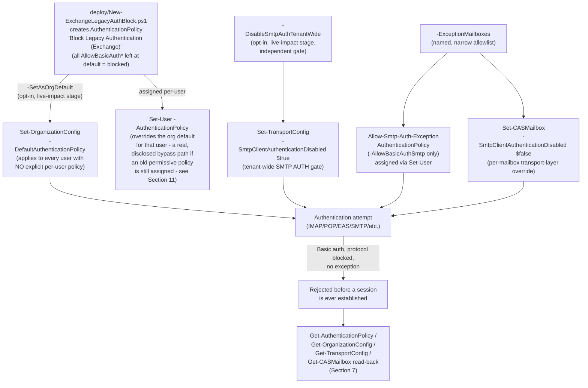

## The short version

Deploys Exchange Online's own, workload-level legacy-authentication controls - an
**Authentication Policy** (`New-/Set-AuthenticationPolicy`) assigned tenant-wide as the default and
to explicit users, plus the tenant-wide **Authenticated SMTP (SMTP AUTH)** toggle
(`Set-TransportConfig -SmtpClientAuthenticationDisabled`) - with a narrow, named, per-mailbox
exception path for devices/apps that still need SMTP AUTH. Unlike Conditional Access, these
controls are evaluated **inside Exchange Online itself, before a session is ever established**.

## Why this matters

- **Exchange-side controls act before first-factor authentication completes - Conditional Access
  does not.** Microsoft's own community guidance states plainly that Conditional Access policies
  "apply post (first factor) authentication... Even if a CA policy blocks the login attempt, at
  this point the attacker knows credentials were successfully verified". The controls in this scenario are evaluated inside the Exchange Online
  authentication stack itself, closing the exact gap the sibling scenario's own design notes
  discloses.
- **SMTP AUTH has a live, ticking deprecation clock - but it isn't disabled yet.** Microsoft has
  already **permanently** disabled Basic authentication tenant-wide, with no re-enable option, for
  Exchange ActiveSync, POP, IMAP, Remote PowerShell, Exchange Web Services, Offline Address Book,
  Autodiscover, and Outlook for Windows/Mac (MAPI/RPC). **Authenticated SMTP
  (SMTP AUTH / Client Submission) is the one protocol Microsoft has deliberately left
  admin-controlled** during an extended deprecation runway: per Microsoft's own updated timeline,
  SMTP AUTH Basic Authentication is scheduled to be **disabled by default for existing tenants at
  the end of December 2026** (admins can still re-enable it after that date), with a final removal
  date to be announced in the second half of 2027; tenants created after December 2026 will have it
  unavailable by default with no re-enable option. As of this build's date
  (2026-09-09), that default flip has **not yet happened** - a tenant that hasn't explicitly
  disabled SMTP AUTH today is still exposed on the one legacy-auth protocol left standing, and
  waiting for Microsoft's own timeline means staying exposed for months longer than necessary.
- **A real, currently-exploited attack surface.** SMTP AUTH is a documented target for
  password-spray and credential-stuffing campaigns (the same attacker motivation the Conditional
  Access sibling scenario's own attack-statistics citation names for legacy auth generally
 ) precisely because it is Basic Authentication - no MFA challenge,
  a single username/password pair, scriptable at scale.
- **SOC 2 / ISO 27001 / PCI DSS control-automation expectations.** Same driver as the Conditional
  Access sibling scenario (why this matters there) - "legacy/basic authentication is disabled" is a commonly
  assessed control; this scenario closes it at the workload layer specifically, which several
  frameworks' control language distinguishes from an identity-layer (Conditional Access) control.
- **Defense-in-depth, not a duplicate.** This scenario does not replace
  *Block Legacy Authentication* - it closes a gap that scenario's own four-lens review disclosed it
  cannot close (the design notes there). Deploy both for layered coverage.

## How the control works

Full rationale for the two independent, both-must-be-closed SMTP AUTH gates (AuthenticationPolicy
vs. transport config) is in the design notes.

## What it takes

### Prerequisites

| Requirement | Minimum | Notes |
|---|---|---|
| Exchange Online (any plan that includes it) | Exchange Online Plan 1/2, or any Microsoft 365/Office 365 plan that bundles it | Authentication Policies, `Set-TransportConfig`, and `Set-CASMailbox` are all core Exchange Online administration surfaces - **no incremental license** beyond Exchange Online itself. Unlike the Conditional Access sibling scenario, this scenario needs no Entra ID P1/P2. |
| Automation identity for the deploy script | Exchange Online app-only certificate authentication (`Connect-ExchangeOnline -AppId ... -CertificateThumbprint ...`), `Exchange.ManageAsApp` application permission on the **Office 365 Exchange Online** resource, plus an Exchange Online RBAC role/role group granted to the app's service principal | [Automation surface, sections 1 and 3](/docs/automation-surface/#1-five-automation-surfaces-not-one-read-this-first) (automation surface 1, Exchange Online PowerShell). This library's confirmed working role for authentication-policy cmdlets is **Organization Management** - see section 11 for the narrower-role VERIFY. |
| Role to run the deploy/validate scripts interactively, or to assign to the app's service principal for unattended use | **Organization Management** (Exchange Online role group) | Confirmed sufficient by this build (it is Exchange Online's superset administrative role group); the exact least-privilege granular Exchange management role scoped to just Authentication Policies is not independently confirmed - see the known limitations and [RBAC model, section 6](/docs/rbac-model/#6-exchange-online-dependency-the-most-common-permissions-gap). |
| Tenant SMTP AUTH inventory before enforcing | List of mailboxes/devices/apps that currently authenticate via SMTP AUTH (multifunction devices/scan-to-email, line-of-business apps, monitoring tools) | step 2 of the implementation steps below. Disabling SMTP AUTH tenant-wide without this step is this scenario's single highest-risk operational mistake - see operations and tuning. |

> Verify current entitlement names against [Licensing matrix, section 4](/docs/licensing-matrix/#4-common-cross-module-prerequisites) and the Product Terms
> before a sales commitment - SKU names change.

### Cost and licensing

- **No incremental license.** Authentication Policies, `Set-TransportConfig`, and `Set-CASMailbox`
  are core Exchange Online administration surfaces, included in every plan that includes Exchange
  Online - unlike the Conditional Access sibling scenario, this scenario needs **no** Entra ID
  P1/P2. [Licensing matrix, section 4](/docs/licensing-matrix/#4-common-cross-module-prerequisites).
- **No PAYG component.** These are tenant configuration objects, not consumption-billed.
- **Real, if modest, migration cost for an organization still relying on SMTP AUTH.** A device/app that
  cannot move to OAuth may need a hardware/firmware update or a paid relay service - call this out
  explicitly in a CISO conversation rather than presenting this scenario as zero-friction.
- **Time-boxed urgency, not a discretionary nice-to-have.** Microsoft's own SMTP AUTH default-disable date (end of December 2026) means an organization that does nothing gets a
  version of this control anyway, on Microsoft's timeline, without the named-exception governance
  this scenario provides - the CISO pitch is "control the transition on your terms, before
  Microsoft controls it on theirs."

## Proof it works

1. **Automated checks** - `./validate/Test-ExchangeLegacyAuthBlock.ps1`:
   - `Get-AuthenticationPolicy -Identity 'Block Legacy Authentication (Exchange)'`
     - confirms every `AllowBasicAuth*` is `$false`/unset.
   - `Get-OrganizationConfig | Select-Object DefaultAuthenticationPolicy` - confirms tenant-wide
     assignment, if `-SetAsOrgDefault` was used.
   - `Get-TransportConfig | Select-Object SmtpClientAuthenticationDisabled` - confirms the SMTP
     AUTH tenant-wide gate, if `-DisableSmtpAuthTenantWide` was used.
   - `-CheckUserOverrides` (optional, `Get-User -ResultSize Unlimited | Where-Object
     AuthenticationPolicy`) - flags any user with an explicit policy assignment other than this
     scenario's own two policies, since those users are **not** covered by the org default.
   - Fails hard if the baseline policy doesn't exist, or exists but any `AllowBasicAuth*` is
     enabled.
2. **Manual checklist** - printed by the same script: Step 2's SMTP AUTH inventory reviewed,
   exception mailboxes tested end-to-end, and awareness of Microsoft's own December 2026 SMTP AUTH
   default-disable date (this scenario should already be ahead of it).
3. **End-to-end functional test (non-production account only)** - attempt an SMTP AUTH send with a
   disposable test mailbox's credentials before and after Step 5; confirm rejection
   (`535 5.7.139 Authentication unsuccessful` per Microsoft's documented SMTP AUTH error code
  ) after enforcement, and confirm an `-ExceptionMailboxes` entry still
   succeeds.

## Where it stops

- **The org default does not override an existing explicit per-user policy assignment.** If any
  user in the tenant already has an `AuthenticationPolicy` assigned directly (e.g. a legacy,
  more-permissive policy from before this scenario, or one assigned by a different automation), the
  org default set in step 4 of the implementation steps has **no effect on that user** - they keep their existing, possibly
  permissive, policy. `validate/Test-ExchangeLegacyAuthBlock.ps1
  -CheckUserOverrides` surfaces this; it is a real, disclosed bypass path this scenario cannot close
  by itself (Red Team finding, the review notes).
- **VERIFY (pilot tenant, before production reliance):** the exact interaction between the
  `AuthenticationPolicy`'s own `AllowBasicAuthSmtp` switch and the independent
  `SmtpClientAuthenticationDisabled` transport-layer setting when only one of the two is
  opened for an exception mailbox - Microsoft's own reference pages document each mechanism
  separately (`Set-AuthenticationPolicy`, the dedicated SMTP AUTH guide
 ) but neither states which one wins, or whether both must agree, if they
  disagree. This scenario's exception path deliberately opens **both** gates together to avoid
  depending on an answer to this question - see step 5 of the implementation steps and the design notes.
- **VERIFY (pilot tenant):** the exact least-privilege Exchange Online management role scoped to
  just Authentication Policy cmdlets, as distinct from the confirmed-sufficient but broad
  **Organization Management** role group this scenario's Prerequisites use - Microsoft's own
  cmdlet reference pages for `New-/Set-/Remove-AuthenticationPolicy` defer to "Find the
  permissions required to run any Exchange cmdlet" rather than naming a specific role directly.
- **Which of the twelve `AllowBasicAuth*` protocols are already moot is not individually confirmed
  for all twelve.** Microsoft's own "Disable Basic authentication" overview names Exchange
  ActiveSync, POP, IMAP, Remote PowerShell, Exchange Web Services, Offline Address Book,
  Autodiscover, and Outlook for Windows/Mac as **already permanently disabled tenant-wide**, with
  no re-enable option - this scenario's baseline policy still blocks those
  redundantly (harmless - a second, explicit gate on an already-closed door) alongside SMTP,
  Outlook Service, Reporting Web Services, RPC, and PowerShell, which are **not** individually named
  on that page as already force-disabled and so remain live, meaningful protocols this policy
  covers. Confirm the current state of each protocol against Microsoft Learn before presenting this
  scenario's baseline policy as covering only "already-moot" ground.
- **This scenario does not disable or migrate `Set-User -AuthenticationPolicy` assignments made
  by other automation or a different admin.** Reconciling every existing per-user assignment in a
  large tenant is out of scope - this scenario creates and assigns the policy objects; a tenant
  with pre-existing per-user policy sprawl should audit `Get-User -ResultSize Unlimited |
  Where-Object AuthenticationPolicy` (the same check `-CheckUserOverrides` runs) before relying on
  the org default alone.
- **No Microsoft-side audit log exists for a rejected SMTP AUTH attempt - grounded and closed, not
  a documentation gap.** See operations and tuning's KPIs section for the full grounding: neither
  `Search-UnifiedAuditLog` nor Entra ID sign-in logs (nor the SMTP AUTH Clients report) capture a
  connection this scenario's own gates reject at the pre-authentication step. Monitor rejection
  volume via the affected device/app's own logs or a synthetic canary probe instead - there is no
  Microsoft cmdlet or API this scenario (or any future companion script) could call to get this
  signal.
- **This scenario does not script Direct Send / unauthenticated relay controls.** Direct Send
  (anonymous relay via an Exchange Online mail flow connector, commonly used by
  scan-to-email/line-of-business apps as an *alternative* to SMTP AUTH) is a materially different,
  separately-configured Exchange Online surface with its own abuse profile - out of scope for this
  scenario, which covers **authenticated** legacy protocols only.
- **Policy identity is by exact name, not a fixed immutable ID exposed to this script's own
  parameters** - same class of limitation as the Conditional Access sibling scenario; renaming
  either policy in the portal or via `Set-AuthenticationPolicy` breaks this script's idempotency
  detection.
- **Grounding note:** `learn.microsoft.com` and `techcommunity.microsoft.com` were not directly
  fetchable from this build's network environment. Cmdlet syntax and parameter behavior were
  grounded via direct fetches of the equivalent Microsoft Learn PowerShell reference pages mirrored
  in the public `MicrosoftDocs/office-docs-powershell` GitHub repository (not a Learn URL, but the
  same source content Learn is generated from); the SMTP AUTH deprecation timeline and the
  already-permanently-disabled protocol list were grounded via WebSearch, corroborated across
  multiple independent secondary sources citing the same official Microsoft pages, following the
  same practice this library used for *Security Policy Violations by Priority Users* when direct
  Learn access was unavailable. Re-verify all cited URLs and exact parameter behavior directly
  against Microsoft Learn before a customer-facing commitment.