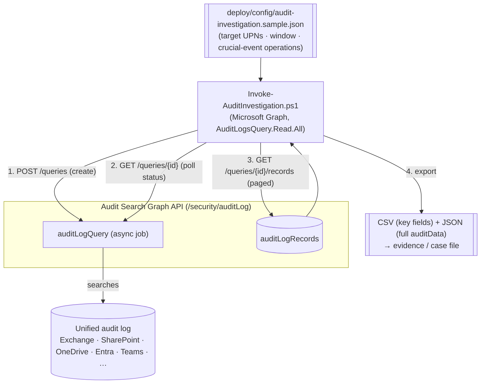

## The short version

Runs a **read-only forensic investigation** of a potentially compromised (or insider-risk) account
using the Microsoft Purview **Audit Search Graph API** (v1.0 `security` namespace): it creates an
async audit-log query scoped to a target user, a time window, and a curated set of **crucial events**
(mailbox access, sending/impersonation, malicious inbox rules and delegate grants, file
download/oversharing, sign-ins, and privilege/identity changes), waits for the job to complete,
retrieves the records (paged), and **exports** them to CSV and JSON for the case file. The whole
investigation is driven by a version-controlled config so triage runs are consistent and repeatable
across incidents.

## Why this matters

When an account is compromised or an insider is suspected, the audit log is the primary source of
truth: it "captures, records, and retains thousands of user and admin operations" so security ops,
IT, insider-risk, and legal teams can reconstruct activity. Speed and completeness
matter - breach-notification clocks (GDPR 72 hours, many U.S. state laws, sector rules) start early,
and regulators/insurers expect a defensible investigation record. Automating the search-and-export:
- **shortens time-to-triage** - a curated crucial-events query runs in one command instead of many
  portal searches;
- **is consistent and defensible** - the same config produces the same scoped investigation, with an
  exported evidence set, every time;
- **exploits Audit (Premium)** - Premium unlocks **crucial events** such as **`MailItemsAccessed`**
  (which mailbox items an attacker actually read - central to scoping a BEC/mailbox compromise) and
  **long retention** (up to 1 year, 10 years with the add-on) so investigations can reach back far
  enough.

## How the control works

The query is an **async job**: create it, poll until its status is terminal, then page the records.
The export is the deliverable - a timestamped CSV (triage-friendly key fields) plus JSON (the full
`auditData` per record for deep analysis). Read-only throughout - no tenant state changes. Full
rationale: the design notes.

## What it takes

### Prerequisites

Full licensing detail: [Licensing matrix](/docs/licensing-matrix/). RBAC: [RBAC model](/docs/rbac-model/). Automation surface:
[Automation surface](/docs/automation-surface/) (surface 3 - Microsoft Graph). Summary:

| Requirement | Minimum | Notes |
|---|---|---|
| Audit tier | **Audit (Standard)** for search/export + Graph API + 180-day retention; **Audit (Premium)** for crucial events (`MailItemsAccessed`), 1-year (10-year add-on) retention, high-bandwidth API | Premium comes with M365/O365 E5, Purview Suite, or the E5 eDiscovery & Audit add-on |
| Graph permission | **AuditLogsQuery.Read.All** (all workloads), or a service-scoped variant (`AuditLogsQuery-Exchange.Read.All`, `-SharePoint.Read.All`, `-Entra.Read.All`, …) | Delegated or Application; least-privileged is `AuditLogsQuery-Entra.Read.All` |
| Auth (this scenario) | `Connect-MgGraph -Scopes 'AuditLogsQuery.Read.All'` (delegated) or app-only certificate | Microsoft Graph PowerShell SDK - [Automation surface, section 3](/docs/automation-surface/#3-authentication-patterns---interactive-vs-unattended) |
| Classic alternative role | **View-Only Audit Logs** / **Audit Logs** (for `Search-UnifiedAuditLog`) | The classic EXO cmdlet path - see the known limitations |
| Auditing enabled | On by default; individual services (e.g. Power BI) may need auditing turned on | Record availability is typically 60-90 min after an event |

> Verify current entitlement names against [Licensing matrix](/docs/licensing-matrix/) (dated 2026-09-02) and the
> Product Terms before a sales commitment - SKU names and the crucial-events list change.

### Cost and licensing

- **Per-user entitlement, no consumption meter.** Audit search/export and the Graph API are included
  in the audit entitlement; **crucial events + long retention are the Premium (E5/Suite) delta**. No Azure PAYG meter for running queries.
- **10-year retention is an add-on.** Reaching back beyond 1 year needs the 10-Year Audit Log
  Retention add-on license per user.
- **Cost is investigator time + evidence storage.** Automation cuts the search labor; secure storage
  and handling of exported PII/sensitive records is the ongoing cost and risk to plan for.

## Proof it works

1. **Readiness** - `./validate/Test-AuditInvestigation.ps1` confirms Graph connectivity, an
   `AuditLogsQuery*` scope, a well-formed config, and runs a **1-hour probe query** that proves the
   API + permission + audit availability end-to-end. Exits non-zero on failure.
2. **Known-event test** - perform a benign, identifiable action as a test user (e.g. create and
   delete an inbox rule), wait ~60-90 minutes for ingestion, then run the
   investigation scoped to that user/operation and confirm the record appears in the export.
3. **Completeness/paging** - for a broad query, confirm the exported record count matches the portal
   search count and that paging followed `@odata.nextLink` (no silent truncation).
4. **Crucial-event (Premium) test** - for a Premium-licensed user, confirm `MailItemsAccessed`
   records are returned (they are not available under Standard) - evidence the Premium tier is active.
5. **Repeatability** - re-run with the same config/window and confirm the same record set (audit
   records are immutable), demonstrating the investigation is reproducible for the case file.

## Where it stops

- **Read-only, but the output is sensitive.** The investigation changes nothing in the tenant, yet
  the **export can contain highly sensitive content and PII** (subjects, file paths, IPs, and
  workload `auditData`). Treat the output directory as evidence: restrict access, store per IR
  policy, and dispose when the matter closes.
- **VERIFY - audit query status enum.** The script polls until the status leaves the running set
  (`notStarted/running/queued/inProgress`) and expects a `succeeded`-like terminal value before
  reading records; confirm the exact `auditLogQueryStatus` values for your tenant/region.
- **Ingestion latency.** Records typically appear 60-90 minutes after the event (longer for some
  services) - "no results" right after an incident may just mean the data hasn't landed.
- **Crucial events need Premium.** `MailItemsAccessed` and other crucial events are **not** available
  under Audit (Standard), and only for appropriately-licensed users - a Standard-only tenant will get
  an incomplete picture of mailbox access.
- **Retention boundary.** Queries can't return data older than the user's retention (180 days
  Standard; up to 1 year Premium; 10 years with the add-on).
- **Concurrency/size limits.** Up to 10 concurrent jobs per admin (one unfiltered); very broad
  queries are slow and large. The classic `Search-UnifiedAuditLog` caps at 50,000
  records per search - the Graph API is the better path for large investigations.
- **Classic alternative.** `Search-UnifiedAuditLog` (EXO PowerShell, View-Only Audit Logs role) is the
  synchronous classic surface; this scenario uses the async Graph API for scale, paging, and app-only
  auth - see the design notes.
- **Region availability.** The Audit Search Graph API is available in the global/GCC deployments noted
  on the reference pages; confirm availability for sovereign clouds before relying on it.