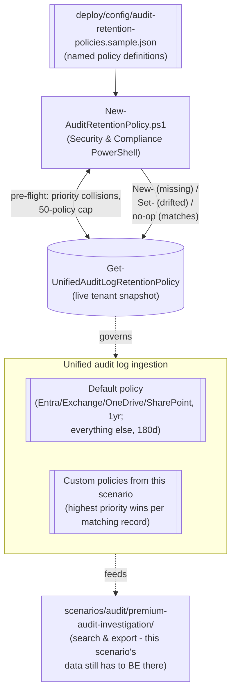

## The short version

Creates and manages **custom Microsoft Purview audit log retention policies** - extending
retention beyond the tenant's automatic one-year Entra/Exchange/OneDrive/SharePoint default (e.g.
to Microsoft Teams, or to a specific regulated user group) and shortening it for noisy,
low-investigative-value activity - as a version-controlled, idempotently-reconciled set, using
Security & Compliance PowerShell.

## Why this matters

Audit records are worthless to an investigator, an auditor, or a regulator if they've already
expired. Retention duration is itself a compliance control, referenced (without a specific number)
by GDPR Article 5(1)(e) (storage limitation - cuts both ways: keep long enough to investigate, not
indefinitely for its own sake), HIPAA's six-year documentation-retention expectation, PCI DSS
Requirement 10 (audit trail retention - at minimum, PCI DSS explicitly expects audit trail history
availability for at least one year, with three months immediately available for analysis), and
SOC 2 CC7 (monitoring). Two concrete drivers this scenario addresses directly:

- **Closing the Teams gap.** Audit (Premium)'s default one-year retention policy covers only
  Entra ID, Exchange, OneDrive, and SharePoint. Microsoft Teams - a primary channel for regulated
  communication in many of this library's organization profiles (see
  *PCI Teams Card-Data Exfiltration Block*, *Workplace Harassment & Code of Conduct*) - silently falls back to the 180-day default unless a custom
  policy extends it. An organization that has deployed Teams-focused DLP/Communication Compliance controls
  but never extended Teams' own audit retention has a real gap between "we can detect this" and
  "we can still prove it happened three months from now."
- **Cost/noise control.** Audit storage and search performance both benefit from *not* retaining
  every high-volume, low-value operation (a service account's routine search queries, for example)
  at the full default duration. A shorter, deliberate retention window for specifically-identified
  noisy activity is a legitimate, documented use of this same mechanism - not a compliance
  shortcut, since it only ever shortens retention *below* what a workload already gets by default,
  never below any applicable legal-hold or regulatory floor the deploying organization must separately track.

## How the control works

`New-AuditRetentionPolicy.ps1` authors policy **objects**; it never touches audit records
directly. Full reconciliation flow: the design notes.

## What it takes

### Prerequisites

Full licensing detail: [Licensing matrix](/docs/licensing-matrix/). RBAC: [RBAC model](/docs/rbac-model/). Automation surface:
[Automation surface](/docs/automation-surface/) (surface 2 - Security & Compliance PowerShell). Summary:

| Requirement | Minimum | Notes |
|---|---|---|
| Audit tier | **Audit (Premium)** for the concept of custom retention policies at all; per-user retention beyond 180 days additionally requires that specific user hold an Audit (Premium)-qualifying license | Microsoft 365/Office 365 E5, Purview Suite, or the E5 eDiscovery & Audit add-on |
| 10-year retention | A separate **10-Year Audit Log Retention add-on** license, per user, in addition to the E5-family license | Only needed for `TenYears` policies; this scenario's scripts cannot verify the add-on is assigned - confirm manually |
| Role to create/edit retention policies | **Organization Configuration** role in the Microsoft Purview portal | Confirmed included by default in the **Compliance Data Administrator** Purview role group; likely also covered by broader groups (Organization Management) - this build independently confirmed only the Compliance Data Administrator grant |
| **Not sufficient alone** | The **Audit Manager** role group ([RBAC model](/docs/rbac-model/)'s Audit row) grants audit **search/export** configuration, not retention-policy creation - these are two distinct roles/role groups for two distinct Audit capabilities | See the known limitations; this distinction is now also reflected directly in [RBAC model](/docs/rbac-model/)'s Audit row |
| Automation identity | App registration with Security & Compliance PowerShell access (certificate app-only), granted a role group containing Organization Configuration | [Automation surface, section 3](/docs/automation-surface/#3-authentication-patterns---interactive-vs-unattended) - surface 2, same `Connect-IPPSSession` pattern as every DLP/DLM scenario in this library |
| Tenant-wide caps | Up to **50** custom audit log retention policies per organization; **Priority** (1-10000) must be globally unique across all of them | Enforced pre-flight by `deploy/New-AuditRetentionPolicy.ps1` before any write - see the configuration reference |

> Verify current entitlement names against [Licensing matrix](/docs/licensing-matrix/) (dated 2026-09-02) and the
> Product Terms before a sales commitment - SKU names change.

### Cost and licensing

- **No PAYG component.** Audit log retention policies are a configuration object, not a
  consumption-billed resource - no Azure meter. Cost is entirely the **per-user licensing** that
  the retention duration in question requires.
- **The real cost driver is the license tier, not the policy count.** Fifty policies referencing
  only E5-licensed users cost nothing beyond the E5 estate already in place; a `TenYears` policy
  requires the separate per-user add-on regardless of how many policies reference that user.
- **Shortening retention saves nothing directly** (no metered audit-storage cost was found in
  Microsoft's licensing documentation as of this build) but reduces the volume an investigator has
  to search through and the corresponding time cost of an investigation - an operational, not a
  license, saving.

## Proof it works

1. **Automated config check** - `./validate/Test-AuditRetentionPolicy.ps1 -ConfigPath <config>`
   confirms every configured policy exists with matching settings, confirms no tenant-wide
   priority collisions exist, and warns when headroom under the 50-policy cap is low. Exits
   non-zero on any hard failure (safe for a CI-style pre-flight/drift check).
2. **Portal cross-check** - Purview portal → **Audit** → **Audit retention policies** dashboard;
   confirm each policy's settings render correctly. **Caveat:** if a policy uses a `RecordTypes`/
   `Operations` combination not offered by the portal's own creation wizard, the dashboard permits
   view-and-delete only - editing must go back through `Set-UnifiedAuditLogRetentionPolicy`
   (the known limitations, and the "Create policy" tool warning Microsoft documents directly).
3. **Retention-in-practice test (longest-lead-time check - start this first)** - perform a
   representative activity matching a newly-widened policy (e.g. a Teams action for the sample
   config's `Extended-Teams-Audit-1Year` policy) and, after the policy's original shorter
   retention window would have expired the record under the *old* rule, confirm via
   *Forensic Investigation of a Compromised Account* (or `Search-UnifiedAuditLog`) that the record is
   still retrievable. This is the only test that actually proves retention, not just
   policy-object configuration, but by construction it can't be run start-to-finish until the
   original (shorter) window has passed.
4. **Idempotency test** - re-run `deploy/New-AuditRetentionPolicy.ps1` with an unchanged config
   twice in a row; confirm the second run reports `[UNCHANGED]` for every policy and makes no
   calls.
5. **Priority-collision rejection test** - temporarily edit the sample config so two entries share
   a `priority`, run with `-WhatIf`, and confirm the script throws before making any change (not a
   partial-apply).

## Where it stops

- **PowerShell cannot create five of the portal's nine durations.** `-RetentionDuration` accepts
  only `ThreeMonths`/`SixMonths`/`NineMonths`/`TwelveMonths`/`TenYears`; the portal additionally
  offers `7 Days`/`30 Days`/`3 Years`/`5 Years`/`7 Years`. Confirmed by directly comparing the
  official `New-`/`Set-UnifiedAuditLogRetentionPolicy` cmdlet references against the official
  `audit-log-retention-policies` conceptual page (both fetched this build) - this is a real,
  sourced gap, not a guess. An organization needing one of those five durations must use the portal for
  that specific policy; `deploy/New-AuditRetentionPolicy.ps1` will reject any config entry that
  requests one.
- **A PowerShell-authored policy can become portal-edit-locked.** If a policy's `RecordTypes`/
  `Operations` combination isn't offered by the portal's own **Create audit retention policy**
  tool, the dashboard permits view-and-delete only - future edits must go back through
  `Set-UnifiedAuditLogRetentionPolicy`, not the portal UI. An organization whose compliance team expects
  to hand-tune policies in the portal should know this before scripting one outside the portal's
  own vocabulary.
- **VERIFY - retroactive vs. forward-only retention-duration changes.** Microsoft's own
  conceptual documentation states both that a retention-policy change "changes the expiration time
  of the audit data after updating" *and*, in the same section, that such changes "don't update
  any previously committed items" - two statements this build could not reconcile to one precise
  rule. Confirm the actual behavior (does shortening a policy immediately mark older-than-new-window records for early expiry, or only affect records committed after the edit?) against a
  pilot tenant before relying on a retention *shortening* for cost/noise control in production -
  see the design notes.
- **`TenYears` license assignment is not verified by this scenario's scripts.** No cmdlet or Graph
  endpoint for checking a specific user's 10-Year Audit Log Retention add-on assignment was found
  during this build's grounding pass. `deploy/New-AuditRetentionPolicy.ps1` only warns; confirm
  license assignment manually (Microsoft 365 admin center → the user → Licenses) before relying on
  a `TenYears` policy.
- **The Organization Configuration role is distinct from the Audit Manager role group already
  documented in [RBAC model](/docs/rbac-model/).** Creating/editing retention policies needs **Organization
  Configuration** (confirmed included in the **Compliance Data Administrator** role group);
  configuring/running audit **search** needs the separate **Audit Manager** role group. An organization's
  existing Audit Manager assignees cannot manage retention policies without an additional role -
  this distinction has been backported into [RBAC model](/docs/rbac-model/)'s Audit row.
- **`$null`-clearing extrapolated from one documented example.** This scenario's scripts pass
  `$null` (not an empty array) to clear a previously-set `RecordTypes`/`Operations`/`UserIds`
  value on update. Microsoft's own worked example documents this convention only for `-UserIds`;
  applying it to `-RecordTypes`/`-Operations` here is this build's own extrapolation by analogy
  (same parameter type, same documented "blank = applies to all" default), not independently
  confirmed for those two parameters specifically - confirm against a pilot tenant before relying
  on a config change that narrows-then-widens a policy's `RecordTypes`/`Operations` scope.
- **This scenario does not perform the audit search itself.** It only configures retention. Use
  *Forensic Investigation of a Compromised Account* (or `Search-UnifiedAuditLog`) to actually query
  the data these policies keep around for longer.