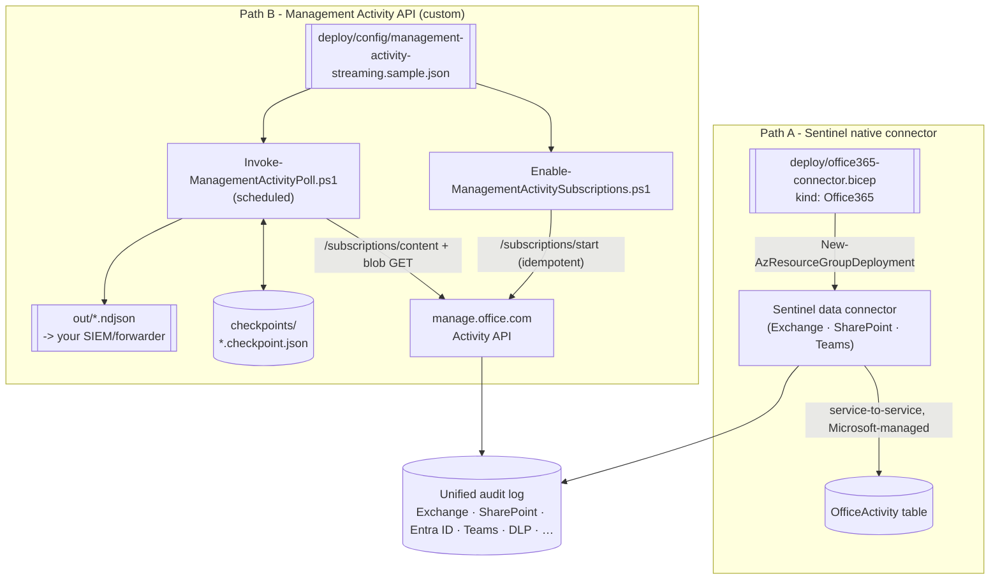

## The short version

Turns the **on-demand** investigation in `audit/premium-audit-investigation` into **continuous**
audit streaming, via two independently deployable paths: (A) the native **Microsoft Sentinel**
data connector for Exchange/SharePoint/Teams activity (`OfficeActivity` table, free, zero
maintenance), and (B) a subscribe-and-poll pipeline against the raw **Office 365 Management
Activity API** for any SIEM, and for the **Entra ID audit** and **`DLP.All`** events Path A doesn't
carry.

## Why this matters

On-demand investigation (this library's *Forensic Investigation of a Compromised Account*) answers "what happened after
the fact." Continuous streaming answers "tell me the moment it happens" - the difference between a
forensic report and a working detection program. Regulators and frameworks that expect **continuous
monitoring and timely detection** (SOC 2 CC7.2, ISO 27001 A.8.16, PCI-DSS Requirement 10) are
satisfied by log data landing in a SIEM with alerting, not by an admin's ability to run a query after
being told something is wrong. Two mechanisms exist because they solve different parts of that
requirement - see the prerequisites for which one (or both) a given organization needs.

## How the control works

Path A is fully managed once deployed - Microsoft streams events server-to-server, no polling loop
to operate. Path B is a scheduled pull: the subscription script (run once, or re-run safely) ensures
content types are enabled; the poll script (run on a schedule) lists and retrieves new content since
its last checkpoint and exports NDJSON for a downstream forwarder. Full rationale and the two-path
comparison: the design notes.

## What it takes

### Prerequisites

Full licensing detail: [Licensing matrix](/docs/licensing-matrix/). RBAC: [RBAC model](/docs/rbac-model/). Automation surface:
[Automation surface, section 4](/docs/automation-surface/#4-routing-table---which-surface-for-which-purview-task) ("Audit search (API, high volume/bulk export)" row cites this exact
API). Summary:

| Requirement | Path A (Sentinel connector) | Path B (Management Activity API) |
|---|---|---|
| SIEM | An existing Microsoft Sentinel workspace (Log Analytics workspace with Sentinel enabled) | Any - the API is SIEM-agnostic |
| Tenant role to connect | **Security Administrator** (or equivalent) on the M365 tenant, **Sentinel Contributor** (read/write) on the workspace | An Entra app registration granted the **Application** permission **"Read activity data for an organization"** (`ActivityFeed.Read`) on **Office 365 Management APIs**, admin-consented. Add **"Read Data Loss Prevention (DLP) policy events"** only if subscribing to `DLP.All` |
| Deployment auth | Azure RBAC **Contributor** (or narrower) on the resource group, for the Bicep deployment | OAuth2 **client-credentials** grant (certificate preferred over secret in production - [Automation surface, section 3](/docs/automation-surface/#3-authentication-patterns---interactive-vs-unattended)) |
| Audit prerequisite | **Unified audit logging** turned on for the tenant (shared prerequisite - both paths read from the same underlying audit pipeline) | Same |
| Cost | **Free** - `OfficeActivity` (Exchange/SharePoint/Teams) is an excluded/free Log Analytics data source | No API charge; you pay for wherever the NDJSON output lands (ingestion, storage) |

> Verify current entitlement names and role requirements against [Licensing matrix](/docs/licensing-matrix/) and
> [RBAC model](/docs/rbac-model/) (dated 2026-09-02) before a sales commitment.

### Cost and licensing

- **Path A is free at the data-ingestion layer** - `OfficeActivity` (Exchange/SharePoint/Teams) is
  an explicitly excluded/free Log Analytics data source; the only cost is the
  Sentinel workspace itself (already a sunk cost if Sentinel is in use).
- **Path B has no API charge**, but every record you retrieve is a record you must land somewhere -
  Log Analytics per-GB ingestion (if forwarded via the Logs Ingestion API), a third-party SIEM's own
  indexing cost, or storage, depending on where the NDJSON output is forwarded.
- **No license SKU gates either path** beyond unified audit logging itself and (for `DLP.All`) the
  separate DLP-events read permission - this is not an Audit (Premium) feature the way crucial
  events in *Forensic Investigation of a Compromised Account* are.

## Proof it works

**Path A:**
1. After deployment, confirm the connector shows **Connected** on the Sentinel **Data connectors**
   page, or inspect the deployed resource (`Get-AzResource -ResourceType
   Microsoft.SecurityInsights/dataConnectors`).
2. Generate a benign, identifiable event (e.g. a test SharePoint file access), wait for the ~60-90
   minute typical ingestion latency shared with the underlying audit log, then
   query `OfficeActivity | where TimeGenerated > ago(2h)` in the workspace and confirm it appears.

**Path B:**
1. **Readiness** - `./validate/Test-ManagementActivityStreaming.ps1` confirms token acquisition and
   that every configured content type shows `status: enabled`.
2. **First poll** - run `Invoke-ManagementActivityPoll.ps1` once; confirm a checkpoint file is
   created per content type and (if any events occurred in the window) an NDJSON export file is
   non-empty.
3. **Pipeline health over time** - re-run `Test-ManagementActivityStreaming.ps1` (without
   `-SkipCheckpointCheck`) after the poll script has been scheduled for a day; confirm every content
   type's checkpoint is fresh (within `-MaxStaleHours`).
4. **Known-event test** - perform a benign action matching one of the subscribed content types (a
   sign-in for `Audit.AzureActiveDirectory`, a file share for `Audit.SharePoint`), wait for
   ingestion latency, run the poll, and confirm the record appears in that run's NDJSON.

## Where it stops

- **Path A does not cover Entra ID audit or DLP events.** Its three data types are Exchange,
  SharePoint, and Teams only - an organization that also needs those needs Path B (or the
  separate, dedicated Microsoft Entra ID Sentinel connector for `AuditLogs`/`SigninLogs`, not built
  here).
- **This is not the Microsoft Purview Information Protection (Preview) connector.** That connector
  streams label/protection-specific events (via the same underlying Management Activity API) into a
  different table (`MicrosoftPurviewInformationProtection`), has documented event duplication against
  `OfficeActivity`, and doesn't populate label names without an enrichment KQL join
  - out of scope here; see the design notes.
- **No webhook/push mode built.** Path B polls; Microsoft also documents a webhook push mode
  requiring a hosted, internet-reachable endpoint, deliberately out of scope for this author-only
  library.
- **Connector resource naming (Path A) - grounded 2026-09-28.** The `Microsoft.SecurityInsights/
  dataConnectors` name isn't required to be a GUID: the resource-format reference documents `name`
  as plain `string (required)` with no format constraint, and its own worked Bicep/ARM/Terraform
  example sets it to an arbitrary string (`'acctest0001'`) for a different connector kind on the
  same resource type. The REST/Codeless-Connector-Framework URI-parameter
  reference confirms the only real constraint: `dataConnectorId` "must be a unique name that's the
  same as the `name` parameter in the request body" - uniqueness, not a GUID format. (`New-AzSentinelDataConnector`'s `-Id` parameter defaults to
  `(New-Guid).Guid`, but that's a convenience default, not a documented requirement.) The Bicep
  template's deterministic `guid`-derived name remains unchanged - it's still a valid, idempotent
  choice - but is now a design choice rather than a workaround for an unstated constraint.
- **VERIFY - 15-minute `/start` cooldown edge case (Path B).** Whether the cooldown is measured from
  the previous `/start` call's timestamp regardless of outcome, or only from a successful one, isn't
  documented - `Enable-ManagementActivitySubscriptions.ps1` sidesteps this by skipping `/start`
  entirely whenever `/subscriptions/list` already shows `enabled` for that content type.
- **Ingestion latency is shared, not additive.** Both paths read from the same underlying audit
  pipeline (~60-90 minutes typical for core services) - streaming doesn't make
  events appear faster than the audit log itself produces them; it removes the need for a human to
  go looking once they do.
- **Sentinel's Azure-portal experience is being retired in favor of the Defender portal** (after
  March 31, 2027) - the data connector itself is unaffected, but screenshots/menu
  paths in organization-facing walkthroughs should be re-checked against whichever portal the deploying organization's
  Sentinel instance actually uses.