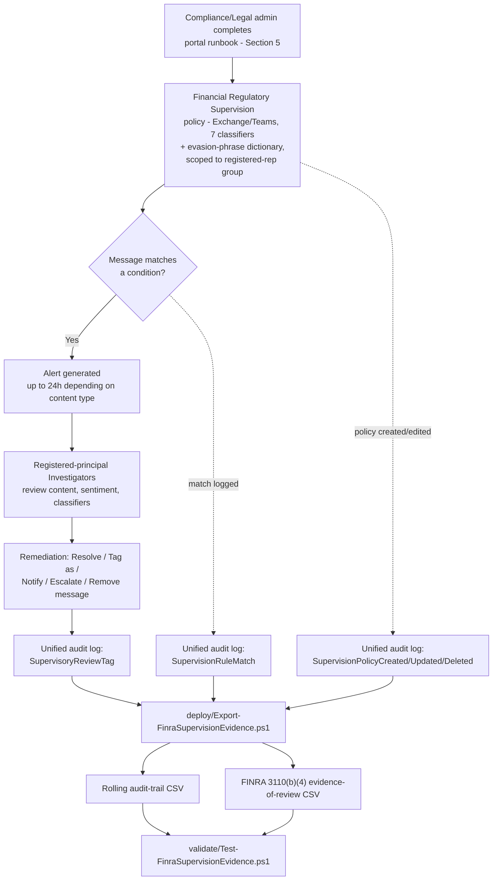

## The short version

> **Scope note (read before implementation):** Microsoft Purview Communication Compliance has **no
> documented PowerShell, Graph, or REST write API** for policy creation or management - the same
> constraint *Workplace Harassment & Code of Conduct* already documents
> (section 2 there, the design notes here). Sections 5-6 below describe a precise **portal runbook** for the
> policy itself, backed by a structured reference manifest, and a genuinely scriptable **audit-trail
> and evidence-of-review export** for the one piece of this solution reachable through a documented
> API.

Deploys a Microsoft Purview Communication Compliance policy that detects signs of stock manipulation,
money laundering, undisclosed gifts/entertainment, collusion, unauthorized disclosure, corporate
sabotage, and unresolved customer complaints across the Exchange Online and Microsoft Teams
communications of a firm's FINRA-registered representatives, routes matches to registered-principal
reviewers, and layers a scriptable export on top that reshapes the native audit trail into the
evidence-of-review record FINRA Rule 3110(b)(4) requires.

## Why this matters

**FINRA Rule 3110 (Supervision)** sets the minimum standard for a member firm's supervisory system.
**Rule 3110(b)(4)** specifically requires firms to have supervisory procedures for the review of
incoming and outgoing correspondence and internal communications relating to the firm's investment
banking or securities business, conducted by a **registered principal**, with the review **evidenced
in writing (electronically or on paper)** - and that evidence must identify **the reviewer, the
correspondence/communication reviewed, the review date, and any action taken as a result of a
significant issue found**. **SEC Rule 17a-4** separately requires broker-dealers
to preserve business communications for a defined retention period (originals of received / copies of
sent communications, at least three years, the first two years in an easily accessible place), in a
non-rewriteable/non-erasable (WORM) format or an equivalent audit-trail alternative
 - see operations and tuning for why this scenario does not attempt to be that retention system.

**Why this is not a theoretical risk.** Between December 2021 and August 2024, the SEC and CFTC
brought a sustained enforcement sweep against Wall Street firms for failing to supervise and preserve
**"off-channel" communications** - business discussions conducted over employees' personal phones via
SMS/iMessage/WhatsApp, entirely outside any firm-monitored channel. JPMorgan's initial $125 million
settlement (December 2021) was followed by a $1.1 billion combined settlement with 16 firms
(September 2022), a $549 million SEC/CFTC combined settlement with 13 firms (August 2023), and further
rounds through August 2024 - over **$3 billion** in combined SEC/CFTC penalties across more than 100
firms in under three years. **The uncomfortable corollary for this scenario:**
supervising Exchange/Teams perfectly does nothing to address the off-channel gap that actually drove
those fines - see the known limitations.

## How the control works

Communication Compliance has no write API, so the policy itself is created and
operated entirely through the Purview portal. The scripted export runs independently on its own
schedule, reading (never writing) the unified audit log.

## What it takes

### Prerequisites

Full licensing detail and citations: [Licensing matrix](/docs/licensing-matrix/). Summary for this scenario:

| Requirement | Minimum | Notes |
|---|---|---|
| Communication Compliance license (users in scope) | **Microsoft Purview Suite** (formerly Microsoft 365 E5 Compliance), **Office 365 E5/A5/G5**, **Microsoft 365 E5/A5/G5**, or **Office 365 E3 + the Advanced Compliance add-on** | See [Licensing matrix](/docs/licensing-matrix/)'s Communication Compliance row; confirm current SKU names against the Product Terms before a sales commitment |
| Policy authoring role | **Communication Compliance** or **Communication Compliance Admins** role group | See section 5 - policy authoring is portal-only |
| Reviewer role (this scenario) | **Communication Compliance Investigators** (full message content) | See the design notes for why Investigators, not Analysts, is required |
| Reviewer registration (organizational, not a Purview setting) | Each named Investigator on this policy must separately hold an appropriate **FINRA registration** (e.g., a Series 24 principal, or a documented delegated-review designee under the firm's written supervisory procedures) | **Gating prerequisite.** Purview's RBAC model has no concept of FINRA registration status - assigning an unregistered reviewer satisfies Purview but not Rule 3110(b)(4). See the design notes. Confirm before go-live, not after. |
| Registered-representative population source | An authoritative, current list of the firm's FINRA-registered/supervised persons, reflected in an Entra ID group or adaptive-scope query | This scenario does not derive or reconcile this population from Microsoft 365 identity data alone - see the design notes (Non-goals) |
| Reviewer mailbox | Reviewers must have a mailbox **hosted on Exchange Online** | Required by the policy-creation workflow itself |
| Audit log | Enabled (default for most tenants) | Communication Compliance alerts and remediation history depend on it |
| Automation identity (audit-trail/evidence-of-review script only) | App registration or account holding **Exchange.ManageAsApp** plus the **View-Only Audit Logs** (or **Audit Logs**) Exchange Online role | `Search-UnifiedAuditLog` requires an **Exchange Online** RBAC role - see [RBAC model, section 6](/docs/rbac-model/#6-exchange-online-dependency-the-most-common-permissions-gap) and [Automation surface, section 3](/docs/automation-surface/#3-authentication-patterns---interactive-vs-unattended) |
| Dependency (not deployed by this scenario) | The firm's own written supervisory procedures (WSPs) documenting the review percentage, escalation path, and registered-principal assignments this policy implements | This scenario ships a defensible technical default; the WSP itself is the firm's own compliance/legal artifact |
| Complementary control (separate scenario) | *Retention Labels for Financial Records* for SEC 17a-4/FINRA 4511 books-and-records retention of the underlying communications | See operations and tuning - this scenario does not replace it |

> Verify current entitlement names against [Licensing matrix](/docs/licensing-matrix/) and the Product Terms before a
> sales commitment - SKU names change.

### Cost and licensing

- **No PAYG component for this scenario.** Communication Compliance's PAYG billing tier applies to
  non-Microsoft-365 generative-AI-application detection, not to this scenario's Exchange/Teams scope.
- **No additional Azure subscription required.**
- **Sizing is narrower than the harassment sibling by design.** Because this policy scopes to the
  firm's registered-representative population rather than All users, licensing needs
  only cover that subset at E5-tier (or the Advanced Compliance add-on) - not the entire workforce.
- **Third-party connector licensing (Bloomberg, ICE Chat, etc.) is separate** and out of scope for
  this scenario if the firm needs those channels supervised too.

## Proof it works

1. **Automated file-integrity check** - `./validate/Test-FinraSupervisionEvidence.ps1` confirms both
   CSVs' schema, no duplicate composite-key rows, valid Category/Operation values, and sorted
   timestamps; exits non-zero on any hard failure.
2. **Manual verification checklist** - the same script prints a checklist (policy exists, correct
   locations/classifiers/population scope/reviewers, registered-principal confirmation, anonymization
   configured, storage-limit healthy, WSPs updated to match) - none of these have a read API to check
   programmatically.
3. **Functional test (policy match)** - from a test account, use the portal's **Test conditions
   (preview)** feature on the policy's Conditions page to test sample text against the configured
   classifiers before or after policy creation, without sending a live message. Do not use real
   restricted-list tickers or actual firm-confidential terms for testing.
4. **Evidence for an examiner** - the native **Alerts** dashboard and **Reports** page are
   Communication Compliance's primary evidence surfaces; this scenario's evidence-of-review CSV is a
   **secondary, complementary** artifact specifically shaped to Rule 3110(b)(4)'s four required
   fields, not a replacement for the native alert record (which retains the actual message content).
   **Do not rely on the evidence-of-review CSV alone as complete Rule 3110(b)(4) evidence.** Its
   `ContentReference` field is explicitly a reference to the review *action*, not the reviewed
   message's own content - on its own, the CSV proves "this reviewer reviewed something on this
   date," not "they reviewed the right thing." An examiner-ready evidence package needs both this CSV
   *and* the native alert record (or an export of it) retained for the same period, not one or the
   other.
5. **Functional test (evidence-of-review script)** - in the portal, resolve or tag a test alert. Wait
   for audit-log ingestion, then re-run the deploy script with a `-StartDate` covering that window.
   Expect a new row in the evidence-of-review CSV naming the reviewer and the review date.

## Where it stops

- **Off-channel communications are entirely invisible to this control - and that is exactly the gap
  that drove over $3 billion in SEC/CFTC penalties since 2021.** A registered representative
  texting a client or colleague from a personal phone is completely outside Communication Compliance's
  visibility (it only sees Microsoft 365-native and connector-configured channels). This scenario is
  necessary but not sufficient - pair it with a firm-wide policy prohibiting unsupervised personal-device business communication, enforced through HR/compliance training and, ideally, a compliant
  mobile-messaging archiving solution for any personal-device use the firm does permit.
- **This scenario cannot script policy creation, condition tuning, reviewer assignment, or population
  scoping.** No write API exists. Purview's RBAC also cannot verify FINRA registration
  status for reviewers - that verification is entirely the firm's own responsibility.
- **Classifier naming - resolved.** The collusion-related classifier's current portal-UI label is
  **"Regulatory collusion"**, confirmed directly against
  [Trainable classifiers definitions](https://learn.microsoft.com/purview/trainable-classifiers-definitions#regulatory-collusion)
  and [Create and manage Communication Compliance policies](https://learn.microsoft.com/purview/communication-compliance-policies#policy-settings).
  "Workplace collusion" does not appear on either canonical page and was an artifact of this
  scenario's original WebSearch-only grounding pass.
- **Classifier-to-template mapping - resolved 2026-09-28.** The built-in "Detect financial regulatory
  compliance" template bundles six of this scenario's seven classifiers (Customer complaints, Gifts &
  entertainment, Money laundering, Regulatory collusion, Stock manipulation, Unauthorized disclosure) at
  a 10% review percentage, and omits **Corporate sabotage** entirely. The separate "Detect conflict of
  interest" template carries **no classifier conditions** - it matches on communications between two
  scoped groups/users, not content. Neither template can produce this scenario's seven-classifier,
  100%-review-percentage posture as shipped, confirming (not just deferring) the decision to build a
  custom policy naming all seven classifiers explicitly.
- **The evidence-of-review CSV's "action taken" field is best-effort, not guaranteed-complete.** This
  build could not confirm the exact `AuditData` JSON property name Microsoft populates for the
  specific remediation action (Resolve/Tag/Escalate/etc.) on a `SupervisoryReviewTag` event, beyond
  confirming the event itself fires and its top-level schema. **VERIFY (pilot tenant):** the script
  parses `AuditData` defensively and surfaces the raw JSON alongside any recognized action-related
  property, rather than guessing a field name that might not exist - see the script's own `.NOTES`.
- **Trainable classifiers have a minimum word-count requirement** that varies by content language - a
  very short message may not trigger a classifier match; the keyword dictionary partially mitigates
  this for known evasion phrasing only.
- **"Limited support for evasive typing"** is Microsoft's own documented limitation for all trainable
  classifiers, not specific to this scenario's classifier set.
- **Storage-limit auto-deactivation is a silent failure mode**, identical to the harassment sibling's
  own finding - monitor actively; "no alerts" does not mean "no problems."
- **Detection latency is not real-time**: up to 1 hour for text, up to 24 hours for attachments/OCR.
- **This scenario is not the SEC 17a-4/FINRA 4511 retention system of record** - see operations and tuning's cross-link to
  *Retention Labels for Financial Records*. Confusing the two in a customer-facing narrative
  misrepresents the firm's actual regulatory posture.
- **Restricted-list/watch-list confidentiality:** never load a firm's actual restricted-list tickers,
  issuer names, or deal codenames into the custom keyword dictionary described in this scenario. The
  list itself is confidential supervisory information; a keyword dictionary that reveals what the firm
  is watching for is a liability, not a control.