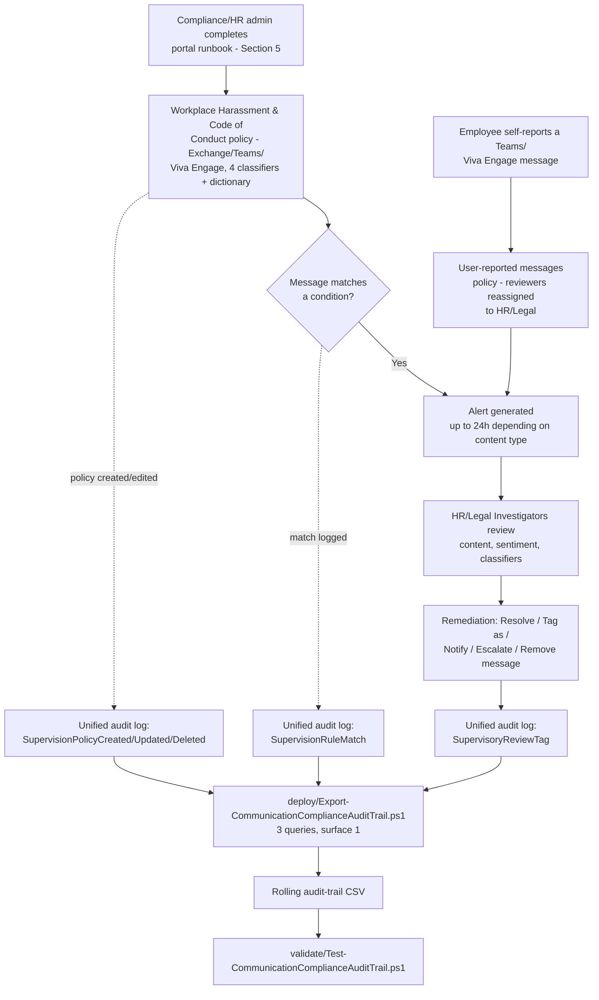

## The short version

> **Scope note (read before implementation):** Microsoft Purview Communication Compliance has **no
> documented PowerShell, Graph, or REST write API** for policy creation or management - Microsoft's
> own docs state this explicitly (why this matters below, the design notes). Sections 5-6 below therefore describe
> a precise **portal runbook** for the policy itself, backed by a structured reference manifest, and
> a genuinely scriptable **audit-trail export** for the one piece of this solution that *is*
> reachable through a documented API. This is the same shape this library already established for
> Compliance Manager (*Assess Against ISO/IEC 27001:2022*) and Insider Risk
> Management policy authoring (*Departing Employee Data Theft*) - not a
> shortcut for this scenario.

Deploys a Microsoft Purview Communication Compliance policy that detects potentially harassing,
discriminatory, threatening, or profane language across Exchange Online email, Microsoft Teams
chat/channel messages, and Viva Engage conversations, routes matches to a role-scoped HR/Legal
review workflow with full message-content access, and layers a scriptable, idempotent audit-trail
export on top for drift detection and retention beyond Communication Compliance's native reporting
window.

## Why this matters

**Title VII of the Civil Rights Act of 1964** (42 U.S.C. § 2000e-2) prohibits harassment based on
race, color, religion, sex, or national origin that is severe or pervasive enough to create a
hostile work environment. Under the Supreme Court's *Faragher v. City of Boca Raton* and
*Burlington Industries v. Ellerth* framework, an employer facing a hostile-work-environment claim
involving a supervisor can raise an affirmative defense only by showing it **exercised reasonable
care to prevent and promptly correct** harassing behavior. Detective monitoring of the channels
where harassment actually happens today - email, Teams, and enterprise social - is direct evidence
of that "reasonable care" element, not just a compliance nicety.

> **VERIFY at deploy time - currency note:** the EEOC's April 2024 sub-regulatory *Enforcement
> Guidance on Harassment in the Workplace* (which explicitly discussed virtual/remote-work
> harassment) was **rescinded by a 2-1 EEOC Commission vote on January 23, 2026**
>. This scenario's regulatory driver rests on the underlying Title VII statute
> and the *Faragher*/*Ellerth* case-law framework above, neither of which depends on that
> sub-regulatory guidance's status - but do not cite the rescinded 2024 guidance itself as current
> authority in a customer-facing compliance narrative. Confirm the EEOC's current sub-regulatory
> guidance position before referencing anything beyond the statute and case law directly.

Two secondary drivers this control also supports:
- **General code-of-conduct enforcement** - profanity and hostile language that doesn't rise to a
  legally protected-characteristic-based harassment claim is still a professionalism and culture
  problem most organizations' own internal conduct policies separately prohibit.
- **Evidentiary readiness** - Communication Compliance's built-in audit trail and this scenario's
  exported history give HR/Legal a documented record of detection and response if a harassment
  claim is ever litigated or investigated by a regulator.

## How the control works

Communication Compliance has no write API, so the policy itself is created and
operated entirely through the Purview portal. The one scripted piece - the audit-trail export -
runs independently on its own schedule, reading (never writing) the unified audit log.

## What it takes

### Prerequisites

Full licensing detail and citations: [Licensing matrix](/docs/licensing-matrix/). Summary for this scenario:

| Requirement | Minimum | Notes |
|---|---|---|
| Communication Compliance license (users in scope) | **Microsoft Purview Suite** (formerly Microsoft 365 E5 Compliance), **Office 365 E5/A5/G5**, **Microsoft 365 E5/A5/G5**, or **Office 365 E3 + the Advanced Compliance add-on** | See [Licensing matrix](/docs/licensing-matrix/)'s Communication Compliance row; confirm current SKU names against the Product Terms before a sales commitment |
| Policy authoring role | **Communication Compliance** or **Communication Compliance Admins** role group | See section 5 - policy authoring is portal-only; these role groups also grant the **Communication Compliance** left-nav item itself |
| Reviewer role (this scenario) | **Communication Compliance Investigators** (full message content) - not Analysts (metadata only) | See the design notes for why Investigators is the deliberate choice for a credible HR investigation. Cross-ref [RBAC model, section 4](/docs/rbac-model/#4-purview-role-groups-by-module-representative-not-exhaustive) |
| Reviewer mailbox | Reviewers must have a mailbox **hosted on Exchange Online** | Required by the policy-creation workflow itself |
| Audit log | Enabled (default for most tenants) | Communication Compliance alerts and remediation history depend on it - confirm via `Search-UnifiedAuditLog` or the audit log search settings before creating the policy |
| Automation identity (audit-trail script only) | App registration or account holding **Exchange.ManageAsApp** plus the **View-Only Audit Logs** (or **Audit Logs**) Exchange Online role | `Search-UnifiedAuditLog` requires an **Exchange Online** RBAC role - a Purview-only role is explicitly documented as insufficient. See [RBAC model, section 6](/docs/rbac-model/#6-exchange-online-dependency-the-most-common-permissions-gap) and [Automation surface, section 3](/docs/automation-surface/#3-authentication-patterns---interactive-vs-unattended) |
| Viva Engage native mode (only if Viva Engage is in scope) | Tenant's Viva Engage network in **Native Mode** | Required for Communication Compliance to check Viva Engage private messages/community conversations |
| Dependency (not deployed by this scenario) | Named HR/Legal stakeholders to populate as reviewers | This scenario does not create or manage user accounts - see `deploy/policy/communication-compliance-policy-manifest.json`'s `reviewers.placeholderMembers` |
| Dependency (not deployed by this scenario) | Employment-counsel review of monitoring-notice/consent obligations, and an updated acceptable-use/monitoring policy communicated to staff | Reading employee message content (the implementation steps, Investigators role) can trigger jurisdiction-specific employee-monitoring notice or consent requirements this scenario's technical grounding cannot determine on the deploying organization's behalf - see the known limitations VERIFY |

> Verify current entitlement names against [Licensing matrix](/docs/licensing-matrix/) (dated 2026-09-02) and the
> Product Terms before a sales commitment - SKU names change.

### Cost and licensing

- **No PAYG component for this scenario.** Communication Compliance's pay-as-you-go billing tier
  applies to detecting risky interactions in **non-Microsoft-365 generative AI applications**
  (third-party AI apps, Microsoft Copilot Studio, Security Copilot) - this scenario's scope
  (Exchange/Teams/Viva Engage) has **no PAYG billing requirement**. Cost is the
  marginal cost of moving any currently-lower-tier users who need harassment/code-of-conduct
  monitoring up to a qualifying E5-tier license or the Advanced Compliance add-on.
- **No additional Azure subscription required.**
- **Sizing note:** given Microsoft's own "include all users" recommendation, this control
  typically pushes toward tenant-wide E5-tier licensing rather than a narrow subset, unlike some of
  this library's other scenarios that can be scoped to a specific team.

## Proof it works

1. **Automated file-integrity check** - `./validate/Test-CommunicationComplianceAuditTrail.ps1
   -AuditTrailCsvPath './out/cc-audit-trail.csv'` confirms the CSV's schema, no duplicate
   composite-key rows, valid Category/Operation values, and sorted timestamps; exits non-zero on
   any hard failure (safe for a CI-style pre-flight).
2. **Manual verification checklist** - the same script prints a checklist (policy exists, correct
   locations/classifiers/reviewers, User-reported messages reviewers reassigned, anonymization and
   notice template configured, storage limit healthy) because none of these have a read API to
   check programmatically.
3. **Functional test (policy match)** - from a test account, send a Teams chat message or email
   containing test profanity-classifier-triggering language (do not use real slurs or threats for
   testing - Microsoft's **Test conditions (preview)** feature on the policy's Conditions page lets
   you test sample text against the configured classifiers before or after policy creation without
   sending a live message). Wait up to 1 hour (text) or 24 hours (attachments),
   then confirm an alert appears in **Communication Compliance** → **Alerts** for an HR/Legal
   Investigator.
4. **Functional test (user-reported message)** - from a test Teams account, use **Report this
   message** on a test chat message. Confirm the reassigned HR/Legal reviewers (not the default
   fallback) see it in the **User-reported messages** policy's alert queue.
5. **Evidence for HR/Legal or an auditor** - the native **Alerts** dashboard and **Reports** page
   are Communication Compliance's primary evidence surfaces; this scenario's audit-trail CSV is a
   **secondary**, complementary artifact proving who could edit the policy, when messages matched,
   and when a reviewer took a remediation action - not a replacement for the native alert record
   itself, which retains the actual message content.
6. **Functional test (audit-trail script)** - in the Purview portal, edit the policy (e.g. toggle
   OCR off then back on). Wait for audit-log ingestion, then re-run the deploy script with a
   `-StartDate` covering that window. Expect: a new row with `Category = PolicyUpdate` and
   `Operation = SupervisionPolicyUpdated`.

## Where it stops

- **This scenario cannot script policy creation, condition tuning, or reviewer assignment.** This
  is not a scoping shortcut - no such API exists as of this writing. Every DLP/
  Information Protection scenario in this library ships a `New-*`/`Set-*` deploy script; this one
  cannot, and says so rather than fabricating one.
- **This is a detective, not a preventive, control.** Unlike *PCI Teams Card-Data Exfiltration Block*,
  this scenario cannot block a harassing message before delivery - the recipient(s) already saw it
  before a reviewer ever triages the alert. Pair with clear internal reporting channels and manager
  training as complementary, non-technical controls.
- **Classifier naming inconsistency across Microsoft's own docs (re-grounded 2026-09-28, still
  open).** A fresh Microsoft Learn direct-fetch narrows but doesn't close this gap. As of this
  re-check, **"Harassment"** is used by both the dedicated classifier-definitions page
  (`trainable-classifiers-definitions#harassment`, including its own word-count-requirements table)
  **and** the `communication-compliance-policies#policy-settings` "Policy settings" table - the
  latter previously cited (in this note) as using "Targeted harassment"; it no longer does, so
  Microsoft appears to have partly unified the naming since this note was first written. **"Targeted
  harassment"/"Targeted Harassment"** still appears elsewhere on current pages: the Get-started
  policy-creation workflow steps (`communication-compliance-configure`, Step 5), the solution
  overview's template list (`communication-compliance-solution-overview`), and the condition-builder
  worked examples (`communication-compliance-conditions-scenarios`). This scenario continues to
  standardize on "Harassment" per the classifier-definitions page (now corroborated by the policy
  settings reference table too), but the **live portal UI label a tenant admin actually sees when
  building the policy** remains unconfirmed without a tenant - **VERIFY** (portal, at deploy time)
  still stands for that specific point.
- **Off-platform harassment is invisible to this control.** Communication Compliance only sees
  Microsoft 365-native and configured third-party-connector channels - personal phones, SMS,
  personal social media, and in-person conduct are entirely outside its visibility. This control is
  one input to an HR program, not the program itself.
- **Teams meetings (audio/video) are not covered unless transcription is used.** Communication
  Compliance analyzes **text** - a harassing comment made verbally in a Teams meeting is only
  detectable if the meeting was transcribed and Teams is selected as an in-scope location; a
  non-transcribed voice/video meeting is entirely outside this control's visibility, distinct from
  (and narrower than) the general "off-platform" gap above.
- **Treat the exact custom keyword dictionary contents as sensitive, not public.** This repo ships
  `deploy/policy/code-of-conduct-evasion-phrases.txt` openly for transparency and reference, but a
  real tenant's deployed dictionary - especially once extended with organization-specific terms -
  should not be broadly published internally or externally: publishing the exact phrase list a
  monitoring control looks for materially helps a bad-faith actor evade it, undermining the
  keyword-dictionary condition's entire purpose.
- **Trainable classifiers have a minimum word-count requirement** that varies by content language
  - a very short, one- or two-word harassing Teams message may not trigger a
  classifier match. The custom keyword dictionary partially mitigates this for known phrases
  but cannot cover every short-form case.
- **"Limited support for evasive typing"** is Microsoft's own documented limitation - letter/number
  substitution and similar adversarial-input evasion has "basic" coverage today, with improvements
  documented as an ongoing roadmap item, not a solved problem.
- **Storage-limit auto-deactivation is a silent failure mode.** A policy that reaches its 100
  GB / 1,000,000-message limit stops generating alerts entirely, with notification emails going
  only to the Communication Compliance/Communication Compliance Admins role groups - a policy could
  be dark for weeks before anyone outside that group notices no alerts have arrived. Monitor this
  actively, don't assume "no alerts" means "no problems."
- **Detection latency is not real-time.** Email/Teams/Viva Engage body content: up to 1 hour;
  attachments and OCR: up to 24 hours; policies created before July 31, 2022 (not applicable to a
  new deployment, but relevant if inheriting an existing tenant's older policy): up to 24 hours for
  everything.
- **VERIFY (jurisdiction-specific, outside this build's grounding scope):** many jurisdictions have
  employee-monitoring notice or consent requirements that may apply to reviewing message content
  under this scenario's Investigator-role design. Confirm applicable notice/consent obligations
  with employment counsel for every jurisdiction the in-scope user population spans before go-live
  - this is a legal determination this scenario's technical grounding cannot make on the deploying organization's
  behalf.
- **EEOC guidance currency:** confirm the current status of federal and any applicable state
  harassment sub-regulatory guidance before finalizing a customer-facing regulatory-driver
  narrative - this area moved materially between this scenario's grounding pass and its publication
  (the 2024 EEOC guidance's January 2026 rescission) and can move again.