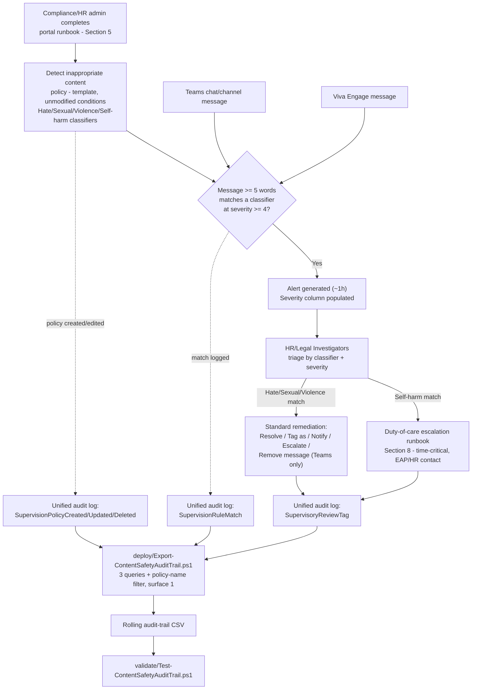

## The short version

> **Scope note (read before implementation):** Microsoft Purview Communication Compliance has **no
> documented PowerShell, Graph, or REST write API** for policy creation or management, including
> policies created from a built-in template - Microsoft's own docs state this explicitly (why this matters below,
> the design notes). Section 5 below therefore describes a precise **portal runbook** for the policy
> itself, backed by a structured reference manifest, and a genuinely scriptable **audit-trail
> export** for the one piece of this solution that *is* reachable through a documented API. Same
> shape this library already established for *Communication Compliance*
> harassment-and-code-of-conduct/` and *Communication Compliance*
> copilot-interaction-detection/` - not a shortcut for this scenario.

Deploys Microsoft Purview Communication Compliance's built-in **Detect inappropriate content**
policy template, which applies four **Azure AI Content Safety large-language-model classifiers -
Hate, Sexual, Violence, Self-harm - Microsoft's severity-ranked (preview) detection layer, distinct
from the pattern-based trainable classifiers this library's *Workplace Harassment & Code of Conduct* scenario
already uses**, to Microsoft Teams and Viva Engage communications, and layers a scriptable,
idempotent audit-trail export plus a deliberate duty-of-care escalation runbook for Self-harm
matches on top.

## Why this matters

**Workplace violence prevention and duty of care.** Employers in most jurisdictions carry a
statutory or common-law duty of care for employee health and safety at work - in the US, OSHA's
General Duty Clause; in the EU, the Framework Directive 89/391/EEC's employer duty-of-care
obligations; in the UK, the Health and Safety at Work etc. Act 1974. A messaging-borne threat of
violence (this scenario's **Violence** classifier) is squarely inside that obligation's scope, and
overlaps - deliberately, see the architecture below - with *Workplace Harassment & Code of Conduct*'s own **Threat**
trainable classifier as a second, differently-built detection layer for the same underlying risk.

**Psychological safety / self-harm duty of care - the driver this scenario exists primarily to
serve.** No other scenario in this library detects employee self-harm risk signals in workplace
messaging. A message expressing suicidal ideation or self-harm intent, sent over Teams or Viva
Engage, is simultaneously the single highest-stakes and most time-sensitive signal a workplace
monitoring control can surface - a documented, ignored, or slowly-triaged self-harm signal is a
materially worse legal and human position than not having deployed detection at all (operations and tuning develops
this as a gating operational requirement, not an optional nicety).

**This scenario is a detection-and-escalation aid, not a wellbeing program, and should not be
represented as one.** Deploying this policy and then treating "we have self-harm detection" as
evidence the organization has addressed employee mental-health risk would be a compliance-theater
framing this scenario's own docs reject (the known limitations restates this as a standing limitation, not a one-time
caveat) - a preview classifier with disclosed word-count and language-coverage gaps will miss
real signals, and this control's value is entirely contingent on the duty-of-care runbook
actually being followed every time an alert does fire.

> **VERIFY (jurisdiction-specific, outside this build's grounding scope):** the exact scope of an
> employer's duty-of-care obligation for employee mental-health/self-harm risk signals surfaced by a
> messaging-monitoring tool varies by jurisdiction and is actively developing case law and
> regulation in several markets (e.g., psychosocial-hazard frameworks referenced in Australian
> work-health-and-safety guidance, ISO 45003 psychological-health-and-safety-at-work guidance).
> Confirm applicable obligations with employment counsel before citing this scenario as satisfying a
> specific legal requirement - the same caution *Workplace Harassment & Code of Conduct* (the known limitations)
> already applies to its own EEOC-guidance currency risk, and `copilot-interaction-detection/
> why this matters applies to AI-governance regulatory citations.

**Regulatory-compliance and business-conduct evidence.** Same general Communication Compliance
framing already established by this library's sibling scenarios: "detect regulatory compliance ... and
business conduct violations such as sensitive or confidential information, harassing or threatening
language, and sharing of adult content" - this scenario is the severity-ranked,
Teams/Viva-Engage-specific instance of that framing.

## How the control works

Communication Compliance has no write API, so the policy itself is created and
operated entirely through the Purview portal. The one scripted piece - the audit-trail export -
runs independently on its own schedule, reading (never writing) the unified audit log. The
Self-harm-escalation split shown above (**F1** vs. **F2**) is a *process* control this scenario's
runbook imposes on top of Communication Compliance's standard investigator workflow - the
product itself has no classifier-specific routing capability.

## What it takes

### Prerequisites

Full licensing detail and citations: [Licensing matrix](/docs/licensing-matrix/) (Communication Compliance row).
Summary for this scenario:

| Requirement | Minimum | Notes |
|---|---|---|
| Communication Compliance license (reviewed users) | **Microsoft Purview Suite** (formerly Microsoft 365 E5 Compliance), **Office 365 E5/A5/G5**, **Microsoft 365 E5/A5/G5**, or **Office 365 E3 + the Advanced Compliance add-on** | [Licensing matrix](/docs/licensing-matrix/); confirm current SKU names against the Product Terms before a sales commitment |
| Policy authoring role | **Communication Compliance** or **Communication Compliance Admins** role group | Policy authoring from a template is portal-only - see the implementation steps |
| Reviewer role (this scenario) | **Communication Compliance Investigators** (full message content) - not Analysts (metadata only) | See the design notes. Cross-ref [RBAC model, section 4](/docs/rbac-model/#4-purview-role-groups-by-module-representative-not-exhaustive) |
| Reviewer mailbox | Reviewers must have a mailbox **hosted on Exchange Online** | Required by the policy-creation workflow itself, same as every other Communication Compliance policy |
| Duty-of-care escalation contact (this scenario's own dependency, not deployed by it) | A named Employee Assistance Program (EAP) / HR duty-of-care contact, reachable outside normal Communication Compliance reviewer rotation - confirm after-hours/weekend coverage explicitly, not just a weekday business-hours contact | Communication Compliance has no classifier-specific auto-routing capability - this is a *process* prerequisite this scenario's runbook depends on, not a technical one; see operations and tuning for why business-hours-only coverage is a disclosed, material gap |
| Audit log | Enabled (default for most tenants) | Communication Compliance alerts and remediation history depend on it |
| PAYG billing | **Not documented as required** for this scenario's scope (Teams, Viva Engage) | Distinct from the Enterprise AI apps/Other AI apps generative-AI locations, which do carry a PAYG requirement (*Microsoft 365 Copilot Interaction Detection* (the prerequisites)) - no PAYG statement was found specific to the content-safety classifier family on Teams/Viva Engage in this build's grounding pass; confirm against the Product Terms before a sales commitment rather than treating this as a guarantee |
| Automation identity (audit-trail script only) | App registration or account holding **Exchange.ManageAsApp** plus the **View-Only Audit Logs** (or **Audit Logs**) Exchange Online role | `Search-UnifiedAuditLog` requires an **Exchange Online** RBAC role. See [RBAC model, section 6](/docs/rbac-model/#6-exchange-online-dependency-the-most-common-permissions-gap) and [Automation surface, section 3](/docs/automation-surface/#3-authentication-patterns---interactive-vs-unattended) |

> Verify current entitlement names against [Licensing matrix](/docs/licensing-matrix/) and the Product Terms before a
> sales commitment - SKU names change.

### Cost and licensing

- **No PAYG component documented for this scenario's scope.** Teams and Viva Engage are core
  Microsoft 365 workloads, distinct from the PAYG-gated Enterprise AI apps/Other AI apps generative-AI
  locations (*Microsoft 365 Copilot Interaction Detection* (the cost and licensing notes)) - no PAYG requirement was found specific
  to the content-safety classifier family on these locations during this build's grounding pass;
  confirm against the Product Terms before a sales commitment.
- **No additional Azure subscription required.** These classifiers run as part of the Communication
  Compliance service, not a separately-billed Azure AI Content Safety resource the deploying organization provisions
  directly.
- **Sizing note:** given this scenario's "all users" default, cost is primarily the
  Communication Compliance E5-tier entitlement itself - typically already satisfied by a tenant
  running *Workplace Harassment & Code of Conduct* or *Microsoft 365 Copilot Interaction Detection* in this library. The
  incremental cost of deploying this scenario alongside either sibling is the operational cost of
  reviewer workload and the duty-of-care escalation process, not incremental licensing.

## Proof it works

1. **Automated file-integrity check** - `./validate/Test-ContentSafetyAuditTrail.ps1
   -AuditTrailCsvPath './out/content-safety-audit-trail.csv'` confirms the CSV's schema, no
   duplicate composite-key rows, valid Category/Operation/ContentSafetyContext values, and sorted
   timestamps; exits non-zero on any hard failure (safe for a CI-style pre-flight).
2. **Manual verification checklist** - the same script prints a checklist (policy exists, correct
   template/location/conditions/reviewers, anonymization configured, storage limit healthy, **and the
   duty-of-care escalation contact is confirmed staffed** - operations and tuning) because none of these have a read API
   to check programmatically.
3. **Functional test (non-crisis-simulating, benign example)** - from a test account, send a Teams
   chat message using clearly non-harmful test language that nonetheless matches one of the four
   classifiers' general subject area (e.g., a message discussing a fictional/gaming scenario
   involving violence, which Microsoft's own severity-level documentation describes as typically
   scoring Low, not necessarily triggering the severity-4 alert threshold) -
   **do not send a real or simulated self-harm-intent message as a test, under any circumstances**
   (the known limitations gating warning). Confirm the intended detection behavior against the documented severity
   threshold rather than assuming any borderline test message will or won't alert.
4. **Functional test (audit-trail script)** - in the Purview portal, edit the policy (e.g. add a
   reviewer). Wait for audit-log ingestion, then re-run the deploy script with a `-StartDate`
   covering that window. Expect: a new row with `Category = PolicyUpdate` and
   `Operation = SupervisionPolicyUpdated`.
5. **Duty-of-care runbook drill (recommended, not a technical test)** - before go-live, run a
   tabletop exercise with the reviewer team and the EAP/HR escalation contact confirming each knows
   their role if a genuine Self-harm-classifier alert arrives - this is the single most important
   "does it work" question for this scenario, and it has no automated check.
6. **Evidence for an audit committee or compliance review** - the native **Alerts** dashboard
   (including its **Severity** column, unique to this classifier family among this library's
   Communication Compliance scenarios) is the primary evidence surface; this scenario's audit-trail
   CSV is a **secondary**, complementary artifact proving who could edit the policy and when a
   reviewer took a remediation action - not a replacement for the native alert record itself, which
   retains the actual message text.

## Where it stops

- **This scenario cannot script policy creation, condition tuning, or reviewer assignment.** Same
  documented gap as both sibling scenarios - no such API exists as of this writing.
- **Genuine, disclosed source inconsistency in Microsoft's own documentation: the minimum message
  length these classifiers evaluate is stated as "three or more words" in one section of
  `communication-compliance-policies` and "five or more words" in a different section of the
  *same* live page**. This build's grounding pass confirmed both figures appear
  verbatim on the current page - not a stale-cache artifact from comparing two different page
  versions. This scenario does not silently pick one; **VERIFY the actual behavior against a test
  message in the tenant at deploy time** rather than relying on either published figure.
- **Preview status.** These are explicitly "content safety classifiers (preview)" - subject to
  change, and evaluated as a materially newer, less broadly production-hardened capability than the
  trainable-classifier family *Workplace Harassment & Code of Conduct* uses.
- **Narrower workload coverage than *Workplace Harassment & Code of Conduct*.** Exchange is not a supported
  location for this classifier family - only Microsoft 365 Copilot, Teams, and Viva Engage. A threatening or self-harm-risk message sent by email is invisible to this
  specific policy; *Workplace Harassment & Code of Conduct*'s Exchange-inclusive trainable classifiers remain
  the only coverage for that channel in this library.
- **No coverage for OCR images, attachments, or Teams meeting transcripts.** - a
  materially narrower content surface than the trainable-classifier family, which does support OCR.
  A self-harm or violent-threat image, or a spoken threat in a Teams meeting, is not detected by this
  policy.
- **No feedback loop to Microsoft yet** - unlike the trainable classifiers.
- **Language support is not confirmed to match Purview's general "12 languages" claim for
  Communication Compliance overall.** The underlying Azure AI Content Safety text models are
  documented as "specially trained and tested" on eight languages (Chinese, English, French, German,
  Spanish, Italian, Japanese, Portuguese), with broader but lower-quality support in "many other
  languages" - this scenario does not assert a specific supported-language count
  for the Purview-configured classifiers specifically, since no worked example in this build's
  grounding pass confirmed whether Purview's general Communication Compliance language-support claim
  applies identically to this preview classifier family. **VERIFY** actual non-English detection
  behavior in the tenant before relying on it for a non-English-majority workforce.
- **No Communication Compliance product capability routes a Self-harm match differently from a
  Hate/Sexual/Violence match.** The duty-of-care escalation split this scenario's runbook
  depends on is entirely a **process control this scenario's own docs establish** - it does not
  exist as a technical safeguard inside Communication Compliance itself, and depends entirely on
  reviewers correctly following the runbook every time. A reviewer team that has not internalized operations and tuning
  will not be technically prevented from mishandling a Self-harm alert.
- **This is a detective, not a preventive, control** - same as both sibling scenarios. By the time an
  Investigator (or the duty-of-care contact) sees a Self-harm alert, the message has already been
  sent; this policy does not intervene in real time. Pair with the organization's existing crisis
  hotline/EAP promotion as the actual preventive/supportive layer - this scenario is a detection and
  escalation aid, not a substitute for one.
- **Storage-limit auto-deactivation is a silent failure mode** - identical risk to both sibling
  scenarios, with a materially worse consequence given this scenario's Self-harm coverage; monitor
  actively.
- **VERIFY:** the exact shape of the `AuditData` JSON payload for a `SupervisionRuleMatch` event
  specific to this four-classifier pairing was not independently confirmed against a worked example
  in this build's grounding pass (same disclosed gap pattern as `copilot-interaction-detection/
  the known limitations). `deploy/Export-ContentSafetyAuditTrail.ps1`'s best-effort `ContentSafetyContext`
  and `SeverityHint` derived columns are deliberately non-blocking - a parse miss never fails or
  drops a row - but should not be treated as fully confirmed until validated against a real tenant's
  actual audit-log output.
- **Do not use a real or simulated self-harm-intent message to functionally test this policy**, even
  from a test account - the validation steps documents a safer validation approach. Testing a detection control for a
  crisis signal is not the same as testing a spam filter; treat any message that could be construed
  as expressing self-harm intent with the same seriousness as a genuine one, regardless of sender
  context.
- **VERIFY (jurisdiction-specific):** see section 2 - confirm applicable duty-of-care obligations with
  employment counsel before citing this scenario as satisfying a specific legal requirement.