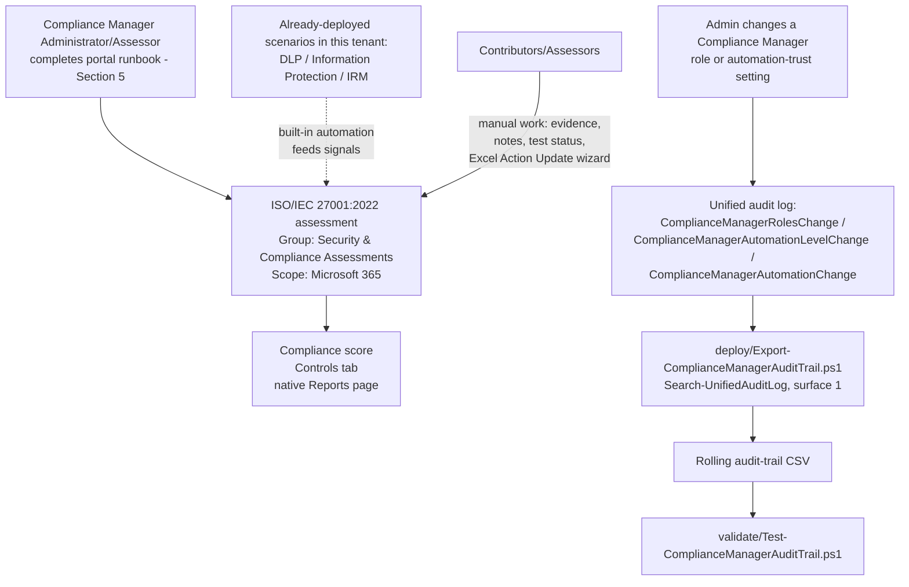

## The short version

Stands up a dedicated **Microsoft Purview Compliance Manager** assessment against the
**ISO/IEC 27001:2022** premium regulatory template, gives it a deliberate grouping and role
structure, and layers one genuinely scriptable piece of monitoring on top: a rolling export of the
only Compliance-Manager-specific events Microsoft's audit log documents (role changes and
automated-testing trust changes). Because Compliance Manager itself has no write API, most of this
scenario is a precise, repeatable **portal runbook** rather than a script - see section 5 and the design notes for why that is the correct, current-best-practice shape for this scenario, not a shortcut.

## Why this matters

**ISO/IEC 27001:2022** is the current edition of the internationally recognized standard for an
Information Security Management System (ISMS), and the one this scenario targets: the industry-wide
IAF-mandated transition window closed October 31, 2025 - every ISO/IEC 27001:2013 certificate had
to expire or be reissued against :2022 by that date, and certification bodies stopped conducting
initial/recertification audits against :2013 after April 30, 2024. Compliance
Manager's template catalog still lists :2013 alongside :2022, but :2013 is not the
correct choice for a new assessment as of this build - see the design notesb for the full grounding
behind this scenario's switch from an earlier draft that recommended :2013. An organization
pursuing certification, renewing an existing certificate, or answering a customer/partner security
questionnaire that asks "are you ISO 27001 certified / aligned?" needs a control-by-control,
evidenced answer - not a narrative claim. Compliance Manager's ISO/IEC 27001:2022 premium template
exists specifically to produce that evidence for the Microsoft 365 portion of the estate: a scored
assessment, per-control status, and an exportable report an internal auditor or external
QSA-equivalent assessor can review.

This is a governance/evidence control, not a technical control - it does not itself reduce risk
the way a DLP policy or a sensitivity label does. Its value is making the technical controls this
library already ships (and any others the tenant has) **legible against a named standard**, which
is what a certification body, a customer questionnaire, or a board audit committee actually asks
for.

## How the control works

Compliance Manager has no write API, so the assessment itself is created and
operated entirely through the Purview portal. The one scripted piece - the audit-trail export -
runs independently on its own schedule, reading (never writing) the unified audit log.

## What it takes

### Prerequisites

Full licensing detail and citations: [Licensing matrix](/docs/licensing-matrix/). Summary for this scenario:

| Requirement | Minimum | Notes |
|---|---|---|
| Compliance Manager base access | **Office 365 / Microsoft 365** license (any tier) | Compliance Manager itself is available at all subscription levels; only premium regulatory templates require more |
| ISO/IEC 27001:2022 premium template | **A5/E5/G5** (3 free premium templates of choice, post-Dec-2022 licensing change) **or** the purchased **Compliance Manager premium assessment add-on**, **or** a **90-day premium assessments trial** (25 templates) | ISO 27001 was an *included* template before the December 2022 licensing change; it now counts against the free-3 allotment like any other premium template - do not assume a pre-2022 deployment guide's licensing claim still holds. **VERIFY:** whether :2013 and :2022 (listed as two separate catalog entries, the known limitations) consume one shared license slot as a "regulation family" (the way Microsoft documents for CMMC's five levels) or two independent slots - not stated either way in the regulations-list/licensing references this scenario cites |
| Role to create/administer the assessment | **Compliance Manager Administration** (or **Compliance Manager Assessor** to create; **Global Administrator** also works) | See §"Create assessments" role requirement, and [RBAC model, section 4](/docs/rbac-model/#4-purview-role-groups-by-module-representative-not-exhaustive) for the Purview role-group mapping |
| Role to edit/test without creating | **Compliance Manager Contribution** (create + edit) or **Compliance Manager Assessor** (edit only, no create) | Assign the narrowest role per person - see `deploy/policy/iso27001-assessment-manifest.json` |
| Role for read-only visibility | **Compliance Manager Reader** | Entra mapping: Global Reader / Security Reader also grants read access |
| Automation identity (audit-trail script only) | App registration or account holding the **View-Only Audit Logs** (or **Audit Logs**) Exchange Online role, in addition to `Exchange.ManageAsApp` | `Search-UnifiedAuditLog` requires an **Exchange Online** RBAC role - a Purview-only role (even Compliance Administrator) is explicitly documented as insufficient. See [RBAC model, section 6](/docs/rbac-model/#6-exchange-online-dependency-the-most-common-permissions-gap) and [Automation surface, section 3](/docs/automation-surface/#3-authentication-patterns---interactive-vs-unattended) |
| Dependency (not deployed by this scenario) | Nothing hard-required, but strongly recommended: this library's *DLP*, *Information Protection*, and *Insider Risk Management* scenarios already deployed | Reduces the manual-testing backlog via Compliance Manager's built-in automation - see the design notes and the `recommendedDeploymentOrder` in the manifest |

> Verify current entitlement names against [Licensing matrix](/docs/licensing-matrix/) (dated 2026-09-02) and the
> Product Terms before a sales commitment - SKU names and the premium-template licensing model
> have changed before (the December 2022 change cited above) and can change again.

### Cost and licensing

- **Premium-template licensing, not PAYG.** ISO/IEC 27001:2022 is a premium regulatory template -
  cost is either 1 of the tenant's 3 free A5/E5/G5 premium-template slots, a purchased **Compliance
  Manager premium assessment add-on**, or a time-boxed free trial. There is no Azure
  consumption/PAYG component for Compliance Manager itself.
- **No additional cost for the audit-trail script** beyond the Exchange Online role assignment -
  `Search-UnifiedAuditLog` is included in Audit (Standard), itself included at no extra cost for
  most Microsoft 365 organizations.
- **Sizing note:** the premium-template allotment is per-regulation, not per-assessment - creating
  multiple ISO 27001 assessments (e.g. one per subsidiary) from the same template consumes only one
  slot. Plan the grouping strategy with this in mind before
  creating more assessments than the org actually needs.

## Proof it works

1. **Automated file-integrity check** - `./validate/Test-ComplianceManagerAuditTrail.ps1
   -AuditTrailCsvPath './out/compliance-manager-audit-trail.csv'` confirms the CSV's schema, no
   duplicate composite-key rows, valid Operation values, and sorted timestamps; exits non-zero on
   any hard failure (safe for a CI-style pre-flight).
2. **Manual verification checklist** - the same script prints a checklist (assessment exists,
   correct regulation/group/services, role assignments match the manifest, at least some
   improvement actions show automation-sourced status) because none of these have a read API to
   check programmatically.
3. **Functional test (audit-trail script)** - in the Purview portal, change a test user's
   Compliance Manager role (e.g. grant then immediately revoke Reader access on the assessment).
   Wait ~60 minutes for audit-log ingestion, then re-run the deploy script with a `-StartDate`
   covering that window. Expect: a new row with `Operation = ComplianceManagerRolesChange` and the
   test user in `UserIds`.
4. **Evidence for an internal or external auditor** - the assessment's own **Export actions**
   report is the primary evidence artifact Compliance Manager is built to produce; this scenario's audit-trail CSV is a **secondary**, complementary artifact
   proving who could edit the assessment and whether its automated-testing trust boundary was
   altered during the audit period - not a replacement for the native export.

## Where it stops

- **This scenario cannot script assessment creation, control mapping, or improvement-action
  updates.** This is not a scoping shortcut - no such API exists as of this writing. Every other module in this library ships a `New-*`/`Set-*` deploy script; this one cannot,
  and says so rather than fabricating one.
- **The audit-trail script does not track compliance score or improvement-action status changes**
  - only the 3 documented Compliance-Manager-specific audit operations (role changes, automation-trust changes). Score/status history is the native **Reports** page's job (up to 6 months of
  history), not this script's architecture.
- **The audit-trail script cannot see Compliance Manager access granted implicitly via an Entra
  ID role.** Global Administrator, Compliance Administrator, Compliance Data Administrator, and
  Security Administrator all grant Administration-equivalent Compliance Manager access without an
  explicit per-assessment role assignment - and Microsoft's own docs confirm users who have access
  this way don't even appear on the **User access** settings page. Their access
  is an Entra directory role assignment, not a `ComplianceManagerRolesChange` event, so this
  scenario's audit-trail script has no visibility into who holds it or when it changed. This gap
  is now closed by a companion scenario:
  *Entra Privileged Role Monitoring* scripts exactly this
  cross-check via Entra's own directory audit log (Microsoft Graph, `Get-MgAuditLogDirectoryAudit`)
  - deploy it alongside this scenario rather than relying on the quarterly manual check this
  limitation used to describe as the only mitigation. See [RBAC model, section 3](/docs/rbac-model/#3-microsoft-entra-roles-that-map-into-purview) for the
  underlying four-role mapping.
- **The Reports page's own score/action-history is not preserved by this scenario beyond its
  native retention.** The native Reports page's detailed history view covers up to 6 months
 but this scenario doesn't export or archive it - a change older than 6 months is gone
  from Compliance Manager itself, not just from this scenario's tooling. Run **Export actions**
 on a periodic (e.g. quarterly) cadence and retain the output outside Compliance
  Manager if a longer durable evidence trail is required for certification purposes.
- **VERIFY:** whether assessment creation/deletion and improvement-action status changes are
  separately audit-logged under an operation name not listed in Microsoft's public
  `audit-log-activities` reference (e.g. logged but undocumented, or logged under a more generic
  operation this scenario's `-Operations` filter would miss). This scenario's audit-trail script
  deliberately filters only the 3 documented operations rather than guessing at additional ones -
  confirm against a pilot tenant (generate a test assessment, then search the full unfiltered audit
  log for the time window) before asserting to a customer/auditor that this script's silence on
  assessment-lifecycle events proves nothing happened.
- **Audit (Standard) default retention is 180 days** (1 year for Entra ID/Exchange/OneDrive/
  SharePoint under an E5-tier license; up to 10 years with Audit Premium retention policies). An organization needing a longer evidentiary window than the audit-trail CSV's own
  accumulated history covers must either run the export on a schedule from day one, or purchase
  Audit (Premium) with a custom retention policy.
- **The "Action Update" Excel bulk-import file's exact column schema is not scripted here.** See
  the design notes (Non-goals) for why fabricating it would violate this library's standards - this is a
  tracked follow-up in the project backlog once a real exported file can be inspected.
- **Compliance Manager's Regulations page lists both ISO/IEC 27001:2013 and ISO/IEC 27001:2022 as
  separate premium templates** (confirmed by direct fetch of `compliance-manager-regulations-list`,
  2026-09-10) - do not select :2013 by mistake when following the implementation steps step 4; they are two distinct,
  independently-licensed catalog entries, not one template with a version dropdown. This scenario
  originally recommended :2013 (its first Microsoft Learn grounding pass only surfaced :2013
  documentation) and was corrected to :2022 once the industry-wide certification transition
  deadline (October 31, 2025 - the design notesb) made :2013 the wrong default for a new assessment.
  A tenant with a pre-existing :2013 assessment from an earlier deployment of this scenario is not
  automatically upgraded - see the design notesb for the recommended migration path (Compliance
  Manager documents no assessment-to-assessment copy/upgrade action).
- **No dedicated Microsoft Learn page under `/compliance/regulatory/` is branded for the :2022
  Compliance-Manager template specifically**, unlike :2013's own
  `compliance/regulatory/offering-iso-27001` page. The only ":2022"-titled Learn page found during
  this grounding pass (`azure/compliance/offerings/offering-iso-27001`) documents Azure's own
  ISO/IEC 27001:2022 certification, not the customer-facing Compliance Manager premium template -
  this scenario cites `compliance-manager-regulations-list` for the template's existence instead of
  reusing the :2013 page's URL as if it also covered :2022. See the design notesb.
- **VERIFY:** whether the :2013 and :2022 templates consume one shared premium-license slot as a
  "regulation family" (the documented behavior for CMMC's five levels) or two independent slots -
  not stated either way in the sources this scenario cites. Relevant only to a tenant that
  deliberately keeps both templates active (e.g. during a :2013→:2022 assessment migration); see the prerequisites.
- **This scenario doesn't verify Microsoft's per-control improvement-action mapping.** the design notes explains why that specific claim can't be grounded from public docs - treat the "deploy
  DLP/IP/IRM scenarios first" recommendation as directionally correct, not as a guarantee of any
  specific score uplift.
- **A high compliance score is not proof of certification-readiness.** Microsoft's own FAQ states
  this explicitly: the score measures progress on recommended actions, not an absolute compliance
  guarantee - do not let this scenario's tooling imply otherwise to a board or
  customer.