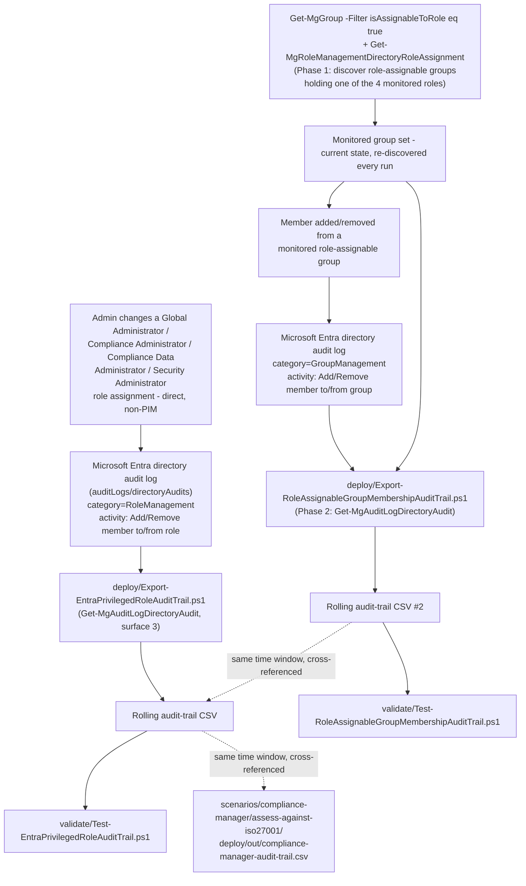

## The short version

Closes a specific, disclosed blind spot in *Assess Against ISO/IEC 27001:2022*:
its audit-trail script can only see an **explicit** Compliance Manager role grant, not the
**implicit** Compliance Manager Administration-equivalent access that **Global Administrator**,
**Compliance Administrator**, **Compliance Data Administrator**, and **Security Administrator**
Entra ID roles carry automatically. This scenario ships a rolling, idempotent export of direct
(non-PIM) assignment/removal events for those four roles, read from Microsoft Entra ID's own
directory audit log via Microsoft Graph - a separate system from the Microsoft 365 unified audit
log every other audit-trail script in this library reads.

This scenario ships **two** scripts. `Export-EntraPrivilegedRoleAuditTrail.ps1` covers **direct**
role assignment/removal for the four roles. `Export-RoleAssignableGroupMembershipAuditTrail.ps1`
closes a gap the first script's own Red Team review disclosed (the review notes round 1, finding 1):
one of the four roles assigned to an Entra ID P1/P2 **role-assignable group** instead of directly to
a user generates a completely different, invisible-to-the-first-script audit event when someone is
added to or removed from that group. The second script discovers which role-assignable groups
currently hold one of the four roles, then monitors exactly those groups' own membership - see the architecture and the implementation steps
below and the design notes.

## Why this matters

Least-privilege and separation-of-duties controls (ISO/IEC 27001:2022 Annex A access-control
requirements - consolidated under the Organizational Controls theme, A.5, in the 2022 revision's
93-control structure, not the 2013 edition's separate 14-domain "A.9 Access Control" clause - plus
SOC 2 CC6 and equivalent frameworks) require an organization to know **who can access or modify a
control's evidence**, not just who the control's own tooling reports as having access. Compliance
Manager's own **User access** settings page - the surface *Assess Against ISO/IEC 27001:2022* (the implementation steps)
step 8 uses to assign roles - provably does not list users who hold Compliance Manager access
implicitly through one of the four Entra roles above. An auditor asking "who
could have altered this assessment's evidence during the audit period" deserves a complete answer,
not one scoped to only the access grants Compliance Manager's own UI happens to surface. This
scenario produces that complete answer for the one population Compliance Manager's UI misses.

## How the control works

This scenario ships two standalone, read-only scripts - there is no assessment or policy object to
create in the portal for either. See the design notes for why this scenario uses a different Graph API
from every other audit-trail script in this library, and the design notes for the second script's own
two-phase (discover, then monitor) design.

## What it takes

### Prerequisites

Full licensing detail and citations: [Licensing matrix](/docs/licensing-matrix/). Summary for this scenario:

| Requirement | Minimum | Notes |
|---|---|---|
| Reading the Entra directory audit log itself | **No premium license required** | Available at every Entra ID tier, including Free - only the **retention window** differs by tier |
| Automation identity's Graph application permission | **`AuditLog.Read.All`** (least-privileged; `Directory.Read.All` also works but is broader) | Application permission on the app registration, admin-consented tenant-wide - see [RBAC model, section 8](/docs/rbac-model/#8-powershell--graph-automation---connecting-with-the-right-role) and [Automation surface, section 3](/docs/automation-surface/#3-authentication-patterns---interactive-vs-unattended) |
| Additional permissions for `Export-RoleAssignableGroupMembershipAuditTrail.ps1` only | **`Group.Read.All`** and **`RoleManagement.Read.Directory`** | Needed for Phase 1 discovery (listing role-assignable groups and their current role assignments) - not needed by `Export-EntraPrivilegedRoleAuditTrail.ps1`, which only reads the audit log. `Group.Read.All` is directly listed on the `Get-MgGroup` cmdlet's own Application-permissions table (the cmdlet this script actually calls); `RoleManagement.Read.Directory` is the least-privileged application permission documented for `Get-MgRoleManagementDirectoryRoleAssignment`/`Get-MgRoleManagementDirectoryRoleDefinition` |
| Automation identity's Entra role (delegated/interactive use only) | **Reports Reader**, **Security Reader**, or **Security Administrator** | Only required for **delegated** (signed-in user) calls to this API; **not** required for the app-only pattern this scenario's script defaults to - Microsoft's own permissions table lists this role requirement specifically under "delegated access using work or school accounts" |
| Longer retention (optional) | **Microsoft Entra ID P1/P2** (30 days) or **Microsoft Purview Audit (Premium)** (1 year, `AzureActiveDirectory` workload, via the E5/Purview Suite/E5 eDiscovery-and-Audit-add-on license already covering *Assess Against ISO/IEC 27001:2022*) | Neither is required to *run* this scenario - only to extend the underlying log's own retention beyond Free tier's 7 days |
| Dependency (not deployed by this scenario) | *Assess Against ISO/IEC 27001:2022* strongly recommended, not required | This scenario closes a specific gap that scenario's own Red Team review disclosed - see the design notes. The script itself has no hard dependency and is useful standalone for any module relying on [RBAC model, section 3](/docs/rbac-model/#3-microsoft-entra-roles-that-map-into-purview)'s four-role mapping |

> Verify current entitlement names and retention figures against [Licensing matrix](/docs/licensing-matrix/) and
> the cited Microsoft Learn pages before a sales commitment - Entra ID's audit-log retention model
> is tied to licensing tier and has changed before.

### Cost and licensing

- **No incremental license cost for the core capability.** Reading the Entra directory audit log
  via Graph requires only the `AuditLog.Read.All` application permission - available at every
  Entra ID tier, including Free.
- **The only cost lever is retention, and it's optional.** A tenant already licensed for
  *Assess Against ISO/IEC 27001:2022* (A5/E5/G5 or the Compliance Manager premium add-on) very likely already
  holds the Microsoft 365 E5/Purview Suite/E5 eDiscovery-and-Audit-add-on tier that also grants
  Purview Audit (Premium)'s 1-year `AzureActiveDirectory`-workload retention -
  meaning most organizations of the sibling scenario get this scenario's extended-retention option "for
  free" on licensing they already carry. An organization without that tier still gets full value from this
  script by simply running it daily from day one and letting the CSV itself become the durable
  record, at no incremental license cost.
- **Sizing note:** this script's own compute/storage cost is negligible - a small daily CSV append
  for a population of, at most, a handful of privileged-role changes per day in a healthy tenant.
  The companion script's Phase 1 discovery calls (`Get-MgGroup`, `Get-MgRoleManagementDirectory*`)
  add a small, fixed daily cost independent of tenant size (bounded by the tenant's 500-role-assignable-group maximum), not a per-user cost.

## Proof it works

1. **Automated file-integrity check** - `./validate/Test-EntraPrivilegedRoleAuditTrail.ps1
   -AuditTrailCsvPath './out/entra-privileged-role-audit-trail.csv'` confirms the CSV's schema, no
   duplicate `Id` rows, valid activity/role values, and sorted timestamps; exits non-zero on any
   hard failure (safe for a CI-style pre-flight).
2. **Manual spot-check checklist** - the same script prints a checklist for cross-referencing one
   row against the Entra admin center's own Audit logs blade directly, since this script's
   `targetResources` parsing rests on a documented-but-not-independently-worked-example schema.
3. **Functional test** - in a test tenant, add then immediately remove a test user from one of the
   four monitored roles (or a role you temporarily add to `-PrivilegedRoleDisplayNames` for the
   test if you don't want to touch a real privileged role). Wait a few minutes for audit-log
   ingestion (Entra ID's directory audit log ingests faster than Audit (Standard)'s unified audit
   log, but no specific SLA is documented - re-run with a widened `-StartDate` if the event doesn't
   appear immediately), then re-run the deploy script. Expect: two new rows - `Add member to role`
   then `Remove member from role` - with the test user in `PrincipalDisplayName`.
4. **The cross-reference this scenario exists to enable** - run this script and
   *Assess Against ISO/IEC 27001:2022*'s `Export-ComplianceManagerAuditTrail.ps1` over the same time window.
   A row here for one of the four roles with **no** corresponding `ComplianceManagerRolesChange`
   row there is exactly the previously-invisible access grant this scenario surfaces - confirming
   you can now see it is the real proof this scenario delivers value, not just that the script
   runs.
5. **`Export-RoleAssignableGroupMembershipAuditTrail.ps1`'s own file-integrity check** -
   `./validate/Test-RoleAssignableGroupMembershipAuditTrail.ps1 -AuditTrailCsvPath
   './out/role-assignable-group-membership-audit-trail.csv'`, same schema/duplicate/timestamp checks
   as the sibling script's validate script, plus a `GroupId`-non-empty check.
6. **The cross-reference this companion exists to enable** - in a test tenant, create (or reuse) a
   role-assignable group, assign it one of the four monitored roles, then add and remove a test user
   from the group's membership. Confirm: (a) `Export-EntraPrivilegedRoleAuditTrail.ps1`'s own output
   shows **nothing** for this change (the RoleManagement-category filter genuinely can't see it), and
   (b) `Export-RoleAssignableGroupMembershipAuditTrail.ps1`'s output shows the add/remove pair with
   the correct `GroupDisplayName`/`RoleDisplayName`. That contrast - visible here, invisible there -
   is the proof this companion closes the disclosed gap rather than merely duplicating coverage.

## Where it stops

- **A role assigned to a role-assignable group is covered by the companion script, not by
  `Export-EntraPrivilegedRoleAuditTrail.ps1` itself.** If one of the four monitored roles is
  assigned to an Entra ID P1/P2 **role-assignable group** (a legitimate, Microsoft-recommended
  practice), adding a new member to that group generates a `GroupManagement`-category "Add member
  to group" event, not a `RoleManagement`-category "Add member to role" event - **entirely invisible
  to `Export-EntraPrivilegedRoleAuditTrail.ps1`'s own filter**. Run
  `Export-RoleAssignableGroupMembershipAuditTrail.ps1` alongside it to
  close this gap - it was a disclosed, unmitigated limitation in this scenario's first release (see
  the Red Team finding in the review notes round 1) and is now closed by that companion script. The companion's own limitations (below) still apply - it is not a substitute for
  confirming, at deploy time, that both scripts are actually scheduled and running.
- **The companion script's Phase 1 discovery is current-state-only, re-evaluated fresh on every
  run.** If a role-assignable group held a monitored role for part of a search window but had the
  role removed before the run that covers that window, membership changes that occurred while the
  role was still assigned won't be included in that run's output (the group is no longer in the
  monitored set by the time discovery runs). For a tenant with frequent role-to-group reassignment,
  consider a shorter interval between runs to narrow this window; for the common case (role-to-group
  assignments are infrequent, deliberate changes), this is a low-probability edge case, not a
  routine gap. See the design notes.
- **The companion script does not distinguish a tenant-wide role assignment to a group from one
  scoped to an administrative unit, and does not separately alert on PIM-mediated group-role
  activation start/end** - see the deploy script's `.NOTES` VERIFY items and the design notes's
  "Non-goals inherited from the sibling script."
- **The companion script's detection window is bounded by its own run interval, not real-time.**
  An attacker who creates a new role-assignable group, assigns it a monitored role, and adds
  themselves to it entirely between two scheduled runs has a window (24 hours at the default daily
  cadence) before the next Phase 1 discovery picks up the new group. This is the same inherent
  trade-off every poll-based control in this scenario carries (operations and tuning's "run daily, not weekly"
  guidance) - an organization with a lower risk tolerance can narrow this window with a shorter schedule
  interval (e.g. hourly). See the review notes round 2, Red Team finding 2.
- **The companion script now also monitors bulk group-membership import/remove activities, with one
  disclosed residual gap.** Microsoft's `reference-audit-activities` page documents
  `"Bulk import group members - finished (bulk)"` and `"Bulk remove group members - finished
  (bulk)"` (under the Microsoft Entra (AAD) Management UX audit source) as activity names distinct
  from the two single-member activities (`Add member to group`/`Remove member from group`) -
  confirmed via a direct fetch of Microsoft's docs source, so both are now in
  `$monitoredActivities`. **Not yet confirmed:** whether a bulk activity's `targetResources` carries
  the same Group-typed-plus-User-typed shape the two single-member activities are confirmed to use -
  no Microsoft worked example addresses the bulk case specifically. The extraction logic fails soft
  (skips the record) rather than guessing at an unconfirmed shape, so a bulk-added
  member of a monitored role-assignable group could still go undetected by this script if the real
  shape turns out to differ - confirming or refuting this needs a pilot-tenant test (see
  `validate/Test-RoleAssignableGroupMembershipAuditTrail.ps1`'s manual checklist). See the review notes
  round 3, Red Team finding 3 (revisited).
- **RESOLVED (2026-09-27, Microsoft Learn pass):** Microsoft's own "Security operations for
  privileged accounts" guidance names a differently-suffixed activity ("Add member to role
  (permanent)", tagged `Service = PIM`) for detecting roles assigned outside PIM. A direct fetch of
  Microsoft's canonical audit-activities reference confirmed this is shorthand for that page's own
  `Add member to role outside of PIM (permanent)` activity - a genuinely distinct, separately-listed
  activity from the plain "Add member to role" this script otherwise filters on. Both are now in
  `$monitoredActivities`. See the design notesa and the deploy script's `.NOTES`.
- **This scenario is not a reinvention of Microsoft's own native "Roles are being assigned outside
  of Privileged Identity Management" PIM alert** - that alert requires **Entra ID P2 or Entra ID
  Governance** to function at all (Microsoft's own PIM alert configuration guidance documents a
  separate alert that fires specifically because the tenant lacks that license). This script is
  the equivalent detective control for tenants below that licensing floor, and a complementary,
  durable CSV export even for tenants above it (PIM's own alert is portal/email-only). See
  the design notes.
- **This scenario does not cover Privileged Identity Management (PIM)-mediated role activation** -
  eligible assignments, time-bound activations, and the ~30 other PIM-specific activity names under
  the same `RoleManagement` audit category. A tenant running these four roles through PIM (which
  Microsoft recommends) needs **PIM's own built-in alerting** as the primary control for that path.
  This script covers the direct/permanent-assignment path specifically - see the design notes.
- **The server-side query only narrows by `category` and date range, not by `activityDisplayName`
  or role name** - those narrow client-side, after a potentially larger pull. For a very
  high-churn tenant (frequent role changes of any kind across the whole `RoleManagement` category,
  including group-role and application-role management events also filed under it), this means more
  data crosses the wire than strictly necessary. Not a correctness issue - the design notes explains
  why the narrower compound filter isn't used without a grounded worked example confirming it's
  supported for this resource.
- **VERIFY (pilot tenant):** the exact `targetResources` array shape for "Add member to role"/
  "Remove member from role" events. Microsoft's `targetResource` resource-type reference documents
  `type`/`displayName` per entry, including a `Role` type, but no worked JSON example for this
  specific activity confirms array ordering or that a `User`-typed entry (the affected principal)
  is always present. The deploy script filters by `.Type` rather than assuming position, and fails
  soft (empty column) rather than guessing - but confirm against a real tenant's audit-log entry
  before treating `PrincipalDisplayName` as guaranteed-populated in an automated alerting pipeline.
- **No alert routing beyond console `Write-Warning` output.** Same accepted scope boundary this
  library draws elsewhere (*Assess Against ISO/IEC 27001:2022* Blue Team finding 2) - an organization
  relying on a scheduled task/pipeline needs that warning to actually reach a human, which this
  scenario doesn't build; see [Automation surface, section 4](/docs/automation-surface/#4-routing-table---which-surface-for-which-purview-task) if building a custom pipeline.
- **Entra directory audit log retention is short and licensing-tiered**: **7 days** on Microsoft
  Entra ID Free, **30 days** on P1/P2. This is dramatically shorter than Audit
  (Standard)'s 180-day default that every other audit-trail script in this library relies on - run
  this script **daily**, not weekly, from day one if continuous coverage matters, or pair it
  with Purview Audit (Premium)'s 1-year `AzureActiveDirectory`-workload retention if already
  licensed.
- **This script is detective, not preventive.** It never blocks or reverses a role change - see
  the design notes for the preventive controls (Conditional Access step-up auth, PIM approval
  workflow) this scenario deliberately doesn't build.