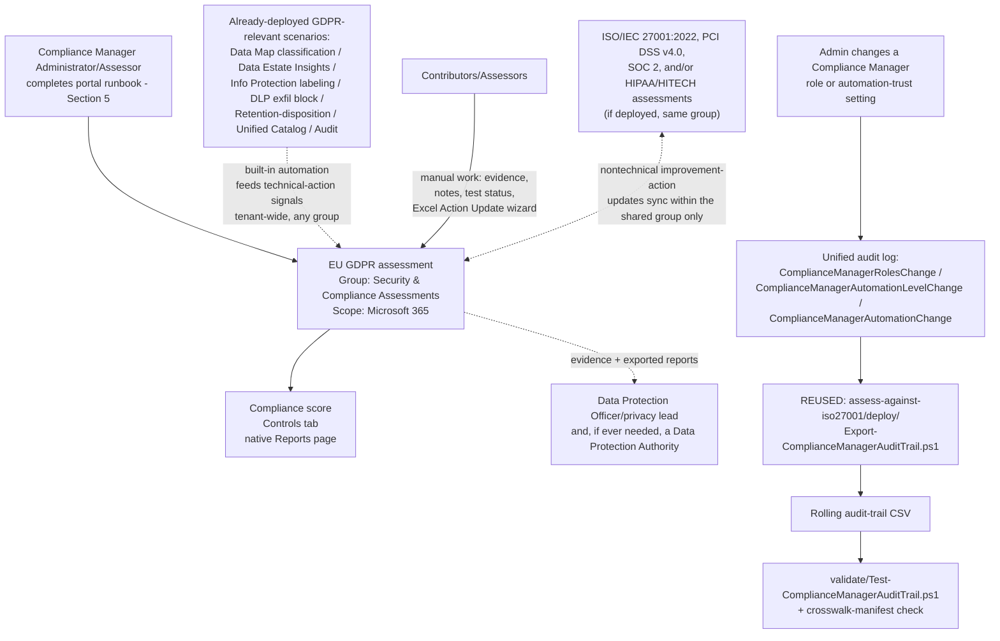

## The short version

Stands up a dedicated **Microsoft Purview Compliance Manager** assessment against the **EU GDPR
(General Data Protection Regulation)** premium template, places it correctly relative to this
library's other Compliance Manager assessments, and cross-references it against the GDPR-relevant
technical controls this library already ships (Data Map classification, Information Protection
labeling, DLP exfiltration blocking, Data Lifecycle Management retention, Unified Catalog data
inventory, Audit). Like *Assess Against ISO/IEC 27001:2022*, `scenarios/
compliance-manager/pci-dss-assessment/`, *SOC 2 Assessment*, and
*HIPAA/HITECH Assessment*, Compliance Manager itself has no write API,
so most of this scenario is a precise, repeatable **portal runbook** - see section 2 and the design notes.

## Why this matters

The **General Data Protection Regulation (GDPR)** (Regulation (EU) 2016/679) gives individuals
("data subjects") rights to manage the personal data organizations collect about them, and imposes
obligations on the organizations ("controllers" and "processors") that process it. Unlike every other regulation this library's Compliance Manager scenarios cover
- HIPAA (a US federal law), PCI DSS (a card-network contractual scheme), SOC 2 (a US/AICPA
attestation), and ISO/IEC 27001 (a voluntary international standard) - GDPR applies **extraterritorially**:
it reaches any organization that offers goods or services to people in the EU/EEA or monitors their
behavior, regardless of where the organization itself is located. Noncompliance
carries real regulatory exposure: fines of up to €20 million or 4% of annual global turnover
(whichever is greater), enforcement by national Data Protection Authorities (DPAs), and - for a
breach likely to result in a high risk to individuals' rights and freedoms - a mandatory 72-hour
notification obligation to the relevant DPA.

GDPR compliance work is organized, per Microsoft's own overview of the regulation, into three core
compliance areas:

1. **Data Subject Requests (DSR)** - formal requests by a data subject to access, correct, restrict,
   export, or delete their personal data (six activities: Discovery, Access, Rectification,
   Restriction, Export, Deletion).
2. **Breach notification** - notifying the appropriate DPA within 72 hours of becoming aware of a
   personal data breach likely to result in a high risk to individuals, and notifying affected
   individuals without undue delay.
3. **Data Protection Impact Assessment (DPIA)** - a required risk assessment for processing
   operations "likely to result in a high risk to the rights and freedoms of natural persons".

Alongside these three areas, GDPR's Article 5 sets out six processing principles (lawfulness/
fairness/transparency, purpose limitation, data minimization, accuracy, storage limitation, and
integrity/confidentiality), Article 30 requires controllers and processors to maintain a Record of
Processing Activities, Article 37 conditionally requires designating a Data Protection Officer, and
Article 46 restricts transfers of personal data outside the EU/EEA absent appropriate safeguards. Compliance Manager's EU GDPR premium template exists to give an
organization's Microsoft 365-based controls a scored, evidenced internal readiness view against this
structure - it does not itself demonstrate legal compliance, and this scenario
does not present it as though it does.

## How the control works

## What it takes

### Prerequisites

Full licensing detail and citations: [Licensing matrix](/docs/licensing-matrix/). Summary for this scenario (identical
role/licensing model to *Assess Against ISO/IEC 27001:2022* (the prerequisites), *PCI DSS v4.0 Assessment* (the prerequisites),
*SOC 2 Assessment* (the prerequisites), and *HIPAA/HITECH Assessment* (the prerequisites) - Compliance Manager's RBAC
and premium-template licensing are tenant-wide, not per-regulation):

| Requirement | Minimum | Notes |
|---|---|---|
| Compliance Manager base access | **Office 365 / Microsoft 365** license (any tier) | Available at all subscription levels; only premium regulatory templates require more |
| EU GDPR premium template | **A5/E5/G5** (3 free premium templates of choice) **or** the purchased **Compliance Manager premium assessment add-on**, **or** a **90-day premium assessments trial** (25 templates) | **Licensing-history caveat, unique to this scenario among this library's five Compliance Manager scenarios:** GDPR was one of a small set of templates (with NIST 800-53 and ISO 27001) included by default **before** Microsoft's December 2022 licensing change. Since that change, continued use of GDPR counts against the same 3-free-premium-template allotment as any other premium template - there is no separate "free GDPR" entitlement any more. Confirm the tenant's current Regulation licenses used counter reflects this rather than assuming a legacy free grant still applies |
| Role to create/administer the assessment | **Compliance Manager Administration** (or **Compliance Manager Assessor** to create; **Global Administrator** also works) | [RBAC model, section 4](/docs/rbac-model/#4-purview-role-groups-by-module-representative-not-exhaustive) for the Purview role-group mapping |
| Role to edit/test without creating | **Compliance Manager Contribution** (create + edit) or **Compliance Manager Assessor** (edit only, no create) | Assign the narrowest role per person - see `deploy/policy/gdpr-assessment-manifest.json` |
| Role for read-only visibility | **Compliance Manager Reader** | Extend to the organization's Data Protection Officer (if designated - see below) if they are not already a Contributor |
| Organizational designation (not a Compliance Manager role, and unlike HIPAA, **conditional**) | A **Data Protection Officer (DPO)** under GDPR Article 37, if the organization's core activities involve large-scale systematic monitoring of data subjects, large-scale processing of special-category/criminal-conviction data, or processing by a public authority | Determine applicability first - Article 37 does **not** require a DPO for every organization the way HIPAA requires a Privacy Officer and Security Officer for every covered entity/business associate |
| Automation identity (audit-trail script only) | App registration or account holding the **View-Only Audit Logs** (or **Audit Logs**) Exchange Online role, plus `Exchange.ManageAsApp` | Same requirement as the four sibling scenarios - [RBAC model, section 6](/docs/rbac-model/#6-exchange-online-dependency-the-most-common-permissions-gap) and [Automation surface, section 3](/docs/automation-surface/#3-authentication-patterns---interactive-vs-unattended) |
| Prerequisite (not deployed by this scenario) | Reviewed Article 28 processor-agreement terms with Microsoft (Online Services Terms / Data Protection Addendum) and, for cross-border transfers, the Standard Contractual Clauses Microsoft incorporates into its Volume Licensing agreements | A contractual, not a technical, prerequisite - see why this matters and the known limitations. This scenario does not create or track these agreements itself |
| Dependency (not deployed by this scenario) | Nothing hard-required, but strongly recommended: *PII-Only Scan Rule Set for Azure SQL Database* (+ siblings), *Exportable, Historical Sensitivity-Label Coverage Report*, *Auto-Label Confidential PII in SharePoint & OneDrive* (+ Exchange sibling), *Exchange PII Exfiltration Block (Block or Encrypt)* (+ Part 2), *Event-Based Retention and Multi-Stage Disposition for Employee Records*, *Governance Domain Hierarchy* and `.../manage-data-products/`, *Forensic Investigation of a Compromised Account*, *Compromised Account Incident Response* | Reduces the manual-testing backlog and maps directly to GDPR's own structure - see the manifest's `controlCrosswalk` and the design notes |
| Recommended (not required) | *Assess Against ISO/IEC 27001:2022*, *PCI DSS v4.0 Assessment*, *SOC 2 Assessment*, and/or *HIPAA/HITECH Assessment* already deployed | Not a hard dependency, but if present, this scenario's group-placement decision gets meaningfully better - join, don't duplicate |

> Verify current entitlement names against [Licensing matrix](/docs/licensing-matrix/) and the Product Terms before a
> sales commitment - SKU names and the premium-template licensing model change over time.

### Cost and licensing

- **Premium-template licensing, not PAYG** - identical model to the four sibling scenarios: 1 of the
  tenant's 3 free A5/E5/G5 premium-template slots, a purchased add-on, or a time-boxed trial.
- **Licensing-history caveat, unique to this scenario:** if this organization has used Compliance
  Manager's GDPR template since before December 2022, confirm it is now correctly counted against
  the tenant's 3-free-premium-template allotment - it is **no longer** a separately-included free
  template the way it (along with NIST 800-53 and ISO 27001) used to be.
- **Don't select the wrong lookalike template.** EU GDPR and the separately-listed "UK Data
  Protection Act" template are billed as **separate** premium-template slots - accidentally
  activating one when only the other's jurisdiction applies consumes a second of the tenant's 3 free
  slots for a materially different regulator's requirements.
- **No additional cost for the audit-trail script** beyond the Exchange Online role assignment, and
  **zero incremental cost if *Assess Against ISO/IEC 27001:2022*, *PCI DSS v4.0 Assessment*, *SOC 2 Assessment*,
  and/or *HIPAA/HITECH Assessment* already run it** - this scenario reuses that script rather than
  running an additional copy.
- **Sizing note:** identical to the sibling scenarios - the premium-template allotment is
  per-regulation, not per-assessment.
- **GDPR's own Article 42/43 certification mechanism has no separate Compliance Manager licensing
  cost** - it is a national supervisory-authority or accredited-certification-body process entirely
  outside Compliance Manager, not a purchasable SKU. It is not something this scenario configures or
  progresses toward.

## Proof it works

1. **Automated file-integrity + manifest check** - `./validate/Test-ComplianceManagerAuditTrail.ps1
   -AuditTrailCsvPath './out/compliance-manager-audit-trail.csv'` confirms the audit-trail CSV's
   schema/de-duplication/sort order (identical checks to the four sibling scenarios) **and**
   structurally validates this scenario's own `controlCrosswalk` manifest (all 6 categories present,
   each with an `articleCitation` and a `coverage` string, every referenced `scenarios/...` path
   actually existing in this library); exits non-zero on any hard failure.
2. **Manual verification checklist** - the same script prints a checklist (assessment exists,
   correct regulation **and not the UK Data Protection Act lookalike**, group placement correct, role
   assignments match, Article 37 DPO applicability determined and documented, group-sharing actually
   works for a shared nontechnical action, licensing counter reflects the post-2022 model, and -
   critically - that this assessment isn't being mis-presented as "GDPR certified") because none of
   these have a read API to check programmatically.
3. **Functional test (audit-trail script)** - identical procedure to the four sibling scenarios:
   change a test user's Compliance Manager role, wait ~60 minutes for audit-log ingestion, re-run
   with a `-StartDate` covering that window, expect a new row with `Operation =
   ComplianceManagerRolesChange`.
4. **Group-sharing functional test** - if *Assess Against ISO/IEC 27001:2022*, *PCI DSS v4.0 Assessment*,
   *SOC 2 Assessment*, and/or *HIPAA/HITECH Assessment* are also deployed: pick one nontechnical
   improvement action common across them, update its implementation status and notes in this GDPR
   assessment, then confirm within a few minutes that the same update appears in the other
   assessment(s). This is the one behavior in this scenario that's easy to configure wrong (wrong
   group choice) without any error message telling you so.
5. **Evidence for a Data Protection Authority inquiry (if ever needed) or a business partner's own
   due-diligence review** - the assessment's own **Export actions** report is the
   primary evidence artifact; this scenario's audit-trail CSV is a secondary, complementary artifact.
   **Neither one is a GDPR certification** nor a substitute for the organization's own required
   Article 30 Records of Processing Activities, Article 35 DPIAs, or documented Article 6 lawful
   basis for each processing activity - see the known limitations.

## Where it stops

- **A high compliance score is not proof of GDPR compliance.** Microsoft's own Compliance Manager FAQ
  states this explicitly for the product generally: "Your compliance score measures your progress in
  completing recommended actions … It doesn't express an absolute measure of organizational
  compliance with regard to a particular standard or regulation". For GDPR
  specifically, a high score says nothing about whether every processing activity has a documented
  Article 6 lawful basis, or whether the organization's Article 30 Record of Processing Activities is
  actually complete and current.
- **GDPR's Article 42/43 certification mechanism is real, but fragmented - a third distinct shape
  among this library's five Compliance Manager scenarios.** HIPAA has no HHS-approved certification
  standard for anyone; SOC 2 and ISO 27001 each have a mature, real third-party
  attestation/certification process. GDPR's own text describes a certification mechanism (Article 42)
  issued by certification bodies (Article 43) or a competent supervisory authority, but current
  practice is fragmented across individual national supervisory authorities and accredited
  certification bodies rather than a single unified EU-wide seal. This Compliance Manager assessment
  is not, and does not progress toward, any Article 42/43 certification - do not let a customer
  conversation, an internal deck, or this scenario's own tooling output imply "GDPR certified" status.
- **Compliance Manager's regulation catalog separately lists a "UK Data Protection Act" template**
  in the same EMEA category as EU GDPR. It is not a near-identical-name trap the way HIPAA/HITECH vs.
  HITRUST is, but it is a materially different jurisdiction (UK Information Commissioner's Office,
  not an EU/EEA DPA) that this assessment does not cover - an organization with both EU and UK
  obligations needs to evaluate both templates, not assume this one substitutes for the other.
- **GDPR's Article 37 Data Protection Officer designation is conditional, not universal** - a real
  contrast with HIPAA's blanket Privacy Officer/Security Officer designation requirement for every
  covered entity/business associate. Determine applicability (large-scale systematic monitoring,
  large-scale special-category data processing, or public-authority processing) before assuming a DPO
  must (or need not) be named.
- **The December 2022 Compliance Manager licensing change specifically affected GDPR** (along with
  NIST 800-53 and ISO 27001): a template that used to be included by default for E5-tier customers
  now draws from the same 3-free-premium-template allotment as every other premium template. An
  organization that adopted this template years ago should re-confirm its current licensing status
  rather than assume nothing changed.
- **This scenario cannot script assessment creation, control mapping, or improvement-action
  updates** - identical constraint and reasoning to the four sibling scenarios.
- **The audit-trail script here is the same file as the four sibling scenarios', not an independent
  implementation** - deliberate, not an oversight; see the design notes. It inherits those scripts' own
  limitations verbatim: it does not track compliance score or improvement-action status changes (only
  the 3 documented role/automation-trust operations), and it cannot see Compliance Manager access
  granted implicitly via the Global Administrator, Compliance Administrator, Compliance Data
  Administrator, or Security Administrator Entra ID roles - see *Assess Against ISO/IEC 27001:2022* (the known limitations) for the full statement of both limitations, which apply here without modification.
- **The `controlCrosswalk` in `deploy/policy/gdpr-assessment-manifest.json` is this library's own
  scenario-to-article correlation, not Microsoft's published improvement-action mapping** - see
  the design notes. The Data Subject Rights category's technical building block is now
  *GDPR Data Subject Request (DSR) Fulfillment*, which adds the request-tracking/SLA layer this
  section previously flagged as missing on top of the same eDiscovery mechanics - it still has no
  rectification/restriction technical fulfillment, because no Purview-native control exists for
  either (that sibling's the design notes states why, rather than this assessment repeating an
  unresolved gap). The Cross-Border Data Transfers category has little to no direct technical
  coverage from this Microsoft 365/Purview-only library - cross-border transfer safeguards are
  contractual instruments between the organization and Microsoft, not a Purview policy.
- **Audit (Standard) default retention is 180 days** (1 year for Entra ID/Exchange/OneDrive/
  SharePoint under an E5-tier license; up to 10 years with Audit Premium retention policies). Unlike HIPAA's specific 6-year documentation-retention citation, GDPR imposes
  no single fixed retention figure for accountability evidence - align the archived audit-trail CSV
  with the organization's own documented Article 5(1)(e) record-retention schedule rather than
  assuming Audit (Standard)'s native window is sufficient, and rather than this scenario inventing a
  number it has no grounded basis to assert.
- **This scenario does not script Data Subject Request fulfillment, breach notification, or Data
  Protection Impact Assessments as end-to-end workflows** - it maps the technical building blocks
  that support each, not the organizational/legal process itself. Notifying a Data
  Protection Authority within 72 hours, notifying affected individuals, and preparing a DPIA's
  necessity/proportionality/risk analysis remain the organization's own responsibility.
- **The "Action Update" Excel bulk-import file's exact column schema is not scripted here** - same
  tracked follow-up as the four sibling scenarios.
- **This scenario does not select or scope which GDPR compliance area applies within the Compliance
  Manager wizard.** No worked example or documented control was found during this build showing a
  per-area (Data Subject Requests / Breach Notification / DPIA / processing principles) selection
  step in the assessment-creation flow - the template appears to map the full published control set
  once selected, the same all-or-nothing pattern the PCI DSS, SOC 2, and HIPAA/HITECH sibling
  scenarios document for their own regulations. **VERIFY (pilot tenant):** whether Compliance
  Manager's Controls/Improvement actions views let you filter or tag improvement actions by GDPR
  compliance area after creation.