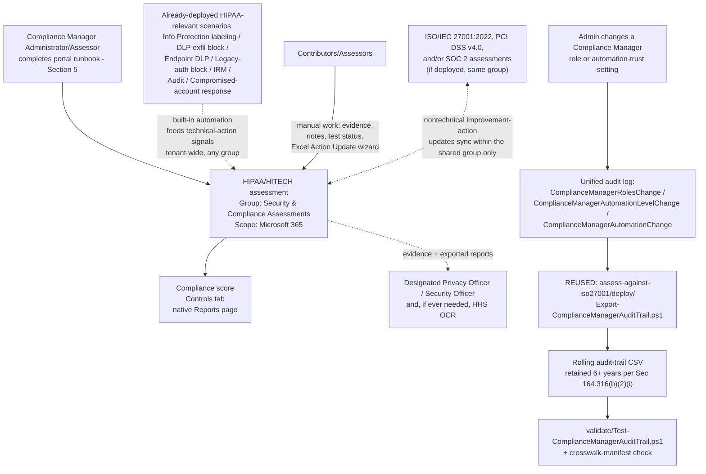

## The short version

Stands up a dedicated **Microsoft Purview Compliance Manager** assessment against the
**HIPAA/HITECH** premium regulatory template, places it correctly relative to this library's other
Compliance Manager assessments, and cross-references it against the HIPAA/HITECH-relevant technical
controls this library already ships (Information Protection labeling, DLP exfiltration blocking,
Adaptive Protection access control, Insider Risk Management, Audit). Like *Assess Against ISO/IEC 27001:2022*, *PCI DSS v4.0 Assessment*, and
*SOC 2 Assessment*, Compliance Manager itself has no write API, so most
of this scenario is a precise, repeatable **portal runbook** - see section 2 and the design notes.

## Why this matters

**HIPAA** (the Health Insurance Portability and Accountability Act of 1996) and the **HITECH Act**
(2009) together form a set of U.S. federal healthcare laws establishing requirements for the use,
disclosure, and safeguarding of protected health information (PHI). Unlike SOC 2
(a contractual/commercial driver), HIPAA is a **legal mandate**: it applies directly to covered
entities and, since HITECH extended its scope, directly to their business associates - including any
cloud service provider, such as Microsoft or a customer running Microsoft 365, that creates,
receives, maintains, or transmits PHI on a covered entity's behalf.
Noncompliance carries real regulatory exposure: enforcement sits with the HHS Office for Civil Rights
(OCR), and the Breach Notification Rule imposes affirmative, time-bound obligations on both covered
entities and business associates when a breach of unsecured PHI occurs.

HIPAA and HITECH together comprise three rules:

1. **The Privacy Rule** - safeguards for the privacy of PHI and restrictions on its use/disclosure
   without patient authorization, plus patient rights to access and correct their own records.
2. **The Security Rule** - administrative, physical, and technical safeguards for the
   confidentiality, integrity, and availability of **electronic** PHI (ePHI).
3. **The Breach Notification Rule** - notification obligations when a breach of unsecured PHI occurs.

Compliance Manager's HIPAA/HITECH premium template exists to give an organization's Microsoft
365-based controls a scored, evidenced internal readiness view against this structure
 - it does not itself demonstrate legal compliance or produce any form of
certification, and this scenario does not present it as though it does. A Microsoft Business
Associate Agreement (BAA) is a separate, contractual prerequisite this scenario assumes is already
in place - it governs Microsoft's own obligations as a business associate, not the customer's
internal control posture, which is exactly what this assessment tracks.

## How the control works

## What it takes

### Prerequisites

Full licensing detail and citations: [Licensing matrix](/docs/licensing-matrix/). Summary for this scenario
(identical role/licensing model to *Assess Against ISO/IEC 27001:2022* (the prerequisites), `pci-dss-assessment/
the prerequisites, and *SOC 2 Assessment* (the prerequisites) - Compliance Manager's RBAC and premium-template
licensing are tenant-wide, not per-regulation):

| Requirement | Minimum | Notes |
|---|---|---|
| Compliance Manager base access | **Office 365 / Microsoft 365** license (any tier) | Available at all subscription levels; only premium regulatory templates require more |
| HIPAA/HITECH premium template | **A5/E5/G5** (3 free premium templates of choice) **or** the purchased **Compliance Manager premium assessment add-on**, **or** a **90-day premium assessments trial** (25 templates) | Compliance Manager's catalog lists **HIPAA/HITECH** under its **US Government** category, alongside a separately-listed **HITRUST** template that is easy to confuse with it - select **HIPAA/HITECH**, not HITRUST, when the goal is a HIPAA-specific readiness view; see the known limitations |
| Role to create/administer the assessment | **Compliance Manager Administration** (or **Compliance Manager Assessor** to create; **Global Administrator** also works) | [RBAC model, section 4](/docs/rbac-model/#4-purview-role-groups-by-module-representative-not-exhaustive) for the Purview role-group mapping |
| Role to edit/test without creating | **Compliance Manager Contribution** (create + edit) or **Compliance Manager Assessor** (edit only, no create) | Assign the narrowest role per person - see `deploy/policy/hipaa-hitech-assessment-manifest.json` |
| Role for read-only visibility | **Compliance Manager Reader** | Extend to the organization's designated Privacy Officer/Security Officer (see below) if they are not already a Contributor |
| Organizational designation (not a Compliance Manager role) | A formally designated **HIPAA Privacy Officer** (45 CFR section 164.530(a)(1)) and **Security Officer** (45 CFR section 164.308(a)(2)) | Legally required designations under the Privacy Rule and Security Rule respectively - not satisfied by assigning anyone Compliance Manager Administration |
| Automation identity (audit-trail script only) | App registration or account holding the **View-Only Audit Logs** (or **Audit Logs**) Exchange Online role, plus `Exchange.ManageAsApp` | Same requirement as the three sibling scenarios - [RBAC model, section 6](/docs/rbac-model/#6-exchange-online-dependency-the-most-common-permissions-gap) and [Automation surface, section 3](/docs/automation-surface/#3-authentication-patterns---interactive-vs-unattended) |
| Prerequisite (not deployed by this scenario) | A **Business Associate Agreement (BAA)** with Microsoft already in place if PHI will be processed in this tenant | A contractual, not a technical, prerequisite - see why this matters. This scenario does not create or track the BAA itself |
| Dependency (not deployed by this scenario) | Nothing hard-required, but strongly recommended: *Auto-Label Confidential PII in SharePoint & OneDrive* (+ Exchange sibling), *Exchange PII Exfiltration Block (Block or Encrypt)* (+ Part 2), *Endpoint DLP: Block USB Removable Media Exfiltration*, *Block Legacy Authentication* (+ Exchange sibling), *Departing Employee Data Theft*, *Forensic Investigation of a Compromised Account*, *Compromised Account Incident Response* | Reduces the manual-testing backlog and maps directly to HIPAA's Security Rule safeguard categories and Breach Notification Rule - see the manifest's `controlCrosswalk` and the design notes |
| Recommended (not required) | *Assess Against ISO/IEC 27001:2022*, *PCI DSS v4.0 Assessment*, and/or *SOC 2 Assessment* already deployed | Not a hard dependency, but if present, this scenario's group-placement decision gets meaningfully better - join, don't duplicate |

> Verify current entitlement names against [Licensing matrix](/docs/licensing-matrix/) and the Product Terms before
> a sales commitment - SKU names and the premium-template licensing model change over time.

### Cost and licensing

- **Premium-template licensing, not PAYG** - identical model to the three sibling scenarios: 1 of
  the tenant's 3 free A5/E5/G5 premium-template slots, a purchased add-on, or a time-boxed trial.
- **Don't select the wrong lookalike template.** HIPAA/HITECH and HITRUST are billed as **separate**
  premium-template slots - accidentally activating HITRUST when only a HIPAA/HITECH readiness view
  is needed consumes a second of the tenant's 3 free slots for a materially different (and
  separately certifiable) framework.
- **No additional cost for the audit-trail script** beyond the Exchange Online role assignment, and
  **zero incremental cost if *Assess Against ISO/IEC 27001:2022*, *PCI DSS v4.0 Assessment*, and/or
  *SOC 2 Assessment* already run it** - this scenario reuses that script rather than running an
  additional copy.
- **Sizing note:** identical to the sibling scenarios - the premium-template allotment is
  per-regulation, not per-assessment.
- **A Business Associate Agreement (BAA) with Microsoft has no separate Compliance Manager
  licensing cost** - it is a contractual instrument under the Microsoft Product Terms, not a
  purchasable SKU. It is a prerequisite this scenario assumes, not something it
  configures.

## Proof it works

1. **Automated file-integrity + manifest check** - `./validate/Test-ComplianceManagerAuditTrail.ps1
   -AuditTrailCsvPath './out/compliance-manager-audit-trail.csv'` confirms the audit-trail CSV's
   schema/de-duplication/sort order (identical checks to the three sibling scenarios) **and**
   structurally validates this scenario's own `controlCrosswalk` manifest (all 5 categories
   present, each Security Rule safeguard category flagged `hasAddressableSpecifications: true`,
   every referenced `scenarios/...` path actually exists in this library); exits non-zero on any hard
   failure.
2. **Manual verification checklist** - the same script prints a checklist (assessment exists,
   correct regulation **and not the HITRUST lookalike**, group placement correct, role assignments
   match, Privacy/Security Officer designations confirmed, group-sharing actually works for a
   shared nontechnical action, at least one "addressable" specification evidenced correctly, and -
   critically - that this assessment isn't being mis-presented as "HIPAA certified") because none
   of these have a read API to check programmatically.
3. **Functional test (audit-trail script)** - identical procedure to the three sibling scenarios:
   change a test user's Compliance Manager role, wait ~60 minutes for audit-log ingestion, re-run
   with a `-StartDate` covering that window, expect a new row with `Operation =
   ComplianceManagerRolesChange`.
4. **Group-sharing functional test** - if *Assess Against ISO/IEC 27001:2022*, *PCI DSS v4.0 Assessment*, and/or
   *SOC 2 Assessment* are also deployed: pick one nontechnical improvement action common across
   them, update its implementation status and notes in this HIPAA/HITECH assessment, then confirm
   within a few minutes that the same update appears in the other assessment(s). This is the one
   behavior in this scenario that's easy to configure wrong (wrong group choice) without any error
   message telling you so.
5. **Evidence for HHS OCR (if ever needed) or a covered entity's own due-diligence review** - the
   assessment's own **Export actions** report is the primary evidence artifact; this
   scenario's audit-trail CSV is a secondary, complementary artifact. **Neither one is a HIPAA
   certification** (none exists) **nor a substitute for the organization's own required Security
   Risk Analysis** - see the known limitations.

## Where it stops

- **There is currently no HHS-approved certification standard for HIPAA/HITECH compliance, for
  anyone.** Microsoft states this explicitly for its own position as a business associate: "There's
  currently no certification standard that the Department of Health and Human Services approves to
  demonstrate compliance with HIPAA or the HITECH Act by a business associate".
  This is a stronger statement than SOC 2's "this assessment isn't the report" caution - for HIPAA,
  no equivalent third-party-issued certification exists at all for this scenario's tooling output to
  be confused with. Do not let a customer conversation, an internal deck, or this scenario's own
  tooling output imply "HIPAA certified" status.
- **This assessment does not substitute for the organization's own legally required Security Risk
  Analysis** (45 CFR 164.308(a)(1)(ii)(A)) - a periodic risk assessment every
  covered entity and business associate must perform themselves. A Compliance Manager score,
  however complete, is an internal readiness-tracking and evidence tool for that broader legal
  obligation, not a replacement for it.
- **Compliance Manager's regulation catalog lists a separately-selectable "HITRUST" premium
  template alongside "HIPAA/HITECH"** in different catalog areas - HITRUST (the HITRUST CSF) is an
  independently governed, separately certifiable framework maintained by the HITRUST Alliance that
  harmonizes many standards including HIPAA, but selecting it does not produce a HIPAA/HITECH-specific readiness view, and vice versa. Selecting the wrong one wastes a premium-template slot
  and produces an assessment mapped to a different (if related) control set - see the implementation steps step 5 and
  the cost and licensing notes for the cost consequence.
- **"Addressable" HIPAA Security Rule implementation specifications are not optional.** Microsoft's
  own HIPAA configuration guidance states this explicitly: "The 'addressable' designation denotes a
  specification is reasonable and appropriate. Addressable doesn't mean that an implementation
  specification is optional. Therefore, subparts that are defined as addressable are also required". An organization must implement each addressable specification as written, or
  document a reasonable equivalent alternative measure and the rationale, or document why no
  safeguard is needed - never simply skip it. This is, in this scenario's assessment, the single
  most commonly misunderstood fact about the HIPAA Security Rule, which is why `deploy/policy/
  hipaa-hitech-assessment-manifest.json` and `validate/Test-ComplianceManagerAuditTrail.ps1` both
  structurally enforce that this distinction stays documented rather than silently dropped.
- **This scenario cannot script assessment creation, control mapping, or improvement-action
  updates** - identical constraint and reasoning to the three sibling scenarios.
- **The audit-trail script here is the same file as the three sibling scenarios', not an
  independent implementation** - deliberate, not an oversight; see the design notes. It inherits
  those scripts' own limitations verbatim: it does not track compliance score or improvement-action
  status changes (only the 3 documented role/automation-trust operations), and it cannot see
  Compliance Manager access granted implicitly via the Global Administrator, Compliance
  Administrator, Compliance Data Administrator, or Security Administrator Entra ID roles - see
  *Assess Against ISO/IEC 27001:2022* (the known limitations) for the full statement of both limitations, which apply
  here without modification.
- **The `controlCrosswalk` in `deploy/policy/hipaa-hitech-assessment-manifest.json` is this
  library's own scenario-to-rule correlation, not Microsoft's published improvement-action
  mapping** - see the design notes. The Privacy Rule and Physical Safeguards categories have little
  to no direct technical coverage from this Microsoft 365/Purview-only library - stated plainly in
  the manifest rather than glossed over, and a dedicated PHI-classification/DLP scenario using
  Purview's built-in "U.S. Health Insurance Act (HIPAA) Enhanced" DLP policy template
  is tracked as a follow-up in the project backlog rather than fabricated here.
- **Audit (Standard) default retention is 180 days** (1 year for Entra ID/Exchange/OneDrive/
  SharePoint under an E5-tier license; up to 10 years with Audit Premium retention policies)
  - dramatically shorter than HIPAA's own 6-year documentation retention
  requirement. Start the recurring audit-trail schedule immediately and
  archive its output outside the tenant's own audit-log retention window rather than relying on
  Audit (Standard) to preserve the underlying events for years.
- **The Breach Notification Rule's own notification obligations are not scripted here.** This
  scenario's crosswalk maps this library's incident-response scenarios to the *evidence-gathering*
  side of a breach response, but notifying affected individuals, HHS, and - for breaches
  affecting 500 or more residents of a state or jurisdiction - the media, are organizational/legal
  processes this library does not automate.
- **The "Action Update" Excel bulk-import file's exact column schema is not scripted here** - same
  tracked follow-up as the three sibling scenarios.
- **This scenario does not select or scope which HIPAA rule categories apply within the Compliance
  Manager wizard.** No worked example or documented control was found during this build showing a
  per-category (Privacy Rule / Administrative / Physical / Technical Safeguards / Breach
  Notification) selection step in the assessment-creation flow - the template appears to map the
  full published control set once selected, the same all-or-nothing pattern the PCI DSS and SOC 2
  sibling scenarios document for their own regulations. **VERIFY (pilot tenant):** whether
  Compliance Manager's Controls/Improvement actions views let you filter or tag improvement actions
  by rule category after creation - this would materially help a Contributor/Assessor scope their
  work, and would help confirm which specific improvement actions correspond to "addressable" vs.
  "required" implementation specifications, which this scenario's grounding pass could not confirm
  is exposed anywhere in the Compliance Manager UI itself (only in the underlying rule text).
- **A high compliance score is not proof of compliance, and is even less a proxy for the
  organization's own legal HIPAA obligations.** Microsoft's own FAQ states this explicitly for
  Compliance Manager generally - HHS OCR's enforcement posture depends on the
  organization's actual documented safeguards, risk analysis, and breach-response conduct, not on
  this assessment's score.