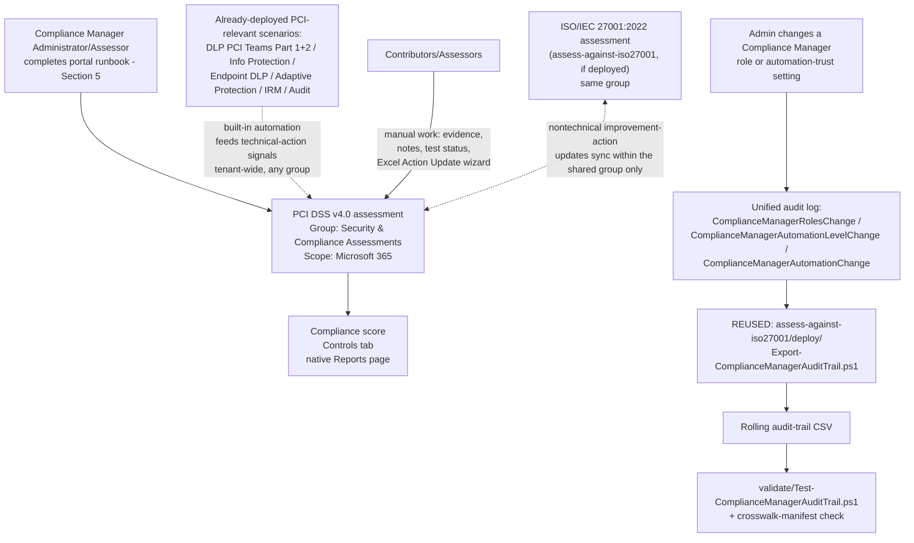

## The short version

Stands up a dedicated **Microsoft Purview Compliance Manager** assessment against the **PCI DSS
v4.0** premium regulatory template, places it correctly relative to this library's other
Compliance Manager assessment, and cross-references it against the PCI-relevant technical controls
this library already ships (DLP PAN-in-Teams blocking, sensitivity labeling, Endpoint DLP, Adaptive
Protection, Insider Risk Management, Audit). Like *Assess Against ISO/IEC 27001:2022*, Compliance Manager itself has no write API, so most of this scenario is
a precise, repeatable **portal runbook** - see section 5 and the design notes.

## Why this matters

**PCI DSS v4.0** (the Payment Card Industry Data Security Standard, currently at revision 4.0.1) is
mandatory for any organization that stores, processes, or transmits payment cardholder data -
membership isn't optional the way some other frameworks in this library's regulatory-driver axis
are. Compliance is demonstrated to an acquiring bank or card network through a
**Self-Assessment Questionnaire (SAQ)** for lower-volume merchants, or a **Qualified Security
Assessor (QSA)**-conducted **Report on Compliance (RoC)** for Level 1 merchants and most service
providers. Compliance Manager's PCI DSS v4.0 premium template exists to give the
Microsoft 365 portion of that estate a scored, evidenced internal assessment a QSA or internal
auditor can review - it does not itself produce an SAQ or RoC, and this scenario
does not present it as though it does.

This scenario's driver is squarely **regulatory/contractual** (the DLP-Teams-PAN control it
cross-references most directly maps to PCI DSS Requirement 4 - protecting cardholder data in
transit - per *PCI Teams Card-Data Exfiltration Block* (why this matters)), and its value is the same
governance/evidence function *Assess Against ISO/IEC 27001:2022* (why this matters) describes: making already-built
technical controls **legible against a named standard**, which is what an assessor, an acquirer
questionnaire, or a board audit committee actually asks for.

## How the control works

## What it takes

### Prerequisites

Full licensing detail and citations: [Licensing matrix](/docs/licensing-matrix/). Summary for this scenario
(identical role/licensing model to *Assess Against ISO/IEC 27001:2022* (the prerequisites) - Compliance Manager's
RBAC and premium-template licensing are tenant-wide, not per-regulation):

| Requirement | Minimum | Notes |
|---|---|---|
| Compliance Manager base access | **Office 365 / Microsoft 365** license (any tier) | Available at all subscription levels; only premium regulatory templates require more |
| PCI DSS v4.0 premium template | **A5/E5/G5** (3 free premium templates of choice) **or** the purchased **Compliance Manager premium assessment add-on**, **or** a **90-day premium assessments trial** (25 templates) | Compliance Manager's catalog lists PCI DSS v4.0 **and** the retired PCI DSS v3.2.1 as two separate premium templates - select v4.0 only; see the known limitations |
| Role to create/administer the assessment | **Compliance Manager Administration** (or **Compliance Manager Assessor** to create; **Global Administrator** also works) | [RBAC model, section 4](/docs/rbac-model/#4-purview-role-groups-by-module-representative-not-exhaustive) for the Purview role-group mapping |
| Role to edit/test without creating | **Compliance Manager Contribution** (create + edit) or **Compliance Manager Assessor** (edit only, no create) | Assign the narrowest role per person - see `deploy/policy/pci-dss-assessment-manifest.json` |
| Role for read-only visibility | **Compliance Manager Reader** | Extend to an engaged QSA/ISA if they need portal visibility, not just the exported evidence |
| Automation identity (audit-trail script only) | App registration or account holding the **View-Only Audit Logs** (or **Audit Logs**) Exchange Online role, plus `Exchange.ManageAsApp` | Same requirement as *Assess Against ISO/IEC 27001:2022* (the prerequisites) - [RBAC model, section 6](/docs/rbac-model/#6-exchange-online-dependency-the-most-common-permissions-gap) and [Automation surface, section 3](/docs/automation-surface/#3-authentication-patterns---interactive-vs-unattended) |
| Dependency (not deployed by this scenario) | Nothing hard-required, but strongly recommended: *PCI Teams Card-Data Exfiltration Block* (+ Part 2), *Auto-Label Confidential PII in SharePoint & OneDrive*, *Endpoint DLP: Block USB Removable Media Exfiltration*, *Dynamic Risk-Based DLP Enforcement*, *Departing Employee Data Theft*, *Forensic Investigation of a Compromised Account* | Reduces the manual-testing backlog and maps directly to PCI DSS goals 2, 4, 5, 6 - see the manifest's `controlCrosswalk` and the design notes |
| Recommended (not required) | *Assess Against ISO/IEC 27001:2022* already deployed | Not a hard dependency, but if present, this scenario's group-placement decision gets meaningfully better - join, don't duplicate |

> Verify current entitlement names against [Licensing matrix](/docs/licensing-matrix/) and the Product Terms before
> a sales commitment - SKU names and the premium-template licensing model change over time.

### Cost and licensing

- **Premium-template licensing, not PAYG** - identical model to *Assess Against ISO/IEC 27001:2022* (the cost and licensing notes): 1 of the tenant's 3 free A5/E5/G5 premium-template slots, a purchased add-on, or a time-boxed
  trial.
- **Don't pay for two PCI DSS templates.** PCI DSS v4.0 and the retired PCI DSS v3.2.1 are billed as
  **separate** premium-template slots even though they're the same underlying regulation at
  different revisions - accidentally activating both consumes 2 of the tenant's 3 free slots for no
  benefit.
- **No additional cost for the audit-trail script** beyond the Exchange Online role assignment, and
  **zero incremental cost if *Assess Against ISO/IEC 27001:2022* already runs it** - this scenario reuses that
  script rather than running a second copy.
- **Sizing note:** identical to *Assess Against ISO/IEC 27001:2022* (the cost and licensing notes) - the premium-template
  allotment is per-regulation, not per-assessment.

## Proof it works

1. **Automated file-integrity + manifest check** - `./validate/Test-ComplianceManagerAuditTrail.ps1
   -AuditTrailCsvPath './out/compliance-manager-audit-trail.csv'` confirms the audit-trail CSV's
   schema/de-duplication/sort order (identical checks to *Assess Against ISO/IEC 27001:2022*) **and**
   structurally validates this scenario's own `controlCrosswalk` manifest (all 6 PCI DSS goals
   present, every referenced `scenarios/...` path actually exists in this library); exits non-zero on
   any hard failure.
2. **Manual verification checklist** - the same script prints a checklist (assessment exists,
   correct regulation **and not the v3.2.1 lookalike**, group placement correct, role assignments
   match, group-sharing actually works for a shared nontechnical action, and - critically - that
   this assessment isn't being mis-presented as an SAQ/RoC substitute) because none of these have a
   read API to check programmatically.
3. **Functional test (audit-trail script)** - identical procedure to
   *Assess Against ISO/IEC 27001:2022* (the validation steps): change a test user's Compliance Manager role, wait ~60
   minutes for audit-log ingestion, re-run with a `-StartDate` covering that window, expect a new
   row with `Operation = ComplianceManagerRolesChange`.
4. **Group-sharing functional test** - if *Assess Against ISO/IEC 27001:2022* is also deployed: pick one
   nontechnical improvement action common to both assessments, update its implementation status and
   notes in this PCI DSS assessment, then confirm within a few minutes that the same update appears
   in the ISO 27001 assessment. This is the one behavior in this scenario that's easy to configure
   wrong (wrong group choice) without any error message telling you so.
5. **Evidence for a QSA, ISA, or internal auditor** - the assessment's own **Export actions** report
 is the primary evidence artifact; this scenario's audit-trail CSV is a secondary,
   complementary artifact. **Neither one is a PCI DSS SAQ or RoC** - see section 11.

## Where it stops

- **This assessment is not a PCI DSS SAQ or QSA Report on Compliance, and does not substitute for
  either.** This is the single most important limitation in this scenario. A Compliance Manager
  score, however complete, is an internal tracking and evidence tool - it is not the instrument
  submitted to an acquirer or card network to demonstrate PCI DSS validation. Do not let a customer conversation, an internal deck, or
  this scenario's own tooling output imply otherwise.
- **Compliance Manager's regulation catalog lists two separate PCI DSS templates** - "PCI DSS
  v3.2.1" and "PCI DSS v4.0" - both under the same `offering-pci-dss` Microsoft Learn reference
  page. PCI DSS v3.2.1 was retired by the PCI Security Standards Council; PCI DSS v4.0 (revision
  4.0.1) is the current mandatory standard Microsoft's own Azure/OneDrive/SharePoint PCI attestation
  is issued against. Select v4.0 - see the implementation steps step 5 and the cost and licensing notes for the cost
  consequence of getting this wrong.
- **This scenario cannot script assessment creation, control mapping, or improvement-action
  updates** - identical constraint and reasoning to *Assess Against ISO/IEC 27001:2022* (the known limitations).
- **The audit-trail script here is the same file as *Assess Against ISO/IEC 27001:2022*'s, not an
  independent implementation** - deliberate, not an oversight; see the design notes. It inherits that
  script's own limitations verbatim: it does not track compliance score or improvement-action
  status changes (only the 3 documented role/automation-trust operations), and it cannot see
  Compliance Manager access granted implicitly via the Global Administrator, Compliance
  Administrator, Compliance Data Administrator, or Security Administrator Entra ID roles - see
  *Assess Against ISO/IEC 27001:2022* (the known limitations) for the full statement of both limitations, which apply
  here without modification.
- **The `controlCrosswalk` in `deploy/policy/pci-dss-assessment-manifest.json` is this library's own
  scenario-to-PCI-goal correlation, not Microsoft's published improvement-action mapping** - see
  the design notes. Two of PCI DSS's six control goals (Build and Maintain a Secure Network and
  Systems; Maintain a Vulnerability Management Program) have no coverage from this Microsoft
  365/Purview-only library at all - stated plainly in the manifest rather than glossed over.
- **The exact PCI DSS Requirement 12.4 formal-review-cadence obligation is not hard-coded into this
  scenario's tooling** - deliberately left to the operator's own PCI scope determination rather than
  assumed. **VERIFY** against the current PCI DSS v4.0 standard and your organization's
  merchant/service-provider level before committing to a specific review interval in a customer
  conversation.
- **Audit (Standard) default retention is 180 days** (1 year for Entra ID/Exchange/OneDrive/
  SharePoint under an E5-tier license; up to 10 years with Audit Premium retention policies)
  - identical caveat to *Assess Against ISO/IEC 27001:2022* (the known limitations).
- **The "Action Update" Excel bulk-import file's exact column schema is not scripted here** - same
  tracked follow-up as *Assess Against ISO/IEC 27001:2022*.
- **A high compliance score is not proof of compliance.** Microsoft's own FAQ states this
  explicitly - this repeats *Assess Against ISO/IEC 27001:2022* (the known limitations)'s identical
  caution because it is at least as important here, given PCI DSS's contractual (not just
  regulatory) stakes.