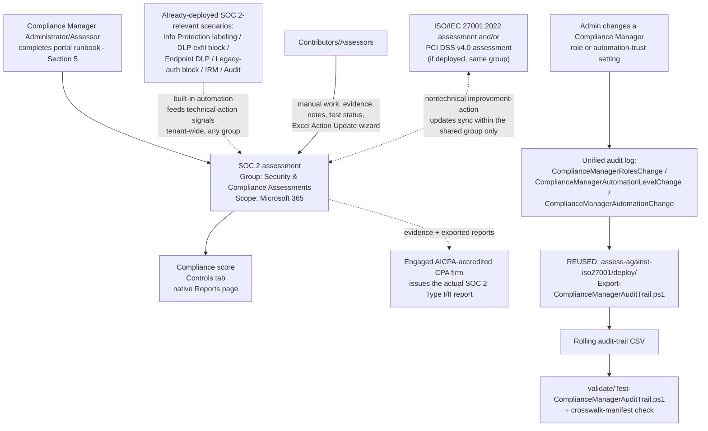

## The short version

Stands up a dedicated **Microsoft Purview Compliance Manager** assessment against the **System and
Organization Controls (SOC) 2** premium regulatory template, places it correctly relative to this
library's other Compliance Manager assessments, and cross-references it against the SOC 2-relevant
technical controls this library already ships (Information Protection labeling, DLP exfiltration
blocking, Adaptive Protection access control, Insider Risk Management, Audit). Like
*Assess Against ISO/IEC 27001:2022* and *PCI DSS v4.0 Assessment*, Compliance Manager itself has no write API, so most of this scenario is a
precise, repeatable **portal runbook** - see section 5 and the design notes.

## Why this matters

**SOC 2** (System and Organization Controls 2) is an American Institute of Certified Public
Accountants (AICPA) attestation framework built on the **2017 Trust Services Criteria (TSC)** -
Security, Availability, Processing Integrity, Confidentiality, and Privacy. Unlike
PCI DSS or HIPAA, SOC 2 is not a legal mandate; it's a **contractual/commercial** driver - enterprise
customers, especially in SaaS procurement, routinely require a current SOC 2 report (Type I or Type
II) as a condition of doing business, and Microsoft's own Office 365 and Azure services carry their
own SOC 2 Type 2 attestations for exactly this reason. A **Type I** report opines
on whether controls are suitably designed at a single point in time; a **Type II** report - the one
most enterprise organizations actually ask for - opines on whether those controls **operated effectively
over a period of performance**, typically 6-12 months. That distinction drives
this scenario's operational emphasis: a Type II report needs sustained evidence, not a
point-in-time snapshot.

Compliance Manager's SOC 2 premium template exists to give an organization's Microsoft 365-based
controls a scored, evidenced internal readiness view before and during a CPA firm's audit fieldwork
 - it does not itself produce a SOC 2 report, and this scenario does not present
it as though it does. This scenario's driver is squarely **commercial/contractual** - closing
enterprise deals that gate on a SOC 2 report - and its value is the same governance/evidence function
*Assess Against ISO/IEC 27001:2022* (why this matters) and *PCI DSS v4.0 Assessment* (why this matters) describe: making
already-built technical controls **legible against a named framework**, which is exactly what a
customer's vendor-security questionnaire or an engaged CPA firm's request-for-evidence list actually
asks for.

## How the control works

## What it takes

### Prerequisites

Full licensing detail and citations: [Licensing matrix](/docs/licensing-matrix/). Summary for this scenario
(identical role/licensing model to *Assess Against ISO/IEC 27001:2022* (the prerequisites) and `pci-dss-assessment/
the prerequisites - Compliance Manager's RBAC and premium-template licensing are tenant-wide, not
per-regulation):

| Requirement | Minimum | Notes |
|---|---|---|
| Compliance Manager base access | **Office 365 / Microsoft 365** license (any tier) | Available at all subscription levels; only premium regulatory templates require more |
| SOC 2 premium template | **A5/E5/G5** (3 free premium templates of choice) **or** the purchased **Compliance Manager premium assessment add-on**, **or** a **90-day premium assessments trial** (25 templates) | Compliance Manager's catalog lists "System and Organization Controls (SOC) 1" and "System and Organization Controls (SOC) 2" as two separate premium templates in its Global category - select **SOC 2**, not SOC 1; see section 11 |
| Role to create/administer the assessment | **Compliance Manager Administration** (or **Compliance Manager Assessor** to create; **Global Administrator** also works) | [RBAC model, section 4](/docs/rbac-model/#4-purview-role-groups-by-module-representative-not-exhaustive) for the Purview role-group mapping |
| Role to edit/test without creating | **Compliance Manager Contribution** (create + edit) or **Compliance Manager Assessor** (edit only, no create) | Assign the narrowest role per person - see `deploy/policy/soc2-assessment-manifest.json` |
| Role for read-only visibility | **Compliance Manager Reader** | Extend to the engaged CPA firm if they need portal visibility, not just exported evidence |
| Automation identity (audit-trail script only) | App registration or account holding the **View-Only Audit Logs** (or **Audit Logs**) Exchange Online role, plus `Exchange.ManageAsApp` | Same requirement as *Assess Against ISO/IEC 27001:2022* (the prerequisites) and *PCI DSS v4.0 Assessment* (the prerequisites) - [RBAC model, section 6](/docs/rbac-model/#6-exchange-online-dependency-the-most-common-permissions-gap) and [Automation surface, section 3](/docs/automation-surface/#3-authentication-patterns---interactive-vs-unattended) |
| Dependency (not deployed by this scenario) | Nothing hard-required, but strongly recommended: *Auto-Label Confidential PII in SharePoint & OneDrive* (+ Exchange sibling), *Auto-Label EU/UK Personal Data in SharePoint & OneDrive* (+ Exchange sibling), *Exchange PII Exfiltration Block (Block or Encrypt)* (+ Part 2), *Endpoint DLP: Block USB Removable Media Exfiltration*, *Block Legacy Authentication*, *Departing Employee Data Theft*, *Forensic Investigation of a Compromised Account* | Reduces the manual-testing backlog and maps directly to the Security, Confidentiality, and Privacy TSC categories - see the manifest's `controlCrosswalk` and the design notes |
| Recommended (not required) | *Assess Against ISO/IEC 27001:2022* and/or *PCI DSS v4.0 Assessment* already deployed | Not a hard dependency, but if present, this scenario's group-placement decision gets meaningfully better - join, don't duplicate |

> Verify current entitlement names against [Licensing matrix](/docs/licensing-matrix/) and the Product Terms before
> a sales commitment - SKU names and the premium-template licensing model change over time.

### Cost and licensing

- **Premium-template licensing, not PAYG** - identical model to *Assess Against ISO/IEC 27001:2022* (the cost and licensing notes) and *PCI DSS v4.0 Assessment* (the cost and licensing notes): 1 of the tenant's 3 free A5/E5/G5 premium-template
  slots, a purchased add-on, or a time-boxed trial.
- **Don't select the wrong sibling template.** SOC 1 and SOC 2 are billed as **separate** premium-template slots - accidentally activating both when only SOC 2 is needed consumes 2 of the tenant's
  3 free slots for no benefit.
- **No additional cost for the audit-trail script** beyond the Exchange Online role assignment, and
  **zero incremental cost if *Assess Against ISO/IEC 27001:2022* and/or *PCI DSS v4.0 Assessment* already run it**
  - this scenario reuses that script rather than running an additional copy.
- **Sizing note:** identical to *Assess Against ISO/IEC 27001:2022* (the cost and licensing notes) - the premium-template
  allotment is per-regulation, not per-assessment.
- **The actual SOC 2 audit is a separate, external cost.** Engaging an AICPA-accredited CPA firm to
  perform the SSAE 18 attestation engagement and issue the SOC 2 report is priced and contracted
  entirely outside Microsoft 365 licensing - this scenario reduces that engagement's evidence-gathering burden but does not reduce or replace its cost.

## Proof it works

1. **Automated file-integrity + manifest check** - `./validate/Test-ComplianceManagerAuditTrail.ps1
   -AuditTrailCsvPath './out/compliance-manager-audit-trail.csv'` confirms the audit-trail CSV's
   schema/de-duplication/sort order (identical checks to *Assess Against ISO/IEC 27001:2022*/
   *PCI DSS v4.0 Assessment*) **and** structurally validates this scenario's own `controlCrosswalk`
   manifest (all 5 TSC categories present, `Security` flagged mandatory, every referenced
   `scenarios/...` path actually exists in this library); exits non-zero on any hard failure.
2. **Manual verification checklist** - the same script prints a checklist (assessment exists,
   correct regulation **and not the SOC 1 lookalike**, group placement correct, role assignments
   match, group-sharing actually works for a shared nontechnical action, and - critically - that
   this assessment isn't being mis-presented as a substitute for an actual SOC 2 report) because
   none of these have a read API to check programmatically.
3. **Functional test (audit-trail script)** - identical procedure to
   *Assess Against ISO/IEC 27001:2022* (the validation steps) and *PCI DSS v4.0 Assessment* (the validation steps): change a test
   user's Compliance Manager role, wait ~60 minutes for audit-log ingestion, re-run with a
   `-StartDate` covering that window, expect a new row with `Operation =
   ComplianceManagerRolesChange`.
4. **Group-sharing functional test** - if *Assess Against ISO/IEC 27001:2022* and/or *PCI DSS v4.0 Assessment* are
   also deployed: pick one nontechnical improvement action common across them, update its
   implementation status and notes in this SOC 2 assessment, then confirm within a few minutes that
   the same update appears in the other assessment(s). This is the one behavior in this scenario
   that's easy to configure wrong (wrong group choice) without any error message telling you so.
5. **Evidence for the engaged CPA firm or a customer's vendor-security reviewer** - the assessment's
   own **Export actions** report is the primary evidence artifact; this scenario's
   audit-trail CSV is a secondary, complementary artifact. **Neither one is a SOC 2 report** - see
   section 11.

## Where it stops

- **This assessment is not a SOC 2 report, and does not substitute for one.** This is the single
  most important limitation in this scenario. A Compliance Manager score, however complete, is an
  internal readiness-tracking and evidence tool - only an independent AICPA-accredited CPA firm
  performing an actual SSAE 18 attestation engagement can issue a SOC 2 Type I or Type II report. Do not let a customer conversation, an internal deck, or
  this scenario's own tooling output imply otherwise.
- **Compliance Manager's regulation catalog lists a separate "System and Organization Controls (SOC)
  1" premium template alongside SOC 2** in the same Global category - SOC 1 addresses a service
  organization's effect on a customer's **financial reporting** internal controls (ICFR, SSAE 18),
  a materially different scope from SOC 2's Trust Services Criteria. Selecting the wrong one wastes
  a premium-template slot and produces an assessment mapped to the wrong control set entirely - see
  the implementation steps step 5 and the cost and licensing notes for the cost consequence.
- **There is no separately-selectable "SOC 2 Type I" vs. "SOC 2 Type II" template in Compliance
  Manager's catalog.** The single "System and Organization Controls (SOC) 2" template's control
  mapping is used for readiness work toward either report type - the Type I/Type II distinction is
  about the CPA firm's actual engagement and reporting period, not about which Compliance Manager
  template is selected.
- **This scenario cannot script assessment creation, control mapping, or improvement-action
  updates** - identical constraint and reasoning to *Assess Against ISO/IEC 27001:2022* (the known limitations) and
  *PCI DSS v4.0 Assessment*.
- **The audit-trail script here is the same file as *Assess Against ISO/IEC 27001:2022*'s and
  *PCI DSS v4.0 Assessment*'s, not an independent implementation** - deliberate, not an oversight; see
  the design notes. It inherits those scripts' own limitations verbatim: it does not track compliance
  score or improvement-action status changes (only the 3 documented role/automation-trust
  operations), and it cannot see Compliance Manager access granted implicitly via the Global
  Administrator, Compliance Administrator, Compliance Data Administrator, or Security Administrator
  Entra ID roles - see *Assess Against ISO/IEC 27001:2022* (the known limitations) for the full statement of both
  limitations, which apply here without modification.
- **The `controlCrosswalk` in `deploy/policy/soc2-assessment-manifest.json` is this library's own
  scenario-to-TSC-category correlation, not Microsoft's published improvement-action mapping** -
  see the design notes. Two of the five TSC categories (Availability, Processing Integrity) have no
  coverage from this Microsoft 365/Purview-only library at all - stated plainly in the manifest
  rather than glossed over. Full Privacy-category coverage also depends on notice/consent/data-subject-request processes this library's scenarios don't build.
- **Audit (Standard) default retention is 180 days** (1 year for Entra ID/Exchange/OneDrive/
  SharePoint under an E5-tier license; up to 10 years with Audit Premium retention policies)
  - shorter than a typical SOC 2 Type II period of performance (6-12 months
 ). Start the recurring audit-trail schedule well before the period of
  performance begins, or invest in Audit Premium retention if a longer native window is preferred.
- **The "Action Update" Excel bulk-import file's exact column schema is not scripted here** - same
  tracked follow-up as *Assess Against ISO/IEC 27001:2022* and *PCI DSS v4.0 Assessment*.
- **This scenario does not select or scope Trust Services Criteria categories within the Compliance
  Manager wizard.** No worked example or documented control was found during this build showing a
  per-category (Security/Availability/Processing Integrity/Confidentiality/Privacy) selection step
  in the assessment-creation flow - the template appears to map the full published SOC 2 control set
  once selected, the same all-or-nothing pattern *PCI DSS v4.0 Assessment* documents for PCI DSS's 6
  goals. **VERIFY (pilot tenant):** whether Compliance Manager's Controls/Improvement actions views
  let you filter or tag improvement actions by TSC category after creation - this would materially
  help a Contributor/Assessor scope their work to only the categories the org's actual SOC 2 report
  will cover.
- **A high compliance score is not proof of compliance, and is even less a proxy for a favorable SOC
  2 opinion.** Microsoft's own FAQ states this explicitly for Compliance Manager generally
  - a CPA firm's SOC 2 opinion depends on evidence and testing methodology this
  assessment does not perform or substitute for.