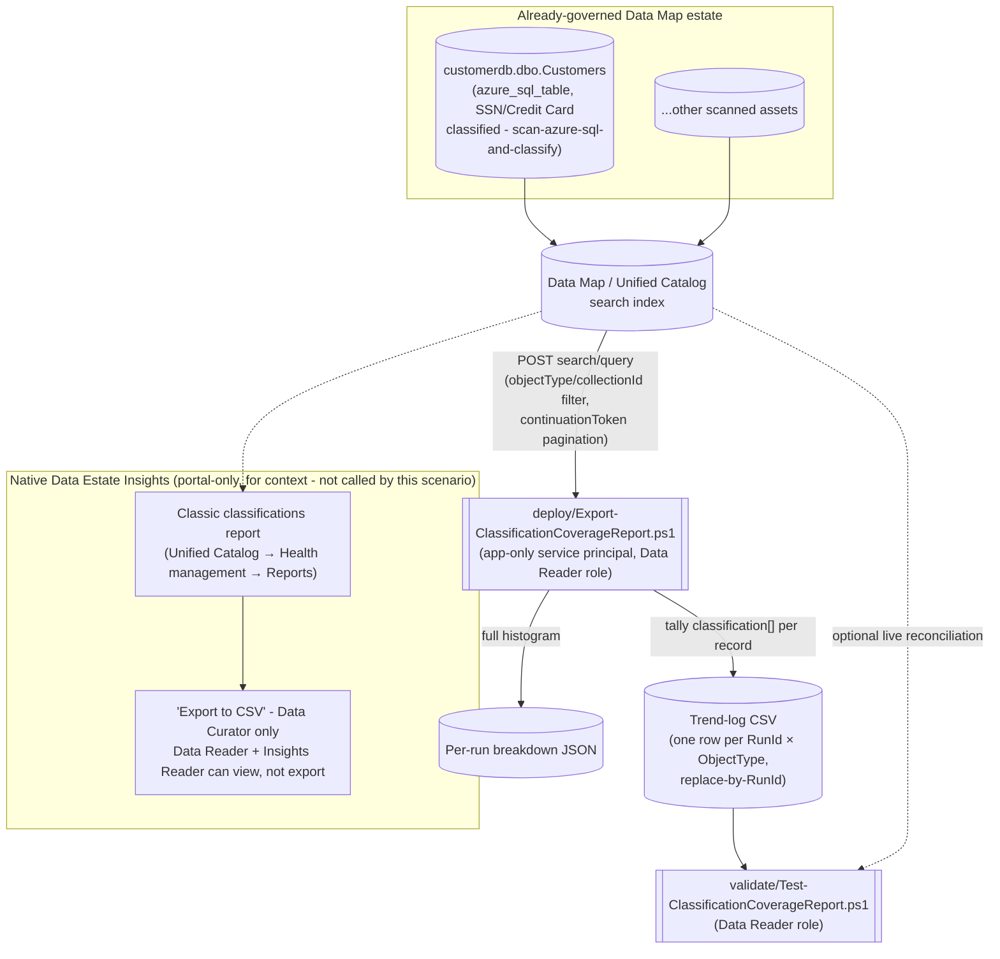

## The short version

Microsoft Purview's native **Data Estate Insights** classification report is a real, automatically-generated dashboard - but it lives only in the portal, has no REST API, gates its own "Export to
CSV" button behind a more privileged role than a read-only automation identity needs, and shows a
rolling 30-day activity window rather than a durable, diffable history. This scenario scripts an
equivalent, exportable **classification coverage report** - total/classified/unclassified asset
counts and a full classification-value breakdown, per object type - using the Purview Data Map
**Discovery - Query** REST API this library's other Data Governance scenarios already treat as
automation surface 4, and appends the result to a source-controllable trend log so the history the
native report discards after 30 days is actually kept.

## Why this matters

Classification coverage is the concrete, measurable proxy governance stakeholders and auditors use
to answer "do you actually know where your sensitive data is": GDPR Art. 30 records-of-processing
and Art. 5(2) accountability both depend on being able to demonstrate what personal data exists and
where, not just assert it; PCI DSS requires an accurate, current inventory of where cardholder data
lives; and a SOC 2 / ISO 27001 auditor evaluating a data-classification control expects evidence of
coverage *trending in the right direction over time*, not a single screenshot. Microsoft's own
framing of the native report makes the same point: it "enables data quality and data security
focused users like data stewards, data curators, and security administrators to understand the
types of information found in their organization's data estate" so they can "identify content with
specific classifications and understand required actions". This scenario doesn't
change what's being measured - it makes the measurement exportable, historical, and obtainable at a
lower privilege level than the native path requires.

This scenario also ties directly into this library's existing Data Governance narrative: the worked
example scopes to `customerdb.dbo.Customers`, the same asset
*Scan Azure SQL Database and Classify Sensitive Columns* scans and classifies (SSN, Credit Card Number).
This report is the natural "what did all that scanning actually produce, in board-deck-ready
numbers, over time" companion to that scenario.

## How the control works

The report script never calls, scrapes, or automates the native Insights application shown above -
it queries the same underlying Data Map search index directly, at a lower privilege level than the
native report's own export path requires. Full design rationale: the design notes.

## What it takes

### Prerequisites

Full licensing detail and citations: [Licensing matrix](/docs/licensing-matrix/). Summary for this scenario:

| Requirement | Minimum | Notes |
|---|---|---|
| Microsoft Purview account + Data Map | Active Azure subscription, Purview account with Data Map enabled | Discovery - Query rides the same Data Map/Unified Catalog PAYG metering as this library's other surface-4 scenarios - see [Licensing matrix, sections 1 and 2](/docs/licensing-matrix/#1-the-two-billing-models-read-this-first) |
| At least one completed scan in scope | Assets already registered and scanned via Data Map (e.g. *Scan Azure SQL Database and Classify Sensitive Columns*) | This scenario does not register or scan any source - see the configuration reference/the design notes |
| Run this scenario's report script | **Data Reader** role on the collection(s) in scope | Discovery - Query is a Catalog Data-plane **read** operation - deliberately narrower than what viewing the native report through "Export to CSV" requires (next row). A credential with this role can already read every classified value in scope one asset at a time via the portal; this scenario changes *how conveniently* that data can be aggregated, not the underlying read boundary - see the known limitations's report-sensitivity note before deciding where the output may be stored |
| View **and export** the *native* Data Estate Insights classification report (for comparison, not required by this scenario) | **Insights Reader** role (assignable only by the root collection's Data Curator) *plus* Data Reader - and even then, **only a Data Curator can select "Export to CSV"**; a Data Reader + Insights Reader can view but not export | This scenario's own script needs none of this - see the design notes goal 2 |
| Grant the automation identity a Purview role at all | **Collection Admin** role at root (or the relevant sub-collection) to perform the role assignment | Only a Collection Admin can assign Data Reader to a service principal |
| Automation identity for the REST calls | App registration with **Data Reader** Purview role on the collection(s) in scope | Client-secret app-only OAuth2, same token endpoint as this library's other surface-4 scripts - [Automation surface, section 3](/docs/automation-surface/#3-authentication-patterns---interactive-vs-unattended) |
| Somewhere to persist the trend-log CSV between runs | A repo path, mounted file share, or blob storage | Not provisioned by this scenario - see the configuration reference and the rollback plan |

> Verify current entitlement names against [Licensing matrix](/docs/licensing-matrix/) (dated 2026-09-02) before a
> sales commitment - SKU names and billing meters change.

### Cost and licensing

- **PAYG, not per-user, and lightweight at this scenario's scale.** Discovery - Query calls bill
  through the same Data Map / Unified Catalog PAYG metering as *Scan Azure SQL Database and Classify Sensitive Columns* and *Close Gaps and Validate End-to-End Customer Data Lineage* - see
  [Licensing matrix, sections 1 and 2](/docs/licensing-matrix/#1-the-two-billing-models-read-this-first). This scenario's calls are read-only search queries, not a scan -
  cost impact is negligible relative to the scanning this scenario depends on as a prerequisite, with
  the caveat that `-Mode Full` at very large estate scale makes materially more calls than a single
  facet query.
- **No M365 per-user license required** - same PAYG/Azure-consumption model as this library's other
  Data Map scenarios.
- **The native Data Estate Insights application itself carries no separate bill** - Microsoft states
  that disabling it removes it from billing entirely, implying it is not separately metered while
  enabled; this scenario's report is an *adjunct* to that free capability, not a
  paid replacement for it.
- **The real cost driver is storage/retention for the trend log**, and the engineering time to wire
  this script into a scheduler and a downstream consumer (board deck template, GRC tool, SIEM) - not
  incremental Azure spend from the queries themselves.

## Proof it works

1. **Automated file-integrity check** - `./validate/Test-ClassificationCoverageReport.ps1` confirms
   the trend log's schema, that no `(RunId, ObjectType)` row is duplicated (proof the replace-by-
   RunId idempotency design is holding), and that `ClassifiedAssets + UnclassifiedAssets` equals
   `TotalAssets` for every Full-mode row. Runs without any tenant credentials - safe to wire into a
   CI-style check on the trend-log file itself.
2. **Live reconciliation (optional)** - supplying tenant credentials adds a check that the most
   recent run's `TotalAssets` is still within a configurable threshold of the *current*
   `@search.count` for that scope, catching a stale report (one that hasn't been re-run since a
   rescan or bulk deletion) as a `[WARN]`, distinct from a hard `[FAIL]`.
3. **Cross-check against the native report** - open the same collection's **Classic classifications**
   report in the portal and compare the top classification values and their relative order
   against this scenario's breakdown JSON for the same object type. Exact counts may differ slightly
   (the native report's own refresh cadence is weekly by default; this scenario's
   script queries live), but the same classification values should appear with a broadly consistent
   ranking.
4. **Idempotency proof** - re-run `deploy/Export-ClassificationCoverageReport.ps1` a second time with
   the same `-RunId` and confirm the trend log still has exactly one row per `(RunId, ObjectType)` -
   never two.

## Where it stops

- **This report is itself a sensitive artifact and must be protected accordingly.** A trend-log row
  or breakdown file that says "customerdb.dbo.Customers: 2 classified assets (SSN, Credit Card
  Number)" is, by construction, a curated index of where an organization's most sensitive data
  lives - more convenient to exfiltrate than the same information locked inside Purview's own
  collection-scoped RBAC, since a flat CSV/JSON file carries no access control at all once it leaves
  the script's memory. Store `-TrendLogPath`/`-BreakdownOutputDirectory` output in access-controlled
  storage (a private repository, a permissioned file share or blob container) - never an open share -
  and apply the same handling discipline to it that governs the source classifications it summarizes.
  See the rollback runbook section 3 for the same consideration at decommission time, and the prerequisites's Data Reader row
  above: a Data Reader credential that can read this report can, by definition, already read every
  classified value it aggregates - this scenario's aggregation makes bulk extraction a single script
  run rather than manual portal browsing, which is precisely why the report artifact itself needs
  this protection.
- **No documented Discovery - Query filter for "has any classification" / "has no classification"
  exists.** Microsoft's own REST reference for this operation documents only an exact-value
  classification filter (`"classification": "<value>", "includeSubClassifications": true`), and a Microsoft Q&A thread on exactly this question confirms no broader filter
  is exposed. Rather than approximate one with an unconfirmed expression (e.g. a
  `prefix` match against `"MICROSOFT."`), this scenario computes the classified/unclassified split by
  paging through every record and testing its documented `classification` array field client-side.
  This is the one design choice in this scenario that trades API-call cost for correctness - see
  the design notes for the alternative `-Mode Facets` trade-off.
- **`-Mode Full` does not scale to unbounded estate sizes without cost.** Paging through every record
  of an object type with several hundred thousand+ assets is a real, non-trivial number of API calls
  (records ÷ 1000, rounded up). This scenario does not implement incremental/delta tallying (e.g.
  only re-tallying assets modified since the last run) - see the design notes. `-Mode Facets` is the
  documented cheaper alternative, with its own named trade-off (no unclassified count; double-counts
  a multi-classified asset under every value it carries, exactly like the native "Top classifications"
  chart does).
- **`-Mode Facets`' classification counts double-count multi-classified assets - this matches, not
  diverges from, the native report's own behavior**, but is worth stating plainly so a report
  consumer doesn't sum facet counts and expect them to equal a distinct-asset total.
  `-Mode Full`'s `ClassifiedAssets`/`UnclassifiedAssets` counts do not have this problem - they tally
  distinct assets, not distinct (asset, classification-value) pairs.
- **`-Mode Facets` is top-N-truncated, not exhaustive - and silently so.** `-FacetTopN` (default 25)
  caps how many classification values come back per object type; a classification present on only a
  handful of assets, below that cutoff, disappears from the output entirely with no "and N more"
  indicator. A reader building a compliance narrative on `-Mode Facets` output needs to know it may
  be an incomplete list, not a full one - `-Mode Full` reports every distinct classification value
  observed, with no truncation.
- **This scenario reports on classifications only - not sensitivity labels or glossary/curation
  rates**, the native Insights application's two other "Curation and governance" report families. Both are natural sibling fragments (the `label` field on the same
  `SearchResultValue` schema would extend this same pattern to sensitivity-label coverage); tracked
  as follow-ups in the project backlog rather than built speculatively here.
- **A paged-record-count vs. `@search.count` mismatch is possible and undocumented as either an
  error or a non-issue.** This scenario's deploy script treats it as a `Write-Warning`, never a hard
  failure, and flags the affected run's classified/unclassified split as worth double-checking - see
  the script's `.NOTES`.
- **This scenario does not push results anywhere** - no built-in Log Analytics/Sentinel/Power BI
  sink. The trend-log CSV and per-run breakdown JSON are the deliverable; routing them into a SIEM or
  BI tool is the deploying organization's own integration, consistent with this library's DLP/Data Quality scenarios'
  treatment of "bring your own SIEM."
- **This is not a replacement for the native Data Estate Insights application** for a human who
  simply wants to browse coverage interactively, drill into specific assets, or use the portal's own
  filter/sort UI - this scenario exists specifically for the export/schedule/history/least-privilege
  gaps the native report leaves, not as a general substitute.