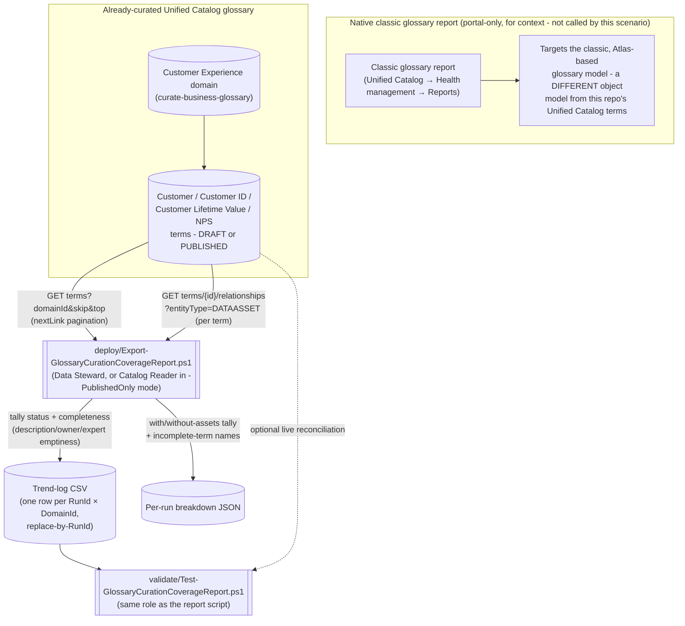

## The short version

Microsoft Purview's native **Data Estate Insights** application ships a **Classic glossary** report
with genuinely useful KPIs - total terms, approved terms without assets, expired terms with assets,
a status/asset-attachment snapshot, and an incomplete-terms breakdown - but it targets the classic,
Atlas-based glossary model, has no REST API of its own, and keeps no durable history beyond its own
refresh cadence. This scenario scripts the *same category* of KPIs against the object model this
repo's own glossary scenario actually uses - the current **Unified Catalog Terms REST API**
(*Curate a Business Glossary*) - and appends the result to a
source-controllable trend log, using the Terms operation group's documented `List` and
`List Related Entities` operations.

## Why this matters

A glossary that exists but isn't curated or attached to any data asset provides none of the
governance value Microsoft's own guidance assigns it: "populate the glossary" is step two of the
Purview data-visibility baseline specifically so terms like *Customer* or *Revenue* carry a shared
meaning teams can build on
(*Curate a Business Glossary* (why this matters)). A term sitting in `DRAFT` with
no owner, no expert, and no linked asset is measurably incomplete - and without a report, that
incompleteness is invisible until someone happens to click into the term in the portal.

This scenario ties the same governance-maturity narrative to concrete, exportable evidence:
- **SOC 2 / ISO 27001 change-management and control-maturity evidence** - a trended
  "percent of published terms actually attached to an asset" number is a citable, board-deck-ready
  proxy for whether the glossary is a living control or an abandoned one-time exercise.
- **GDPR/CCPA data-mapping accountability** - an incomplete term (no owner, no expert) is a term
  nobody is accountable for; this report surfaces exactly which terms need that gap closed, the
  same "identify and act" framing Microsoft uses for its own classification/glossary insights
  (*Exportable, Historical Classification Coverage Report* (why this matters)).
- **CDMC (Cloud Data Management Capabilities)** - ownership and business-context completeness are
  direct inputs to Unified Catalog's own CDMC control-maturity tracking
  (*Curate a Business Glossary* (why this matters)).

This scenario also ties directly into this library's existing narrative: the worked example reports on
the exact `Customer Experience` domain and four terms *Curate a Business Glossary* creates - the
natural "how healthy is the glossary we just curated, over time" companion to that scenario.

## How the control works

The report script never calls, scrapes, or automates the classic glossary report shown above - it
queries the Unified Catalog Terms REST API directly, the same object model
*Curate a Business Glossary* already authors into. Full design rationale: the design notes.

## What it takes

### Prerequisites

Full licensing detail and citations: [Licensing matrix](/docs/licensing-matrix/). Summary for this scenario:

| Requirement | Minimum | Notes |
|---|---|---|
| Unified Catalog data governance | **Pay-as-you-go (PAYG)** Purview account, Unified Catalog enabled | See the cost and licensing notes - this scenario only reads existing domain/term metadata; it creates no billable governed asset |
| A populated governance domain | At least one domain with glossary terms (e.g. *Curate a Business Glossary*'s `Customer Experience` domain) | This scenario does not create or curate terms - see the configuration reference/the design notes |
| Report role (default mode, full status coverage) | **Data Steward** on every `-DomainIds` value | Only documented role that can see `DRAFT`-status terms - more privileged than this report's own `-PublishedOnly` mode, see next row |
| Report role (`-PublishedOnly` mode) | **Global Catalog Reader** or **Local Catalog Reader** | Documented as reading only **published** artifacts across (Global) or within (Local) governance domains - Draft/Expired-dependent KPIs are reported as `N/A` in this mode, never a false zero |
| Grant the automation identity a Unified Catalog role at all | A **Governance Domain Owner** (or a Data Governance Administrator delegating one) assigns roles on the domain's **Roles** tab | Same assignment path *Curate a Business Glossary* (the prerequisites) already documents |
| Automation identity for the REST calls | App registration assigned the role above, client-credentials OAuth2 against resource `https://purview.azure.net` | Same pattern as [Automation surface, section 3](/docs/automation-surface/#3-authentication-patterns---interactive-vs-unattended) and *Curate a Business Glossary*'s own script |
| Somewhere to persist the trend-log CSV between runs | A repo path, mounted file share, or blob storage | Not provisioned by this scenario - see the configuration reference and the rollback plan |

> Verify current entitlement names against [Licensing matrix](/docs/licensing-matrix/) (dated 2026-09-02) before a
> sales commitment - SKU names and role names change, and this scenario targets a **public preview**
> REST API surface (`2026-03-20-preview`) that Microsoft explicitly documents as subject to change
> before general availability.

### Cost and licensing

- **This scenario, by itself, incurs no incremental PAYG charge.** It only reads terms and existing
  term-to-asset relationships - it links no new data asset to anything. Unified Catalog's governed-assets billing meter is driven by assets actively linked to a governance concept
  (*Curate a Business Glossary* (the cost and licensing notes)); a read of an existing
  relationship doesn't create a new governed-asset-day.
- **No M365 per-user license required** - same PAYG-only model as *Curate a Business Glossary* and
  *Exportable, Historical Classification Coverage Report* ([Licensing matrix, section 2](/docs/licensing-matrix/#2-master-capability--license-matrix)).
- **The classic Data Estate Insights application itself carries no separate bill**, and this
  scenario doesn't call it at all - see *Exportable, Historical Classification Coverage Report* (the cost and licensing notes) for the
  citation; not repeated here since this scenario's KPIs come from a different API entirely.
- **The real cost driver is the per-term `List Related Entities` call volume at scale** -
  a domain with several thousand terms makes several thousand additional API calls per run unless
  `-SkipAssetLinkCheck` is set - and the engineering time to wire this script into a scheduler and a
  downstream consumer, not incremental Azure spend from the queries themselves.

## Proof it works

1. **Automated file-integrity check** - `./validate/Test-GlossaryCurationCoverageReport.ps1`
   confirms the trend log's schema, that no `(RunId, DomainId)` row is duplicated (proof the
   replace-by-RunId idempotency design is holding), and that the status counts and the
   with-assets/without-assets counts each sum to `TotalTerms` for every row where the corresponding
   check ran. Runs without any tenant credentials - safe to wire into a CI-style check on the
   trend-log file itself.
2. **Live reconciliation (optional)** - supplying tenant credentials adds a check that the most
   recent run's `TotalTerms` for a domain is still consistent with a fresh `List` call for that
   domain, catching a stale report as a `[WARN]`, distinct from a hard `[FAIL]`.
3. **Cross-check against the portal** - open the domain in **Unified Catalog** → **Governance
   domains** → the domain → **Glossary terms** → **View all**, and compare the Draft/Published/
   Expired counts and which terms show a **Governance** tab asset link against this scenario's
   breakdown JSON for the same domain. Do **not** cross-check against the
   classic glossary report - it reads a different object model entirely.
4. **Idempotency proof** - re-run `deploy/Export-GlossaryCurationCoverageReport.ps1` a second time
   with the same `-RunId` and confirm the trend log still has exactly one row per
   `(RunId, DomainId)` - never two.

## Where it stops

- **This report targets the Unified Catalog Terms model, not the classic glossary model the native
  report reads - they are not interchangeable, and this scenario's numbers will not match the
  classic glossary report's numbers for a tenant still on the classic Data Catalog glossary.**
  An organization that hasn't migrated to Unified Catalog terms will see this scenario report zero terms
  against a non-zero classic-glossary count. This is a disclosed scope boundary
  (the design notes point 4, section 8), not a bug - confirm which glossary model a given tenant actually
  uses before pointing this scenario at it.
- **No `Alert`-status equivalent is computed.** The classic report's four-value status vocabulary
  (`Draft`/`Approved`/`Alert`/`Expired`) has no `Alert` analog on the Unified Catalog `Term` object's
  three-value `CatalogModelStatus` enum (`DRAFT`/`PUBLISHED`/`EXPIRED`) - this scenario reports three
  statuses and states why, rather than fabricating a fourth.
- **"Missing steward" is an interpretive mapping to `contacts.owner`, not a Microsoft-confirmed term
  equivalence.** The new `ContactsMap` schema's contact types are `owner`/`expert`/`databaseAdmin` -
  there is no field literally named `steward`. This scenario treats `owner` as the closest documented
  analog and says so in the design notes rather than asserting the classic report's "steward" and the
  new model's "owner" are formally the same Microsoft-defined concept.
- **Weekly/monthly active-user counts (the native Data Stewardship/Catalog Adoption dashboards'
  usage-telemetry metric) are out of scope and not approximated.** No documented REST operation on
  any Unified Catalog operation group exposes portal search/view telemetry - this was the specific
  gap the originating project follow-up flagged as needing "a different REST primitive," and
  this build's grounding pass confirms none exists rather than guessing a proxy metric.
- **The per-term asset-attachment check does not scale to unbounded glossary sizes without cost.**
  One `List Related Entities` call per term, every run (records ÷ 1, not batched - no documented
  bulk "which of these N terms have assets" operation exists). `-SkipAssetLinkCheck` is the
  documented opt-out, at the cost of leaving with/without-assets KPIs as `Skipped` in that run's
  output rather than computed.
- **No documented maximum `top` value for Terms - List.** This scenario defaults `-PageSize` to a
  conservative 100 and always follows `nextLink` until absent, so an unconfirmed server-side cap
  cannot cause a silently truncated pull - but a tenant with a very large single domain should
  confirm actual page-size behavior in a pilot tenant before assuming 100 is optimal for runtime.
  **Re-grounded 2026-09-28** (Microsoft Learn MCP, re-fetched against the pinned
  `2026-03-20-preview` API version this scenario uses): `top`'s reference entry still states only
  "The number of result items to return" with no ceiling - genuinely still undocumented, not a
  guess. The same fetch surfaced one previously-undocumented, directly relevant fact worth
  recording: `Terms - List` now documents a **rate limit of 100 requests per 20-second window** for
  this API version - not present on the `2025-09-15-preview` reference. `-PageSize 100` (this
  scenario's default) keeps a single-domain pull well inside that window at any realistic glossary
  size; a future revision touching multiple `-DomainIds` in a tight loop should be aware a large
  fan-out could approach the limit and may want a 429 backoff, which this script does not currently
  implement.
- **`Terms - Get Facets`' `facets[].name` values are not enumerated in Microsoft's reference** -
  only a worked `owner` example exists. This scenario deliberately does not attempt an unconfirmed
  `status` or `hasAssets` facet request to short-circuit the client-side tally -
  a future revision could adopt a facets-based fast path once Microsoft documents valid facet names,
  the same class of "wait for documentation, don't guess the shape" discipline
  *Exportable, Historical Classification Coverage Report* (the known limitations) already applies to its own `-Mode Facets`.
- **`-PublishedOnly` mode reports `N/A`, not `0`, for Draft/Expired-dependent KPIs** - a consuming
  report or dashboard must handle that distinction explicitly (an `N/A` means "not measured due to
  role," not "there are none").
- **This scenario does not push results anywhere** - no built-in Log Analytics/Sentinel/Power BI
  sink, consistent with *Exportable, Historical Classification Coverage Report* (the known limitations)'s own treatment of
  "bring your own SIEM."
- **This report is a sensitivity-adjacent artifact** - a lower sensitivity tier than
  *Exportable, Historical Classification Coverage Report*'s output (glossary metadata, not classified-data locations), but
  still an index of business terminology, ownership, and which business concepts are actively
  governed. Store `-TrendLogPath`/`-BreakdownOutputDirectory` output in access-controlled storage,
  consistent with this library's general handling discipline for reporting-scenario output.