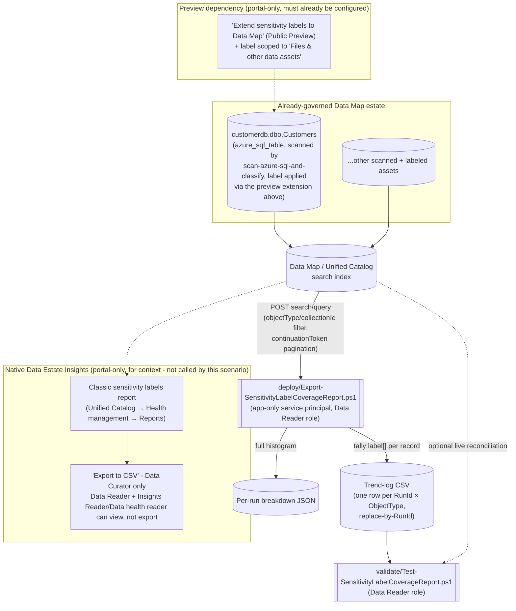

## The short version

> **Public Preview dependency.** This scenario reads labels applied via "Extend sensitivity labels to
> assets in Microsoft Purview Data Map," which is itself a Microsoft-labeled **preview** capability as
> of this build. Re-check GA status before a production-facing
> deployment - see the known limitations.

Microsoft Purview's native **Data Estate Insights** classification report family includes a **Classic
sensitivity labels** report - a real, automatically-generated dashboard - but, like its sibling
**Classic classifications** report, it lives only in the portal, has no REST API, gates its own
"Export to CSV" button behind a more privileged role than a read-only automation identity needs, and
shows a rolling 30-day activity window rather than a durable, diffable history. This scenario scripts
an equivalent, exportable **sensitivity-label coverage report** - total/labeled/unlabeled asset counts
and a full label-value breakdown, per object type - using the same Purview Data Map **Discovery -
Query** REST API this library's other Data Governance scenarios already treat as automation surface 4,
and appends the result to a source-controllable trend log so the history the native report discards
after 30 days is actually kept. It is the direct sibling of
*Exportable, Historical Classification Coverage Report*, applying the identical,
already-reviewed design to the `label` field instead of `classification`.

## Why this matters

Sensitivity labels are the mechanism Microsoft Purview uses to state *how sensitive* certain data is
and to drive the handling/protection actions that follow from that - Microsoft's own framing of the
native report makes this precise: it "enables security administrators to ensure the security of the
data found in their organization's data estate by identifying where sensitive data is stored," so they
can "identify the sensitivity labels found in your content and understand required actions, such as
managing access to specific repositories or files". Where the sibling
*Exportable, Historical Classification Coverage Report* scenario answers "do we know what kinds of sensitive data exist and
where," this scenario answers the adjacent, security-operations question: "is the protection posture
(the label) we've decided on for that data actually applied, and is coverage trending in the right
direction." A GDPR Art. 32 (security of processing) or SOC 2 / ISO 27001 access-control auditor
evaluating a data-protection control expects evidence that protective labeling is both applied and
*trending*, not asserted from a single screenshot - the same historical-evidence gap the sibling
scenario's driver names for classifications.

This scenario ties directly into this library's existing Data Governance narrative and its own sibling
report: the worked example scopes to the same `customerdb` collection
*Scan Azure SQL Database and Classify Sensitive Columns* scans and
*Exportable, Historical Classification Coverage Report* already reports classification
coverage for. An organization that wants the full "what's classified, and separately, what's actually
protected-by-label" picture runs both sibling scripts against the same estate.

> **A high `PercentLabeled` number is not, by itself, evidence that the underlying data is
> encrypted, access-restricted, or otherwise protected.** Microsoft documents plainly that a
> sensitivity label surfaced in the Data Map is applied **only as metadata** - "these sensitivity
> labels don't modify your files and databases in any way," and Data Map does not currently support
> encryption, content marking, or DLP enforcement for the files/tables it labels
>. This report measures **labeling coverage**, i.e. "is
> sensitivity known and recorded," not **protection coverage**, i.e. "is access to this data actually
> restricted." Do not present this scenario's output as proof of enforced protection - see the known limitations.

## How the control works

The report script never calls, scrapes, or automates the native Insights application shown above - it
queries the same underlying Data Map search index directly, at a lower privilege level than the native
report's own export path requires. Full design rationale: the design notes.

## What it takes

### Prerequisites

Full licensing detail and citations: [Licensing matrix](/docs/licensing-matrix/). Summary for this scenario:

| Requirement | Minimum | Notes |
|---|---|---|
| Microsoft Purview account + Data Map | Active Azure subscription, Purview account with Data Map enabled | Discovery - Query rides the same Data Map/Unified Catalog PAYG metering as this library's other surface-4 scenarios - see [Licensing matrix, sections 1 and 2](/docs/licensing-matrix/#1-the-two-billing-models-read-this-first) |
| **"Extend sensitivity labels to Data Map" turned on**, with at least one asset already labeled | A Microsoft 365 E5/A5/G5 (or E5/A5/G5 Compliance, or E5/A5/G5 Information Protection and Governance, or Office 365 E5 + EMS E5/A5/G5 + AIP Plan 2) license in the same Entra tenant as the Purview account **or**, for non-Microsoft-365 sources, PAYG billing enabled | This is a **Public Preview** capability and a separate licensing dependency from Data Map scanning itself - see the known limitations. This scenario does not turn this on or apply any label - see the configuration reference/the design notes |
| At least one completed scan in scope | Assets already registered and scanned via Data Map | This scenario does not register or scan any source - see the configuration reference/the design notes |
| Run this scenario's report script | **Data Reader** role on the collection(s) in scope | Discovery - Query is a Catalog Data-plane **read** operation - deliberately narrower than what viewing the native report through "Export to CSV" requires (next row). A credential with this role can already read every label value in scope one asset at a time via the portal; this scenario changes *how conveniently* that data can be aggregated, not the underlying read boundary - see the known limitations's report-sensitivity note before deciding where the output may be stored |
| View **and export** the *native* Data Estate Insights sensitivity-labels report (for comparison, not required by this scenario) | **Insights Reader** role (assignable only by the root collection's Data Curator) *plus* Data Reader on the classic experience - or **Data health reader** on the new Unified Catalog experience - and even then, **only a Data Curator can select "Export to CSV"**; a Data Reader + Insights Reader can view but not export | This scenario's own script needs none of this - see the design notes goal 2 |
| Grant the automation identity a Purview role at all | **Collection Admin** role at root (or the relevant sub-collection) to perform the role assignment | Only a Collection Admin can assign Data Reader to a service principal |
| Automation identity for the REST calls | App registration with **Data Reader** Purview role on the collection(s) in scope | Client-secret app-only OAuth2, same token endpoint as this library's other surface-4 scripts - [Automation surface, section 3](/docs/automation-surface/#3-authentication-patterns---interactive-vs-unattended) |
| Somewhere to persist the trend-log CSV between runs | A repo path, mounted file share, or blob storage | Not provisioned by this scenario - see the configuration reference and the rollback plan |

> Verify current entitlement names against [Licensing matrix](/docs/licensing-matrix/) (dated 2026-09-02) before a
> sales commitment - SKU names and billing meters change, and this scenario's own preview dependency
> (row 2) is especially likely to change before GA.

### Cost and licensing

- **PAYG for the Discovery - Query calls themselves, not per-user, and lightweight at this scenario's
  scale.** Calls bill through the same Data Map / Unified Catalog PAYG metering as
  *Exportable, Historical Classification Coverage Report* - see [Licensing matrix, sections 1 and 2](/docs/licensing-matrix/#1-the-two-billing-models-read-this-first). This scenario's calls are read-only search queries, not a scan - cost impact is negligible
  relative to the scanning this scenario depends on as a prerequisite.
- **A separate, real license cost sits upstream of this scenario and is easy to miss:** the "extend
  sensitivity labels to Data Map" capability itself requires at least one Microsoft 365 E5/A5/G5-tier
  (or equivalent Compliance/Information Protection and Governance) license in the tenant, or PAYG
  billing for non-Microsoft-365 sources - this is a licensing gate the sibling
  *Exportable, Historical Classification Coverage Report* scenario does not have (classifications require only Data Map
  scanning, not a Microsoft 365 label license). Confirm this license already exists in the deploying organization's
  tenant before quoting this scenario as a drop-in addition to the classification-coverage report.
- **No additional M365 per-user license required for this scenario's own script** beyond whatever
  license already satisfies the upstream label-extension prerequisite above - the report script itself
  rides the same PAYG Data Map metering as every other surface-4 scenario in this library.
- **The native Data Estate Insights application itself carries no separate bill** - same as the
  sibling scenario's own note; this scenario's report is an *adjunct* to that free
  capability, not a paid replacement for it.
- **The real cost driver is storage/retention for the trend log**, and the engineering time to wire
  this script into a scheduler and a downstream consumer - not incremental Azure spend from the
  queries themselves.

## Proof it works

1. **Automated file-integrity check** - `./validate/Test-SensitivityLabelCoverageReport.ps1` confirms
   the trend log's schema, that no `(RunId, ObjectType)` row is duplicated (proof the replace-by-RunId
   idempotency design is holding), and that `LabeledAssets + UnlabeledAssets` equals `TotalAssets` for
   every Full-mode row. Runs without any tenant credentials - safe to wire into a CI-style check on the
   trend-log file itself.
2. **Live reconciliation (optional)** - supplying tenant credentials adds a check that the most recent
   run's `TotalAssets` is still within a configurable threshold of the *current* `@search.count` for
   that scope, catching a stale report (one that hasn't been re-run since a rescan, bulk relabeling, or
   bulk deletion) as a `[WARN]`, distinct from a hard `[FAIL]`.
3. **Cross-check against the native report** - open the same collection's **Classic sensitivity
   labels** report in the portal and compare the top label values and their relative order
   against this scenario's breakdown JSON for the same object type. Exact counts may differ slightly
   (the native report's own refresh cadence vs. this scenario's live query), but the same label values
   should appear with a broadly consistent ranking.
4. **Idempotency proof** - re-run `deploy/Export-SensitivityLabelCoverageReport.ps1` a second time
   with the same `-RunId` and confirm the trend log still has exactly one row per `(RunId, ObjectType)`
   - never two.

## Where it stops

- **A high `PercentLabeled` is a labeling-coverage metric, not a protection-coverage metric - do not
  conflate the two in a board or auditor narrative.** Microsoft documents that a sensitivity label
  surfaced through the Data Map extension is applied **only as metadata**: "these sensitivity labels
  don't modify your files and databases in any way," Data Map does not currently support encryption or
  content marking for the files/tables it labels, and Data Map does not provide DLP enforcement at all
  - DLP is supported only for Microsoft 365 apps and services.
  This report proves an asset's sensitivity was *identified and recorded*; it says nothing about
  whether access to that asset is actually restricted. A reader who needs evidence of *enforced*
  protection (encryption, access control, DLP) needs this library's DLP/Information Protection module
  scenarios (*DLP*, *Information Protection*), not this report.
- **`0% labeled` for a collection or object type is ambiguous between two structurally different
  causes, and this scenario's script cannot currently distinguish them.** Microsoft's supported-source
  list for the Data Map sensitivity-label extension is a specific, named set (Azure Blob Storage, ADLS
  Gen1/Gen2, SQL Server, Azure SQL Database, Azure SQL Managed Instance, Amazon S3, Amazon RDS
  (public preview), Power BI) - a source type outside that list will always read
  0% labeled regardless of how sensitive its data actually is, because labeling isn't available there
  at all, not because coverage was skipped. Before treating a low `PercentLabeled` number as a
  governance gap to close, confirm the scoped object type/collection is actually a supported source -
  this scenario's script does not perform that check itself (a candidate follow-up, tracked in
  the project backlog).
- **"Extend sensitivity labels to Data Map" is a Public Preview capability as of this build**
  - everything this scenario reports on depends on it. Re-check
  GA status, licensing terms, and whether the `label` field/facet semantics documented in the
  Discovery - Query reference still hold once (if) it reaches GA, before a production-facing
  deployment.
- **This report is itself a sensitive artifact and must be protected accordingly** - identical
  reasoning to the sibling *Exportable, Historical Classification Coverage Report* scenario's own the known limitations note, reproduced here
  for self-containment: a trend-log row or breakdown file that says "customerdb.dbo.Customers:
  Confidential" is, by construction, a curated index of where an organization's most sensitively
  *labeled* - i.e. already flagged as requiring protection - data lives, more convenient to exfiltrate
  than the same information locked inside Purview's own collection-scoped RBAC. Store
  `-TrendLogPath`/`-BreakdownOutputDirectory` output in access-controlled storage - never an open
  share - and apply the same handling discipline to it that governs the source labels it summarizes.
  See the rollback runbook section 3 for the same consideration at decommission time.
- **No documented Discovery - Query filter for "has any label" / "has no label" exists.** Microsoft's
  own REST reference for this operation documents only an exact-value `classification` filter, with no
  analogous worked example for `label` - see the design notes goal 3. Rather than
  approximate one, this scenario computes the labeled/unlabeled split by paging through every record
  and testing its documented `label` array field client-side - the same trade-off (API-call cost for
  correctness) the sibling scenario already accepts for `classification`.
- **`-Mode Full` does not scale to unbounded estate sizes without cost**, for the same reason as the
  sibling scenario - see the design notes. `-Mode Facets` is the documented cheaper alternative, with
  its own named trade-off (no unlabeled count; double-counts a multi-labeled asset under every value
  it carries, exactly like the native "Top labels" charts do).
- **`-Mode Facets` is top-N-truncated, not exhaustive - and silently so**, identical caveat to the
  sibling scenario (`-FacetTopN`, default 25).
- **No official Microsoft-named "Unlabeled assets" KPI exists for this scenario to reproduce**, unlike
  the sibling *Exportable, Historical Classification Coverage Report* scenario, which reproduces the native Classic assets
  report's own explicitly-defined "Unclassified assets" KPI verbatim. This scenario's "unlabeled"
  metric - an asset whose `label` array is empty - is this library's own designed analog to that KPI, not
  a term Microsoft itself defines and publishes. A reader building a compliance narrative on this
  number should describe it as such, not attribute it to Microsoft's own reporting language. See
  the design notes.
- **A paged-record-count vs. `@search.count` mismatch is possible and undocumented as either an error
  or a non-issue** - identical treatment (`Write-Warning`, never a hard failure) to the sibling
  scenario.
- **This scenario does not push results anywhere** - no built-in Log Analytics/Sentinel/Power BI
  sink, identical scope to the sibling scenario.
- **This is not a replacement for the native Data Estate Insights application** for a human who simply
  wants to browse label coverage interactively, drill into specific assets, or use the portal's own
  filter/sort UI - this scenario exists specifically for the export/schedule/history/least-privilege
  gaps the native report leaves, not as a general substitute.
- **This scenario does not extend, apply, or manage sensitivity labels or the Data Map extension
  capability itself** - it only reads whatever is already labeled. See the design notes.