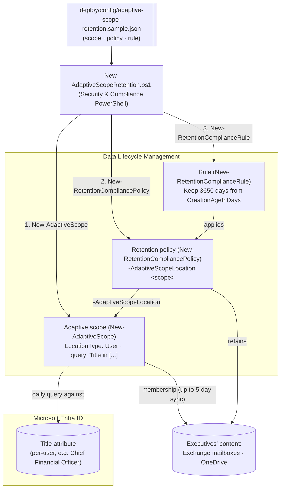

## The short version

Retains executives' Exchange email and OneDrive content for a fixed period using an **adaptive
scope** - a daily-refreshed query against the Entra `Title` attribute - instead of a static
distribution list or SharePoint site that someone has to maintain by hand as people are promoted,
hired, or leave. Deployed as code via Security & Compliance PowerShell: one `New-AdaptiveScope`
call, one `New-RetentionCompliancePolicy -AdaptiveScopeLocation` call, one `Keep`-only
`New-RetentionComplianceRule`.

## Why this matters

Executives' communications are disproportionately relevant to litigation holds, regulatory
inquiries, and internal investigations - many organizations retain them longer than the standard
population as a corporate-governance and litigation-readiness baseline. The operational problem
with a static scope for this population is turnover: a distribution list or explicit mailbox list
requires someone to notice every promotion, hire, and departure and edit the policy. Microsoft's
own documented adaptive-scopes guidance uses this exact scenario as its worked example: "For new
executives, there's no need to reconfigure the retention policy because these new users... are
automatically picked up". This scenario builds that pattern as reproducible
code, generalizable to any attribute-driven population (department, country/region, a
custom Entra extension attribute).

> ⚠️ **Lower irreversibility than a record label, but not zero risk.** This scenario is `Keep`-only
> - not a record or regulatory record - so rollback genuinely releases retention rather than
> leaving content locked. The real risk here is **scope precision**: an
> over-broad or stale `Title` query retains (or fails to retain) the wrong population. Validate
> actual scope membership (`Get-AdaptiveScopeMembers`) before relying on this operationally, and
> allow up to 5 days for the query to populate after any change.

## How the control works

The scope's query decides **who** (re-evaluated daily against Entra); the policy/rule decide **how
long and what happens** (`Keep`, 3650 days). Unlike a static-scope policy, no location list or
mailbox list is maintained by hand. Full rationale, including the disclosed parameter-surface gap
on which *locations* an adaptive-scope policy actually covers: the design notes.

## What it takes

### Prerequisites

Full licensing detail: [Licensing matrix](/docs/licensing-matrix/). RBAC: [RBAC model](/docs/rbac-model/). Automation surface:
[Automation surface](/docs/automation-surface/) (surface 2 - Security & Compliance PowerShell). Summary:

| Requirement | Minimum | Notes |
|---|---|---|
| Licensing | Adaptive scopes, auto-apply, trainable-classifier retention: **M365 E5** (or Information Protection & Governance add-on) | This library's own [Licensing matrix](/docs/licensing-matrix/) - basic Data Lifecycle Management is E3, but adaptive scopes specifically require E5/IP&G |
| Role | **Scope Manager** role (included in the Records Management, Compliance Administrator, Compliance Data Administrator, Organization Management, Communication Compliance / Communication Compliance Admins role groups) to create the scope; **Retention Management**/**Records Management** role group to create the policy/rule | [RBAC model](/docs/rbac-model/) |
| Auth | `Connect-IPPSSession` (certificate app-only preferred) | Security & Compliance PowerShell - [Automation surface, section 3](/docs/automation-surface/#3-authentication-patterns---interactive-vs-unattended) |
| Entra attribute | `Title` (Job title) populated for the target population | Adaptive scopes query existing Entra attributes - no separate group to maintain |
| Administrative units (optional) | Entra ID P1/P2, if restricting the scope to a delegated boundary | Not exercised in the sample config - the design notes |

> Verify current entitlement names against [Licensing matrix](/docs/licensing-matrix/) (dated 2026-09-10) before a
> sales commitment - SKU names change.

### Cost and licensing

- **Per-user E5 entitlement** (or the Information Protection & Governance add-on) - adaptive
  scopes specifically require E5, not just the E3 baseline that covers static-scope Data Lifecycle
  Management. No separate Azure consumption meter.
- **Cost is licensing + governance discipline, not storage growth** for this scenario in
  particular: a 10-year `Keep`-only policy on a small executive population is a modest storage
  delta compared to org-wide retention - the real cost driver is keeping the query accurate over
  time, not infrastructure.
- **The expensive mistake is a stale or over-broad query**, not over-scoping a static list - the
  failure mode moves from "someone forgot to update the distribution list" to "the query no longer
  matches reality," which is easier to miss because nothing visibly breaks.

## Proof it works

1. **Automated** - `./validate/Test-AdaptiveScopeRetention.ps1` confirms the scope exists with the
   expected `LocationType`, the policy exists/enabled and references the scope, and the rule
   applies the expected duration/action. Exits non-zero on failure.
2. **Membership sample** - the validate script also prints (informational, non-failing) a small
   `Get-AdaptiveScopeMembers` sample so you can sanity-check actual coverage.
3. **Idempotency proof** - re-run the deploy; the scope/policy/rule report `exists` (not `created`)
   and nothing is duplicated or silently mutated.
4. **Population/distribution timing** - allow up to 5 days for the adaptive scope's query to
   populate, then confirm actual scope membership in the portal (**Adaptive
   scopes** > select the scope > **Scope details**) or via
   `Get-AdaptiveScopeMembers -Identity <scope> -State Added` before treating retention as "live"
   for the intended population.
5. **Query correctness (lab tenant)** - before deploying, validate the equivalent OPATH filter
   directly against Exchange Online PowerShell, e.g.
   `Get-Recipient -RecipientTypeDetails UserMailbox,MailUser -Filter {Title -eq "Chief Financial Officer"} -ResultSize Unlimited`,
   and compare the result to what you expect the scope to match.

## Where it stops

- **Genuine parameter-surface gap, disclosed rather than guessed (VERIFY, pilot tenant):**
  `New-RetentionCompliancePolicy`'s `AdaptiveScopeLocation` parameter set exposes
  `-AdaptiveScopeLocation` and `-Applications` only - no documented `-ExchangeLocation`/
  `-OneDriveLocation`/`-SharePointLocation` equivalent the way the static parameter set has. Which
  of the scope's covered `User`-type locations (Exchange mailboxes, OneDrive, Teams chats, Copilot
  experiences, etc.) the policy actually applies to is not exposed as a documented parameter on
  this cmdlet, even though the portal's own flow implies per-policy location selection. Confirm the
  actual applied-locations behavior in a pilot tenant before a customer-facing deployment -
  the design notes.
- **`Get-AdaptiveScopeMembers`'s result-metadata property names are confirmed via Microsoft's own
  worked paging examples**, not a formal properties table: `TotalMemberCount`, `CurrentPageMemberCount`,
  `IsLastPage`, and `Watermark`. `validate/Test-AdaptiveScopeRetention.ps1`'s
  membership sample prints these named values (plus a generic `Format-List` fallback in case a
  future API revision adds or renames properties).
- **Up to 5-day population delay, and it's not instant to change either.** A newly created or
  edited adaptive scope's membership isn't immediate - don't expect a same-day roster, and don't
  assume the portal's Scope details view and a live `Get-AdaptiveScopeMembers` query will agree
  within that window.
- **`-WhatIf` is non-functional in S&C PowerShell** - the scripts ship a `-DryRun` instead.
- **Idempotency is create-or-report, not create-or-update.** The deploy locates objects by name
  and does **not** silently modify an existing scope/policy/rule - edit deliberately (`Set-
  AdaptiveScope`/`Set-RetentionCompliancePolicy`) if the query or retention settings must change.
- **Adaptive scopes are shared objects.** The same scope can be reused by other retention
  policies, Insider Risk Management policies, and Communication Compliance policies - don't remove
  one without checking what else references it.
- **`Skype for Business` and `Exchange public folders` don't support adaptive scopes at all** - use
  a static scope for those locations.
- **Whoever can edit the `Title` attribute controls who's in scope (see the Red Team review, finding 2).** Because membership is entirely attribute-driven, anyone who can write a user's
  `Title` in Entra ID (self-service profile edit, an HR system sync with lax field ownership, or an
  admin) can add or remove that user from retention within the scope's own re-evaluation window.
  Source `Title` from an authoritative HR feed rather than self-service profile edit, and monitor
  `SetAdaptiveScope`/`ApplicableAdaptiveScopeChange` - this scenario does not otherwise defend
  against it.
- **This is `Keep`-only by design** - no record/regulatory-record semantics here; pair with
  *Retention Labels for Financial Records* if immutability is
  also required for part of this population.
- **This is a governance baseline, not a litigation hold.** A `Keep`-only retention policy retains
  content on a schedule the org set in advance; it is not scoped to a matter, does not notify
  custodians, and is not the control an active investigation or legal matter should rely on. For a
  specific matter, use an eDiscovery hold (*eDiscovery*) - the two are complementary,
  not substitutes.
- **Illustrative values.** The executive `Title` list, the 10-year duration, and the policy/scope
  names are placeholders - set them to your actual executive-role taxonomy and retention
  obligation, validated by HR/Legal, before deploying.