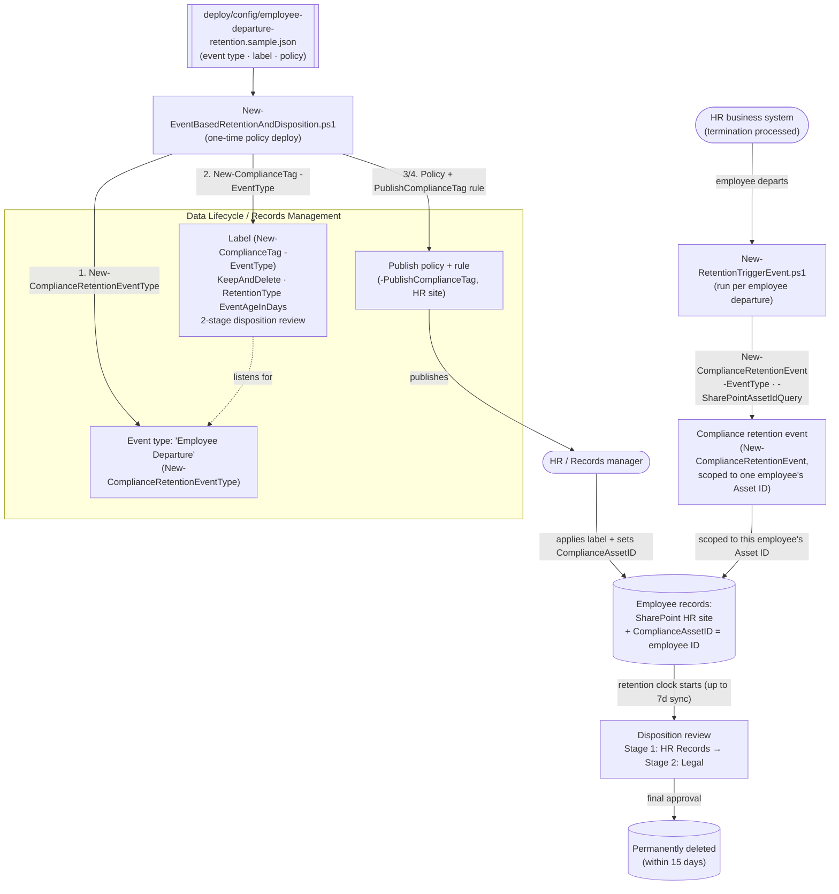

## The short version

Creates a **retention event type**, an **event-based retention label** (`KeepAndDelete`, retention
clock starts on an *event* rather than content creation/modification date, with a **two-stage
disposition review**), and a **publish** label policy so HR/Records can manually apply the label -
plus an operational script that fires the triggering event for one departed employee, as code, via
Security & Compliance PowerShell. This is the event-driven, human-reviewed sibling to this module's
*Retention Labels for Financial Records* starter (which auto-applies a `Keep`-only regulatory record
label from content signals).

## Why this matters

Employee-record retention obligations are typically expressed as a period **after separation**, not
after document creation - Microsoft's own event-based-retention guidance uses this exact shape as
its lead example: *"employee records must be retained for 10 years from the time an employee leaves
the organization... the event that triggers the... retention period is the employee leaving the
organization"*. A creation-age or modification-age retention clock can't express
that; only an **event-based** retention label can, because the clock starts when you tell Purview
the event happened - which can be a past, present, or future date.

The second half of the driver is **defensible disposition**: many jurisdictions' employment-records
obligations, and most internal records-governance policies, expect a **human review** before
terminated-employee records are permanently destroyed - not silent auto-deletion - so that legal
hold, active dispute, or a data-subject request can intercept the deletion. Microsoft's disposition
review mechanism, with up to five stages and up to 10 reviewers per stage (individual users and/or
mail-enabled security groups - Microsoft 365 groups aren't supported for this option), is built for
exactly this. This scenario models a realistic two-stage chain (HR Records, then
Legal) rather than the sibling scenario's single-approver `Keep`-only pattern.

> ⚠️ **Set the real retention duration and the real reviewers before deploying.** The 10-year
> duration mirrors Microsoft's own illustrative example, not a specific statute -
> your organization's actual post-departure employee-record retention obligation (which varies by
> jurisdiction, record type, and whether benefits/tax records are involved) must come from your
> Legal/HR compliance function, not this library. See the known limitations.

## How the control works

Four objects, two operators: the **event type** and **label** (deployed once, by Records
Management), and the recurring **event** (fired by HR/an integration, per departing employee). The
label only starts counting down for an item once (a) the label + Asset ID are on it and (b) a
matching event has been fired for that Asset ID. Full rationale: the design notes.

## What it takes

### Prerequisites

Full licensing detail: [Licensing matrix](/docs/licensing-matrix/). RBAC: [RBAC model](/docs/rbac-model/). Automation surface:
[Automation surface](/docs/automation-surface/) (surface 2 - Security & Compliance PowerShell). Summary:

| Requirement | Minimum | Notes |
|---|---|---|
| Licensing | Retention labels/policies: **M365 E3**; records management (event-based retention, disposition review, record labels): **M365 E5 / E5 Compliance / Purview Suite** | Event-based retention and disposition review are Records Management (E5) capabilities |
| Role | **Records Management** role group (RecordManagement, Retention Management, Disposition Management, Scope Manager roles) | To create event types, labels, policies, rules, and to fire events - [RBAC model](/docs/rbac-model/) |
| Auth | `Connect-IPPSSession` (certificate app-only preferred) | Security & Compliance PowerShell - [Automation surface, section 3](/docs/automation-surface/#3-authentication-patterns---interactive-vs-unattended) |
| Disposition reviewer permissions | Reviewers named in the label (or added later) need Disposition Management-equivalent access | Adding a reviewer via the portal's "Add reviewers" action does **not** automatically grant permissions |
| Asset ID property | SharePoint/OneDrive `ComplianceAssetID` document property populated on target content | How an event is scoped to one employee's records instead of everyone's |
| Target locations | HR SharePoint site(s) (and/or HR mailboxes) | Publish policy needs ≥1 location |

> Verify current entitlement names against [Licensing matrix](/docs/licensing-matrix/) before a sales commitment -
> SKU names change.

### Cost and licensing

- **Per-user E5 entitlement**, no Azure consumption meter. Event-based retention, disposition review,
  and record labels are **E5 / E5 Compliance / Purview Suite** capabilities; plain retention
  labels/policies are E3.
- **Cost is licensing + storage + review workload**, not a metered service. The review workload is
  the real operational cost here: every departed employee whose records reach end-of-retention
  generates a two-stage human review - budget HR/Legal reviewer time for this, not just the
  Purview entitlement.
- **The expensive mistake is an unscoped event.** Firing an event with no Asset ID starts the
  retention clock - and eventual disposition review, and eventual deletion - for **every** item
  under that event type, tenant-wide, not just one employee's. This is the
  dominant risk this scenario guards against (the known limitations, and the trigger script's `-Force` gate).

## Proof it works

1. **Automated** - `./validate/Test-EventBasedRetentionAndDisposition.ps1` confirms the event type,
   label (action/type/duration/event-binding/record flag/review configuration), policy
   (enabled + location), and rule (publishes the expected label) all exist as configured. Exits
   non-zero on failure.
2. **Event scoping test (lab tenant)** - apply the label to two test items with different
   `ComplianceAssetID` values, fire an event scoped to only one Asset ID, and confirm (via
   Content Search on the `ComplianceAssetID` property, or the item's retention date once synced)
   that only the matching item's retention period started.
3. **Disposition review test (lab tenant)** - let (or force, in a lab, by using a short test
   duration) an item reach the end of its retention period and confirm the Stage 1 (HR) reviewer
   receives the disposition email, that **Approve disposal** at Stage 1 moves it to Stage 2 (Legal)
   rather than deleting it, and that only the Stage 2 approval marks it eligible for permanent
   deletion (within 15 days).
4. **Idempotency proof** - re-run the deploy; the event type/label/policy/rule report `exists` (not
   `created`) and nothing is duplicated. Re-running the trigger script with the same `-EventName`
   reports the existing event rather than firing a duplicate.
5. **Unscoped-event guard** - confirm `New-RetentionTriggerEvent.ps1` without `-EmployeeId` refuses
   to run unless `-Force` is passed.

## Where it stops

- **Retention events cannot be canceled once created.** `New-RetentionTriggerEvent.ps1`
  checks for an existing event with the same `-Name` and refuses to re-fire it, but it has **no way
  to detect** whether a *different-named* event was already fired for the same employee (no
  documented query-by-Asset-ID cmdlet was found) - naming discipline (`<event type> - <employee ID>`)
  is the only guard against an accidental duplicate/redundant event under a different name.
- **Firing an event with no Asset ID retains everything of that event type.** The
  trigger script requires `-EmployeeId` unless you explicitly pass `-Force`.
- **The event type binding is permanent once the label is saved.** Plan the event
  type taxonomy (this scenario uses one: "Employee Departure") before deploying labels against it.
- **`-AutoApprovalPeriod`'s parameter description is an unfilled Microsoft documentation stub** on
  the `New-ComplianceTag` reference page; the 7-365 day range and 14-day default cited here come from
  the separate, conceptual disposition-review article, not a confirmed mapping to this exact cmdlet
  parameter. Left disabled (`null`) in the sample config for this reason - VERIFY (pilot tenant)
  before relying on it.
- **Read-back of `MultiStageReviewProperty`/`ReviewerEmail` on `Get-ComplianceTag` is undocumented.**
  Neither parameter's exact returned property name/shape is confirmed by Microsoft's reference pages
  (both parameter descriptions are stubs); `validate/Test-EventBasedRetentionAndDisposition.ps1`
  checks for **either** property being non-null and reports `[WARN]`, not `[FAIL]` rather than asserting an unconfirmed shape. VERIFY (pilot tenant).
- **Whether `-ReviewerEmail` and `-MultiStageReviewProperty` can coexist, or are mutually
  exclusive, is undocumented.** This scenario always uses one or the other (never both) for exactly
  this reason - VERIFY (pilot tenant) before combining them.
- **`-WhatIf` is non-functional in S&C PowerShell** - the scripts ship a `-DryRun` instead.
- **No scripted reconciliation between HR terminations and fired events.** `New-RetentionTriggerEvent.ps1`
  is a wrapper you call per departure (by hand, or from an HR system integration you build); this
  scenario does not ship an HR-feed connector or a "which departed employees are missing an event"
  report - a documented follow-up.
- **The protection window before a record is labeled.** Content isn't locked as a record until the
  label is actually applied to it - if that only happens at offboarding time (rather than at hire,
  per the recommendation above), a departing employee's records are editable/deletable like any
  other content right up until a records manager gets to them. Applying the label proactively, early
  in the employee lifecycle, is the mitigation this scenario recommends rather than a technical
  control this scenario can enforce.
- **No audit-trail export script.** This scenario doesn't ship a dedicated `Search-UnifiedAuditLog`
  export for event creation / label application / disposition actions (the pattern several other
  scenarios in this library use) - the exact `RecordType`/`Operations` values for these specific
  records-management actions weren't grounded in this build. A documented follow-up.
- **Idempotency is create-or-report, not create-or-update**, for the event type/label/policy/rule -
  the deploy locates objects by name and does **not** silently modify an existing one; edit
  deliberately, with review, if settings must change.
- **Illustrative values.** The 10-year duration, event type name, HR site URL, and reviewer addresses
  are placeholders - set them to your actual obligation and org structure, validated by HR/Legal,
  before deploying.