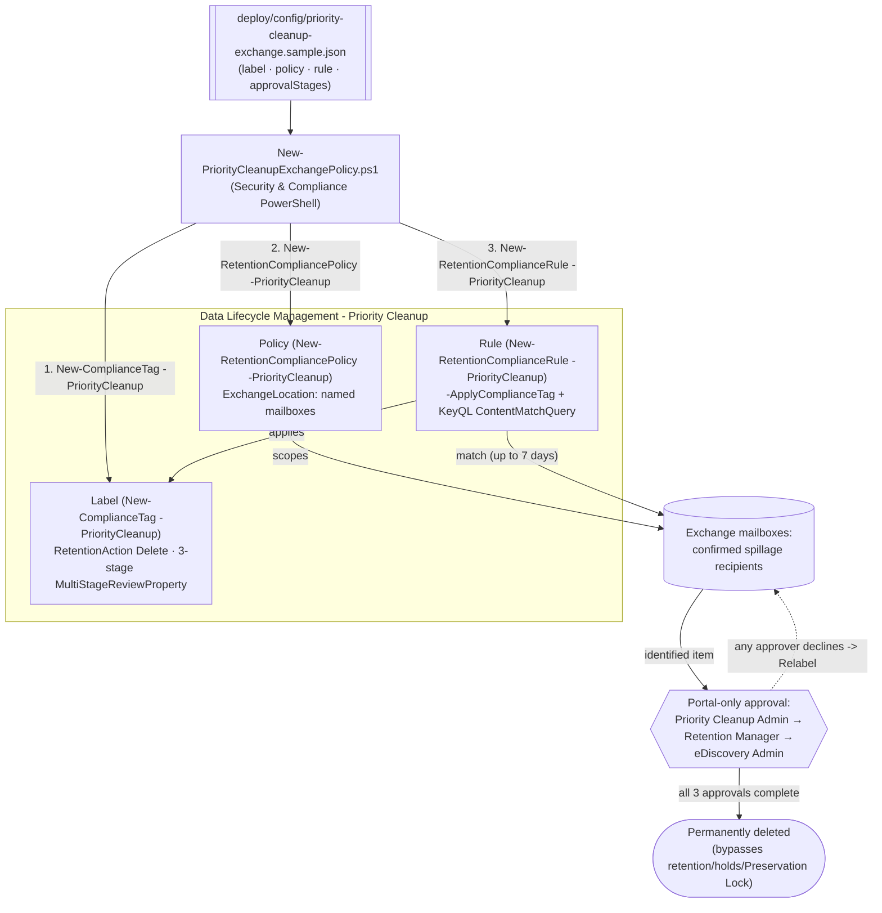

## The short version

Deploys a Microsoft Purview **Priority cleanup** label, policy, and rule for Exchange mailboxes - as
code, via Security & Compliance PowerShell's official `-PriorityCleanup` parameter set. Priority
cleanup **permanently deletes** matching mail content even when a retention policy, litigation hold,
eDiscovery hold, or Preservation Lock (delete-only) would otherwise keep it - the one Data Lifecycle
Management control in this library explicitly designed to override every other retention control.

## Why this matters

Data spillage - an employee accidentally emails sensitive information (M&A plans, PII, regulated
data) to the wrong recipients - is a named Microsoft use case for this feature, alongside privacy
deletion requests for departed employees whose mailboxes sit under a multi-year retention policy. Waiting out a 2-year retention period, or a pending eDiscovery hold, is not an
option when the exposure is active today. Priority cleanup exists precisely to let an organization
**compliantly override its own holds** for a specific, approved, audited reason - but that is also
exactly why it is the most dangerous control in this library: it is a **documented spoliation risk** if
used to destroy content relevant to litigation, and Microsoft's own guidance to highly regulated
organizations using Preservation Lock is that they *"might want the additional safeguard of turning
off priority cleanup at the tenant level"* rather than relying on approvals alone.

> ⚠️ **This is not a normal retention control.** Once every required approval completes, matching
> items are **permanently deleted and cannot be restored by users, by admins, or by Microsoft**
>. Get Legal sign-off - not just Compliance sign-off - before deploying, and treat
> every use as a documented, individually-justified exception, never a standing policy. Priority
> cleanup is also, as of this writing, a Microsoft-labeled **preview** capability, "subject to change"
>. See the known limitations.

## How the control works

Same three-object shape (label / policy / rule) as every other retention scenario in this library, but
every cmdlet call uses the official `-PriorityCleanup` parameter set, and a fourth stage - portal-only
multi-party approval - sits between "matched" and "deleted." Full rationale: the design notes.

## What it takes

### Prerequisites

Full licensing detail: [Licensing matrix, section 2](/docs/licensing-matrix/#2-master-capability--license-matrix). RBAC: [RBAC model, section 4](/docs/rbac-model/#4-purview-role-groups-by-module-representative-not-exhaustive). Automation
surface: [Automation surface, section 3](/docs/automation-surface/#3-authentication-patterns---interactive-vs-unattended) (Security & Compliance PowerShell). Summary:

| Requirement | Minimum | Notes |
|---|---|---|
| Licensing | **M365 E5/A5/G5**, **Microsoft Purview Suite**, **E5/A5/F5/G5 Information Protection and Governance**, or **Office 365 E5/A5/G5** | Same tier as Records Management; confirmed by the Purview service description |
| Creator role | **Priority Cleanup Admin** (not included by default in Compliance Administrator; add manually) | [RBAC model, section 4](/docs/rbac-model/#4-purview-role-groups-by-module-representative-not-exhaustive) |
| Approver roles (3 stages, Exchange) | Priority Cleanup Admin (+Data Classification Content/List Viewer, Disposition Management); Retention Management (+ same 3); Search And Purge + Hold + Review (+ same 3) for eDiscovery | Policy creation **fails with an error** if any listed reviewer lacks their stage's roles |
| Approvers | 3 distinct individual users (not groups) - one per stage, in addition to the creator | Mail-enabled security groups aren't supported as approvers |
| Auditing | Enabled ≥1 day before first use | Required to view simulation results and monitor via Cleanup ID |
| Mailbox size | ≥10 MB per mailbox | Smaller mailboxes aren't supported by priority cleanup |
| Auth | `Connect-IPPSSession` (certificate app-only preferred) | [Automation surface, section 3](/docs/automation-surface/#3-authentication-patterns---interactive-vs-unattended) |
| Feature toggle | Enabled tenant-wide by default; can be turned off entirely | Portal: Data Lifecycle Management → Priority cleanup settings - no confirmed PowerShell equivalent found |

> Verify current entitlement names against [Licensing matrix](/docs/licensing-matrix/) before a sales commitment.

### Cost and licensing

- **Per-user E5-tier entitlement**, no separate Azure meter - same licensing family as Records
  Management.
- **The real cost is process, not the meter**: 3 named approvers with the correct role assignments,
  auditing enabled in advance, and a Legal/Compliance sign-off workflow around every use.
- **The expensive mistake is scope creep on `ContentMatchQuery`** - an over-broad query permanently
  destroys content with no possibility of recovery, unlike every other retention mistake in this library
  (which can usually be caught and reversed before the retention period ends).

## Proof it works

1. **Automated (object-level)** - `./validate/Test-PriorityCleanupExchangePolicy.ps1` confirms the
   label/policy/rule exist and are classified as priority cleanup objects (via the `-PriorityCleanup`
   filter switch), the rule applies the expected label, and reports the policy's Enabled/Mode/
   DistributionStatus. Exits non-zero on failure. **This does not, and cannot, confirm anything about
   approvals or deletions** - see the next two items.
2. **Approval-queue check (portal only)** - Data Lifecycle Management → Priority cleanup → Pending
   cleanups. No PowerShell/Graph read API exists for this queue.
3. **Deletion proof (auditing)** - search the audit log using the policy's **Cleanup ID** (shown after
   creation) as the keyword; look for `PriorityCleanupTagApplied` (item identified/labeled) and
   `PriorityCleanupDelete` (item permanently deleted) operations - neither has a friendly name in the
   portal's audit UI yet, so search by raw operation name.
4. **Idempotency proof** - re-run the deploy; the label/policy/rule report `exists` (not `created`)
   and nothing is duplicated or silently mutated.
5. **Simulation-mode sanity check** - if deployed with `-Simulate`, confirm status shows **In
   simulation** before `-EnforceSimulation`, and **Enabled (Success)** (not stuck at **Enabled
   (Pending)**) after.

## Where it stops

- **PREVIEW.** Microsoft's own note: *"Priority cleanup is rolling out in preview and subject to
  change"*. Re-verify current status before a customer-facing commitment.
- **IRREVERSIBLE and HOLD-OVERRIDING.** This is the one control in this library that is explicitly
  designed to defeat retention policies, litigation holds, eDiscovery holds, and Preservation Lock
  (delete-only). Once approved, deletion "cannot be restored by users, by admins, or by Microsoft". Highly regulated organizations using Preservation Lock may prefer to leave the
  tenant-wide toggle **off** entirely - Microsoft says so explicitly.
- **No PowerShell/Graph approval API.** Approving or declining pending items is portal-only. This
  scenario's scripts stop at provisioning and validation; they cannot drive or observe the approval
  workflow itself.
- **`-MultiStageReviewProperty` stage shape is this scenario's construction, not a confirmed one.**
  See the design notes - flagged as VERIFY, not asserted.
- **`RetentionDuration 0` / `TaggedAgeInDays` for "as soon as possible" is inferred, not confirmed.**
  See the design notes - VERIFY before production reliance.
- **No confirmed cmdlet for the tenant-wide on/off toggle.** The portal's "Priority cleanup settings"
  page has no PowerShell/Graph equivalent found during this build's grounding pass across official
  Microsoft Learn sources.
- **KeyQL exclusions.** `SenderAuthor`, `SubjectTitle`, `(c:c)`, `(c:s)` are **not** supported in a
  priority cleanup `ContentMatchQuery`, even though ordinary eDiscovery search allows them
  - don't reuse an eDiscovery query unmodified.
- **Records exception.** Priority cleanup cannot delete content already marked as a record or
  regulatory record - it does not override the strongest retention control in this
  repo's own *Retention Labels for Financial Records* sibling.
- **eDiscovery review-set exception.** Content already copied into an eDiscovery review set survives
  priority cleanup until the entire case is deleted by an eDiscovery admin.
- **Approving a decline does not undo the label.** If an approver declines ("Relabel"), they must pick
  an *existing* retention label to apply instead - approvers need to know in advance which labels are
  appropriate; this scenario's deploy does not provision that fallback label.
- **`-WhatIf` is non-functional in S&C PowerShell** - the scripts ship `-DryRun` instead.
- **Illustrative values.** The mailbox addresses, attachment name, and approver email addresses in the
  sample config are placeholders - replace with the real, confirmed spillage recipients and named
  approvers, validated by Legal, before deploying.