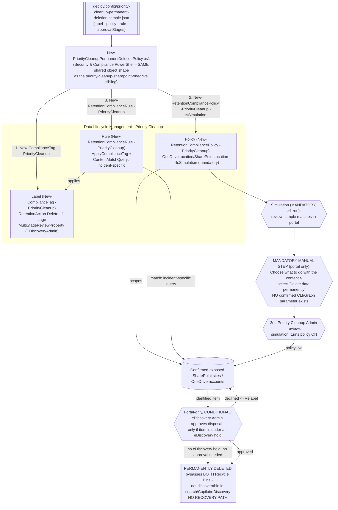

## The short version

Provisions the Microsoft Purview **Priority cleanup** label/policy/rule (Security & Compliance
PowerShell) that underlies the **permanent deletion** sub-feature for SharePoint and OneDrive -
which bypasses both Recycle Bins entirely, leaving content unrecoverable and no longer discoverable
in SharePoint search, Microsoft 365 Copilot, or eDiscovery. This is the sibling of
*Priority Cleanup for SharePoint & OneDrive* for the case where that scenario's Recycle-Bin outcome is not
final enough. Rolling out to **public preview from 2026-08-24**.

## Why this matters

Microsoft's own stated rationale for this feature is reducing "data exposure risk from rapidly
growing Copilot-related content" while preserving compliance through required eDiscovery-admin
review. Once a file is confirmed to be broadly, improperly shared and already
indexed for Copilot, moving it to a Recycle Bin (the sibling scenario's outcome) leaves a
time-bounded window during which the exposure - or at minimum the storage and index footprint - is
not fully closed. Regulatory drivers: GDPR/data-minimization "right to erasure"-adjacent operational
need for verifiably complete deletion; incident-response requirements that call for irreversible
remediation, not merely reversible remediation, once a confirmed leak has been contained.

> ⚠️ **This is not a routine storage-reclamation tool.** Use the *Priority Cleanup for SharePoint & OneDrive*
> sibling scenario (Recycle Bin outcome, recoverable) for stale Teams recordings, departed-employee
> OneDrive cleanup, or any use case where irreversibility is not specifically required. Reach for
> this scenario only when a Recycle Bin recovery window is itself an unacceptable residual risk.

## How the control works

Same three-object shape as every retention scenario in this library. The one node with no scriptable
path is **Manual** - Microsoft's own procedure for selecting the permanent-deletion outcome is
portal-wizard-only, with no PowerShell/Graph equivalent found during this build's grounding pass.
Full rationale: the design notes.

## What it takes

### Prerequisites

Full licensing detail: [Licensing matrix, section 7](/docs/licensing-matrix/#7-adjacent-product-family-microsoft-defender-for-endpoint--intune-device-control-scenarios). RBAC: [RBAC model, section 4](/docs/rbac-model/#4-purview-role-groups-by-module-representative-not-exhaustive). Automation
surface: [Automation surface, section 3](/docs/automation-surface/#3-authentication-patterns---interactive-vs-unattended) (Security & Compliance PowerShell). This feature shares
**all** base prerequisites, roles, and the approver model with the *Priority Cleanup for SharePoint & OneDrive*
sibling - see that scenario's the prerequisites for the full breakdown (Priority Cleanup Admin role,
two-person rule, conditional eDiscovery Admin approval, mandatory simulation, auditing enabled ≥1
day in advance). This table covers only what's **additional or different** for permanent deletion:

| Requirement | Minimum | Notes |
|---|---|---|
| Tenant availability | Confirm the option is present before use | **Public preview rollout begins 2026-08-24** - Worldwide multi-tenant only is confirmed by this Learn page; **VERIFY (pilot tenant)** current availability before a customer-facing commitment - see the known limitations for the 2026-09-28 GCC/GCC High/DoD grounding pass (still not a confirmed statement of parity) |
| Content-disposition selection | Portal only | Selecting **"Delete data permanently"** on the policy wizard's "Choose what to do with the content" page has **no confirmed PowerShell/Graph parameter** - see section 5 and the design notes |
| Review-set exception | Always applies, restated specifically on this feature's own page | Items **already copied to an eDiscovery review set** are **not** deleted by Priority Cleanup, permanent-deletion mode included - do not assume a "permanent" policy is exhaustive if a review set copy exists |
| Records exception | Same as base feature | Content marked as a **record or regulatory record** cannot be targeted by priority cleanup at all |

> Verify current entitlement names against [Licensing matrix](/docs/licensing-matrix/) before a sales commitment.

### Cost and licensing

- **Same per-user E5-tier entitlement and shared tenant-wide toggle** as both priority-cleanup
  siblings - no separate meter for permanent-deletion mode specifically.
- **The real cost is governance discipline, not the meter:** a bespoke, reviewed query per incident,
  mandatory simulation, and a manual portal step that cannot be automated away - budget operator time
  per incident, not a one-time setup.
- **The financial case is risk-avoidance, not storage reclamation** - the opposite framing from the
  sibling scenario's cost-avoidance narrative; the value here is closing a confirmed exposure
  verifiably, which is a compliance/incident-response cost avoided (breach notification scope,
  regulatory exposure), not a storage bill reduced.

## Proof it works

1. **Automated (object-level)** - `./validate/Test-PriorityCleanupPermanentDeletionPolicy.ps1`
   confirms the label/policy/rule exist and are classified as priority cleanup objects, and reports
   the policy's Enabled/Mode/DistributionStatus. **This cannot confirm permanent-deletion mode is
   active** - no documented property exposes it.
2. **Manual confirmation (portal)** - open the policy and confirm "Delete data permanently" is
   selected on the content-disposition page.
3. **Deletion proof (auditing) - the only reliable, scriptable confirmation** - search the audit
   log using the policy's **Cleanup ID** as the keyword; look for **`PriorityCleanupFileDeleted`**
   (item permanently deleted - this scenario's intended outcome). A
   **`PriorityCleanupFileRecycled`** event instead means the item went to the Recycle Bin - the
   manual step was likely not completed, or the policy is not actually in permanent-deletion mode.
4. **Idempotency proof** - re-run the deploy script; the label/policy/rule report `exists` (not
   `created`) and nothing is duplicated or silently mutated.
5. **Review-set exception sanity check** - for any item you expect to be deleted, confirm it has
   **not** already been copied to an eDiscovery review set; if it has, priority cleanup (any mode)
   will not delete it - do not treat a missing `PriorityCleanupFileDeleted` event
   for such an item as a scenario failure.

## Where it stops

- **PREVIEW.** Public preview rollout begins 2026-08-24 - today's date for this
  build is 2026-09-09, so Worldwide multi-tenant rollout should be underway, but **VERIFY (pilot
  tenant)** actual availability before relying on this scenario; do not assume GCC/GCC High/DoD
  timing matches Worldwide multi-tenant (unconfirmed by this Learn page - community reporting
  suggests a later, separate timeline for those environments, not independently verified by this
  build against an official Microsoft source). **Re-grounded 2026-09-28** (Microsoft Learn MCP):
  the GCC High deployment guide's Step 4 capability-difference table - the authoritative source
  for Purview features that are unavailable, delayed, or "in development" for GCC High - has **no
  row at all for Priority Cleanup**, base feature or permanent-deletion sub-feature, as of this
  pass; the Microsoft Purview service description's Data Lifecycle & Records
  Management licensing section also lists Priority Cleanup's required licenses (Microsoft 365
  E5/A5/G5, Microsoft Purview Suite/EDU/**GOV**/FLW, Office 365 E5/A5/G5) with no cloud-environment
  qualifier. Neither is an affirmative statement that permanent deletion is
  live in GCC/GCC High/DoD today - an absent table row can equally mean the table simply hasn't
  been updated for a feature this new, which is common for recently-preview capabilities - so this
  does **not** resolve the VERIFY. Remains open; re-open for a fresh pass only once either page is
  updated to state GCC/GCC High/DoD timing explicitly, or a pilot-tenant check confirms/denies
  presence directly.
- **No confirmed CLI/Graph parameter selects "Delete data permanently."** This is this scenario's
  central, disclosed gap - see the design notes. `New-ComplianceTag -RetentionAction` was directly
  confirmed to accept only `Delete`/`Keep`/`KeepAndDelete` during this build's grounding pass.
- **VERIFY (pilot tenant):** whether a policy provisioned via this scenario's PowerShell script is
  even a valid starting point for the portal's permanent-deletion wizard step, or whether such
  policies must be created end-to-end through the portal (the design notes, two open readings).
- **No read-back property for content-disposition mode.** `validate/` cannot confirm permanent
  deletion is configured - only post-hoc audit search (`PriorityCleanupFileDeleted`) confirms it
  actually happened.
- **Items already in an eDiscovery review set are never deleted by Priority Cleanup**, in any mode
  - do not assume "permanent deletion" is exhaustive against a review-set copy.
- **Records/regulatory records are out of scope entirely** - same exception as the base feature.
- **No recovery path whatsoever once deleted** - see the rollback runbook. This is by far this scenario's
  highest-consequence property; do not deploy against a broad or untested query.
- **`-MultiStageReviewProperty` single-stage shape and the `RetentionDuration 0`/`TaggedAgeInDays`
  "as soon as possible" mapping are carried over, unverified constructions from the sibling
  scenario** - same open VERIFY items, see the sibling scenario's known limitations and this scenario's
  the design notes.
- **`-WhatIf` is non-functional in S&C PowerShell** - the scripts ship `-DryRun` instead.
- **Illustrative values.** The SharePoint site URL, approver email address, and `contentMatchQuery`
  placeholder in the sample config are not usable as-is - replace with real, incident-specific
  values before deploying (the deploy script refuses to run against the placeholder query).