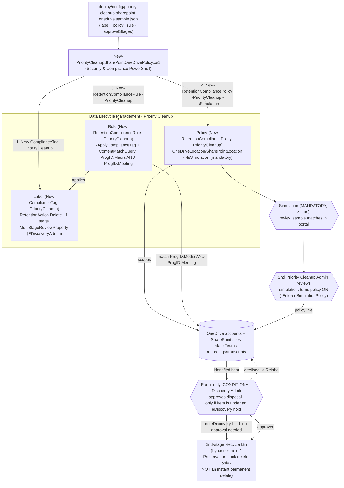

## The short version

Deploys a Microsoft Purview **Priority cleanup** label, policy, and rule for OneDrive and
SharePoint - as code, via Security & Compliance PowerShell's official `-PriorityCleanup` parameter
set. Unlike the Exchange sibling scenario (*Priority Cleanup for Exchange Data Spillage*), this is a
**continual, standing control**: it targets stale Microsoft Teams meeting recordings and
transcripts that Copilot recap no longer needs, overriding retention settings to move them into
the second-stage Recycle Bin instead of waiting out a retention policy.

## Why this matters

Teams meeting recordings and transcripts saved for Copilot recap are large and typically have
little business value after 1-3 months, but a retention policy or hold can keep them indefinitely. Priority cleanup lets an organization reclaim that storage on a standing basis.
The second named use case - deleting Preservation Hold library items so a departed employee's
OneDrive site can finally be removed - is incident-driven (triggered per departure) but still uses
the same continual-policy mechanism.

> ⚠️ **Materially different risk profile from the Exchange sibling.** For SharePoint/OneDrive,
> priority cleanup moves matching items to the **second-stage Recycle Bin** - it does **not**
> instantly, permanently delete them the way the Exchange variant does. From there, items follow
> the same SharePoint/OneDrive Recycle Bin retention timers as any other deletion
>. Preservation Lock is overridden **only if** the underlying retention setting
> is delete-only - not unconditionally, as with Exchange. A separate, still
> **public-preview** sub-feature (**permanent deletion**, bypassing the Recycle Bin entirely,
> rollout beginning 2026-08-24) is explicitly **out of scope** for this fragment - see section 11 and the
> dedicated sibling scenario, *Priority Cleanup Permanent Deletion (SharePoint & OneDrive)*.

## How the control works

Same three-object shape (label / policy / rule) as every other retention scenario in this library and
as the Exchange sibling, but the policy's location parameters are `-OneDriveLocation`/
`-SharePointLocation`, simulation is mandatory rather than optional, and the terminal state is the
Recycle Bin, not permanent deletion. Full rationale: the design notes.

## What it takes

### Prerequisites

Full licensing detail: [Licensing matrix, section 7](/docs/licensing-matrix/#7-adjacent-product-family-microsoft-defender-for-endpoint--intune-device-control-scenarios). RBAC: [RBAC model, section 4](/docs/rbac-model/#4-purview-role-groups-by-module-representative-not-exhaustive). Automation
surface: [Automation surface, section 3](/docs/automation-surface/#3-authentication-patterns---interactive-vs-unattended) (Security & Compliance PowerShell). Summary:

| Requirement | Minimum | Notes |
|---|---|---|
| Licensing | **M365 E5/A5/G5**, **Microsoft Purview Suite**, **E5/A5/F5/G5 Information Protection and Governance**, or **Office 365 E5/A5/G5** | Same tier and same tenant-wide feature toggle as the Exchange sibling - turning priority cleanup off turns it off for **both** workloads |
| Creator/first-stage role | **Priority Cleanup Admin** (not included by default in Compliance Administrator; add manually) | [RBAC model, section 4](/docs/rbac-model/#4-purview-role-groups-by-module-representative-not-exhaustive) |
| Two-person rule (Priority Cleanup Admin) | A **second, different** Priority Cleanup Admin, included in the policy configuration flow **before** the policy is turned on - reviews simulation results and turns the policy on | Different mechanism from Exchange's post-turn-on approval stage - see the design notes |
| Conditional approver (eDiscovery Admin) | **eDiscovery Administrator** role; approval required **only if** an identified item is under one or more eDiscovery holds | [RBAC model, section 4](/docs/rbac-model/#4-purview-role-groups-by-module-representative-not-exhaustive); policy creation fails with an error if this reviewer lacks the role |
| Approver roles, exact set | eDiscovery admins: Search And Purge + Hold + Review + Data Classification Content/List Viewer + Disposition Management. Priority Cleanup admins: Priority Cleanup Admin + Data Classification Content/List Viewer + Retention Management | Note the **Retention Management** role appears on the *Priority Cleanup Admin* row here - different from the Exchange sibling's table, where it's *Disposition Management* |
| Approvers | Individual users only (not groups); one eDiscovery approver is sufficient even if multiple are named | Mail-enabled security groups aren't supported as approvers |
| Simulation | **Mandatory** - required to initially set up the policy, and again for any change other than the description | Unlike Exchange, where it's recommended but optional |
| Auditing | Enabled ≥1 day before first use | Required to view simulation results |
| Auth | `Connect-IPPSSession` (certificate app-only preferred) | [Automation surface, section 3](/docs/automation-surface/#3-authentication-patterns---interactive-vs-unattended) |
| Feature toggle | Enabled tenant-wide by default; can be turned off entirely - same switch as Exchange | Portal: Data Lifecycle Management → Priority cleanup settings - no confirmed PowerShell equivalent found |
| SharePoint site indexing | Sites can't be added until indexed | `New-RetentionCompliancePolicy`'s own `-SharePointLocation` parameter note |

> Verify current entitlement names against [Licensing matrix](/docs/licensing-matrix/) before a sales commitment.

### Cost and licensing

- **Per-user E5-tier entitlement**, no separate Azure meter - same licensing family and same
  tenant-wide toggle as the Exchange sibling.
- **The real cost is the mandatory review cycle**, not the meter: every initial setup and every
  meaningful edit requires a simulation run plus a second admin's review before it can go live -
  budget recurring admin time for this, not just a one-time setup cost.
- **Storage reclamation is the direct financial upside** unique to this workload - unlike the
  Exchange sibling's data-spillage framing, this scenario's lead use case (stale Teams recordings)
  is itself a cost-avoidance play against SharePoint/OneDrive storage growth.

## Proof it works

1. **Automated (object-level)** - `./validate/Test-PriorityCleanupSharePointOneDrivePolicy.ps1`
   confirms the label/policy/rule exist and are classified as priority cleanup objects, the rule
   applies the expected label, and reports the policy's Enabled/Mode/DistributionStatus (a policy
   still `Enabled: $false` / `Mode: In simulation` is the **expected** starting state here, not a
   failure). **This does not, and cannot, confirm anything about approvals or Recycle Bin moves**
   - see the next two items.
2. **Approval-queue check (portal only)** - Data Lifecycle Management → Priority cleanup → Pending
   cleanups. No PowerShell/Graph read API exists for this queue.
3. **Deletion proof (auditing)** - search the audit log using the policy's **Cleanup ID** (shown
   after creation) as the keyword; look for `PriorityCleanupTagApplied` (item identified/labeled)
   and `PriorityCleanupFileRecycled` (item moved to the second-stage Recycle Bin) - neither has a
   friendly name in the portal's audit UI yet, so search by raw operation name.
   Note this is a **different** operation name from the Exchange sibling's `PriorityCleanupDelete`.
4. **Idempotency proof** - re-run the deploy; the label/policy/rule report `exists` (not `created`)
   and nothing is duplicated or silently mutated.
5. **Simulation-mode sanity check** - confirm status shows **In simulation** before
   `-EnforceSimulation`, and **Enabled (Success)** (not stuck at **Enabled (Pending)**) after.

## Where it stops

- **PREVIEW.** Same tenant-wide preview status as the Exchange sibling: *"Priority cleanup is
  rolling out in preview and subject to change"*. Re-verify before a
  customer-facing commitment.
- **NOT an instant permanent delete.** Matching items move to the second-stage Recycle Bin, then
  follow ordinary SharePoint/OneDrive Recycle Bin retention timers - a
  materially different (softer) mechanism than the Exchange sibling. The separate **permanent
  deletion** sub-feature (bypasses the Recycle Bin; public preview from 2026-08-24) is explicitly
  out of scope for this fragment - built as its own sibling scenario,
  *Priority Cleanup Permanent Deletion (SharePoint & OneDrive)*.
- **Preservation Lock override is conditional, not unconditional.** Only overridden if the
  underlying retention setting is delete-only - do not assume this scenario
  overrides every locked policy the way the Exchange sibling does.
- **`-MultiStageReviewProperty` single-stage shape is this scenario's construction, not a confirmed
  one.** See the design notes - flagged as VERIFY, not asserted. Specifically unconfirmed: whether a
  `PriorityCleanupAdmin` stage entry is also required for the pre-turn-on two-person check to
  register, beyond the `EDiscoveryAdmin` stage this scenario includes.
- **`RetentionDuration 0` / `TaggedAgeInDays` for "as soon as possible" is inferred, not confirmed**
  - carried over from the Exchange sibling's same open gap. See the design notes.
- **KeyQL exclusions for this workload - re-grounded 2026-09-28, treat as applicable here too.**
  Microsoft's Exchange-specific priority cleanup page documents that `SenderAuthor`, `SubjectTitle`,
  `(c:c)`, and `(c:s)` are unsupported in a priority cleanup `ContentMatchQuery`; the SharePoint/
  OneDrive-specific page's own Limitations section doesn't repeat that bullet. Checking what these
  four actually are (Microsoft's eDiscovery condition-builder reference)
  resolves the gap without a pilot tenant: `(c:c)` and `c:s` aren't general query operators at
  all - they're notation the condition builder UI auto-inserts when it converts point-and-click
  conditions into KeyQL (`(c:c)` marks where builder-added conditions start; `c:s` separates
  keyword segments), and Microsoft's own text says "Don't use `(c:c)` in manually entered queries"
  and that `c:s` insertion "doesn't require manual entry" - a caution about hand-typing
  condition-builder syntax, not an Exchange-only restriction, so it applies equally to a
  SharePoint/OneDrive KeyQL query built the same way. `SenderAuthor`/`SubjectTitle` map to the
  eDiscovery common properties **Sender/Author** and **Subject/Title**, which that same reference
  documents as applying to *both* mail and documents (the Author/Title metadata fields on Office
  files) - not Exchange-only properties, which is consistent with the exclusion carrying over to
  this workload's documents too. No Microsoft page states the SharePoint/OneDrive priority cleanup
  exclusion in so many words, so this scenario still treats all four as unsupported in its
  `ContentMatchQuery` here (matching the Exchange sibling) rather than assuming the SharePoint/
  OneDrive page's silence means broader support.
- **No built-in query age filter.** `ProgID:Media AND ProgID:Meeting` matches all Teams recordings/
  transcripts, not just stale ones - see operations and tuning.
- **No confirmed cmdlet for the tenant-wide on/off toggle.** Same gap as the Exchange sibling - the
  portal's "Priority cleanup settings" page has no PowerShell/Graph equivalent found during this
  build's grounding pass, and the toggle is shared between both workloads.
- **Approving a decline does not undo the label.** If the eDiscovery approver declines ("Relabel"),
  they must pick an *existing* retention label to apply instead; this scenario's
  deploy does not provision that fallback label.
- **`-WhatIf` is non-functional in S&C PowerShell** - the scripts ship `-DryRun` instead.
- **Illustrative values.** The SharePoint site URL and approver email address in the sample config
  are placeholders - replace with real, confirmed values before deploying.