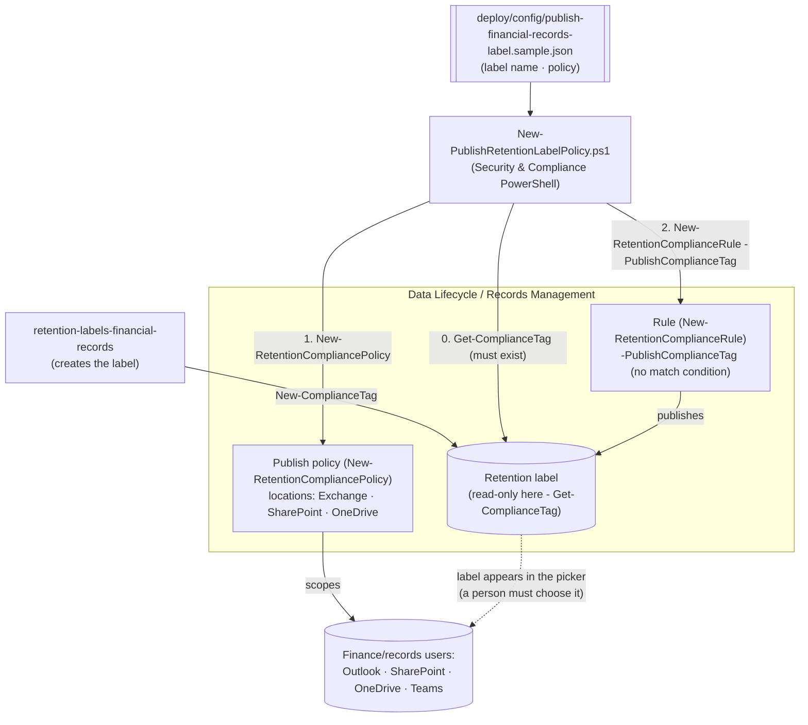

## The short version

Publishes an **existing** retention label to Exchange, SharePoint, and OneDrive so admins and end
users can manually apply it - in Outlook, SharePoint, OneDrive, and Teams group-connected sites - as
code, via Security & Compliance PowerShell. This scenario never creates or edits the label itself;
it only makes an already-created label selectable.

## Why this matters

Two distinct, real needs converge on the same mechanism:

1. **Regulatory records have no other path.** Microsoft's auto-apply retention label policies
   explicitly **do not support regulatory records** - the docs state this as a scenario-level
   limitation, not a corner case: *"This scenario isn't supported for regulatory records... These
   scenarios require a published retention label policy"*, corroborated by
   *"...for labels that mark items as records (but not regulatory records), auto-apply those
   labels"*. If your obligation (SEC 17a-4, FINRA 4511, SOX, MiFID II - see the
   sibling scenario) requires full WORM regulatory immutability, **this scenario is not optional** -
   it is the mechanism, not a variant.
2. **Precision and immediacy for everything else.** Auto-apply is asynchronous (up to 7 days) and
   only as good as its match query. Publishing lets a person who *knows* an item is a financial
   record apply the label the moment they create or receive it - a genuine complement, not a
   duplicate, of auto-apply for standard and record (non-regulatory) labels.

> ⚠️ **This scenario corrects a gap in the sibling scenario.** *Retention Labels for Financial Records*
> originally auto-applied its label with `regulatory: true` by default - a configuration Microsoft's
> documentation says isn't supported. That sibling has been corrected (see its review notes
> correction addendum) to default to a plain **record** label for auto-apply, and to stop before
> policy/rule creation if `regulatory: true` is set. This scenario is what completes the regulatory
> case: create the label there, publish it here. See the design notes for the full grounding.

## How the control works

Only two objects here (the **policy** and the **rule**) - the label is a read-only dependency
created elsewhere. Full rationale, including the auto-apply/regulatory-record correction: the design notes.

## What it takes

### Prerequisites

Full licensing detail: [Licensing matrix](/docs/licensing-matrix/). RBAC: [RBAC model](/docs/rbac-model/). Automation surface:
[Automation surface](/docs/automation-surface/) (surface 2 - Security & Compliance PowerShell). Summary:

| Requirement | Minimum | Notes |
|---|---|---|
| Licensing | Retention labels/policies: **M365 E3**; records management (record/regulatory record labels, publishing them, disposition): **M365 E5 / E5 Compliance / Purview Suite** | Same licensing the label itself required - publishing adds no new SKU |
| Role | **Retention Management** or **Records Management** role group (Compliance Administrator / Organization Management include it) | Same role group as the sibling - [RBAC model](/docs/rbac-model/) |
| Auth | `Connect-IPPSSession` (certificate app-only preferred) | Security & Compliance PowerShell - [Automation surface, section 3](/docs/automation-surface/#3-authentication-patterns---interactive-vs-unattended) |
| Pre-existing label | The retention label named in the config **must already exist** | This scenario never creates or edits a label - *Retention Labels for Financial Records* (or any label source) creates it first |
| Target locations | Finance SharePoint site(s) / Exchange mailboxes or DG / OneDrive / Microsoft 365 Group | Policy needs ≥1 location |

> Verify current entitlement names against [Licensing matrix](/docs/licensing-matrix/) before a sales commitment -
> SKU names change.

### Cost and licensing

- **No incremental licensing cost.** Publishing uses the same records-management/E5-tier entitlement
  the label itself already required - there's no separate "publish" SKU.
- **The real cost is human, not technical.** Publishing depends on people choosing to apply the
  label; the cost of under-coverage is a training/process problem, not a licensing one - factor
  operator/user training into the rollout plan, especially where (as with regulatory records) this
  is the *only* mechanism available.
- **No storage-growth risk from this scenario alone** - publishing doesn't retain anything by
  itself; the label's own retention action (created by the sibling) does that.

## Proof it works

1. **Automated** - `./validate/Test-PublishRetentionLabelPolicy.ps1` confirms the label exists, the
   policy exists/enabled with ≥1 location, and the rule publishes the expected label. Exits
   non-zero on failure.
2. **Publish timing** - SharePoint/OneDrive typically surface the label within a day (allow up to 7);
   Exchange can take up to 7 days and needs the mailbox to hold ≥10 MB of data.
3. **Manual-apply test** - in a lab tenant, confirm the label actually appears in Outlook's **Assign
   Policy** menu and SharePoint/OneDrive's **Apply label** picker, then apply it to a test item and
   confirm the expected retention/record behavior.
4. **Idempotency proof** - re-run the deploy; the policy/rule report `exists` (not `created`) and
   nothing is duplicated or silently mutated.
5. **If stuck (Off (Error))** - run `Set-RetentionCompliancePolicy -Identity <policy> -RetryDistribution`.

## Where it stops

- **Human-dependent coverage.** A published label is only as effective as people choosing to apply
  it. For regulatory records this is unavoidable (auto-apply isn't an option); for other labels,
  pair this with the sibling's auto-apply scenario rather than relying on publishing alone.
- **No content-matching for publish rules.** `-PublishComplianceTag` accepts no
  `-ContentMatchQuery`/`-ContentContainsSensitiveInformation` - there's nothing to "tune" beyond
  locations, unlike the auto-apply sibling.
- **Publish latency.** Up to 7 days for both SharePoint/OneDrive and Exchange in the worst case
  (SharePoint/OneDrive usually appears within a day); Exchange mailboxes need ≥10 MB of data.
- **This scenario never creates the label.** If `Get-ComplianceTag` finds nothing, the deploy script
  throws rather than guessing a definition - create the label first.
- **`Get-RetentionComplianceRule`'s `PublishComplianceTag` read-back property is not explicitly
  documented** - Microsoft's reference lists only Name/Disabled/Mode/Comment as the cmdlet's
  documented default-display properties. This repo's sibling scenario already
  reads the parallel `ApplyComplianceTag` property directly without flagging it as unconfirmed;
  `validate/Test-PublishRetentionLabelPolicy.ps1` follows the same established convention for
  `PublishComplianceTag` rather than introducing an inconsistent hedge. **VERIFY (pilot tenant)**
  before relying on this in an unattended pipeline.
- **Default labels for SharePoint/Outlook are a related but separate capability.** After
  publishing, an admin can set the label as a *default* for a document library or Outlook folder so
  unlabeled items inherit it automatically - a portal-only step; no
  PowerShell/Graph cmdlet for it was found during this build's grounding pass. Out of scope here.
- **A label can be in more than one label policy.** Microsoft confirms *"a single retention label can
  be included in multiple retention label policies"* - so a non-regulatory record
  label could legitimately be both auto-applied (sibling scenario) and published (this scenario) at
  the same time. This scenario's default worked example targets the sibling's regulatory label,
  which by definition can only ever be published.
- **Illustrative values.** The policy name, locations, and Exchange distribution-group name are
  placeholders - set them to your actual finance locations before deploying.