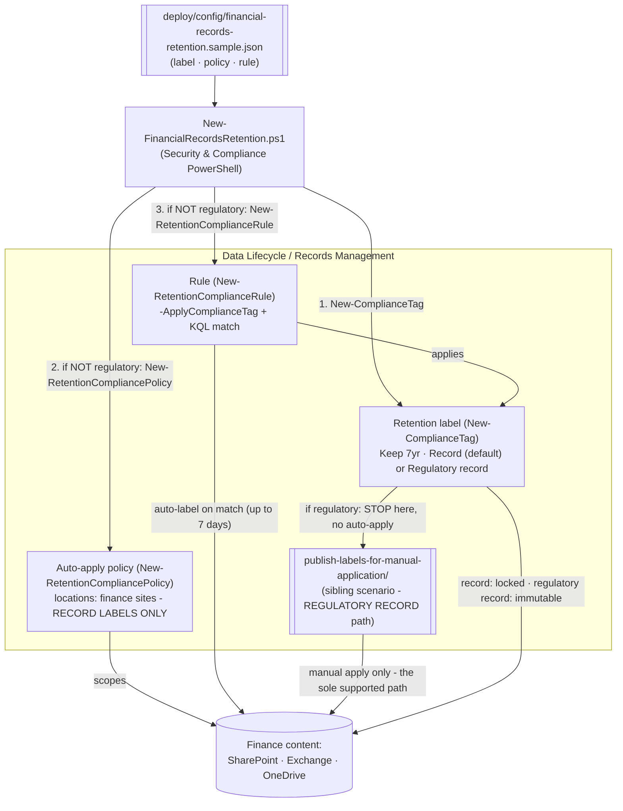

## The short version

Creates a **record** retention label for financial books-and-records (SEC 17a-4-style immutability)
and an **auto-apply** retention label policy that stamps it onto finance content - as code, via
Security & Compliance PowerShell. The label keeps content for 7 years and locks it as a **record**
(can't be edited/deleted, can only be unlocked or removed by a records manager); the auto-apply
policy targets the finance SharePoint site(s) and matches financial-record signals with a KQL query.
The same script can also create a stronger **regulatory record** label (`-Regulatory $true`,
PowerShell-only - the portal hides the option by default) - but Microsoft does **not** support
auto-applying a regulatory record, so for that case this script creates the label only and hands off
to the sibling `publish-labels-for-manual-application/` scenario to distribute it. See why this matters.

## Why this matters

Financial-services firms face prescriptive records-retention rules: **SEC Rule 17a-4** requires
broker-dealers to preserve specified records for defined periods (many for 6 years, the first 2
readily accessible), for the strictest records in a **non-rewriteable, non-erasable (WORM)** format;
**FINRA Rule 4511**, **CFTC 1.31**, **Sarbanes-Oxley**, and **MiFID II** impose parallel obligations.
Microsoft Purview offers two strengths of control for this: a **record** label (locks the item; a
records manager can still unlock/remove it) and a **regulatory record** label (the label **can't be
removed, relabeled, or unlocked, its retention can't be shortened, and the content can't be edited or
deleted** - for anyone, including admins - until the retention period expires).

> ⚠️ **Correction (this build's grounding pass): auto-apply does not support regulatory records.**
> Microsoft's own documentation states plainly that automatically applying a retention label "isn't
> supported for regulatory records... These scenarios require a published retention label policy"
>, corroborated by "...for labels that mark items as records (**but not
> regulatory records**), auto-apply those labels". This scenario's earlier draft
> auto-applied a regulatory record label by default - a configuration Microsoft doesn't support. It
> now defaults to a plain **record** label for auto-apply (fully supported), and creates but does
> **not** auto-apply a regulatory record label if you configure one - see the sibling
> *Publish Retention Labels for Manual Application* scenario, which is the
> *only* Microsoft-supported way to distribute a regulatory record label. Full grounding: that
> scenario's the design notes and this scenario's the review notes correction addendum.

> ⚠️ **Irreversibility is still real for a record label, just not absolute.** Over-scoping the
> auto-apply query locks the wrong content as a record, which then only a records manager can unlock
> or remove - and a regulatory record, if you create one, can never be removed once applied by
> anyone. Test in a lab tenant, review with `-DryRun`, and get Records/Legal sign-off before
> deploying. See the known limitations.

## How the control works

Three objects: the **label** (the retention + record/regulatory settings), the **policy** (where to
look), and the **rule** (which label to apply and the match query) - but the policy/rule are only
created when the label is **not** a regulatory record. Full rationale: the design notes.

## What it takes

### Prerequisites

Full licensing detail: [Licensing matrix](/docs/licensing-matrix/). RBAC: [RBAC model](/docs/rbac-model/). Automation surface:
[Automation surface](/docs/automation-surface/) (surface 2 - Security & Compliance PowerShell). Summary:

| Requirement | Minimum | Notes |
|---|---|---|
| Licensing | Retention labels/policies: **M365 E3**; **records management** (record + regulatory record labels, auto-apply, event-based, disposition review): **M365 E5 / E5 Compliance / Purview Suite** | Records are a Records Management (E5) capability |
| Role | **Retention Management** or **Records Management** role group (Compliance Administrator / Organization Management include it) | To create labels, policies, and rules - [RBAC model](/docs/rbac-model/) |
| Auth | `Connect-IPPSSession` (certificate app-only preferred) | Security & Compliance PowerShell - [Automation surface, section 3](/docs/automation-surface/#3-authentication-patterns---interactive-vs-unattended) |
| Regulatory record option | Enabled **only via PowerShell** (`New-ComplianceTag -Regulatory $true`) | The portal hides regulatory records by default |
| Target locations | Finance SharePoint site(s) / mailboxes / OneDrive | Auto-apply policy needs ≥1 location |

> Verify current entitlement names against [Licensing matrix](/docs/licensing-matrix/) (dated 2026-09-02) before a
> sales commitment - SKU names change.

### Cost and licensing

- **Per-user E5 entitlement**, no Azure consumption meter. Records management (record/regulatory
  record labels, auto-apply, disposition) is an **E5 / E5 Compliance / Purview Suite** capability;
  plain retention labels/policies are E3.
- **Cost is licensing + storage + governance discipline.** Content locked as a record (or regulatory
  record) can't be deleted early, so storage grows for the full retention term - factor 7-year (or
  longer) growth into SharePoint/Exchange capacity planning.
- **The expensive mistake is over-scoping.** An over-broad auto-apply query locks vast amounts of
  content as records that then need a records manager (or, for a regulatory record, no one at all) to
  release - the dominant risk to manage.

## Proof it works

1. **Automated** - `./validate/Test-FinancialRecordsRetention.ps1` confirms the label exists with the
   expected action/duration and record flags; if the label is **not** a regulatory record, also that
   the policy exists and is enabled with ≥1 location, and the rule applies the expected label. Exits
   non-zero on failure.
2. **Lock test (lab tenant)** - apply the label to a test document, then confirm you **cannot** edit
   or delete it while it's a record; a records manager can unlock/remove a plain record label, but
   **no one** can if you configured a regulatory record instead.
3. **Auto-apply test (record label only)** - place matching content in a finance location, wait up to
   **7 days**, and confirm the label is applied (portal, or `Get-` on the item's
   compliance tag). If stuck, run `Set-RetentionCompliancePolicy -RetryDistribution`. **Not applicable
   for a regulatory record** - see the publish sibling scenario instead.
4. **Idempotency proof** - re-run the deploy; the label (and, for a record label, the policy/rule)
   reports `exists` (not `created`) and nothing is duplicated or silently mutated.
5. **Disposition (if configured)** - for `KeepAndDelete` labels with disposition review, confirm the
   reviewer receives a disposition item at end-of-retention (out of scope for the `Keep`-only default).

## Where it stops

- **Fixed grounding defect (2026-09-16):** the deploy script's `New-RetentionComplianceRule` call
  previously passed both `-Name` and `-ApplyComplianceTag`. Microsoft's current reference documents
  `-Name` as mutually exclusive with `-ApplyComplianceTag`/`-PublishComplianceTag` - the `ComplianceTag`
  parameter set `-ApplyComplianceTag` belongs to has no `-Name` parameter at all - so that combination
  would not have resolved at runtime. `deploy/New-FinancialRecordsRetention.ps1` now omits `-Name`; the
  existing idempotency check (`Get-RetentionComplianceRule -Policy`) already locates the rule by policy,
  not by name, so nothing else depended on it. Found while grounding the sibling
  *Adaptive-Scope Auto-Apply Label* scenario, whose own script
  never repeated the defect. See the configuration reference and the review notes' correction addendum.
- **Auto-apply does not support regulatory records - this is a hard product limitation, not a bug in
  this scenario.** Microsoft: "This scenario isn't supported for regulatory records... These scenarios
  require a published retention label policy". This script creates the label
  either way, but skips policy/rule creation and tells you to use
  *Publish Retention Labels for Manual Application* instead when
  `regulatory: true`. See why this matters's correction note and the design notes.
- **A record label is lockable, not irreversible; a regulatory record is irreversible.** Only pick
  `Regulatory: true` if your obligation genuinely needs WORM immutability that even admins can't
  override - otherwise the default record label (still locked; a records manager can unlock/remove
  it) is the less-restrictive, equally-automatable choice. **Test in a lab tenant, review with
  `-DryRun`, and get Records/Legal sign-off before deploying either**.
- **Regulatory records are PowerShell-only to create.** `New-ComplianceTag -Regulatory $true` is the
  only supported way; the portal hides the option by default. That's independent
  of the auto-apply limitation above - label creation and label distribution are two different
  product surfaces with two different constraints.
- **`-WhatIf` is non-functional in S&C PowerShell** - the scripts ship a `-DryRun` instead.
- **Auto-apply latency & scope (record label only).** Auto-apply can take up to 7 days; can't label
  SharePoint/OneDrive items older than 6 months for trainable-classifier conditions; SharePoint/
  mailboxes need ≥10 MB for classifier-based apply. This scenario uses a KQL `-ContentMatchQuery`,
  which is not subject to the classifier age/size limits, but still has the 7-day latency.
- **Idempotency is create-or-report, not create-or-update.** The deploy locates objects by name and
  does **not** silently modify an existing label/policy (retention objects are high-consequence) - edit
  deliberately, with review, if settings must change.
- **Adaptive scopes out of scope.** This scenario uses static SharePoint locations; large/dynamic
  estates should use adaptive scopes (a documented follow-up).
- **Locking behavior of the policy vs. records.** Disabling/deleting the auto-apply policy stops future
  labeling only - it never releases content already locked as a record.
- **Illustrative values.** The 7-year duration, the finance site URL, and the match query are
  placeholders - set them to your actual regulatory obligation and record signals, validated by Records/
  Legal, before deploying.