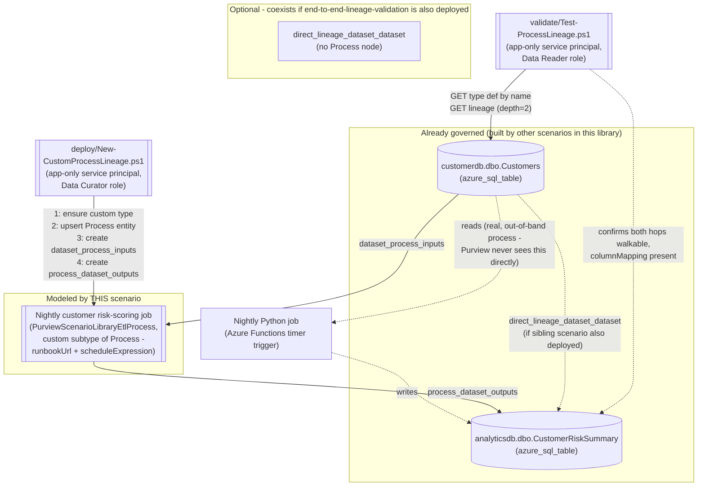

## The short version

Extends *Close Gaps and Validate End-to-End Customer Data Lineage* from a single unattributed
DataSet-to-DataSet edge into the richer **DataSet -> Process -> DataSet** lineage shape: the
nightly custom transform job itself becomes a queryable, Process-typed entity in the Purview lineage
graph - carrying a runbook URL and a schedule expression - rather than an invisible hop a reviewer
has to already know to ask about. This closes the exact follow-up
*Close Gaps and Validate End-to-End Customer Data Lineage* Section 7 left open: that scenario's own grounding pass
did not confirm a REST-documented body for creating a custom Process entity, so it used only the
direct-edge shape. This scenario's grounding pass found and confirmed that body.

## Why this matters

Same underlying driver as *Close Gaps and Validate End-to-End Customer Data Lineage* Section 2 - Microsoft's Cloud
Adoption Framework guidance to "enable automated lineage where available and close gaps manually
where required," and the same GDPR Art. 30/PCI DSS cardholder-data-flow-mapping and impact-analysis
use cases that depend on a complete graph. This scenario adds a narrower, complementary driver:
**root-cause and change-management workflows need to know *who to call*, not just *that a hop
exists*.** When `analyticsdb.dbo.CustomerRiskSummary` looks wrong, "there's an unattributed edge
from `Customers`" tells an investigator less than "there's a `Nightly customer risk-scoring job`
node with a runbook URL and a `0 3 * * *` schedule" - the second is immediately actionable inside
the same portal view the investigator is already looking at, without needing separate institutional
knowledge of which team owns which script.

## How the control works

The deploy script creates one custom Process-typed entity and up to two lineage relationships
(each only if missing). It never touches the upstream/downstream DataSet entities themselves, and
it never removes any pre-existing `direct_lineage_dataset_dataset` edge - see the design notes Section 6
for what a reader should make of seeing both edge types in the portal simultaneously. Full design
rationale: the design notes.

## What it takes

### Prerequisites

Full licensing detail and citations: [Licensing matrix](/docs/licensing-matrix/). Summary for this scenario (same
Data Map / Azure-consumption billing model as *Close Gaps and Validate End-to-End Customer Data Lineage* - see that scenario's
this page Section 3 for the full PAYG framing, not repeated here):

| Requirement | Minimum | Notes |
|---|---|---|
| Microsoft Purview account + Data Map | Active Azure subscription, Purview account with Data Map enabled | Same PAYG billing as the sibling scenario - [Licensing matrix, sections 1 and 2](/docs/licensing-matrix/#1-the-two-billing-models-read-this-first) |
| Create/update the Process entity and both relationships | **Data Curator** role on the collection containing the upstream/downstream assets | Classic Data Map role, Catalog Data plane. Same collection-wide blast-radius caveat *Close Gaps and Validate End-to-End Customer Data Lineage* (the prerequisites) already documents - treat this credential with the same care |
| Create the custom Process **type definition** | **Data Curator** role on the collection where the data asset is housed - **RESOLVED (2026-09-27 Microsoft Learn re-fetch)**: "Manage assets with metamodel"'s own prerequisites state collection-level Data Curator as sufficient for "Create and modify asset types", the same scoping already confirmed for the closely related "create a custom **classification**" action. No broader/root-level grant is required. This is the metamodel portal feature's own asset-type creation path rather than an independently fetched permission statement for the raw `Type - Bulk Create` entityDefs call this scenario's script uses directly - both sit on the same underlying Data Map/Atlas type system and Purview's RBAC model draws no documented distinction between data-plane create actions on that basis, so this is treated as resolved rather than a separate open item. **Residual risk regardless**: Apache Atlas type definitions are account-wide objects, not partitioned per collection the way entities are - collection-level Data Curator can create/pollute the tenant's entire shared type namespace, not just objects inside its own collection. Treat the deploy credential's blast radius as tenant-wide for this specific action, on top of the collection-wide entity/relationship blast radius the sibling scenario's own Red Team review already flagged |
| Read lineage and the type definition only (validation) | **Data Reader** role on the same collection | Least-privilege for the read-only `validate/` script |
| Grant the automation identity a Purview role at all | **Collection Admin** role at root (or the relevant sub-collection) | Only a Collection Admin can assign Data Curator/Data Reader to a service principal |
| The upstream and downstream assets already exist | Both registered and scanned via Data Map - same assets *Close Gaps and Validate End-to-End Customer Data Lineage* already targets (*Scan Azure SQL Database and Classify Sensitive Columns* for `customerdb.dbo.Customers`) | This scenario does not register or scan either source - see the configuration reference/the design notes |
| Automation identity for the REST calls themselves | App registration with Data Curator (deploy) or Data Reader (validate) Purview role | Client-secret app-only OAuth2, same token endpoint as this library's other surface-4 scripts - [Automation surface, section 3](/docs/automation-surface/#3-authentication-patterns---interactive-vs-unattended) |

> Verify current entitlement names against [Licensing matrix](/docs/licensing-matrix/) before a sales commitment.

### Cost and licensing

- **PAYG, not per-user, and effectively free at this scenario's scale** - same Data Map /
  Azure-consumption metering as the sibling scenario ([Licensing matrix, sections 1 and 2](/docs/licensing-matrix/#1-the-two-billing-models-read-this-first)). Creating one
  type definition and one entity is a lighter-weight metadata write than even the sibling's
  relationship-only calls.
- **No M365 per-user license required.**
- **The real cost driver is operational, not metered**: keeping the Process entity's
  `runbookUrl`/`scheduleExpression` attributes current as the underlying job changes owners or
  schedules - budget engineering time for that, not Azure spend.

## Proof it works

1. **Automated end-to-end check** - `./validate/Test-ProcessLineage.ps1` confirms the custom type
   exists **and its attribute set matches this scenario's definition file** (catching schema drift
   the deploy script's own existence-only check can't - see the known limitations), fetches the two-hop lineage graph
   in one call, and confirms both the
   `dataset_process_inputs` and `process_dataset_outputs` hops are walkable edges *in the correct
   order* (not merely that all three nodes appear somewhere in the graph), plus that the Process
   entity's `columnMapping` attribute survived. Exits non-zero on any hard failure.
2. **Portal evidence** - open `customerdb.dbo.Customers`' **Lineage** tab; a new "Nightly customer
   risk-scoring job" Process node should appear between it and
   `analyticsdb.dbo.CustomerRiskSummary`. Selecting the node should show the `runbookUrl` and
   `scheduleExpression` attributes; selecting either edge should show the relationship type.
3. **Negative test (prove the validator actually detects a gap)** - run
   `deploy/Remove-CustomProcessLineage.ps1` to delete both relationships and the Process entity,
   then re-run `validate/Test-ProcessLineage.ps1` and confirm it now reports `[FAIL]` for the
   Process entity's presence (and, consequently, both hops) with the guidance pointing back at the
   deploy script. Re-run the deploy script afterward to restore the chain.
4. **Idempotency proof** - re-run `deploy/New-CustomProcessLineage.ps1` a second time against an
   already-deployed chain and confirm every step reports `[SKIP]`/upsert-no-op rather than creating
   duplicates - including a **third** run after that, to confirm the second run's idempotency wasn't
   a fluke of ordering.

## Where it stops

- **Custom lineage - including this scenario's Process node - is asserted, not verified.** Same
  evidentiary caveat as *Close Gaps and Validate End-to-End Customer Data Lineage* (the known limitations): Purview does not check that
  the modeled job actually does what its attributes claim. If this graph is cited as
  audit/compliance evidence, distinguish natively-captured lineage from custom-asserted lineage
  (both the edges *and* this Process node) explicitly.
- **VERIFY - relation-end typeName for a *custom* Process subtype.** This scenario uses the literal
  `Process` (not `PurviewScenarioLibraryEtlProcess`) as the relationship-end typeName for both
  `dataset_process_inputs` and `process_dataset_outputs`, matching Microsoft's own worked example
  exactly - but that example's concrete entity type was a **built-in** subtype (`hive_view_query`),
  not a custom one. Whether the same ancestor-typeName resolution behavior holds identically for a
  custom subtype was not independently re-confirmed by this build's grounding pass. If it doesn't,
  the fix is a one-line change (use `PurviewScenarioLibraryEtlProcess` instead of `Process` in both
  relationship end definitions) - flagged rather than assumed either way.
- **RESOLVED (2026-09-27 Microsoft Learn re-fetch) - permission scope for creating a custom entity
  type definition.** the prerequisites above; "Manage assets with metamodel"'s prerequisites now confirm
  collection-level Data Curator as sufficient for "Create and modify asset types",
  matching the scoping already confirmed for the closely related "create a custom classification"
  action. No broader/root-level grant is required.
- **The deploy script's type-existence check does not detect schema drift** - it only asks "does a
  type with this name exist," and (per Type - Bulk Create's own "avoid recreating existing types"
  warning) never re-submits the shape to reconcile an existing type that was edited out-of-band.
  `validate/Test-ProcessLineage.ps1` closes the detection gap (a dedicated schema-drift check
  compares the live type's attribute names against this definition file), but does not - and, given
  the unconfirmed update semantics, should not - attempt to fix drift automatically. See that
  script's inline comments.
- **VERIFY - the not-found status code for Type - Get Entity Def By Name.** This script's existence
  check treats *any* non-success response as "type does not exist yet" rather than assuming 404
  specifically - see the deploy script's `.NOTES`. Functionally safe (a transient error would also
  be misread as "missing," causing a redundant-but-harmless Type - Bulk Create attempt that itself
  would then either succeed or surface a clearer error), but not the same as a confirmed 404.
- **Confirmed (was VERIFY) - the qualifiedName format Purview assigns to an `azure_sql_table`
  asset.** Same item the sibling scenario carries and has since confirmed
  (*Close Gaps and Validate End-to-End Customer Data Lineage* (the known limitations and the references): Microsoft's own Discovery - Query REST
  reference documents the `mssql://<server-fqdn>/<database>/<schema-or-path>/<table>` scheme
  directly) - applies here identically to the upstream/downstream references, not to the Process
  entity's own (self-authored) qualifiedName.
- **This scenario does not validate that `runbookUrl` points at a live, current document** - see
  operations and tuning. A stale link is not detected by `validate/Test-ProcessLineage.ps1`.
- **Rollback does not delete the custom Process type definition** - see the rollback runbook "What
  rollback does not undo" for why. The `Type - Delete` REST path is now confirmed (2026-09-28
  Microsoft Learn maintenance pass: `DELETE {endpoint}/datamap/api/atlas/v2/types/typedef/name/{name}`,
  204 No Content on success - reference 18), but its behavior against a type that has - or ever
  had - entity instances remains an open VERIFY: the reference page's error shape
  (`AtlasErrorResponse`, "an unexpected error response") is generic and does not document
  whether an in-use type succeeds, no-ops, or errors on delete.
- **This is the Data Map / Atlas REST surface, not the retiring classic Data Catalog UI** - same
  clarification as the sibling scenario (*Close Gaps and Validate End-to-End Customer Data Lineage* (the known limitations)); nothing
  here depends on the classic Data Catalog UI or is at risk from its retirement.