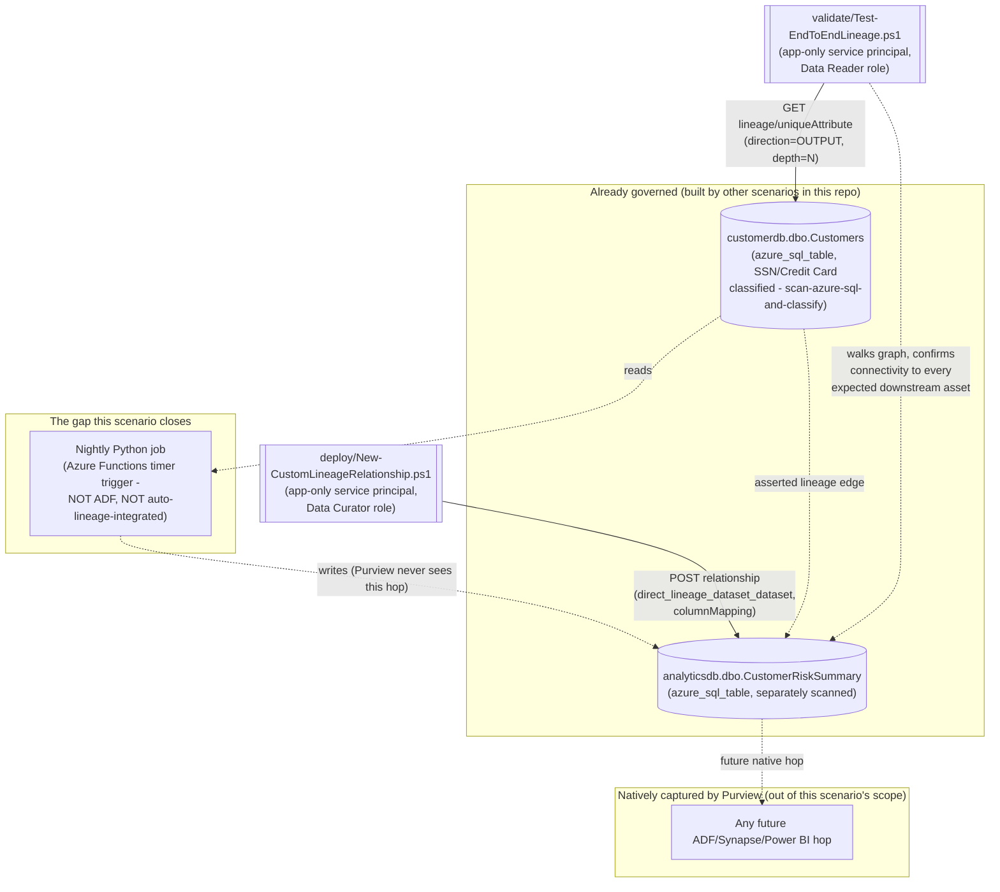

## The short version

Closes a common data-lineage gap - a custom data-processing job that isn't one of Microsoft
Purview's automatically-integrated systems (Azure Data Factory, Synapse, Power BI, Databricks,
Airflow/OpenLineage, and a handful of others) - by asserting the missing link via the Purview Data
Map REST API's custom-lineage support, then proves the *entire* chain from origin to destination is
actually connected with a repeatable, read-only validation script. This is the first Data Lineage
scenario in this library, and it deliberately targets the harder, more novel half of "lineage" that
the other Data Governance scenarios here don't cover: not "did a scan discover an asset" (Data Map)
or "is the data named and governed" (Unified Catalog) or "is the data any good" (Data Quality), but
"can we actually prove, end-to-end, how data moves and where it came from" - the specific question
root-cause analysis, impact analysis, and audit evidence all depend on.

## Why this matters

Microsoft's own Cloud Adoption Framework guidance for Purview data governance states the
requirement plainly: *"Data lineage provides visibility into how data moves and changes across
systems. Recommendation: Enable automated lineage where available and close gaps manually where
required"*. A broken or incomplete lineage graph isn't just an inconvenience -
it directly undermines the specific compliance and security use cases lineage exists for: GDPR
Art. 30 records-of-processing and Art. 15 subject-access requests both depend on being able to
trace where personal data flows once it leaves its source of record; PCI DSS cardholder-data-flow
diagrams (Requirement 1.2.4/prior v3.2.1 Requirement 1.1.3) require an accurate, current map of
where card data moves, not a diagram that stops at the first custom transform; and impact analysis
before a schema change - "if we drop this column from `Customers`, what breaks downstream" - is
only as reliable as the graph is complete. A lineage graph that silently stops at every custom job
gives a false sense of completeness: it looks the same, in the portal, as "there is genuinely no
downstream consumer," which is the worst possible failure mode for a control whose entire purpose
is visibility.

This scenario also ties directly into this library's existing Data Governance narrative:
*Scan Azure SQL Database and Classify Sensitive Columns* already classifies `customerdb.dbo.Customers`
with SSN/Credit Card Number sensitive information types. Without lineage connecting it to
`analyticsdb.dbo.CustomerRiskSummary`, a reviewer asking "where else does this classified data end
up" gets an incomplete answer purely because the connecting job happens to be a custom script
instead of an Azure Data Factory pipeline - an accident of implementation, not a difference in
actual risk.

## How the control works

The deploy script creates one `direct_lineage_dataset_dataset` relationship between two
**already-existing** DataSet entities - it never creates entities, only the edge between them. The
validate script is deliberately a separate, broader check: it walks the whole reachable graph from
the origin asset and confirms every asset in an independently-declared expected chain is actually
connected, not just that this scenario's one link exists. Full design rationale: the design notes.

## What it takes

### Prerequisites

Full licensing detail and citations: [Licensing matrix](/docs/licensing-matrix/). Summary for this scenario:

| Requirement | Minimum | Notes |
|---|---|---|
| Microsoft Purview account + Data Map | Active Azure subscription, Purview account with Data Map enabled | Data Map/lineage is **PAYG-billed Azure consumption**, not a per-user M365 entitlement - see [Licensing matrix, sections 1 and 2](/docs/licensing-matrix/#1-the-two-billing-models-read-this-first) |
| Create/update the custom lineage relationship | **Data Curator** role on the collection containing both target assets | Classic Data Map role - grants access to the **Catalog Data plane**, which is what the entity/relationship/lineage REST operations this scenario uses live on. **This role is granted at the collection level, not per asset or per relationship** - a service principal holding Data Curator on the collection containing these two tables can create, edit, or delete entities and relationships on *any* asset in that collection, not just the two this scenario targets. See [RBAC model, section 5](/docs/rbac-model/#5-data-governance-roles-data-map--unified-catalog---a-separate-model) and treat this credential with the same care as any collection-wide write grant, reviewing membership periodically |
| Read lineage only (validation) | **Data Reader** role on the same collection | Least-privilege for the read-only `validate/` script |
| Grant the automation identity a Purview role at all | **Collection Admin** role at root (or the relevant sub-collection) to perform the role assignment | Only a Collection Admin can assign Data Curator/Data Reader to a service principal |
| The upstream and downstream assets already exist | Both registered and scanned via Data Map (e.g. *Scan Azure SQL Database and Classify Sensitive Columns* for `customerdb.dbo.Customers`, and an equivalent scan of the analytics database for `analyticsdb.dbo.CustomerRiskSummary`) | This scenario does **not** register or scan either source - see section 6/the design notes |
| Automation identity for the REST calls themselves | App registration with **Data Curator** (deploy) or **Data Reader** (validate) Purview role on the collection | Client-secret app-only OAuth2, same token endpoint as this library's other surface-4 scripts - [Automation surface, section 3](/docs/automation-surface/#3-authentication-patterns---interactive-vs-unattended) |

> Verify current entitlement names against [Licensing matrix](/docs/licensing-matrix/) (dated 2026-09-02) before a
> sales commitment - SKU names and billing meters change.

### Cost and licensing

- **PAYG, not per-user, and effectively free at this scenario's scale.** Entity/relationship/
  lineage REST calls bill through the same Data Map / Azure-consumption metering as
  *Scan Azure SQL Database and Classify Sensitive Columns* - see [Licensing matrix, sections 1 and 2](/docs/licensing-matrix/#1-the-two-billing-models-read-this-first). Unlike a
  scan, this scenario's calls are lightweight, low-volume metadata writes (one relationship per
  custom hop), not a data-scanning workload - cost impact at typical scale (tens to low hundreds of
  custom links) is negligible compared to the Data Map scanning this scenario depends on as a
  prerequisite.
- **No M365 per-user license required** - same PAYG/Azure-consumption model as this library's other
  Data Map scenarios, not an M365 per-user entitlement feature.
- **The real cost driver is operational, not metered**: keeping `expectedDownstreamChain` current
  as new custom hops are added, and running the recurring validation check - budget engineering
  time for definition-file maintenance, not Azure spend, when scaling this pattern past a handful
  of links.

## Proof it works

1. **Automated end-to-end check** - `./validate/Test-EndToEndLineage.ps1` walks the full graph from
   the origin asset and confirms every asset in `expectedDownstreamChain` is both present *and*
   reachable by a walkable path (not merely co-listed in the response), plus that each custom
   link's column mapping survived. Exits non-zero on any hard failure (safe for a CI-style
   pre-flight or a recurring scheduled check).
2. **Portal evidence** - open `customerdb.dbo.Customers`' **Lineage** tab in the Purview portal;
   `analyticsdb.dbo.CustomerRiskSummary` should now appear downstream, connected by a
   `direct_lineage_dataset_dataset` edge. Selecting the edge should show the `CustomerId ->
   CustomerId` column mapping.
3. **Negative test (prove the validator actually detects a gap, not just a happy path)** - run
   `deploy/Remove-CustomLineageRelationship.ps1` to delete the link, then re-run
   `validate/Test-EndToEndLineage.ps1` and confirm it now reports a `[FAIL]` for the missing
   downstream asset with the "most likely cause" guidance pointing back at the deploy script - this
   is the concrete proof the validation is actually checking connectivity, not just returning
   success unconditionally. Re-run the deploy script afterward to restore the link.
4. **Idempotency proof** - re-run `deploy/New-CustomLineageRelationship.ps1` a second time against
   an already-deployed link and confirm it reports `[SKIP] ... already exists` rather than creating
   a duplicate edge.

## Where it stops

- **Custom lineage is asserted, not verified.** Purview does not check a custom
  `direct_lineage_dataset_dataset` relationship against reality in any way - it accepts whatever
  the caller (this scenario's deploy script, or a human via the portal) claims. If this library
  is used to produce audit or compliance evidence ("here is our data flow map"), be explicit in
  that narrative about which edges were natively captured (Purview independently observed the
  system doing the work) versus custom-asserted (an engineer told Purview this is true). This
  scenario's own the short version and the architecture and `deploy/lineage/customer-risk-summary-lineage.json`'s
  `description` field are written to make that distinction easy to preserve downstream - don't
  drop it when citing this graph as evidence.
- **This is the Data Map / Atlas REST surface, not the retiring classic Data Catalog UI.** Several
  citations below (references 1, 2, 4, 6) point at articles titled "classic Data Catalog" because
  that's where Microsoft documents lineage *concepts* (the DataSet/Process model, relationship
  types, the supported auto-lineage system list) in most detail. The REST API this scenario
  actually calls (`datamap/api/atlas/v2/...`, references 5/10-14) is the current, actively
  maintained Data Map data plane - the same one the (non-deprecated) Unified Catalog reads from
  for its own Lineage tab. Nothing this scenario builds depends on the classic Data Catalog UI or
  is at risk from its retirement.
- **This scenario does not model the transform as a Process asset.** The lineage graph shows a
  direct edge from `customerdb.dbo.Customers` to `analyticsdb.dbo.CustomerRiskSummary` with no
  intermediate node representing the nightly job itself - Microsoft's model supports a richer
  DataSet -> Process -> DataSet shape, but this build's grounding pass did not confirm a
  REST-documented body for creating a *custom* Process-typed entity (only for referencing the
  built-in `Process` type against entities a tutorial had already created via a different flow -
  see the design notes Section 1/7). Follow-up tracked in the project backlog.
- **Confirmed (was VERIFY) - the qualifiedName format Purview assigns to an `azure_sql_table`
  asset.** Microsoft's own Discovery - Query REST reference documents the `mssql://` scheme
  directly, in two independent worked examples pairing `"entityType": "azure_sql_table"` with
  `"qualifiedName": "mssql://exampleserver.database.windows.net/examplesqldb/examplepath/exampledata1"`
  - i.e. `mssql://<server-fqdn>/<database>/<schema-or-path>/<table>`. This
  scenario's definition file still requires the operator to copy the real, per-asset value from
  the portal (or resolve it via Discovery - Query/GraphQL) rather than having either script
  auto-construct it - the scheme is now format-confirmed, but the exact schema/path segment is
  asset-specific, so copying the real value stays the safer default.
- **VERIFY - `Relationship - Create`'s behavior on a duplicate POST.** This build's grounding pass
  confirmed `Relationship - Create`'s request/response shape directly from Microsoft's REST
  reference, but that reference does not state whether re-POSTing an identical relationship
  rejects, no-ops, or creates a second (duplicate) edge. This scenario's own existence check makes
  its idempotency independent of the answer (the design notes Section 2), but a production integration
  that calls `Relationship - Create` directly, without this scenario's check first, should confirm
  the behavior against a pilot tenant.
- **A rescanned asset gets a new GUID even if its qualifiedName is unchanged.** If either the
  upstream or downstream table is deleted and re-registered (not just re-scanned in place) by Data
  Map, the old relationship - which points at GUIDs, not qualifiedNames, once created - becomes
  orphaned. `validate/Test-EndToEndLineage.ps1` will correctly detect this as a connectivity
  failure (see operations and tuning's incident-response runbook); re-running the deploy script resolves it.
- **This scenario's validate script checks that a column mapping is *present*, not that it's
  *correct or current*.** It confirms the `columnMapping` attribute this scenario's own deploy
  script wrote didn't get cleared or corrupted - it does not re-derive the mapping from either
  table's live schema, so a schema change that silently invalidates the mapping (e.g. `CustomerId`
  renamed on one side) is not caught by this scenario. See the design notes Section 7.
- **No Purview-native alerting for a broken lineage link** - see section 8's Alert routing note; the
  recurring `validate/` run is the only detection mechanism this scenario provides.