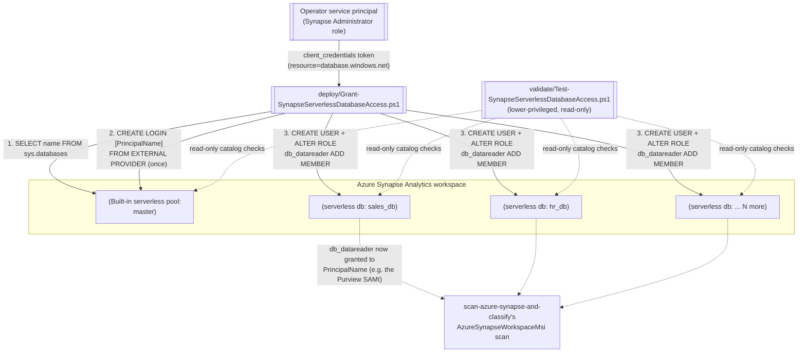

## The short version

Automates the per-serverless-database `CREATE LOGIN`/`CREATE USER`/`db_datareader` grants
*Scan Azure Synapse Analytics Workspace and Classify Sensitive Columns*'s serverless-SQL-pool scanning path depends on,
across every serverless database in an Azure Synapse Analytics workspace (or an explicit subset) in one
idempotent run, instead of the manual, per-database Synapse Studio SQL-script walkthrough Microsoft
documents. This is a **companion/prerequisite-automation scenario**, not a standalone one - it exists
because that parent scenario's own four-lens review flagged the manual version as a real cost that
scales with database count, not a fixed one-time chore (see the CISO review, finding 1, there).

## Why this matters

Same underlying drivers as the parent scenario (*Scan Azure Synapse Analytics Workspace and Classify Sensitive Columns* (why this matters)) - this
scenario doesn't add a new regulatory driver of its own, it removes an operational blocker to realizing
that scenario's classification coverage at scale. A workspace whose prerequisite grants are only
partially applied (because the manual per-database walkthrough was too costly to finish) has classification
coverage gaps in exactly the databases nobody got around to granting - a silent, self-inflicted version of
the same "unclassified aggregation point" risk the parent scenario's why this matters describes.

## How the control works



## What it takes

### Prerequisites

Full licensing detail and citations: [Licensing matrix](/docs/licensing-matrix/) (no incremental license cost - this
scenario uses only Azure Synapse's own RBAC/SQL surface, not a Purview or M365 entitlement). Summary for
this scenario:

| Requirement | Minimum | Notes |
|---|---|---|
| Operator identity to run this script (`-AppId`) | **Synapse Administrator** role on the workspace (Azure Synapse's own RBAC, assignable in Synapse Studio → **Manage** → **Access control**, or `New-AzSynapseRoleAssignment -RoleDefinitionName 'Synapse Administrator'` from the `Az.Synapse` module) | A **completely different RBAC system** from the Purview roles the parent scenario's deploy script needs - confirmed via Microsoft's own *Azure Synapse workspace access control overview*: "Synapse Administrators are granted db_owner (DBO) permissions on the serverless SQL pool... To grant other users access to the serverless SQL pool, Synapse administrators need to run SQL scripts on the serverless pool." **Not yet cross-referenced in [RBAC model](/docs/rbac-model/)** (that doc currently documents nine systems, none of them Azure Synapse workspace RBAC) - flagged rather than guessed at a section number; recorded as a follow-up in the project backlog |
| Principal being granted access (`-PrincipalName`) | Any Microsoft Entra-backed principal Azure Synapse accepts in `CREATE LOGIN ... FROM EXTERNAL PROVIDER` | Typically the Microsoft Purview account's own display name (the parent scenario's SAMI) - the two parameters are deliberately different identities in the common case, see the design notes |
| Workspace **firewall**: "Allow Azure services and resources to access this workspace" = **On** | Azure portal → the workspace → **Firewalls/Networking** | Same prerequisite the parent scenario documents (*Scan Azure Synapse Analytics Workspace and Classify Sensitive Columns* (the prerequisites)) - this script also needs a network path to the serverless endpoint, from wherever it runs |
| `SqlServer` PowerShell module | A version supporting `Invoke-Sqlcmd -AccessToken` (Microsoft's own worked examples for this parameter use current module releases; pin a specific version before shipping to an organization) | `Install-Module -Name SqlServer -Scope CurrentUser`. This is a **sixth automation surface** for this library, not yet catalogued in [Automation surface](/docs/automation-surface/)'s five - see section 11 |
| Automation identity for the read-only `validate/` script | A lower-privileged identity than the deploy script's operator - only needs `CONNECT`/catalog-view visibility, not Synapse Administrator | See `validate/Test-SynapseServerlessDatabaseAccess.ps1`'s own `.PARAMETER AppId` note |

> Verify current role names and RBAC assignment mechanics against [RBAC model](/docs/rbac-model/) and Microsoft
> Learn before a sales commitment - this scenario's RBAC system (Azure Synapse workspace roles) is not
> yet cross-referenced there.

### Cost and licensing

No incremental license cost - this scenario grants SQL-level permissions using Azure Synapse's own RBAC
and T-SQL surface, not a Purview or Microsoft 365 entitlement. The operator identity's Synapse
Administrator role assignment itself has no billing implication either. See [Licensing matrix](/docs/licensing-matrix/)
for the parent scenario's own PAYG/Azure-consumption notes, which this scenario doesn't add to.

## Proof it works

1. **Automated check** - `./validate/Test-SynapseServerlessDatabaseAccess.ps1` confirms the server-level
   login exists and, for every target database, that the principal is both a database user and a
   `db_datareader` member. Exits non-zero on any hard failure.
2. **Manual spot-check** - from Synapse Studio, against any target database:
   ```sql
   SELECT p.name AS UserName, r.name AS RoleName
   FROM sys.database_principals p
   LEFT JOIN sys.database_role_members rm ON p.principal_id = rm.member_principal_id
   LEFT JOIN sys.database_principals r ON rm.role_principal_id = r.principal_id
   WHERE p.authentication_type_desc = 'EXTERNAL'
   ORDER BY p.name;
   ```
   (Microsoft's own documented verification query, unfiltered - shows every external principal, not
   just the one this scenario granted.)
3. **Downstream evidence** - after running this scenario's deploy script, re-run
   `scan-azure-synapse-and-classify/deploy/New-AzureSynapseDataMapScan.ps1 -RunNow` and confirm (via
   that scenario's own `validate/Test-AzureSynapseDataMapScan.ps1` and the validation steps) that the previously-ungranted
   databases now report discovered/classified assets.

## Where it stops

- **Cannot auto-detect read-only Spark/Lake-replicated databases.** Microsoft documents that "the
  following steps for serverless databases do not apply to replicated databases" (databases replicated
  from a Spark/Lake database are currently read-only), but no catalog column or documented signal
  identifying them was found during this build's grounding pass. This script surfaces a failed grant
  attempt against one as a per-database `Error` in its result table rather than fabricating a detection
  heuristic - use `-ExcludeDatabase` to skip known ones on subsequent runs.
- **`-PrincipalName` for a service-principal grantee is a known naming ambiguity this library already
  carries elsewhere.** Microsoft's own documentation uses the literal placeholder `[ServicePrincipalID]`
  for this case without stating whether it means the app's display name or its application (client) ID
  - the same ambiguity *Scan Azure Synapse Analytics Workspace and Classify Sensitive Columns* and its two Azure-SQL siblings already flag for
  their own service-principal-authentication non-goals. This scenario's default use case (granting the
  Purview account's own MSI, by its unambiguous display name) is unaffected.
- **CORRECTION applied here, not yet backported to the parent scenario.** `scan-azure-synapse-and-classify/
  the implementation steps step 3c and the design notes describe `CREATE LOGIN` as a per-database step. This
  scenario's own grounding pass found two independent Microsoft Learn sources confirming it is a
  server-scoped statement (run once against `master`) - see the design notes for the full grounding. This
  scenario implements the corrected behavior; the parent scenario's wording is not edited by this
  fragment - a follow-up to reconcile it is recorded in the project backlog.
- **Idempotency checks match by name only, not by a stable identifier.** The login/user-existence
  checks (`sys.server_principals`/`sys.database_principals` filtered by `name = @PrincipalName`) would
  treat an unrelated pre-existing principal that happens to share the same display name as "already
  granted," silently skipping the intended grant. Azure Synapse's external-provider login model doesn't
  document a way to pin a specific Microsoft Entra object ID at creation time the way a dedicated pool's
  SID-aware variant can - flagged as a Red Team finding in the review notes rather than resolved by
  guessing a pinning mechanism. Low real-world likelihood (display-name collisions across
  Entra-backed principals in one tenant are uncommon) but worth knowing before trusting this script's
  "already granted" result for a principal name you didn't choose yourself.
- **Cross-cutting doc gaps surfaced, not fixed here.** This scenario introduces a **sixth** automation
  surface (direct T-SQL via `Invoke-Sqlcmd`) not yet in [Automation surface](/docs/automation-surface/)'s five, and relies
  on a **tenth** RBAC system (Azure Synapse workspace roles - Synapse Administrator) not yet in
  [RBAC model](/docs/rbac-model/)'s nine. Both are flagged inline above rather than silently assumed covered;
  follow-ups to add them are recorded in the project backlog.
- **Dedicated SQL pools are out of scope** - see the design notes. The parent scenario's manual,
  one-time-per-workspace dedicated-pool grant remains unautomated (and, per that scenario's own
  reasoning, doesn't need bulk automation - a workspace typically has at most one dedicated pool).
- **Network path required from wherever this script runs.** Unlike the parent scenario's SAMI-authenticated
  scan (which runs inside the Purview service), this script's operator identity connects directly to the
  serverless SQL endpoint over TDS/1433 from wherever the script executes - confirm outbound network
  reachability (and the workspace firewall setting) from that location before troubleshooting an
  authentication failure as a permissions problem.