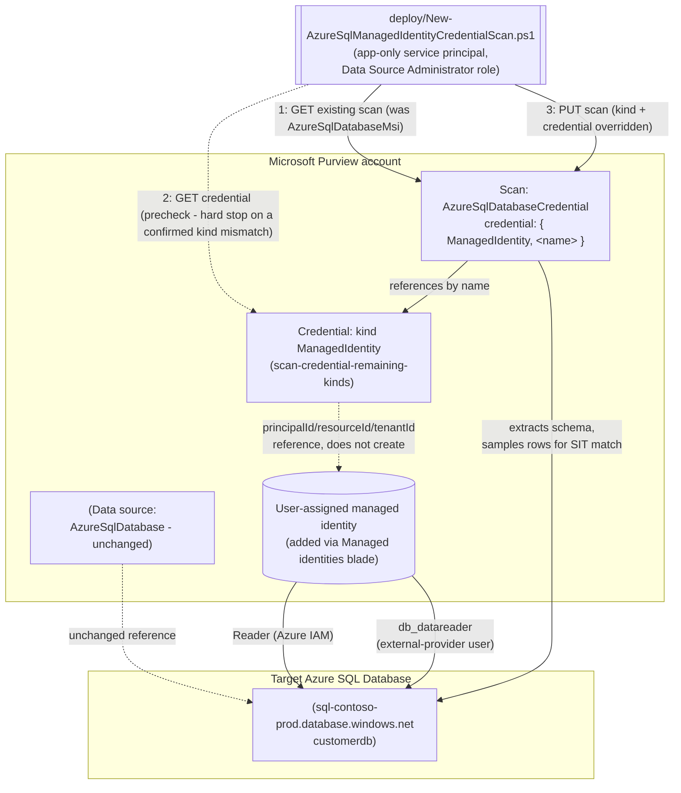

## The short version

Extends *Scan Azure SQL Database and Classify Sensitive Columns*: reconciles that scenario's already-registered scan from the Purview account's shared system-assigned managed identity (SAMI) onto a
**user-assigned managed identity (UAMI)** - a separately-scoped, per-source Azure identity built via
*Scan Credentials: Remaining Kinds (Account Key, Role ARN, Consumer Key, Delegated Auth, User-Assigned Managed Identity)*'s `ManagedIdentity` credential kind. Every
other scan property (database, server, collection, scan rule set) is preserved unchanged; only the
authentication path moves.

## Why this matters

Least-privilege and blast-radius reduction are explicit controls under SOC 2 (CC6.1 - logical
access restricted to least privilege), ISO 27001 (A.8.2 - privileged access rights), and most
internal segregation-of-duties policies. The Purview account's SAMI is, by design, **one identity
shared across every source that account scans** - there is no way to scope the SAMI itself more
narrowly per source. Microsoft's own documented credential priority order ranks a UAMI directly
below SAMI for exactly this reason: it is a separate, independently-grantable and independently-revocable Azure identity per source or source group. This scenario makes that
narrower option concrete for the base scenario's Azure SQL Database scan, rather than leaving it as
a documented-but-unbuilt "alternative" (the base scenario's own page the configuration reference has always named
`AzureSqlDatabaseCredential` as the alternative scan kind without scripting it).

## How the control works

## What it takes

### Prerequisites

Full licensing detail and citations: [Licensing matrix](/docs/licensing-matrix/). Summary for this scenario -
**additive** to the base scenario's own prerequisite table, which still applies in full:

| Requirement | Minimum | Notes |
|---|---|---|
| The base scenario already deployed | *Scan Azure SQL Database and Classify Sensitive Columns* scan exists (SAMI or already-reconciled credential auth) | This scenario reconciles an **existing** scan - it refuses to run against a data source/scan that doesn't exist yet |
| A user-assigned managed identity (UAMI) created and added to the Purview account | Azure identity-administration action, via the Purview account's own **Managed identities** blade | Out-of-band Azure step, not a Scanning-API call - see *Scan Credentials: Remaining Kinds (Account Key, Role ARN, Consumer Key, Delegated Auth, User-Assigned Managed Identity)* (the prerequisites) |
| A Purview credential object, kind `ManagedIdentity`, referencing that UAMI | Built via *Scan Credentials: Remaining Kinds (Account Key, Role ARN, Consumer Key, Delegated Auth, User-Assigned Managed Identity)* -CredentialType ManagedIdentity` | This scenario's `-CredentialReferenceName` parameter is that credential object's name |
| Reconcile the scan onto the new credential | **Data Source Administrator** role on the scan's collection | Same Purview role the base scenario's own deploy script needs - see [RBAC model, section 5](/docs/rbac-model/#5-data-governance-roles-data-map--unified-catalog---a-separate-model) |
| Azure IAM on the target SQL Server, for the **UAMI** (not the Purview account's SAMI) | **Reader** role, scoped to the **SQL Server resource itself**, granted to the UAMI | A separate grant from the base scenario's SAMI grant - Microsoft's portal instructions accept "your Microsoft Purview account name or UAMI" in the same **Select** box, but they are two different principals with two separate role assignments |
| Database-level access for the UAMI | `db_datareader` granted to the **UAMI's exact managed-identity name** as a Microsoft Entra external-provider database user | Same T-SQL pattern as the base scenario's SAMI grant, different `[Username]` value - see the implementation steps |
| Network path to the database | Unchanged from the base scenario - **neither SAMI nor UAMI works over a self-hosted integration runtime** | Confirmed explicitly for UAMI, not just SAMI - see the known limitations |
| Automation identity for the REST calls themselves | App registration with **Data Source Administrator** (and, for `validate/`, **Data Reader**) Purview role on the collection | Same as the base scenario - [Automation surface, section 3](/docs/automation-surface/#3-authentication-patterns---interactive-vs-unattended) and the validation steps below |

> Verify current entitlement names against [Licensing matrix](/docs/licensing-matrix/) before a production rollout -
> this scenario introduces no new licensing surface (still PAYG Data Map scanning), only a different
> authentication identity.

### Cost and licensing

- **No new billing surface.** This scenario changes authentication only - the same PAYG Data Map
  scan-consumption model documented in [Licensing matrix, sections 1 and 2](/docs/licensing-matrix/#1-the-two-billing-models-read-this-first) and the base scenario's the cost and licensing notes
  applies unchanged.
- **A UAMI itself has no direct Azure cost** - it is a free identity resource. The only cost
  consideration is operational: each additional UAMI is one more Azure identity a team must
  provision, grant, and monitor (see the CISO coordination-cost point in
  *Scan Credentials: Remaining Kinds (Account Key, Role ARN, Consumer Key, Delegated Auth, User-Assigned Managed Identity)*, which applies identically here).

## Proof it works

1. **Automated config check** - `./validate/Test-AzureSqlManagedIdentityCredentialScan.ps1` confirms
   the scan's `kind` is `AzureSqlDatabaseCredential`, its `credential.credentialType` is
   `ManagedIdentity`, and (with `-ExpectedCredentialReferenceName`) that it references the expected
   credential object. `-CheckCredentialObject` additionally confirms that object itself still exists
   and is still kind `ManagedIdentity`.
2. **Scan run status** - Purview portal → **Data Map** → **Data sources** → the scan → **Recent
   scans** → confirm a run under the new identity reaches **Completed**.
3. **Access-path evidence** - confirm in Azure SQL (`SELECT * FROM sys.database_principals WHERE
   type = 'E'`) that the UAMI (not the Purview account) now appears as the external-provider
   database user with `db_datareader` actually being used by new scan runs.
4. **Negative test** - temporarily revoke the UAMI's `db_datareader` grant, re-run with `-RunNow`,
   and confirm the run fails with an authentication/authorization error rather than silently
   succeeding under a fallback identity (Purview does not fall back from a configured credential to
   SAMI).

**What no script here can prove**, beyond the base scenario's own section 7 disclaimer: whether the UAMI is
still attached to the Purview account (it can be detached/deleted independently of the credential
object that references it - see the known limitations); whether the stored credential's three ID strings still match
a live, existing UAMI resource.

## Where it stops

- **`ManagedIdentity` (UAMI) is a Microsoft-labeled Preview capability**, inherited from
  *Scan Credentials: Remaining Kinds (Account Key, Role ARN, Consumer Key, Delegated Auth, User-Assigned Managed Identity)*. A production rollout built on it could be disrupted by a
  behavior change with no corresponding documentation update - see that scenario's page the known limitations for
  the full disclosure, which applies unchanged here.
- **Neither SAMI nor UAMI works over a self-hosted integration runtime.** If the target SQL Server is
  reachable only via self-hosted IR, this entire scenario (and the base scenario's SAMI default) is
  inapplicable - the only supported paths are service principal or SQL authentication, both
  requiring a Key Vault-backed credential via *Key Vault-Backed Scan Credential (SQL Auth / Service Principal)* instead.
- **A UAMI can be deleted independently of the credential object that references it, and
  independently of this scan's configuration.** Neither this scenario's deploy script nor its
  validate script can detect that - `-CheckCredentialObject` confirms the Purview credential object
  still exists and is the right kind, not that the UAMI resource it points at is still live and
  attached to the Purview account. Confirm in the Azure portal's Managed identities blade if a
  previously-working scan starts failing authentication.
- **Reverting to SAMI (rollback) assumes the SAMI's own Reader/`db_datareader` grants from the base
  scenario are still in place.** If they were removed when the UAMI was adopted, re-establish them
  before rolling back, or the reverted scan will register successfully but fail on its next run -
  see the rollback runbook.
- **This scenario's precheck cannot detect every misconfiguration.** `-CheckCredentialObject`/the
  deploy script's built-in precheck confirm the credential object exists and is the right *kind* -
  neither confirms the UAMI it references is attached to the Purview account or holds the Azure
  IAM/SQL grants, the same disclosed gap *Scan Credentials: Remaining Kinds (Account Key, Role ARN, Consumer Key, Delegated Auth, User-Assigned Managed Identity)* (the validation steps) already
  carries for every consumer of a `ManagedIdentity` credential.