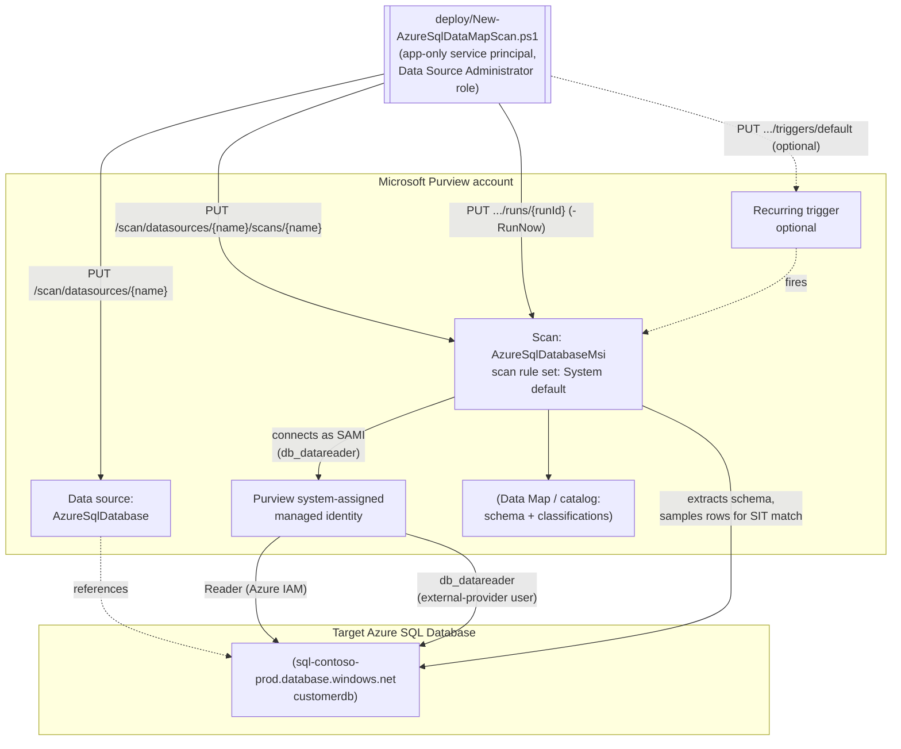

## The short version

Registers an Azure SQL Database as a Microsoft Purview Data Map source, configures a scan that
authenticates with the Purview account's own system-assigned managed identity (SAMI - Microsoft's
recommended, credential-free option), and runs that scan with Microsoft's system default scan
rule set - which includes the SSN and Credit Card Number sensitive information types (SITs) this
repo already uses elsewhere, among ~200 built-in classifications - so sensitive columns are
automatically classified and surfaced in the catalog. This is the foundational data-discovery scenario every
other Data Security control in this library assumes already happened: DLP, auto-labeling, and IRM
policies all act on data whose sensitivity is already known - Data Map scanning is how a tenant
first finds out.

## Why this matters

Every major data-protection regulation (GDPR Art. 30 records of processing, CCPA/CPRA data
inventory obligations, PCI DSS Requirement 3.2/12.5.2 cardholder data discovery, HIPAA §164.308
risk analysis) starts from the same unglamorous prerequisite: an accurate, current inventory of
where regulated data lives. Manual spreadsheet-based data inventories go stale the moment a new
table or column is added. Microsoft Purview Data Map scanning automates that inventory for
Azure SQL Database - extracting schema (server → database → schema → tables/views → columns) and
automatically applying classifications to columns that match a sensitive information type (SIT),
on a recurring schedule, so the inventory tracks the live schema instead of a point-in-time
manual audit.

This scenario is deliberately the **first** Data Governance fragment in this library: the DLP, Information Protection, and Insider Risk scenarios already built assume
sensitive data has been located and (for Information Protection) labeled. Data Map scanning is
the step that makes those downstream controls evidence-based rather than guesswork - "we believe
customers' SSNs are in these three databases" becomes "Purview confirms 14 columns across 3
databases classified as U.S. Social Security Number, last scanned 6 hours ago."

## How the control works

Two Purview Data Map objects, both created by the same idempotent (create-or-replace) REST call
pattern: a **data source** (the registration record pointing at the Azure SQL logical server) and
a **scan** (the credential, scope, and scan rule set for one database under that source). The
scan authenticates to the database as the Purview account's own SAMI - no credential object, no
Key Vault link, nothing for this script to manage beyond the two Azure/SQL-side grants in the implementation steps.
Classification happens inline during the scan: matched columns get tagged with the SITs selected
in the scan rule set and become searchable/filterable in the catalog. Full design rationale and
the SAMI-vs-alternatives decision: the design notes.

## What it takes

### Prerequisites

Full licensing detail and citations: [Licensing matrix](/docs/licensing-matrix/). Summary for this scenario:

| Requirement | Minimum | Notes |
|---|---|---|
| Microsoft Purview account + Data Map | Active **Azure subscription** with the M365 tenant, resource group for the Purview account | Data Map scanning is **PAYG-billed Azure consumption**, not a per-user M365 entitlement - see [Licensing matrix, sections 1 and 2](/docs/licensing-matrix/#1-the-two-billing-models-read-this-first) |
| Register + configure the source/scan | **Data Source Administrator** role on the target collection (or a parent collection with inheritance) | Classic Data Map role - see [RBAC model, section 5](/docs/rbac-model/#5-data-governance-roles-data-map--unified-catalog---a-separate-model) |
| Call the Data Map REST API at all (any role) | **Collection Admin** role at root collection assigns data-plane roles to the automation service principal | Only a Collection Admin can grant Data Source Administrator/Data Curator/Data Reader to a service principal - see [RBAC model, section 5](/docs/rbac-model/#5-data-governance-roles-data-map--unified-catalog---a-separate-model) and |
| Read scan results / browse classified assets (validation) | **Data Reader** role on the target collection | Least-privilege for the read-only `validate/` script |
| Azure IAM on the target SQL Server | **Reader** role for the Purview account's system-assigned managed identity (SAMI), scoped to the **SQL Server resource itself** | Required so the SAMI-based scan (this scenario's default) can enumerate the server/database - a separate, ARM-level role assignment from any Purview role. **Scope it to the server, not the resource group or subscription** - Microsoft's docs show Reader can be granted at any of those three levels, but a broader grant gives the Purview account's SAMI read visibility into every other resource in that resource group/subscription, not just the SQL server this scenario targets |
| Database-level access for the scan identity | `db_datareader` granted to the Purview account's SAMI as a Microsoft Entra external-provider database user | T-SQL step in the implementation steps - grants read access to sample data for classification, not just schema |
| Network path to the database | Either **Allow Azure services and resources to access this server** enabled on the SQL logical server, a self-hosted integration runtime, or a Purview managed virtual network | SAMI/UAMI authentication is **not supported** over a self-hosted integration runtime - see section 11 |
| Automation identity for the REST calls themselves | App registration with **Data Source Administrator** (and, for the validate script, **Data Reader**) Purview role on the collection | Client-secret or certificate app-only OAuth2 - see [Automation surface, section 3](/docs/automation-surface/#3-authentication-patterns---interactive-vs-unattended) and the validation steps below |

> Verify current entitlement names and the PAYG meter against [Licensing matrix](/docs/licensing-matrix/) (dated
> 2026-09-02) before a sales commitment - SKU names and billing meters change.

### Cost and licensing

- **PAYG, not per-user.** Data Map scanning bills through **Azure consumption** tied to the
  Purview account's associated Azure subscription, not an M365 per-user license - see
  [Licensing matrix, sections 1 and 2](/docs/licensing-matrix/#1-the-two-billing-models-read-this-first). There is no scan charge once the source is
  on Unified Catalog PAYG or an Enterprise tier, per the licensing matrix - confirm current
  metering against the Purview pricing calculator before estimating cost at scale.
- **No M365 license consumed** by this scenario itself - no user needs a Purview-tier M365 SKU to
  benefit from Data Map scanning specifically (contrast with *DLP* and
  *Information Protection*, which are M365 per-user entitlement features).
- **Sizing note:** cost scales with **number of sources scanned and scan frequency**, not with the
  number of Purview users browsing results - a large SQL estate with many databases scanned daily
  costs materially more than the same estate scanned weekly with incremental scans between full
  scans. Start with `Incremental` for steady-state and reserve `Full` for the first run and
  periodic re-baselines.
- **Cost governance.** Because this is PAYG/consumption billing rather than a fixed per-user
  license, cost grows automatically as more sources and recurring triggers are added over time
  with no natural ceiling - set an Azure Cost Management budget/alert on the Purview account's
  resource group before rolling this pattern out across an estate larger than a handful of
  databases, rather than discovering the run-rate at the next invoice.

## Proof it works

1. **Automated config check** - `./validate/Test-AzureSqlDataMapScan.ps1` confirms the data
   source and scan objects exist with the expected `kind`, collection, and scan rule set, and
   reports the most recent scan run's status. Exits non-zero on any hard failure (safe for a
   CI-style pre-flight).
2. **Scan run status** - Purview portal → **Data Map** → **Data sources** → select the source →
   **Recent scans** → the run shows **Queued → In progress → Completed**, with assets
   discovered/classified counts. Scan run history is retained for **90 days**.
3. **Classification evidence** - browse or search the **Unified Catalog** for the scanned
   database asset; confirm the target columns carry the **U.S. Social Security Number** or
   **Credit Card Number** classification badges, and that the classification is visible at both
   the asset and column level.
4. **Negative test** - temporarily scope the scan rule set to exclude one of the two SITs, rerun,
   and confirm columns previously classified with the excluded SIT no longer gain **new** matches
   on the next full scan (existing classifications from prior scans are not retroactively removed
   - see the known limitations).
5. **Access-path evidence** - confirm in Azure SQL (`SELECT * FROM sys.database_principals WHERE
   type = 'E'`) that the Purview account's SAMI appears as an external-provider database user with
   `db_datareader`, corroborating that the scan is reading with the least-privilege grant this
   scenario configured, not an over-broad one.

## Where it stops

- **SAMI cannot be used with a self-hosted integration runtime.** If the target SQL Server is
  behind a private network reachable only via self-hosted IR, this scenario's default
  authentication (SAMI) will not work - fall back to service principal or SQL authentication
  (both supported over self-hosted IR) and a Key Vault-backed credential created via the portal.
- **Existing classifications are not retroactively removed** when a scan rule set is narrowed.
  Removing a SIT from the rule set stops **new** matches on subsequent scans; it does not clear
  classification tags already applied by prior runs. Clearing stale classifications requires a
  separate cleanup action outside this scenario's scope.
- **U.S.-centric SIT starter set.** As with *Auto-Label Confidential PII in SharePoint & OneDrive*, the SSN + Credit Card Number pair is a U.S.-centric
  starting point, not GDPR-complete personal-data coverage for an EU/UK-only tenant - swap in the
  relevant regional SITs (e.g. national ID formats) before presenting this as complete PII
  discovery for a non-U.S. estate.
- **Stored procedure lineage extraction runs on its own fixed six-hour schedule** and has several
  documented constraints (no INSERT/DROP statements captured, requires `db_owner` not just
  `db_datareader`, no public-access-disabled Purview accounts) - this scenario does not enable
  lineage extraction by default; see the source documentation before turning it on.
- **RESOLVED (2026-09-04) - Run Scan / List Scan History REST shapes were corrected, not just
  verified.** The sibling *Scan Azure SQL Managed Instance and Classify Sensitive Columns* build
  independently direct-fetched the canonical **Scan Result - Run Scan** and **Scan Result - List
  Scan History** REST reference pages this scenario's own build could not reach, and found both of
  this scenario's original reconstructed shapes were wrong: Run Scan is an action-style
  `POST {endpoint}/scan/datasources/{ds}/scans/{scan}:run?runId={guid}&scanLevel={level}&
  api-version=...` (this script previously sent an unconfirmed resource-style
  `PUT .../runs/{runId}`), and List Scan History's per-run asset counts are nested at
  `discoveryExecutionDetails.statistics.assets.discovered`/`.classified` (this script's validate
  companion previously read unconfirmed flat `.assetsDiscovered`/`.assetsClassified` properties).
  Both `deploy/New-AzureSqlDataMapScan.ps1` and `validate/Test-AzureSqlDataMapScan.ps1` have been
  corrected to the confirmed shapes - see reference 17 below and each script's `.NOTES`.
- **RESOLVED (2026-09-28) - Data Sources / Triggers REST body shapes were direct-fetched and
  confirmed, not just corroborated.** Microsoft's canonical **Data Sources - Create Or Replace**
  (not "Create Or Update" - this scenario's own build had guessed the wrong operation name; the
  `create-or-update` URL slug does not resolve) and **Triggers - Create Or Replace** REST reference
  pages, which returned fetch errors in the original build's environment, were successfully
  direct-fetched via the Microsoft Learn MCP tool. Both confirm the reconstructed shapes this
  scenario's script already used: for `PUT {endpoint}/scan/datasources/{dataSourceName}?
  api-version=2023-09-01`, the `AzureSqlDatabaseDataSource` schema's `kind: "AzureSqlDatabase"` and
  its `AzureSqlDatabaseProperties` object confirm exactly the six claimed fields -
  `serverEndpoint`, `resourceName`, `resourceGroup`, `subscriptionId`, `location`, and `collection`
  (a `CollectionReference` object; the doc's own worked example sends only `{"referenceName": "..."}`
  in the request body - `type`/`lastModifiedAt` are response-only). For
  `PUT {endpoint}/scan/datasources/{dataSourceName}/scans/{scanName}/triggers/default?
  api-version=2023-09-01`, the `TriggerProperties`/`TriggerRecurrence` schema confirms the
  `properties.recurrence` nesting (`startTime`, `endTime`, `interval`, `frequency`, `schedule`) this
  script's trigger body already sends. No discrepancy found against either operation; nothing in
  `deploy/New-AzureSqlDataMapScan.ps1` required correction. See references 18-19 below.
- **VERIFY - custom scan rule set REST creation.** This scenario ships Microsoft's system default
  scan rule set rather than a narrower, PII-only custom rule set. The product supports a custom
  rule set that excludes specific system classifications (confirmed via the `Az.Purview` module's
  `New-AzPurviewAzureSqlDatabaseScanRulesetObject -ExcludedSystemClassification` parameter), but
  the exact REST JSON body for the "Scan Rulesets - Create Or Update" operation was not
  independently confirmed during this build. Follow-up: script that call once grounded, or use the
  `Az.Purview` PowerShell module directly for this one object type.
- **~~VERIFY - credential-object REST creation.~~ RESOLVED 2026-09-16 - this scenario's original
  claim was wrong.** This scenario's build concluded that no documented REST endpoint existed for
  creating a Key Vault-backed credential object (needed for the `AzureSqlDatabaseCredential` scan
  kind), and that credential creation was portal-only. **It is not.** The Purview Scanning
  data-plane API exposes **Credential** (`PUT /scan/credentials/{credentialName}`) and **Key Vault
  Connections** (`PUT /scan/azureKeyVaults/{azureKeyVaultName}`) as first-class documented
  operation groups at `api-version=2023-09-01`. Both are now scripted end-to-end by
  *Key Vault-Backed Scan Credential (SQL Auth / Service Principal)*, which also documents the one field shape
  that genuinely remains unconfirmed (the two `KeyVaultSecret` discriminator literals). An organization
  needing SQL-auth or service-principal scanning should build the credential with that scenario and
  reference it by name here - no portal step required. This scenario's own script still defaults to
  the SAMI (`AzureSqlDatabaseMsi`) path, which remains Microsoft's recommended option where it is
  available.