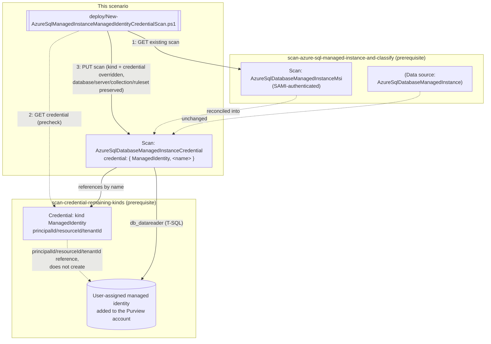

## 1. Problem statement

*Scan Azure SQL Managed Instance and Classify Sensitive Columns* authenticates its scan as the
Purview account's shared system-assigned managed identity (SAMI) - the same blast-radius tradeoff
*UAMI Credential for the Azure SQL Database Scan* (the short version) already lays out in full for
the Azure SQL Database sibling: one identity, shared across every source the Purview account scans,
with no per-source scoping. This fragment is that same fix, ported to Managed Instance - the second
of the two sibling scan scenarios *Scan Credentials: Remaining Kinds (Account Key, Role ARN, Consumer Key, Delegated Auth, User-Assigned Managed Identity)* (the configuration reference) named as still open
after the Azure SQL Database wiring landed.

**This is a genuine port, not a rename.** Managed Instance is its own Purview scan `kind`
(`AzureSqlDatabaseManagedInstanceCredential`, not `AzureSqlDatabaseCredential`) with its own REST
properties object - confirmed independently via direct fetch of the Scans - Create Or Replace
reference during this build, not assumed identical to the Database sibling by naming convention
alone. The base Managed Instance scenario's own design notes already documents three genuine
differences from the Database sibling (server endpoint format, scan rule set name, the
Directory-Readers Entra prerequisite) - this fragment re-verifies each still applies (or doesn't)
to the credential-reconciliation path specifically, rather than copy-pasting the Database sibling's
script with names swapped.

## 2. Design goals

1. **Same reconciliation pattern as the Database sibling, ported not copied.** GET the existing
   scan, copy every property forward, override only `kind` and `properties.credential`. The
   properties preserved (`databaseName`, `serverEndpoint`, `collection`, `scanRulesetName`,
   `scanRulesetType`) are identical in *name* to the Database sibling's - confirmed via direct fetch
   of `AzureSqlDatabaseManagedInstanceCredentialScanProperties`, not inferred from
   `AzureSqlDatabaseCredentialScanProperties` by analogy.
2. **The Managed-Instance-specific prerequisites (public endpoint, Microsoft Entra admin, Directory
   Readers) are orthogonal to this fragment and already satisfied by the base scenario.** All three
   are properties of the *managed instance resource itself* enabling Microsoft Entra authentication
   to work at all - not properties of *which* Entra identity (SAMI or UAMI) Purview uses once Entra
   auth is already working. This fragment adds no new instance-level prerequisite; it only adds the
   one identity-specific grant (`db_datareader`) for the UAMI instead of the SAMI, the same delta the
   Database sibling has for its own T-SQL grant. **Corrected 2026-09-27:** this goal previously also
   named an Azure IAM Reader grant on the instance resource as a second identity-specific delta -
   removed; see the known limitations for the grounding (Microsoft documents no Azure RBAC Reader step for
   Managed Instance scan authentication, unlike the Database sibling's confirmed portal walkthrough).
3. **The credential precheck's severity split is ported unchanged.** A confirmed kind mismatch on
   the referenced credential hard-stops (unless `-Force`); an ambiguous 404 only warns. This was a
   Red Team fix in the Database sibling's own review round (*UAMI Credential for the Azure SQL Database Scan*) - porting the fix, not the pre-fix behavior, into this sibling
   from the start.
4. **The credential object is a prerequisite, not this scenario's job to create** - same boundary as
   the Database sibling and *Scan Credentials: Remaining Kinds (Account Key, Role ARN, Consumer Key, Delegated Auth, User-Assigned Managed Identity)* itself.

## 3. Architecture

## 4. Configuration model

| Element | Value | Why |
|---|---|---|
| Scan `kind` (after reconciliation) | `AzureSqlDatabaseManagedInstanceCredential` | Confirmed via direct fetch of the Scans - Create Or Replace REST reference - a distinct enum member from the Database sibling's `AzureSqlDatabaseCredential` |
| `properties.credential.credentialType` | `ManagedIdentity` | Confirmed as the same shared `CredentialType` enum both sibling scan kinds' `credential` field uses |
| `properties.credential.referenceName` | Name of a pre-existing `ManagedIdentity`-kind credential object | Built via *Scan Credentials: Remaining Kinds (Account Key, Role ARN, Consumer Key, Delegated Auth, User-Assigned Managed Identity)* |
| Properties preserved from the existing scan | `databaseName`, `serverEndpoint` (the `tcp:<fqdn>,<port>` form), `collection`, `scanRulesetName`, `scanRulesetType` | GET-then-PUT reconciliation - confirmed identical property *names* to the Database sibling via direct fetch of `AzureSqlDatabaseManagedInstanceCredentialScanProperties` |
| SQL-side grant | `db_datareader`, granted via `CREATE USER [Username] FROM EXTERNAL PROVIDER` where `[Username]` is the UAMI's exact managed-identity name | Same T-SQL pattern as the base scenario's SAMI grant. **No separate Azure IAM Reader grant applies** - unlike the Database sibling, Microsoft documents no Azure RBAC role assignment step for Managed Instance SAMI/UAMI scan authentication; corrected 2026-09-27, see the known limitations |
| Instance-level prerequisites (unchanged by this fragment) | Public endpoint enabled; Microsoft Entra admin set via `Set-AzSqlInstanceActiveDirectoryAdministrator`; Directory Readers role for the **instance's own** managed identity | Already established by the base scenario - orthogonal to which Purview identity (SAMI/UAMI) authenticates (Design goal 2) |

## 5. What this scenario does not do

- **Create a second, parallel scan**, **create the UAMI/credential object**, or **grant the SQL-side
  `db_datareader` permission** - same boundaries as the Database sibling, for the same reasons
  (*UAMI Credential for the Azure SQL Database Scan* (the implementation steps)).
- **Re-establish or re-verify the Managed-Instance-specific instance-level prerequisites** (public
  endpoint, Entra admin, Directory Readers) - Design goal 2 explains why these are orthogonal to
  this fragment and assumed already satisfied by the base scenario's own deploy.
- **Extend to Azure Synapse dedicated SQL pools.** That is the third and last sibling
  *Scan Credentials: Remaining Kinds (Account Key, Role ARN, Consumer Key, Delegated Auth, User-Assigned Managed Identity)* (the configuration reference) named - a separate fragment with its own scan
  `kind` and properties shape, tracked in the project backlog.
- **What rollback does not undo:** identical scope boundary to the Database sibling - see
  the rollback runbook.

## 6. References

Full citation list in the references.
