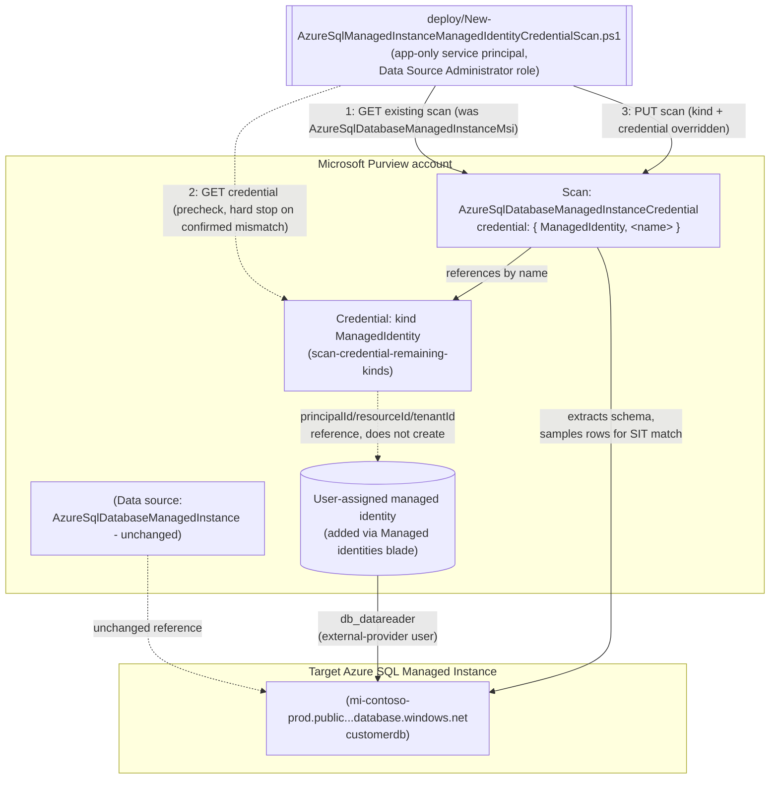

## The short version

Extends *Scan Azure SQL Managed Instance and Classify Sensitive Columns*: reconciles that
scenario's already-registered scan from the Purview account's shared system-assigned managed
identity (SAMI) onto a **user-assigned managed identity (UAMI)** - a separately-scoped, per-source
Azure identity built via *Scan Credentials: Remaining Kinds (Account Key, Role ARN, Consumer Key, Delegated Auth, User-Assigned Managed Identity)*'s `ManagedIdentity`
credential kind. Every other scan property (database, server, collection, scan rule set) is
preserved unchanged; only the authentication path moves. This is the Managed Instance sibling of
*UAMI Credential for the Azure SQL Database Scan*, following the same
reconciliation pattern but against Managed Instance's own distinct scan `kind` and REST properties
shape - see the design notes for the full diff from that sibling.

## Why this matters

Identical to the Database sibling (`scan-azure-sql-and-classify-managed-identity-credential/
why this matters): SOC 2 CC6.1 and ISO 27001 A.8.2 both call for least-privilege, blast-radius-scoped
access, and a UAMI is a separate, independently-grantable and independently-revocable Azure identity
per source - ranked directly below SAMI in Microsoft's own documented credential priority order. Managed Instance is a particularly common landing zone for lift-and-shift
migrations of regulated on-premises SQL Server estates (*Scan Azure SQL Managed Instance and Classify Sensitive Columns* (why this matters)), which raises the stakes of a shared, broadly-scoped scanning identity
across many such migrated databases.

## How the control works

## What it takes

### Prerequisites

Full licensing detail and citations: [Licensing matrix](/docs/licensing-matrix/). Summary for this scenario -
**additive** to the base scenario's own prerequisite table, which still applies in full (including
its Managed-Instance-specific deltas from the Database sibling: public endpoint, Microsoft Entra
admin on the instance, Directory Readers role):

| Requirement | Minimum | Notes |
|---|---|---|
| The base scenario already deployed | *Scan Azure SQL Managed Instance and Classify Sensitive Columns* scan exists (SAMI or already-reconciled credential auth) | This scenario reconciles an **existing** scan - it refuses to run against a data source/scan that doesn't exist yet |
| A user-assigned managed identity (UAMI) created and added to the Purview account | Azure identity-administration action, via the Purview account's own **Managed identities** blade | Out-of-band Azure step - see *Scan Credentials: Remaining Kinds (Account Key, Role ARN, Consumer Key, Delegated Auth, User-Assigned Managed Identity)* (the prerequisites) |
| A Purview credential object, kind `ManagedIdentity`, referencing that UAMI | Built via *Scan Credentials: Remaining Kinds (Account Key, Role ARN, Consumer Key, Delegated Auth, User-Assigned Managed Identity)* -CredentialType ManagedIdentity` | This scenario's `-CredentialReferenceName` parameter is that credential object's name |
| Reconcile the scan onto the new credential | **Data Source Administrator** role on the scan's collection | Same Purview role the base scenario's own deploy script needs |
| Database-level access for the UAMI | `db_datareader` granted to the **UAMI's exact managed-identity name** as a Microsoft Entra external-provider database user | Same T-SQL pattern as the base scenario's SAMI grant, different `[Username]` value - see the implementation steps. This is the **only** identity-specific access grant Microsoft documents for Managed Instance scan authentication - **no separate Azure IAM Reader role assignment applies**, unlike the Database sibling; corrected 2026-09-27, see the known limitations |
| Instance-level prerequisites (unchanged from the base scenario) | Public endpoint enabled; Microsoft Entra admin set via `Set-AzSqlInstanceActiveDirectoryAdministrator`; **Directory Readers** role for the instance's own managed identity | Orthogonal to which Purview identity authenticates - these enable Microsoft Entra auth on the instance at all, regardless of SAMI vs UAMI - already satisfied if the base scenario's scan is running |
| Network path to the instance | Unchanged from the base scenario - **neither SAMI nor UAMI works over a self-hosted integration runtime** | Same restriction as the Database sibling |
| Automation identity for the REST calls themselves | App registration with **Data Source Administrator** (and, for `validate/`, **Data Reader**) Purview role on the collection | Same as the base scenario |

> Verify current entitlement names against [Licensing matrix](/docs/licensing-matrix/) before a production rollout -
> this scenario introduces no new licensing surface.

### Cost and licensing

Identical to the Database sibling (`scan-azure-sql-and-classify-managed-identity-credential/
the cost and licensing notes): no new billing surface - still PAYG Data Map scanning; a UAMI itself has no direct
Azure cost, only the operational cost of provisioning, granting, and monitoring one more identity.

## Proof it works

1. **Automated config check** - `./validate/Test-AzureSqlManagedInstanceManagedIdentityCredentialScan.ps1`
   confirms the scan's `kind` is `AzureSqlDatabaseManagedInstanceCredential`, its
   `credential.credentialType` is `ManagedIdentity`, and (with `-ExpectedCredentialReferenceName`)
   that it references the expected credential object. `-CheckCredentialObject` additionally confirms
   that object itself still exists and is still kind `ManagedIdentity`.
2. **Scan run status** - Purview portal → **Data Map** → **Data sources** → the scan → **Recent
   scans** → confirm a run under the new identity reaches **Completed**.
3. **Access-path evidence** - confirm in Azure SQL Managed Instance
   (`SELECT * FROM sys.database_principals WHERE type = 'E'`) that the UAMI now appears as the
   external-provider database user actually being used by new scan runs.
4. **Negative test** - temporarily revoke the UAMI's `db_datareader` grant, re-run with `-RunNow`,
   and confirm the run fails with an authentication/authorization error.

**What no script here can prove**: whether the UAMI is still attached to the Purview account
(detachable independently of the credential object that references it); whether the instance-level
prerequisites (Directory Readers, Entra admin) that already gated the base scenario's own SAMI scan
remain intact - this scenario's checks are scoped to the identity/credential layer only.

## Where it stops

- **`ManagedIdentity` (UAMI) is a Microsoft-labeled Preview capability**, inherited from
  *Scan Credentials: Remaining Kinds (Account Key, Role ARN, Consumer Key, Delegated Auth, User-Assigned Managed Identity)* - see that scenario's page the known limitations.
- **Neither SAMI nor UAMI works over a self-hosted integration runtime.** If the instance is
  reachable only via self-hosted IR, this entire scenario is inapplicable - fall back to service
  principal or SQL authentication via *Key Vault-Backed Scan Credential (SQL Auth / Service Principal)*.
- **A UAMI can be deleted independently of the credential object that references it, and
  independently of this scan's configuration.** Same disclosed gap as the Database sibling.
- **Reverting to SAMI (rollback) assumes the SAMI's own `db_datareader` grant from the base
  scenario is still in place.** See the rollback runbook.
- **This scenario's precheck cannot detect every misconfiguration** - it confirms the credential
  object exists and is the right *kind*, not that the UAMI it references is attached to the Purview
  account or holds the `db_datareader` grant - same disclosed gap as the Database sibling.
- **Instance-level prerequisites are assumed, not re-verified.** This scenario's scripts do not
  re-check the public endpoint, Microsoft Entra admin, or Directory Readers role the base scenario
  already established - see the design notes goal 2 for why that's a deliberate scope boundary, not an
  oversight.
- **RESOLVED (2026-09-27) - no Azure IAM Reader role applies to Managed Instance scan authentication,
  for either SAMI or UAMI.** This row previously carried an open VERIFY, framing the Database
  sibling's confirmed "Access control (IAM) → Add role assignment → Reader → Select box" portal
  walkthrough as very likely applying identically here, just not independently re-confirmed
  word-for-word on the Managed Instance page. A direct fetch of that page found the reverse: no Azure
  RBAC role-assignment step appears anywhere in its managed-identity authentication section for
  either SAMI or UAMI - only the Object ID lookup, Entra contained-user creation, and `db_datareader`
  grant already in the implementation steps step 2. This is a genuine mechanism difference from the Database sibling, not a
  documentation-page omission - Managed Instance's SAMI/UAMI authentication path never involves an
  Azure IAM role assignment on the instance resource at all. *Scan Azure SQL Managed Instance and Classify Sensitive Columns* (the known limitations) carries the full grounding (including the separate, subscription-scoped,
  registration-time-only Reader recommendation this could otherwise be confused with) and corrects
  the same claim in the base scenario this fragment extends. the prerequisites and the architecture, and the implementation steps above are corrected to
  match.