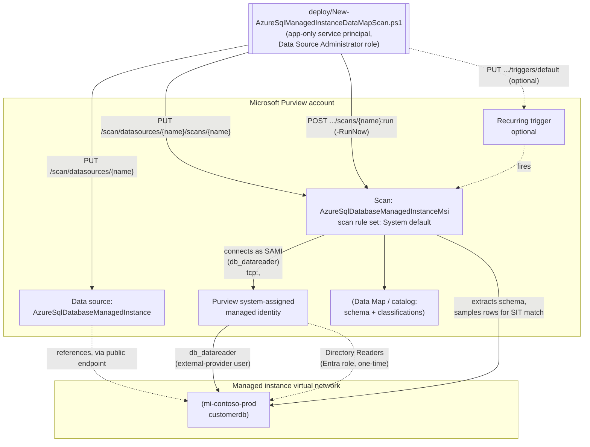

## The short version

Registers an Azure SQL Managed Instance database as a Microsoft Purview Data Map source, configures
a scan that authenticates with the Purview account's own system-assigned managed identity (SAMI -
credential-free, no Key Vault link to manage), and runs that scan with Microsoft's system default
scan rule set for this source type - which includes the SSN and Credit Card Number sensitive
information types (SITs) this library already uses elsewhere - so sensitive columns are automatically
classified and surfaced in the catalog. This is the Managed Instance sibling of
*Scan Azure SQL Database and Classify Sensitive Columns*, following the same proven pattern but adapted for
the genuine registration, network, and Microsoft Entra differences Managed Instance has as its own
Purview data source `kind` - see the design notes for the full diff.

## Why this matters

Same underlying drivers as the sibling scenario - GDPR Art. 30 records of processing, CCPA/CPRA
data inventory obligations, PCI DSS Requirement 3.2/12.5.2 cardholder data discovery, HIPAA section 164.308
risk analysis all require an accurate, current inventory of where regulated data lives. Azure SQL Managed Instance is a common landing zone for lift-and-shift
migrations of on-premises SQL Server estates specifically *because* it preserves near-full SQL
Server surface area (cross-database queries, SQL Agent, linked servers) - which also means it tends
to accumulate the same long-lived, schema-drifted databases that made the original on-premises
inventory go stale in the first place. Scanning it with the same automated, recurring discovery this
repo already applies to Azure SQL Database keeps a lift-and-shift migration from silently
regressing the tenant's classification coverage.

## How the control works

Same two-object model as the sibling scenario (a data source + a scan, both create-or-replace), with
the connection routed over the managed instance's **public endpoint** using the literal
`tcp:<fqdn>,<port>` server-endpoint form, and the SAMI's access gated behind one extra, one-time
Microsoft Entra prerequisite (**Directory Readers**) the logical-server scenario doesn't need. Full
design rationale and the complete Managed-Instance-vs-Database diff: the design notes.

## What it takes

### Prerequisites

Full licensing detail and citations: [Licensing matrix](/docs/licensing-matrix/). Summary for this scenario (deltas
from the sibling scenario's table are called out explicitly):

| Requirement | Minimum | Notes |
|---|---|---|
| Microsoft Purview account + Data Map | Active **Azure subscription** with the M365 tenant, resource group for the Purview account | PAYG-billed Azure consumption, not a per-user M365 entitlement - see [Licensing matrix, sections 1 and 2](/docs/licensing-matrix/#1-the-two-billing-models-read-this-first) |
| Register + configure the source/scan | **Data Source Administrator** role on the target collection | Classic Data Map role - see [RBAC model, section 5](/docs/rbac-model/#5-data-governance-roles-data-map--unified-catalog---a-separate-model) |
| Call the Data Map REST API at all (any role) | **Collection Admin** role at root collection assigns data-plane roles to the automation service principal | Only a Collection Admin can grant Purview roles to a service principal - see [RBAC model, section 5](/docs/rbac-model/#5-data-governance-roles-data-map--unified-catalog---a-separate-model) |
| Read scan results / browse classified assets (validation) | **Data Reader** role on the target collection | Least-privilege for the read-only `validate/` script |
| **Public endpoint enabled** on the managed instance | [Configure public endpoint in Azure SQL Managed Instance](https://learn.microsoft.com/azure/azure-sql/managed-instance/public-endpoint-configure) | **Different from the sibling scenario** - a managed instance has no public endpoint by default; this scenario's default (SAMI over the public endpoint) does not work until it's explicitly enabled |
| **Microsoft Entra admin set on the instance itself** | `Set-AzSqlInstanceActiveDirectoryAdministrator` (not `Set-AzSqlServerActiveDirectoryAdministrator`) | A different cmdlet/resource type from the logical-server sibling scenario - see the implementation steps step 2 |
| **Directory Readers Microsoft Entra role** for the instance's managed identity | Granted by a **Privileged Role Administrator** | **New prerequisite not present in the sibling scenario** - Managed Instance requires this broader role (or equivalent fine-grained Graph permissions) before Microsoft Entra authentication works at all; Azure SQL Database does not |
| Database-level access for the scan identity | `db_datareader` granted to the Purview account's SAMI as a Microsoft Entra external-provider database user (`CREATE USER [<PurviewAccountName>] FROM EXTERNAL PROVIDER;`) | T-SQL step in the implementation steps - this scenario cites the exact statement directly rather than a generic cross-reference. **Corrected 2026-09-27:** an earlier revision of this table also listed an Azure IAM **Reader** role on the managed instance resource itself as a scan-authentication prerequisite, copied from the logical-server sibling scenario. Microsoft's own Managed Instance registration/authentication walkthrough documents no such Azure RBAC step for either SAMI or UAMI - only this T-SQL grant. A subscription-scoped (not resource-scoped) Azure RBAC **Reader** role for the Purview MSI is separately documented, but only as an aid to the portal's "Select From Azure subscription" *registration-time* browse experience, not as part of scan authentication itself - removed from this table, see the known limitations |
| Network path to the instance (NSG) | Inbound rule allowing the `AzureCloud` service tag over the ports the instance's connection type requires (Redirect: `1433` + `11000`-`11999`; Proxy: `3342`) | Managed-Instance-specific - a logical server's simpler "Allow Azure services" firewall toggle has no equivalent here; see the configuration reference and the known limitations |
| Automation identity for the REST calls themselves | App registration with **Data Source Administrator** (and, for the validate script, **Data Reader**) Purview role on the collection | Client-secret app-only OAuth2 - see [Automation surface, section 3](/docs/automation-surface/#3-authentication-patterns---interactive-vs-unattended) and the implementation steps below |

> Verify current entitlement names and the PAYG meter against [Licensing matrix](/docs/licensing-matrix/) before a
> sales commitment - SKU names and billing meters change.

### Cost and licensing

Same PAYG/Azure-consumption billing model as the sibling scenario - see [Licensing matrix, sections 1 and 2](/docs/licensing-matrix/#1-the-two-billing-models-read-this-first) and *Scan Azure SQL Database and Classify Sensitive Columns* (the cost and licensing notes) for the full text (cost governance, sizing,
no M365 license consumed). No Managed-Instance-specific billing delta: Data Map scanning meters the
same way regardless of the underlying Azure SQL source type.

## Proof it works

1. **Automated config check** - `./validate/Test-AzureSqlManagedInstanceDataMapScan.ps1` confirms
   the data source and scan objects exist with the expected `kind`, `serverEndpoint` form, and scan
   rule set, and reports the most recent scan run's status. Exits non-zero on any hard failure (safe
   for a CI-style pre-flight).
2. **Scan run status** - Purview portal → **Data Map** → **Data sources** → select the source →
   **Recent scans** → the run shows **Queued → In progress → Completed**, with assets
   discovered/classified counts. Scan run history is retained for **90 days**.
3. **Classification evidence** - browse or search the **Unified Catalog** for the scanned database
   asset; confirm the target columns carry the **U.S. Social Security Number** or **Credit Card
   Number** classification badges.
4. **Entra prerequisite evidence** - on the managed instance's **Microsoft Entra ID** pane in the
   Azure portal, confirm the Directory Readers banner no longer appears (or run
   `Get-MgDirectoryRoleMember` against the Directory Readers role and confirm the instance's managed
   identity is a member) - a missing Directory Readers grant is the single most common reason this
   scenario's scan authenticates successfully in testing but fails against a newly registered
   instance. **Deliberately manual, not part of `validate/Test-AzureSqlManagedInstanceDataMapScan.ps1`:**
   that script authenticates against the Purview Data Map data-plane resource with a Data
   Reader-scoped Purview role; confirming Directory Readers membership needs a separate Microsoft
   Graph token and a directory-read permission this scenario's automation identity has no other
   reason to hold - automated instead by the dedicated companion scenario
   *Verify Purview / Azure SQL Managed Instance Microsoft Entra Prerequisites*, which checks Directory Readers
   membership (and drift) across every Managed-Instance-backed Purview source, not just this one.
5. **Access-path evidence** - confirm in the database (`SELECT * FROM sys.database_principals WHERE
   type = 'E'`) that the Purview account's SAMI appears as an external-provider database user with
   `db_datareader`.

## Where it stops

- **SAMI cannot be used with a private endpoint.** If the managed instance is reachable only via a
  Purview ingestion private endpoint, this scenario's default authentication (SAMI) does not work -
  Microsoft's own documentation states managed identity authentication isn't supported when
  connecting to Microsoft Purview over private endpoints. Fall back to a service principal or SQL
  authentication (both requiring a Key Vault-backed credential object created via the portal - no
  documented REST endpoint for credential creation was found during this build, same open gap as the
  sibling scenario).
- **Directory Readers is a tenant-wide-flavored role, not a Purview-scoped one.** Granting it
  requires a **Privileged Role Administrator**, a materially higher-privilege operation than any
  other grant this scenario needs - flagged as a Red Team finding in the review notes.
- **Existing classifications are not retroactively removed** when a scan rule set is narrowed - same
  behavior as the sibling scenario.
- **U.S.-centric SIT starter set** - same caveat as every other scenario in this library using the
  SSN + Credit Card Number pair; not GDPR-complete for a non-U.S. tenant.
- **VERIFY - default public-endpoint port.** This scenario defaults `-Port` to `3342`, matching
  Microsoft's own worked registration example, but the actual port a given instance's public
  endpoint listens on depends on its connection-policy configuration. Confirm the real port (Azure
  portal → the instance → **Networking** → **Public endpoint**) before relying on the default in a
  script running unattended.
- **RESOLVED (2026-09-25) - credential-object REST creation.** This row originally claimed no
  documented REST endpoint existed for creating the Key Vault-backed credential object needed for
  `AzureSqlDatabaseManagedInstanceCredential` scanning, describing it as portal-only. **It is not.**
  The Purview Scanning data-plane API exposes **Credential** (`PUT /scan/credentials/{credentialName}`)
  and **Key Vault Connections** (`PUT /scan/azureKeyVaults/{azureKeyVaultName}`) as first-class
  documented operation groups - the same correction the sibling *Scan Azure SQL Database and Classify Sensitive Columns*
  scenario applied to its own equivalent claim on 2026-09-16. Build the credential with
  *Key Vault-Backed Scan Credential (SQL Auth / Service Principal)* (SQL auth/service principal) or
  *Scan Credentials: Remaining Kinds (Account Key, Role ARN, Consumer Key, Delegated Auth, User-Assigned Managed Identity)* (`ManagedIdentity`, consumed by
  `scan-azure-sql-managed-instance-and-classify-managed-identity-credential/`) and reference it by
  name - no portal step required.
- **Follow-up recorded in the project backlog:** the two REST-shape corrections this build made relative to
  the sibling scenario's assumptions (Run Scan's action-style POST; List Scan History's nested asset
  counts - the design notes) should be backported into *Scan Azure SQL Database and Classify Sensitive Columns*'s own scripts, since
  that scenario's `PUT .../runs/{runId}` call would not match the confirmed API contract.
- **RESOLVED (2026-09-27) - no Azure IAM Reader role is required on the managed instance resource for
  SAMI/UAMI scan authentication.** the prerequisites and the architecture, and the implementation steps previously listed an Azure IAM **Reader** role
  assignment on the managed instance resource itself as a scan-authentication prerequisite, carried
  over from the logical-server sibling scenario's own table. A direct fetch of Microsoft's Managed
  Instance registration/authentication page found no such Azure RBAC step documented for either SAMI
  or UAMI - the only documented access grant for scan authentication is the Entra contained-user +
  `db_datareader` T-SQL grant already in the implementation steps step 4. Microsoft's Purview deployment
  checklist separately documents an Azure RBAC **Reader** role for the Purview MSI, but scoped to the
  data source's **subscription** (not the individual instance resource) and for a different purpose -
  populating the portal's "Select From Azure subscription" browse dropdown at *registration* time, not
  scan-time authentication; the current data-source readiness-checklist tooling's
  own Managed-Instance-specific checks (network, ProxyOverride, NSG, Entra admin) confirm this by
  omission - unlike its Blob Storage/ADLS Gen2/Synapse checks, it has no RBAC Reader check item for
  Managed Instance at all. The row, diagram edge, and portal step claiming otherwise are corrected in
  place rather than left to silently mislead a reader granting access. This also corrects the same
  copied claim in *UAMI Credential for the Azure SQL Managed Instance Scan* (the prerequisites and the architecture and the implementation steps and the known limitations), which closes that scenario's own open VERIFY on this point.